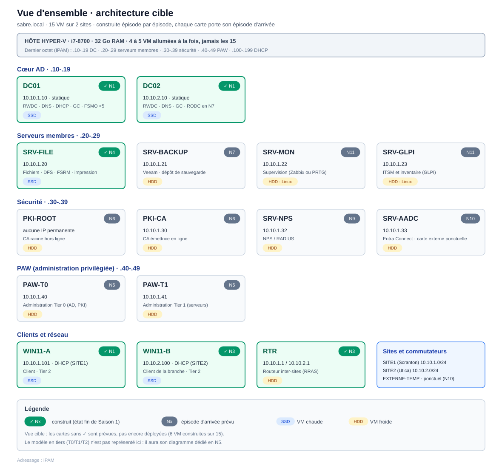

# 🪪 Dunder MifflAD · Portfolio AD & Windows Server

Le lab simule une infrastructure Windows d'entreprise sur Hyper-V (hôte unique), en 11 épisodes (`N1` à `N11`) regroupés en 3 saisons, chacun construit sur une base validée par le précédent. Forêt et domaine uniques.

Il montre comment annuaire, résolution de noms, réplication, stratégies, sécurité, PKI, sauvegarde et reprise, cycle de vie des comptes et exploitation fonctionnent ensemble, et surtout comment on **diagnostique** chacun quand il tombe.

L'état décrit est l'état **as-built** : ce qui tourne réellement à la fin de chaque épisode, avec les décisions justifiées et les limites écrites.

**À ce jour, la Saison 1 est terminée (épisodes N1 à N4).** La Saison 2 est en préparation.

## <a id="sommaire"></a>Sommaire

1. [Programme : la feuille de route N1 → N11](#au-programme)
2. [Concept : le marché de l'emploi comme cahier des charges](#concept)
3. [Méthode : Build it, Break it, Fix it](#methode)
4. [Autres grands principes de conception](#principes)
5. [Topologie cible](#topologie)
6. [Documentation et carte du dépôt](#documentation)

## <a id="au-programme"></a>1. Programme : la feuille de route N1 → N11

> Le numéro `N` est l'ancre technique de chaque épisode. La saison n'est qu'un regroupement de lecture.

### 🎬 Saison 1 : Déploiement ✅

| Épisode              | Sujet                    | Concepts clés                                                                              |
| -------------------- | ------------------------ | ------------------------------------------------------------------------------------------ |
| [N1](./episodes/N1/) | 🏗️ Fondations           | AD DS · forêt/domaine · DNS intégré · DHCP · réplication · GC · FSMO · hiérarchie de temps |
| [N2](./episodes/N2/) | 👥 Administration        | OU · comptes · AGDLP · PowerShell · GPO · LAPS · cycle de vie (JML) + prestataire externe  |
| [N3](./episodes/N3/) | 🧭 Réseau entreprise     | RTR · 2 sites · Sites & Services · réplication inter-site · DNS inter-site                 |
| [N4](./episodes/N4/) | 🗂️ Services de fichiers | SMB/NTFS · DFS · DFS-R · FSRM · serveur d'impression                                       |

### 🎬 Saison 2 : Sécurité et résilience 🔜

| Épisode | Sujet | Concepts clés |
|---|---|---|
| N5 | 🛡️ Sécurité et tiering | modèle en tiers · PAW · Protected Users · gMSA · audit · WEF · baselines de durcissement |
| N6 | 🔐 PKI à deux niveaux | CA racine hors ligne et CA émettrice · EKU/SAN · CRL/CDP/AIA · révocation |
| N7 | ♻️ Résilience et reprise | System State · Veeam et PRA/PCA · saisie FSMO · RODC et PRP · Forest Recovery |
| N8 | 🧨 Break/Fix transversal | pannes combinées, sans étiquette *(final de saison)* |

### 🎬 Saison 3 : Exploitation 🔜

| Épisode | Sujet                            | Concepts clés                                                                                                                                         |
| ------- | -------------------------------- | ----------------------------------------------------------------------------------------------------------------------------------------------------- |
| N9      | 🔌 Accès distant et mises à jour | NPS/RADIUS · VPN (RRAS) · WSUS et anneaux par GPO                                                                                                     |
| N10     | ☁️ Identité hybride              | Entra Connect (concept et une synchronisation) · administration M365 du quotidien (licences, Exchange Online, Teams et SharePoint) · Intune (concept) |
| N11     | 📡 Supervision & ITSM            | bases d'administration Linux · supervision et alerting (Zabbix) · inventaire et tickets (GLPI)                                                        |

---

## <a id="concept"></a>2. Concept : le marché de l'emploi comme cahier des charges

**Dunder MifflAD** est la deuxième étape de ma reconversion vers l'**administration systèmes et réseaux**.

La première, **[Dunder MiffLAN](https://github.com/Joupow/DunderMiffLAN-Network-Portfolio)**, couvrait le réseau sous Cisco Packet Tracer (VLAN, routage et redondance, pare-feu et DMZ, VoIP, Wi-Fi) et m'a mené à la certification **CompTIA Network+**.

Ce lab monte d'une couche : l'annuaire, les serveurs Windows et ce qui les fait tenir en production.

Les deux projets visent le même poste. Seul le point de départ a changé. Pour le réseau, je suivais le programme d'une certification. Pour le système, j'ai d'abord regardé ce que demandent les employeurs. 

J'ai relevé une soixantaine d'offres sur un peu plus d'un mois, dont 45% en CDI autour de Lyon (du technicien à l'administrateur confirmé) et 55% alternances dans toute la France (plus difficile d'avoir des offres dans mon bassin de prédilection j'ai donc du élargir au niveau national pour avoir un panel intéressant). 

J'ai compté ce qui revenait d'une annonce à l'autre, puis construit le programme à partir de ce comptage qui reflète le marché tel que je l'ai lu entre aout et septembre 2026. 

Si les offres évoluent, le programme suivra.

## <a id="methode"></a>3. Méthode : Build it, Break it, Fix it

Une compétence arrive en tête dans les deux relevés : le support et la résolution d'incidents, demandés dans 77% des annonces (dont 84% des CDI lyonnais et 70% des alternances). 

Autrement dit, un lab qui se contente de déployer ne montre rien de cette compétence.

Le programme suit donc un seul fil : **construire, sécuriser, casser volontairement, diagnostiquer, restaurer**. Chaque épisode contient au moins une **mission panne** délibérée, pour comprendre pourquoi quelque chose marche ou ne marche plus.

**Une panne se joue en quatre temps.**

1. **Injection** : on casse volontairement un composant.
2. **Impact** : on tente une vraie opération d'utilisateur et on la regarde échouer (une session refusée, un poste sans adresse, un règlement qui n'arrive pas).
3. **Diagnostic** : on élimine les fausses pistes, on croise des sources indépendantes, on remonte à la cause racine.
4. **Réparation et validation** : on répare, puis on rejoue la même opération d'utilisateur pour prouver qu'elle remarche.

L'impact n'est pas le symptôme. Le symptôme, c'est ce que l'administrateur lit sur un outil de diagnostic. L'impact, c'est ce que subit un utilisateur. Le premier parle à un ingénieur, le second à un manager, et chaque dossier montre les deux.

Les deux axes de lecture des pannes (d'où elles viennent, ce qu'il faut pour en revenir) et le bilan de ce qui a été cassé épisode par épisode sont dans la [vue d'ensemble technique](./TECHNICAL_OVERVIEW.md#pannes), sections 3 et 4.

## <a id="principes"></a>4. Autres grands principes de conception

- **1) Tout se prouve par un état observable, jamais par un voyant vert.**

Une réplication se prouve par un objet qui traverse d'un contrôleur à l'autre, pas par un service « démarré ». Chaque affirmation des documents renvoie à une capture brute (`P-xx` pour la construction, `BF-xx` pour les pannes), et ce qui n'a pas pu être prouvé est écrit comme tel.

- **2) L'honnêteté sur les limites.**

Chaque épisode tient un registre des dettes et des limites assumées : ce qui reste à faire, ce qui a été reporté et pourquoi, ce qui ne se simule pas sur un seul hôte, ce qui a été laissé hors périmètre. Les écarts qui traversent tout le lab sont regroupés dans la [vue d'ensemble technique](./TECHNICAL_OVERVIEW.md#ecarts).

- **3) Le jugement ne se délègue pas, même à une IA**

J'ai utilisé une IA pour affiner le programme à partir des offres relevées, puis je l'ai cadrée comme un mentor technique. 

Son rôle, sa méthode et ses règles de progression ont été rédigés par mes soins. Le détail des tâches confiées à l'IA figure dans la [vue d'ensemble technique](./TECHNICAL_OVERVIEW.md#relecteur)

## <a id="topologie"></a>5. Topologie cible

> Voici l'infrastructure conçue, construite épisode par épisode. Les VM marquées ✓ sont construites (6 sur 15 à la fin de la Saison 1). L'état réel de chaque épisode est dans son README.



---

## <a id="documentation"></a>6. Documentation et carte du dépôt

Ressources globales :

- 📘 [Vue d'ensemble technique](./TECHNICAL_OVERVIEW.md) : état du lab, rôle et placement de chaque VM, lecture des pannes, bilan par épisode, écarts avec la production
- 🗺️ [IPAM](./IPAM.md) : le plan d'adressage, source de vérité unique
- 🎭 [À propos de Dunder MifflAD](./ABOUT_DUNDER_MIFFLAD.md) : le nom, la couche narrative, l'annuaire de démo et les scénarios

Chaque épisode a trois documents :

- 📄 **README** : objectif, principes de conception, cadrage de la mission panne, compétences couvertes, limites, avec la topologie as-built de l'épisode
- 🪜 **WORKFLOW** : chaque étape en PowerShell annoté et en version graphique, validation de bout en bout, registre des dettes, avec le schéma logique de l'annuaire
- 🔧 **BREAKFIX** : missions panne exécutées et incidents imprévus, avec leurs preuves

```
Dunder MifflAD/
├── README.md                  ← vous êtes ici
├── TECHNICAL_OVERVIEW.md      ← état du lab, pannes, écarts avec la production
├── ABOUT_DUNDER_MIFFLAD.md    ← couche narrative et annuaire de démo
├── IPAM.md                    ← plan d'adressage
├── episodes/
│   ├── N1/  README.md · WORKFLOW.md · BREAKFIX.md
│   ├── N2/  …
│   ├── N3/  …
│   └── N4/  …
└── assets/
    ├── branding/              ← identité visuelle : logo, visuels réseaux sociaux
    ├── topologies/            ← overview_target.svg (cible) + topology_N{N}.svg 
    └── captures/N{N}/         ← captures de session (preuves P-xx et BF-xx)
```
