# Épisode N1 : Break/Fix

**Concepts clés** : localisation d'un DC par les enregistrements SRV du DNS · un annuaire sain devient invisible si la résolution casse · séparer trois causes voisines (client mal pointé, SRV manquant, forwarder mort) · panne silencieuse hors périmètre · un domaine à deux DC survit à la perte d'un DC pour l'auth et le DNS, pas pour le DHCP (SPOF) · résolution de nom ≠ connectivité · attendre la convergence avant de signer « réparé »

- 🎬 **Saison 1 · Épisode N1**
- 🖥️ **Stack** : Hyper-V, Windows Server 2025 éval (2 DC : DC01, DC02), Windows 11 Enterprise (WIN11-A), vSwitch privé `SITE1`
- 🗺️ Adressage (IP / DNS / passerelle / vSwitch) → [IPAM](../../IPAM.md)
- 🎭 Annuaire de démo (OU, groupes, comptes, nommage...) → [ABOUT DUNDER MIFFLAD](../../ABOUT_DUNDER_MIFFLAD.md)
- 📄 Présentation de l'épisode → [README N1](./README.md)
- 📝 Progression étape par étape → [WORKFLOW N1](./WORKFLOW.md)

## Sommaire

**1. Missions panne (délibérées)**

- [Mission 1, DNS/SRV : l'annuaire devient invisible](#mission-panne)
- [Mission 2, Redondance : perte d'un contrôleur de domaine](#mission-redondance)

**2. Dépannage (incidents accidentels)**

- [Incidents de session](#dépannage-incidents-de-session)
- [Incidents marquants](#incidents-marquants)
	- [Le dcdiag qui ment](#dcdiag)

---

# 1. Missions panne (délibérées)

> **Prérequis :** WIN11-A est créé et joint au domaine dans le [WORKFLOW § Étape 7](./WORKFLOW.md#étape-7). Ces missions partent d'un client sain, déjà membre de `sabre.local`.

## <a id="mission-panne"></a>Mission 1, DNS/SRV : l'annuaire devient invisible

> 🎥 **Storyline :** *Un poste de Scranton ne retrouve plus l'annuaire : plus de session, plus de règles, alors que les contrôleurs tournent parfaitement.*

**Ce que cette panne démontre :** AD DS ne se localise que par le DNS. 

Un client trouve un DC via ses enregistrements **SRV**, donc un annuaire intact devient injoignable dès que la résolution casse. Les trois vecteurs que j'ai cassés ici donnent des symptômes proches mais se réparent autrement, et l'un d'eux n'a aucun impact en lab isolé.

### 1.1 Injection (délibérée)

**Point de départ.** Avant toute injection, la zone publie un SRV de localisation pour chacun des deux DC.

<details><summary><a id="bf-01"></a>📷 Preuve : BF-01 · état sain de référence</summary>

**BF-01**, WIN11-A : `Resolve-DnsName -Type SRV _ldap._tcp.dc._msdcs.sabre.local` → **dc01 ET dc02**, port 389. *(état sain, avant injection)*
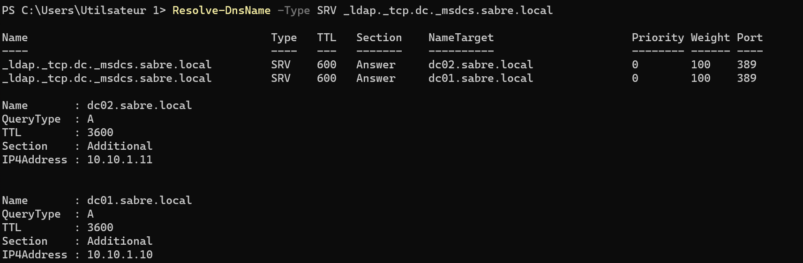
</details>

**Ce que j'ai cassé, exprès, depuis trois angles :**

1. Le **DNS client de WIN11-A** est repointé vers une adresse morte (`10.10.1.250`) ;
2. L'**enregistrement SRV** de localisation des DC est supprimé de la zone `_msdcs.sabre.local` ;
3. Le **forwarder** de DC01 est remplacé par une adresse morte (`10.10.1.240`).

```powershell
# Sur WIN11-A : DNS client dirigé vers une adresse morte
hostname      # WIN11-A attendu : même nom de carte "Ethernet" que sur les DC, la commande passerait partout
Set-DnsClientServerAddress -InterfaceAlias "Ethernet" -ServerAddresses 10.10.1.250
```

```powershell
# Sur DC01 : suppression des enregistrements SRV de localisation des DC (nœud _ldap._tcp.dc, tous DC confondus)
# _msdcs.sabre.local est une zone distincte de sabre.local
Remove-DnsServerResourceRecord `
    -ZoneName "_msdcs.sabre.local" `
    -Name "_ldap._tcp.dc" `
    -RRType Srv `
    -Force
```

```powershell
# Sur DC01 : forwarder pointé vers une impasse
Set-DnsServerForwarder -IPAddress 10.10.1.240
```

> ⚠️ **Vérifier la machine avant d'injecter.** Pendant cette mission, l'injection 1 a été exécutée une fois sur DC01 au lieu de WIN11-A, puis annulée avec un geste valable uniquement pour un client DHCP. Le DNS client de DC01 s'est retrouvé vide ([incident 2](#dcdiag)). D'où le `hostname` en tête de bloc.

### <a id="mp-impact"></a>1.2 Impact : ce que la panne casse pour un utilisateur

L'impact est mesuré sur un vrai geste de poste utilisateur, pas seulement par une sonde d'admin.

Le geste retenu est le changement de mot de passe (Ctrl+Alt+Suppr → *Modifier un mot de passe*). Il n'a pas de mode hors-ligne : là où l'ouverture de session peut s'appuyer sur le cache du poste, le changement de mot de passe joint toujours un DC. Il échoue donc de façon fiable dès que le DC est injoignable.

Le test tourne sous `SABRE\Administrateur`, le seul compte de domaine qui existe à N1 (les comptes métier arrivent en N2). Ici il joue l'utilisateur, pas l'admin : le vrai lambda qui subit la panne apparaîtra quand les comptes existeront.

Casser le DNS client seul ne suffit pas : le poste garde en cache l'adresse du DC déjà localisé et n'a plus besoin de résoudre son nom. Pour que la panne se voie, j'ai vidé le cache DNS et forcé la réélection d'un DC. Sans cette étape, le cache masque la panne.

```powershell
# Sur WIN11-A, session sabre\administrateur, rejeu de l'injection 1
Set-DnsClientServerAddress -InterfaceAlias "Ethernet" -ServerAddresses 10.10.1.250
ipconfig /flushdns
nltest /sc_reset:sabre.local   # force la réélection d'un DC → échoue, DNS mort
```

**Geste utilisateur, puis constat :** Ctrl+Alt+Suppr → *Modifier un mot de passe* → l'opération tente de joindre un DC et **échoue**. Rien n'est modifié (l'opération n'aboutit pas), aucun risque de verrouillage.

<details><summary><a id="bf-02"></a>📷 Preuves : BF-02 · impact utilisateur (chaîne de causalité)</summary>

**BF-02a**, WIN11-A : `whoami` → `sabre\administrateur` + `nltest /dsgetdc` → un DC répond (DC02). *(état SAIN d'avant : session de domaine, DC joignable, c'est le point de départ, pas la panne)*
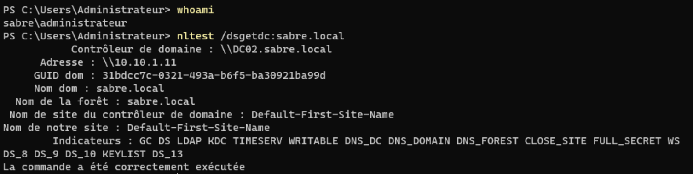

**BF-02b**, WIN11-A : après rejeu de l'injection 1, `nltest /sc_reset:sabre.local` → `1311 ERROR_NO_LOGON_SERVERS`. *(état cassé côté client)*
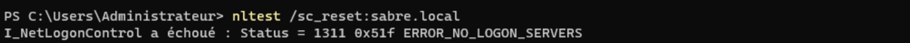

**BF-02c**, WIN11-A : Ctrl+Alt+Suppr → *Modifier un mot de passe* → « les informations de configuration n'ont pas pu être lues sur le contrôleur de domaine ». *(impact : un geste utilisateur échoue)*

</details>

### <a id="mp-symptome"></a>1.3 Symptôme observé

Côté client, la résolution du domaine expire (BF-03b). Côté serveur, la sonde de l'enregistrement SRV renvoie « objet introuvable » (BF-03c) : DC01 lui-même ne peut plus répondre « voici un DC pour `sabre.local` ».

<details><summary><a id="bf-03"></a>📷 Preuves : BF-03 · état cassé (les trois vecteurs)</summary>

**BF-03a**, WIN11-A : `Get-DnsClientServerAddress` → `10.10.1.250` (mort). *(état cassé)*
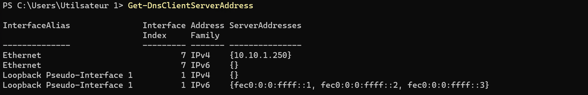

**BF-03b**, WIN11-A : `Resolve-DnsName sabre.local` → TIMEOUT. *(état cassé)*
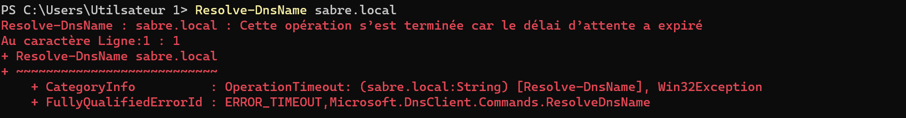

**BF-03c**, DC01 : `Get-DnsServerResourceRecord` du SRV → ObjectNotFound (9714). *(état cassé)*
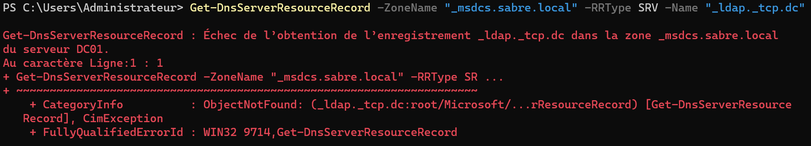

**BF-03d**, DC01 : forwarder → `10.10.1.240` (impasse). *(état cassé)*
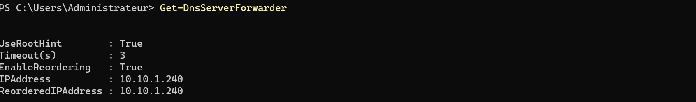
</details>

### 1.4 Diagnostic

```powershell
# 1. Quel serveur DNS le client interroge-t-il vraiment ?
ipconfig /all

# 2. En forçant la requête vers DC01 : le nom A revient-il ? Et le SRV ?
Resolve-DnsName dc01.sabre.local -Server 10.10.1.10
Resolve-DnsName _ldap._tcp.dc._msdcs.sabre.local -Type SRV -Server 10.10.1.10

# 3. Côté serveur : l'enregistrement SRV existe-t-il encore dans la zone _msdcs ?
Get-DnsServerResourceRecord -ZoneName "_msdcs.sabre.local" -RRType SRV -Name "_ldap._tcp.dc"

# 4. Le forwarder pointe-t-il vers une cible vivante ?
Get-DnsServerForwarder
```

Raisonnement par élimination : 

1. `ipconfig /all` sur WIN11-A montre un DNS à `10.10.1.250` : premier vecteur. 
2. En forçant la requête vers `10.10.1.10`, le nom A revient mais le SRV reste introuvable : deuxième vecteur, la zone a perdu son enregistrement. 
3. Le forwarder mort est le troisième, sans impact mesurable en lab isolé puisqu'il n'y a pas d'Internet à joindre. Le prouver avec `Resolve-DnsName github.com` ne donne qu'un timeout ambigu, dû à l'isolement et pas au forwarder. Je le documente comme une panne silencieuse plutôt que d'inventer un faux impact.

### 1.5 Cause racine

Deux causes réelles se cumulent : le client interroge un résolveur mort, et la zone a perdu l'enregistrement SRV qui désigne les DC. 

Le forwarder cassé est un troisième vecteur volontaire mais **sans effet ici** : ce composant ne sert qu'à la résolution externe, absente du périmètre du lab isolé.

### 1.6 Réparation

**Gestes :** remettre le DNS client sur les DC, forcer DC01 à ré-enregistrer ses SRV, restaurer le forwarder d'origine.

```powershell
# Sur WIN11-A : DNS client remis sur les deux DC (résilience)
Set-DnsClientServerAddress -InterfaceAlias "Ethernet" -ServerAddresses 10.10.1.10,10.10.1.11
Clear-DnsClientCache
```

```powershell
# Sur DC01 : forcer Netlogon à ré-enregistrer TOUS les enregistrements DNS du DC, SRV compris
nltest /dsregdns
```

```powershell
# Sur DC01 : forwarder d'origine restauré
Set-DnsServerForwarder -IPAddress 9.9.9.9,1.1.1.1
```

> 🔧 **Note de réparation.** `nltest /dsregdns` est l'outil canonique quand des SRV de DC manquent : il demande au DC de se ré-annoncer immédiatement dans le DNS. Repli : `Restart-Service Netlogon`, puis 30 à 60 s d'attente avant de re-vérifier. Dans les deux cas, le DC doit pouvoir joindre un serveur DNS : c'est son **client** DNS qui publie les enregistrements.

> ⚠️ **La réparation n'a pas tenu du premier coup.** `nltest /dsregdns` a répondu `NERR_Success`, mais l'enregistrement SRV de DC01 est resté absent de la zone. Seul celui de DC02 était revenu. Cause : le client DNS de DC01 ne pointait plus sur aucun serveur, et un DC ne peut pas se réinscrire dans un DNS qu'il ne sait pas joindre. Ce second problème, découvert en réparant le premier, est traité dans [l'incident 2](#dcdiag). La validation ci-dessous vaut après sa résolution.

### <a id="mp-validation"></a>1.7 Validation en miroir

J'ai retenté l'opération qui échouait pendant la panne : depuis WIN11-A, localiser un DC et résoudre les SRV. Elle doit réussir maintenant. Pas de « réparé » sans l'avoir re-prouvé côté client.

**Opération retentée :** `nltest /dsgetdc:sabre.local` et `Resolve-DnsName` des SRV depuis WIN11-A.

**Résultat observé (après réparation) :** le client localise de nouveau un DC (BF-04b) et le forwarder d'origine est rétabli (BF-04a). Le retour du SRV de DC01, lui, n'est acquis qu'après l'incident 2 : la requête SRV renvoie alors **dc01 et dc02**, comme dans l'état de référence (BF-01). Preuve texte au [§6 du transcript BF-09](#dcdiag).

<details><summary><a id="bf-04"></a>📷 Preuves : BF-04a · BF-04b · état réparé et validation</summary>

**BF-04a**, DC01 : forwarder rétabli `{9.9.9.9, 1.1.1.1}`. *(après restauration)*
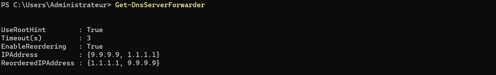

**BF-04b**, WIN11-A : `nltest /dsgetdc` + `Resolve` → DC localisé. *(validation miroir)*
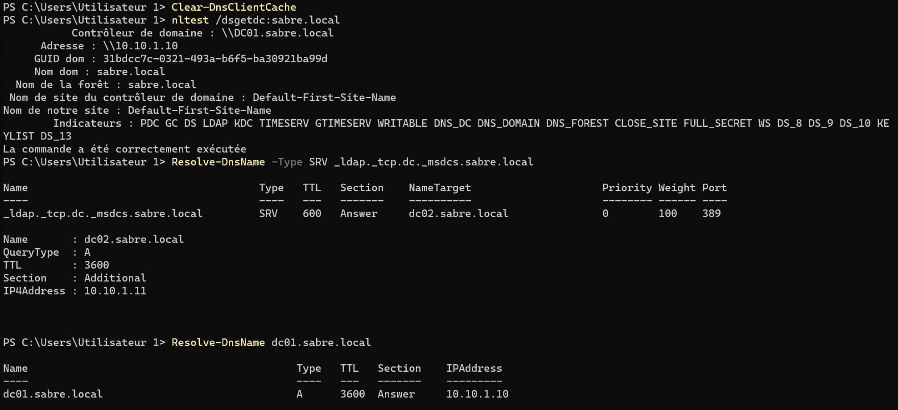
</details>

### 1.8 Leçon transférable

1) Quand une machine « ne trouve plus le domaine », le premier réflexe n'est pas d'ouvrir la console AD. Je regarde d'abord quel serveur DNS le client interroge, puis je force la résolution vers un DC pour séparer « client mal pointé » de « zone abîmée ».
2) Le cache masque la panne : tant que le cache du localisateur de DC n'a pas été vidé, le poste rappelle une adresse déjà connue et la panne DNS ne se voit pas.

Trois réflexes que cette panne ancre :

- **En cas de désaccord client/serveur, croire le serveur.** Si `nltest` côté client dit « DC trouvé » alors que `Get-DnsServerResourceRecord` sur le DC dit « introuvable », c'est le cache client, ou la copie de zone d'un autre DC, qui ment : la zone sur le DC est la source, elle prime. 
- **Vérifier l'enregistrement exact, pour chaque DC.** Une zone `_msdcs` pleine de SRV (`_kerberos._tcp.dc`, `_ldap._tcp.pdc`, `_ldap._tcp.gc`) ne prouve pas que celui qu'on a supprimé est revenu. J'ai failli conclure à une réparation sur cette base, alors que l'entrée `_ldap._tcp.dc` de DC01 manquait toujours.
- **Un « succès » renvoyé par une commande n'est pas une réparation prouvée.** `nltest /dsregdns` a répondu `NERR_Success` sans que l'enregistrement revienne. Seule la relecture de la zone l'a montré.

---

## <a id="mission-redondance"></a>Mission 2, Redondance : perte d'un contrôleur de domaine

>🎥 **Storyline :** *Un contrôleur de Scranton tombe en pleine journée. Les postes déjà ouverts continuent de travailler, mais un nouveau poste ne reçoit plus d'adresse.*

**Ce que cette panne démontre :** avec deux DC, l'**authentification** et le **DNS** survivent à la perte de l'un d'eux, le client bascule sur l'autre via les enregistrements SRV. La redondance n'est pas totale pour autant. Le **DHCP** ne tourne que sur DC01, c'est le point non redondant (SPOF).

### 2.1 Prérequis : la redondance ne marche que si le client connaît les deux DC

La bascule n'est possible que parce que le client reçoit **deux** serveurs DNS par DHCP (option 006). Sans ce prérequis, couper DC01 couperait aussi le seul DNS connu du poste. 

La preuve que le client connaît les deux DC est capturée à la construction : voir [P-15a dans le WORKFLOW](./WORKFLOW.md#p-15) (`ipconfig /all` → bail `.101`, DNS `10.10.1.10` et `10.10.1.11`).

### 2.2 Injection (délibérée)

```powershell
# Sur l'hôte : arrêt propre de DC01 (simulation de perte d'un DC)
Stop-VM DC01
```

### 2.3 Impact : ce qui tient, ce qui tombe

**Ce qui tient : la localisation d'un DC.** Le client localise immédiatement **DC02** au lieu de DC01 ([BF-05a](#bf-05) et [BF-05b](#bf-05) ), avec les indicateurs `GC`, `KDC` et `WRITABLE` : il peut s'y authentifier et interroger le catalogue global. DC02 n'affiche pas l'indicateur `PDC`, parce que ce rôle reste sur DC01 même éteint (aucun transfert automatique). La bascule joue sur l'authentification courante, pas sur les rôles FSMO.

**Ce qui tombe : le DHCP.** Les baux en cours restent valides jusqu'à expiration, donc un poste déjà servi ne voit rien tout de suite. Au premier renouvellement, plus aucun serveur ne répond : WIN11-A tombe en adresse APIPA `169.254.x.x` ([BF-06a](#bf-06)). Le bail revient dès que DC01 redémarre ([BF-06b](#bf-06)).

> 📋 **Limite assumée.** La redondance DHCP (failover ou split-scope) n'est pas au programme de N1. Le lab démontre le SPOF, il ne le corrige pas.

### 2.4 Symptôme et diagnostic

```powershell
# Sur WIN11-A : quel DC le client localise-t-il maintenant ?
nltest /dsgetdc:sabre.local

# Les DC connus de l'annuaire (DC01 y figure même éteint : c'est un objet, pas un état de santé)
Get-ADDomainController -Filter *

# Réplication : échecs attendus tant que DC01 est éteint, la mesure utile se fait après son retour (§2.6)
repadmin /replsummary
```

`nltest` renvoie désormais `\\DC02.sabre.local` (`10.10.1.11`) au lieu de DC01 : la bascule a eu lieu. Le domaine reste joignable, l'annuaire répond.

<details><summary><a id="bf-05"></a><a id="bf-06"></a><a id="bf-07"></a>📷 Preuves : BF-05 · BF-06 · BF-07 · bascule, impact DHCP et convergence</summary>

**BF-05a**, WIN11-A, DC01 éteint : `nltest /dsgetdc:sabre.local` → `\\DC02.sabre.local` (`10.10.1.11`), indicateurs `GC KDC WRITABLE`, pas de `PDC`. *(bascule d'authentification)*
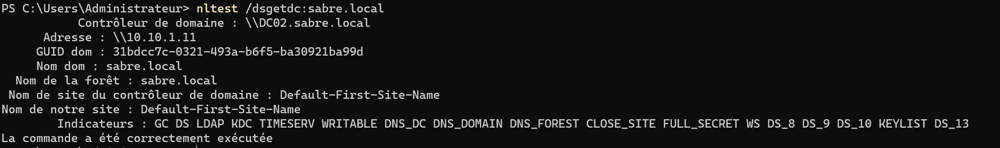

**BF-05b**, WIN11-A, DC01 éteint : session ouverte par `sabre\omartinez`, compte jamais connecté sur ce poste (aucun cache possible). `LOGONSERVER` vaut `\\DC02` : un DC a réellement authentifié l'utilisateur.
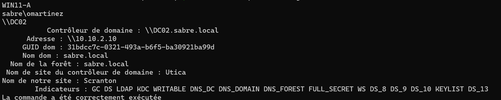

**BF-06a**, WIN11-A, DC01 éteint : `ipconfig /release` puis `ipconfig /renew` → « Impossible de contacter votre serveur DHCP », adresse APIPA `169.254.25.123`.
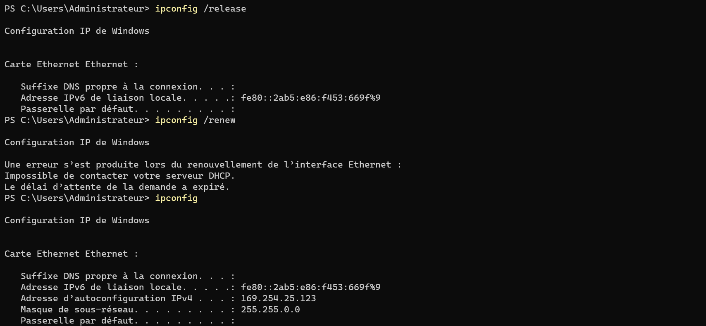

**BF-06b**, WIN11-A, DC01 rallumé : `ipconfig /renew` → bail `10.10.1.101` rétabli.
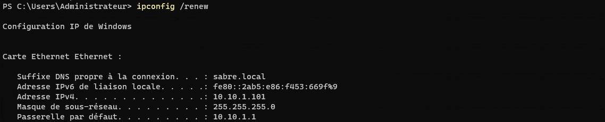

> ⚠️ **BF-05b, BF-06a et BF-06b rejouées en état N4.** La passerelle `10.10.1.1` visible en BF-06b vient de l'option 003 posée en N3, absente en N1. Le mécanisme démontré (un DHCP porté par DC01 seul) est le même.

**BF-07a**, DC01 : `repadmin /replsummary` juste après le redémarrage de DC01 → DC02 **2/5 échecs, erreur 8524 (recherche DNS)**. *(état transitoire, NE PAS conclure ici)*
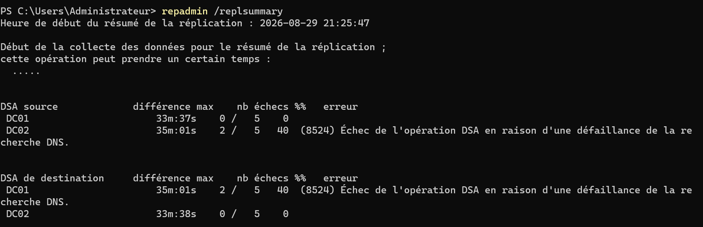

**BF-07b**, DC01 : `repadmin /replsummary` après convergence → **0/5, 0 erreur** sur les deux DC. *(clôture saine, complète P-11)*
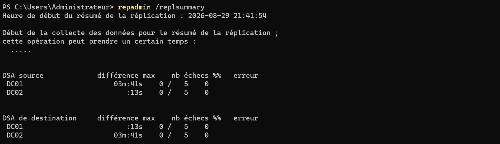
</details>

### 2.5 Cause racine et réparation

**Cause :** DC01 éteint volontairement (injection), pas une panne réelle. Réparation : le rallumer et laisser la réplication converger.

```powershell
# Sur l'hôte : remise en service de DC01
Start-VM DC01
```

### 2.6 Validation en miroir, et le piège de la convergence

Je re-mesure la réplication : 

- La première mesure, prise juste après `Start-VM DC01`, montre `2/5 échecs, erreur 8524 (défaillance de la recherche DNS)` (BF-07a). Le 8524 porte sur la résolution de l'alias GUID du partenaire de réplication (`<GUID>._msdcs.sabre.local`), pas sur les SRV. [Probable] Cause la plus vraisemblable : DC01, en DNS loopback seul, redémarre et interroge son propre service DNS avant qu'il soit prêt. Un partenaire en DNS préféré aurait probablement atténué ce creux. Explication à confirmer.
- Signer « réparé » ici serait faux. Après quelques minutes la mesure repasse à `0/5, 0 erreur` (BF-07b), et là seulement la mission est close.

**Opération re-tentée :** `nltest /dsgetdc:sabre.local` (le client relocalise DC01 ou DC02) et `Get-ADDomainController -Filter *` (les deux DC listés).

**Résultat observé (après convergence) :** les deux DC répondent, réplication à zéro échec.

### 2.7 Leçon transférable

1) Deux DC ne rendent pas tout redondant. En regardant l'infra, j'ai cherché ce qui ne bascule pas : ici DC01 porte le DHCP tout seul, et ce service tombe avec lui. 
2) J'ai aussi appris à ne pas conclure trop tôt après un redémarrage : le 8524 juste après `Start-VM` est un creux de résolution transitoire, pas une réplication cassée.

---

# 2. Dépannage (incidents accidentels)

## <a id="dépannage-incidents-de-session"></a>Incidents de session

> Incidents **accidentels** rencontrés et corrigés dans la même session, distincts des missions panne délibérées.

| # | Symptôme | Cause | Diagnostic | Correctif |
| - | -------- | ----- | ---------- | --------- |
| 1 | DC01 ne démarrait pas proprement / firmware non conforme | modèle Secure Boot réglé sur « Microsoft UEFI » (pour invités non-Windows) au lieu de « Microsoft Windows » | GUI Firmware, `Get-VMFirmware` | rebasculer le modèle Secure Boot sur **MicrosoftWindows** |
| 2 | `dcdiag /test:dns` en échec, deux causes empilées : (a) client DNS de DC01 vide (code réel 9852 derrière une fausse erreur WMI `0x80041001`), (b) SRV de DC01 jamais réinscrit après la Mission 1 | (a) **erreur de cible** : l'injection 1, prévue pour WIN11-A, a été exécutée sur DC01 puis annulée avec `-ResetServerAddresses`, un retour arrière qui ne vaut que pour un client DHCP ; (b) conséquence de (a) : un DC sans DNS client ne peut pas se réinscrire | `dcdiag /test:dns /v` (lire les **codes**, pas les messages), `Get-DnsClientServerAddress`, `winmgmt /verifyrepository`, historique PowerShell et journal Système de DC01 | `Set-DnsClientServerAddress 127.0.0.1` puis `Restart-Service Netlogon` et ~60 s d'attente → [détail](#dcdiag) |

**Commandes de diagnostic de référence :**

```powershell
Get-VMFirmware DC01
dcdiag /test:dns
repadmin /replsummary
Resolve-DnsName sabre.local -Type SRV
nltest /dsgetdc:sabre.local
```

> Numérotation d'origine conservée : les incidents intermédiaires, non retenus pour la publication, ont été retirés.

<details><summary><a id="bf-08"></a>📷 Preuve : BF-08 · Secure Boot avant correction (incident 1)</summary>

**BF-08**, GUI DC01, modèle Secure Boot « UEFI Microsoft ». *(état AVANT correction, à ne jamais présenter comme conformité)*
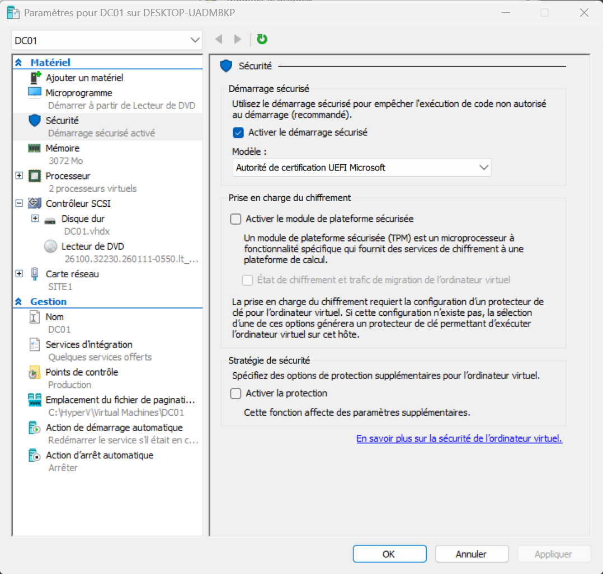

État APRÈS correction (conformité) : voir [P-01b](./WORKFLOW.md#p-01) dans le WORKFLOW (`MicrosoftWindows`).
</details>

## <a id="incidents-marquants"></a>Incidents marquants


> Résumé des incidents accidentels rencontrés pendant la construction de l'épisode, par opposition aux missions panne injectées volontairement. Chacun a été diagnostiqué jusqu'à la cause racine et traité dans la session.

### <a id="dcdiag"></a><a id="bf-09"></a>Le `dcdiag` qui ment (BF-09)

> **Preuve texte** (transcripts de terminal réels). Sur cette build, `dcdiag` mélange messages français et anglais : ils sont cités tels quels.

Machine : **DC01** (`10.10.1.10`), console `Administrateur`. Domaine `sabre.local`.

---

#### 1. État cassé : `dcdiag /test:dns` échoue (résumé)

```
Résumé des résultats des tests DNS :
                                     Auth Basc Forw Del  Dyn  RReg Ext
     ________________________________________________________________
     Domaine : sabre.local
        DC01                         PASS FAIL PASS PASS WARN FAIL n/a
     ......................... Le test DNS de sabre.local a échoué
```

Messages accusateurs (tous trompeurs) : « can't read network adapter information through WMI »,
« The A record for this DC was not found », « Pas de connectivité LDAP ».

---

#### 2. Élimination des fausses pistes par sondes indépendantes

Chaque sonde **dément** une accusation de `dcdiag`.

**WMI lit bien la carte** (contredit « can't read adapter through WMI ») :

```
PS> Get-WmiObject Win32_NetworkAdapterConfiguration -Filter "IPEnabled=True" |
      Select-Object Description, IPAddress
Description                       IPAddress
-----------                       ---------
Microsoft Hyper-V Network Adapter {10.10.1.10, fe80::836b:6824:b998:8254}
```

**L'enregistrement A existe** (contredit « A record not found ») :

```
PS> Get-DnsServerResourceRecord -ZoneName "sabre.local" -RRType A -Name "dc01"
HostName  RecordType  RecordData
--------  ----------  ----------
dc01      A           10.10.1.10
```

**Le pare-feu est ouvert sur LDAP** (contredit « Pas de connectivité LDAP ») :

```
PS> Test-NetConnection 10.10.1.10 -Port 389
ComputerName     : 10.10.1.10
RemotePort       : 389
TcpTestSucceeded : True
```

**Le dépôt WMI est sain** (contredit une corruption WMI) :

```
PS> winmgmt /verifyrepository
L'espace de stockage WMI EST cohérent.
```

Aucune carte fantôme, délégation `_msdcs` valide, forwarders valides (via `dcdiag /v`).
→ Toutes les accusations tombent : **le DNS est sain**.

---

#### 3. Cause racine n°1 : le DNS *client* de DC01 est vide

Le verbose `dcdiag /test:dns /v` donne le vrai code, noyé dans le test `Dyn` :

```
[Error details: 9852 (Type: Win32 - Description:
 Aucun serveur DNS n'est configuré pour le système local.)]
```

Confirmation directe, la carte n'a **aucun** serveur DNS client renseigné :

```
PS> Get-DnsClientServerAddress -InterfaceAlias "Ethernet" -AddressFamily IPv4
InterfaceAlias   InterfaceIndex  AddressFamily  ServerAddresses
--------------   --------------  -------------  ---------------
Ethernet         6               IPv4           {}
```

> **Le mensonge décodé :** DC01 résout via son *service* DNS local, mais son *client* DNS ne pointe
> sur rien. `dcdiag` lit la config *client* de la carte → « pas de DNS » → et l'erreur WMI
> `0x80041001` n'était que le masque du code 9852 (aucun serveur DNS configuré).

#### 3 bis. Origine : une erreur de cible pendant la mission panne

Le vidage ne vient pas d'une cause inexpliquée. L'injection 1 de la Mission 1, prévue pour WIN11-A, a été exécutée sur DC01, puis annulée avec un retour arrière valable uniquement pour un client DHCP :

```
Set-DnsClientServerAddress -InterfaceAlias "Ethernet" -ServerAddresses 10.10.1.250
Set-DnsClientServerAddress -InterfaceAlias "Ethernet" -ResetServerAddresses
```

`-ResetServerAddresses` redemande les serveurs DNS au DHCP. Sur une carte en IP statique, il ne reçoit rien et la liste reste vide.

Deux sources indépendantes se recoupent. L'historique PowerShell de DC01 n'est pas horodaté, l'heure vient des journaux d'événements.

| Source | Élément | Ce qu'il établit |
| ------ | ------- | ---------------- |
| Historique PSReadLine de DC01 | l.55-56, entre des commandes DC01 d'environ 21:48 (l.52-54) et la préparation de l'injection 2 (l.58) | la commande et son ordre |
| Journal Système, NETLOGON | 26/08 19:30:02, démarrage sans 5782 | carte encore renseignée |
| Journal Système, NETLOGON | 26/08 22:25:20, premier 5782 « Aucun serveur DNS n'est configuré pour le système local » | carte vide à cette heure |
| Journal Système, NETLOGON | 27/08, 5782 jusqu'à 02:09:40 puis 5781 à 02:32:44 | réparation entre ces deux heures |
| Directory Service, DC01 | 2087/2088 dès le 26/08 22:44 | impact sur la résolution des partenaires de réplication |

Trois facteurs ont permis l'erreur : une consigne de retour arrière donnée sans préciser qu'elle ne vaut que pour un client DHCP, le même nom de carte (`Ethernet`) sur DC01 et WIN11-A, qui laisse la commande s'exécuter sans erreur sur la mauvaise machine, et aucun contrôle de la machine courante (`hostname`) avant l'injection.

Le diagnostic du soir l'a manqué parce que `dcdiag` échouait sur la résolution de l'alias GUID de DC01 (`<GUID>._msdcs.sabre.local`), ce que la suppression des SRV ne pouvait pas provoquer. L'échec a d'abord été attribué à l'injection 2, puis à WMI, sans inspecter le DNS client de DC01.

---

#### 4. Réparation n°1 et révélation de la cause n°2

```
PS> Set-DnsClientServerAddress -InterfaceAlias "Ethernet" -ServerAddresses 127.0.0.1
PS> Clear-DnsClientCache ; ipconfig /registerdns
PS> dcdiag /test:dns
```

`Connectivity` et `Basc` passent **PASS**. `dcdiag` révèle alors le vrai problème restant,
masqué jusque-là :

```
TEST: Records registration (RReg)
   Carte réseau [00000000] Microsoft Hyper-V Network Adapter :
      Avertissement :
      Enregistrement SRV manquant au niveau du serveur DNS 10.10.1.10 :
      _ldap._tcp.dc._msdcs.sabre.local

Résumé : DC01   PASS PASS PASS PASS PASS FAIL n/a
```

L'entrée SRV de **DC01** manquait (supprimée par l'injection 2 de la mission panne, jamais
réinscrite tant que le DNS client était vide). Seule celle de DC02 subsistait :

```
PS> Get-DnsServerResourceRecord -ZoneName "_msdcs.sabre.local" -RRType SRV -Name "_ldap._tcp.dc"
HostName        RecordData
--------        ----------
_ldap._tcp.dc   [0][100][389][dc02.sabre.local.]      <-- dc01 absent
```

---

#### 5. Réparation n°2 : réinscription du SRV et convergence

```
PS> Restart-Service Netlogon
PS> Start-Sleep -Seconds 60          # laisser converger la zone _msdcs
PS> Clear-DnsClientCache
```

---

#### 6. État final, prouvé de deux façons

`dcdiag /test:dns` :
```
......................... Le test DNS de sabre.local a réussi
```

Vue client : le SRV renvoie de nouveau **les deux DC** (équilibrage rétabli).
```
PS> Resolve-DnsName -Type SRV _ldap._tcp.dc._msdcs.sabre.local
NameTarget         Priority Weight Port
----------         -------- ------ ----
dc01.sabre.local   0        100    389
dc02.sabre.local   0        100    389
```

---

#### Ce que cet incident prouve

Deux pannes empilées derrière un rapport trompeur. La méthode qui les a démasquées :
lire les **codes** du verbose (pas les messages), trouver le code qui **explique** les autres
(`9852` → `0x80041001` → « A not found »), et savoir qu'une panne réparée peut en **révéler**
une seconde. Le service DNS n'a jamais été en panne. Ce qui manquait, c'était la configuration client de DC01 et, par ricochet, un enregistrement, et `dcdiag` en a donné une lecture trompeuse.

Trois réflexes en sortent :

- avant toute injection ou tout retour arrière, vérifier la machine courante (`hostname` en tête de bloc) ;
- choisir un retour arrière selon l'état d'origine de la cible (statique ou DHCP), jamais par réflexe ;
- face à un DC qui ne résout plus son propre nom, contrôler son DNS client avant toute autre hypothèse.

---

⬆️ [Sommaire](#sommaire) · 📄 **[← Workflow N1](./WORKFLOW.md)** · [README de l'épisode](./README.md) · [Vue d'ensemble](../../README.md) · **Suivant → [Workflow N2](../N2/WORKFLOW.md)** : OU, comptes en masse, AGDLP, GPO, LAPS et cycle de vie.
