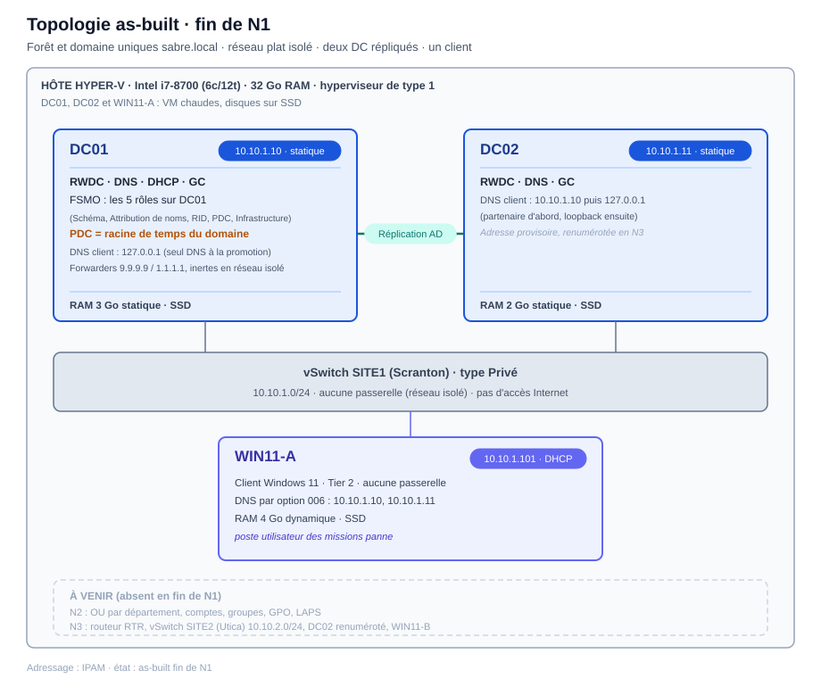

# Épisode N1 : Les fondations

**Concepts clés** : forêt et domaine uniques · contrôleur de domaine (RWDC) · DNS intégré à AD · DHCP · réplication AD · Global Catalog (GC) · rôles FSMO · hiérarchie de temps (PDC Emulator) · jonction d'un client au domaine

- 🎬 **Saison 1 · Épisode N1**
- 🖥️ **Stack** : Hyper-V, Windows Server 2025 éval (2 DC : DC01, DC02), Windows 11 Enterprise (WIN11-A), vSwitch privé `SITE1`
- 🗺️ Adressage (IP / DNS / passerelle / vSwitch) → [IPAM](../../IPAM.md)
- 🎭 Annuaire de démo (OU, groupes, comptes, nommage...) → [ABOUT DUNDER MIFFLAD](../../ABOUT_DUNDER_MIFFLAD.md)
- 📝 Progression étape par étape → [WORKFLOW N1](./WORKFLOW.md)
- 🔧 Mission panne & dépannage → [BREAKFIX N1](./BREAKFIX.md)

> 🎥 **Storyline :** *Scranton ouvre. Avant le premier employé, il faut que les machines sachent se trouver, que l'annuaire sache qui est qui, et qu'une horloge fasse foi pour tout le monde. Rien de spectaculaire à l'écran, et pourtant tout le reste du lab repose sur ces trois fondations posées ce jour-là.*

## Topologie 

## Objectif

Poser le socle d'identité de `sabre.local` : une forêt et un domaine uniques, deux contrôleurs de domaine qui se répliquent sur un réseau isolé, et les services cœur dont tout le reste dépendra (DNS intégré à l'annuaire, DHCP, catalogue global, rôles FSMO).

Router et sécuriser viendront en N3 et N5. Ici, le but était de rendre l'annuaire **vivant** (il répond), **trouvable** (une requête « où est ce service ? » aboutit) et **répliqué** (les deux DC portent la même information).

Ce que pose N1 :

- Forêt et domaine uniques `sabre.local`.
- DC01 : RWDC + DNS intégré à AD + DHCP + GC + les 5 rôles FSMO.
- DC02 : second RWDC, DNS, GC (réplication et résilience de l'authentification).
- Réplication AD validée sur un seul `/24`, sans routeur (le multi-site attend N3).
- Hiérarchie de temps figée : le PDC Emulator (DC01) est la racine de temps du domaine.

Tout ce que construira N2 (unités d'organisation, comptes, stratégies de groupe) s'appuie sur ce socle.

## Principes de conception

1. **Une forêt, un domaine :** Le multi-forêt a été jugé comme de la sur-ingénierie pour ce premier lab.

2. **DNS intégré à AD, forwarders publics mais pas le DNS du FAI en primaire sur un DC :** AD localise ses contrôleurs par des enregistrements SRV publiés dans la zone DNS interne. Ces fiches n'existent nulle part ailleurs. Un DNS FAI en primaire aurait renvoyé les clients vers un serveur qui ignore l'existence du domaine, et plus personne n'aurait trouvé de DC pour s'authentifier.

3. **DNS d'un DC = son partenaire, puis loopback.** Un DC qui ne pointe que sur lui-même peut finir isolé de la réplication (*DNS island*). DC02 a été configuré ainsi (DC01 puis `127.0.0.1`). DC01, premier DC de la forêt, n'avait aucun partenaire à sa promotion : le loopback seul était la seule valeur possible. Son passage en « partenaire puis loopback » était prévu à partir de N3, une fois DC02 à son adresse définitive ([registre](./WORKFLOW.md#registre-derreurs--dette-technique)).

4. **Aucune passerelle sur les DC en réseau isolé.** En N1-N2 le réseau est plat : il n'existe rien à router hors du sous-réseau. La passerelle arrive avec le routeur en N3. Ce choix n'est pas une mesure de sécurité, le confinement Tier 0 est traité en N5.

5. **Global Catalog sur les deux DC.** L'ouverture de session a besoin d'un GC pour résoudre l'appartenance aux groupes. En mettre un sur chaque DC, c'est garder l'authentification possible même si l'un des deux est éteint.

6. **PDC Emulator = racine de temps dès le jour 1.** Kerberos refuse tout écart d'horloge supérieur à 5 minutes. Une référence de temps unique doit donc exister avant les premiers clients, sinon les authentifications tomberont plus tard sans raison apparente.

## La mission panne : cadrage

- **Mission 1, résolution DNS :** trois vecteurs cassés en même temps (DNS client du poste pointé vers une adresse morte, enregistrement SRV supprimé, forwarder cassé). Impact : le poste ne localise plus aucun contrôleur et un changement de mot de passe échoue.

- **Mission 2, perte d'un contrôleur :** DC01 éteint. L'authentification bascule sur DC02, mais le DHCP, porté par DC01 seul, n'a plus de serveur : un poste qui renouvelle son bail tombe en adresse APIPA.

- **Ce que ça démontre :** AD DS dépend totalement du DNS, et une panne de résolution se localise par élimination, sans se laisser tromper par le cache. Deux DC ne rendent pas tout redondant : le DHCP reste un point de défaillance unique (SPOF).

- ➡️ Exécution & preuves : [BREAKFIX N1 · Mission 1](./BREAKFIX.md#mission-panne) · [Mission 2](./BREAKFIX.md#mission-redondance)

## Couverture compétences

| Compétence                   | Démonstration                                                                   |
| ---------------------------- | ------------------------------------------------------------------------------- |
| DNS (résolution AD / SRV)    | Zone intégrée AD, forwarders, enregistrements SRV ; panne injectée puis réparée |
| AD DS (forêt / domaine / DC) | Forêt et domaine `sabre.local`, DC01 RWDC promu                                 |
| Réplication AD               | DC02 réplique DC01 sur un `/24` isolé                                           |
| Global Catalog (GC)          | GC sur DC01 et DC02 ; bascule vers DC02 observée depuis le client, DC01 éteint  |
| FSMO                         | Les 5 rôles portés par DC01                                                     |
| DHCP                         | Scope SITE1, option 006 poussant les deux DC                                    |
| Hiérarchie de temps (PDC)    | PDC = racine de temps, horloge de la VM en réseau isolé                         |

## Limites de l'épisode

- 📋 **Source NTP externe hors périmètre N1** : en réseau isolé, le PDC suit sa propre horloge (celle de la VM, initialisée depuis l'hôte au démarrage). En production, il serait calé sur une source NTP externe fiable.

- 📋 **Zone de recherche inversée non créée.** La localisation d'un DC passe par les enregistrements SRV et A, les enregistrements inverses (PTR) n'y jouent aucun rôle. Seul effet visible : `nslookup` affiche « UnKnown » pour le nom du serveur interrogé, sans que la résolution échoue.

- 📋 **Redondance DHCP hors périmètre** à ce stade (failover ou split-scope) : la Mission 2 démontre le SPOF sans le corriger.

- 📋 **Sécurité (tiering, PAW, durcissement) hors N1** : elle arrive en N5.

- ⚠️ **Réplication AD, GC et FSMO montés mais réellement éprouvés plus tard** : DR et saisie FSMO en N7, panne combinée sans étiquette en N8.

## Conclusion

Ce que je retiens de N1 n'est pas d'avoir promu deux contrôleurs de domaine, c'est d'avoir compris que l'annuaire n'existe pour ses clients que si le DNS le laisse se localiser. Le jour où une ouverture de session échouera, mon premier réflexe ne sera pas de regarder AD, mais la résolution de noms et les enregistrements SRV.

J'ai aussi intégré que des mécanismes voisins se diagnostiquent séparément, avec leurs propres outils : la réplication AD n'est pas le DNS, et SYSVOL, plus tard, sera encore autre chose.

Mais ce qui m'a le plus appris, c'est la mission panne. Une panne se manifeste rarement là où elle est écrite : le symptôme que voit l'admin et la cause racine sont deux choses distinctes, et tout l'enjeu est de ne pas les confondre. Ce réflexe de creuser sous le symptôme, je le réutilise depuis à chaque épisode.

La panne la plus instructive n'était d'ailleurs pas celle que j'avais prévue. En rejouant l'injection, j'ai exécuté sur DC01 une commande destinée au poste client, puis annulée avec un geste qui ne vaut que pour une machine en DHCP : le DNS client de DC01 s'est retrouvé vide. J'en garde un réflexe simple, vérifier la machine courante avant toute injection et choisir un retour arrière selon l'état d'origine de la cible.

---

⬆️ [Vue d'ensemble](../../README.md) · 🔁 [Workflow N1](./WORKFLOW.md) · 🔧 [Break/Fix N1](./BREAKFIX.md) · **Suivant → [N2 : Administration](../N2/README.md)** : OU, comptes, AGDLP, PowerShell, GPO, LAPS et cycle de vie des comptes.
