# Épisode N1 : Workflow

**Concepts clés** : forêt et domaine uniques · contrôleur de domaine (RWDC) · DNS intégré à AD · DHCP · réplication AD · Global Catalog (GC) · rôles FSMO · hiérarchie de temps (PDC Emulator) · jonction d'un client au domaine

- 🎬 **Saison 1 · Épisode N1**
- 🖥️ **Stack** : Hyper-V, Windows Server 2025 éval (2 DC : DC01, DC02), Windows 11 Enterprise (WIN11-A), vSwitch privé `SITE1`
- 🗺️ Adressage (IP / DNS / passerelle / vSwitch) → [IPAM](../../IPAM.md)
- 🎭 Annuaire de démo (OU, groupes, comptes, nommage...) → [ABOUT DUNDER MIFFLAD](../../ABOUT_DUNDER_MIFFLAD.md)
- 📄 Présentation de l'épisode → [README N1](./README.md)
- 🔧 Mission panne & dépannage → [BREAKFIX N1](./BREAKFIX.md)

## Sommaire

**1. Cadrage**

- [Composants & rôles](#composants--rôles)
- [Topologie logique AD (delta N1)](#ad-logique)

**2. Étapes de configuration**

- [Étape 1 : commutateur privé SITE1 + coquilles VM](#étape-1)
- [Étape 2 : IP statique et DNS de DC01](#étape-2)
- [Étape 3 : promotion de DC01 (forêt sabre.local) + DNS](#étape-3)
- [Étape 4 : DHCP (scope SITE1)](#étape-4)
- [Étape 5 : DC02, réplication et GC](#étape-5)
- [Étape 6 : FSMO et hiérarchie de temps](#étape-6)
- [Étape 7 : WIN11-A (client) et jonction au domaine](#étape-7)

**3. Preuves et clôtures**

- [Validation de bout en bout](#validation-de-bout-en-bout)
- [Registre d'erreurs & dette technique](#registre-derreurs--dette-technique)

---

# 1. Cadrage

## <a id="composants--rôles"></a>Composants & rôles

- Deux contrôleurs de domaine (DC01, DC02) posés sur un unique sous-réseau `10.10.1.0/24`, branchés sur le commutateur virtuel **privé** `SITE1`. 

- Aucun routeur, aucune passerelle : le réseau est plat et isolé, état voulu jusqu'à N3. 

- La réplication AD circule directement entre les deux DC sur ce même `/24`, sans équipement intermédiaire. 

- Une fois le domaine et le DHCP en place, le client WIN11-A rejoint le domaine et reçoit son adressage par bail.

| Machine | Rôle dans l'épisode                   | IP (réf. IPAM)        |
| ------- | ------------------------------------- | --------------------- |
| DC01    | RWDC, DNS, DHCP, GC, les 5 rôles FSMO | `10.10.1.10`          |
| DC02    | Second RWDC, DNS, GC (réplication)    | `10.10.1.11`          |
| WIN11-A | Client Windows 11 joint au domaine    | bail DHCP `.100-.199` |

## <a id="ad-logique"></a>Topologie logique AD (delta N1)

N1 crée l'annuaire de zéro : la forêt, le domaine, les deux DC, le lien de réplication et le premier client joint. Tout est nouveau.

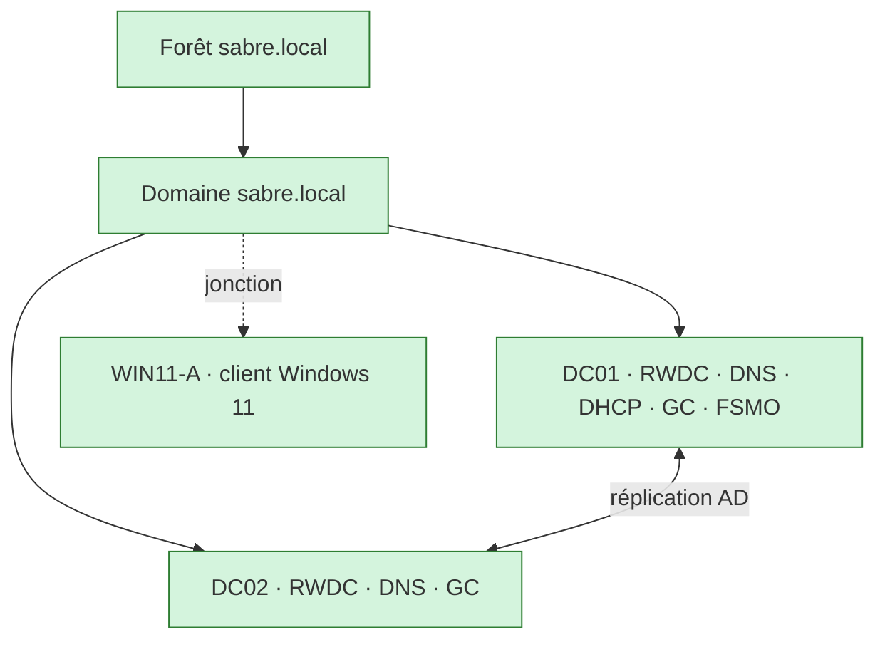

---

# 2. Étapes de configuration

Pourquoi ce choix chronologique : 

1. Créer le réseau isolé **avant** les VM (sinon la carte se branche dans le vide). 

2. Poser l'IP statique **avant** de promouvoir DC01 (un DC promu sur une adresse DHCP causerait des conflits de résolution par la suite). 

3. Orienter le DNS de DC02 vers DC01 **avant** de tenter sa promotion (sinon DC02 ne localise pas le domaine et la promo échoue). 

4. Monter le DHCP **avant** d'introduire le client (sinon pas de bail). 

5. Vérifier GC, réplication, FSMO et temps une fois les deux DC debout, puis joindre le client en dernier.

---
### <a id="étape-1"></a>Étape 1 : commutateur privé SITE1 + coquilles VM

🎯 **Objectif :** créer le réseau isolé du lab, puis les deux VM DC01 et DC02 sur le bon disque, avec le bon firmware.

⚠️ **Le piège de la VM laissée sur un commutateur externe.**

Un commutateur externe branché en permanence, juste « pour avoir Internet », aurait exposé les invités au DHCP du FAI physique, avec des adresses parasites côté lab. L'externe ne s'active que ponctuellement (mises à jour, synchro N10), puis on rebascule en privé.

```powershell
# 1. Le commutateur virtuel privé du site 1 (aucune sortie réseau : isolé)
New-VMSwitch -Name "SITE1" -SwitchType Private
```

```powershell
# 2. Coquille DC01 : Gen2, 3 Go statiques, VHDX et config sur le SSD (VM chaude)
New-VM `
    -Name "DC01" `
    -Generation 2 `
    -MemoryStartupBytes 3GB `
    -NewVHDPath "<Dossier VHDX chauds>\DC01.vhdx" `
    -NewVHDSizeBytes 80GB `
    -SwitchName "SITE1" `
    -Path "C:\<Chemin vers les Virtual Machines>"

# Durcissement spécifique DC
Set-VMMemory -VMName "DC01" -DynamicMemoryEnabled $false -StartupBytes 3GB
Set-VMProcessor -VMName "DC01" -Count 2
Set-VM -VMName "DC01" -CheckpointType Production -AutomaticCheckpointsEnabled $false -AutomaticStopAction ShutDown
Disable-VMIntegrationService -VMName "DC01" -Name "Time Synchronization"

$dvd = Add-VMDvdDrive -VMName "DC01" -Path "<Dossier ISO>\WindowsServer2025.iso" -Passthru
Set-VMFirmware -VMName "DC01" -FirstBootDevice $dvd
Set-VMFirmware -VMName "DC01" -SecureBootTemplate "MicrosoftWindows"
```

```powershell
# 3. Coquille DC02 : identique, 2 Go statiques
New-VM `
    -Name "DC02" `
    -Generation 2 `
    -MemoryStartupBytes 2GB `
    -NewVHDPath "<Dossier VHDX chauds>\DC02.vhdx" `
    -NewVHDSizeBytes 80GB `
    -SwitchName "SITE1" `
    -Path "C:\<Chemin vers les Virtual Machines>"

# Durcissement spécifique DC
Set-VMMemory -VMName "DC02" -DynamicMemoryEnabled $false -StartupBytes 2GB
Set-VMProcessor -VMName "DC02" -Count 2
Set-VM -VMName "DC02" -CheckpointType Production -AutomaticCheckpointsEnabled $false -AutomaticStopAction ShutDown
Disable-VMIntegrationService -VMName "DC02" -Name "Time Synchronization"

$dvd = Add-VMDvdDrive -VMName "DC02" -Path "<Dossier ISO>\WindowsServer2025.iso" -Passthru
Set-VMFirmware -VMName "DC02" -FirstBootDevice $dvd
Set-VMFirmware -VMName "DC02" -SecureBootTemplate "MicrosoftWindows"
```

💡 **Principe de conception : un DC reste en mémoire statique.** 

`New-VM` crée déjà la VM en mémoire statique, le `Set-VMMemory` le rend explicite. La mémoire dynamique (ballooning) peut reprendre de la RAM à AD DS sous charge et dégrader l'authentification. Tous les DC du lab restent en statique, seuls les serveurs membres et les clients passent en dynamique.

⚠️ **Le piège du modèle Secure Boot :** 

Le mauvais modèle Secure Boot (« Microsoft UEFI », réservé aux invités non-Windows) empêche un boot Windows propre : incident réellement rencontré, voir [BREAKFIX § Dépannage](./BREAKFIX.md#dépannage-incidents-de-session).

<details><summary>🖱️ Version GUI</summary>

Commutateur : **Gestionnaire Hyper-V** → **Gestionnaire de commutateur virtuel** → **Nouveau commutateur réseau virtuel** → **Privé** → **Créer le commutateur virtuel** → nom `SITE1` → **OK**.

VM (DC01, puis DC02) : **Action** → **Nouveau** → **Ordinateur virtuel** → **Génération 2** → mémoire 3072 Mo (DC01) / 2048 Mo (DC02), **décocher « Utiliser la mémoire dynamique »** → connexion `SITE1` → disque 80 Go dans le dossier des VHDX chauds (SSD) → **Installer un système d'exploitation à partir d'un fichier image** → ISO Windows Server.

Puis clic droit sur la VM → **Paramètres** :
- **Processeur** → 2 processeurs virtuels.
- **Sécurité** → **Modèle** = **Microsoft Windows** (pas « Autorité de certification UEFI Microsoft »).
- **Microprogramme** → lecteur DVD en tête de l'ordre de démarrage (déjà le cas si l'ISO a été choisie dans l'assistant).
- **Services d'intégration** → décocher **Synchronisation date/heure**.
- **Points de contrôle** → type **Production**, décocher **Utiliser les points de contrôle automatiques**.
- **Action d'arrêt automatique** → **Arrêter le système d'exploitation invité**.
</details>

**Validation**

| Vérification                                                              | Attendu                                           | Preuve |
| ------------------------------------------------------------------------- | ------------------------------------------------- | ------ |
| `Get-VM DC01 \| Format-List Name,Generation,MemoryStartup,ProcessorCount` | Gen2, 3 Go statiques, 2 vCPU                      | P-01a  |
| `Get-VMFirmware DC01 \| Format-List SecureBoot,SecureBootTemplate`        | `On` / `MicrosoftWindows`                         | P-01b  |
| Points de contrôle (GUI)                                                  | type **Production**                               | P-01c  |
| `Get-VMMemory DC01 \| Format-List DynamicMemoryEnabled`                   | `False` (mémoire statique)                        | P-01d  |
| `Get-VM DC02`                                                             | Off, Génération 2 (version de configuration 12.0) | P-02a  |
| `Get-VMFirmware DC02`                                                     | SecureBoot On / MicrosoftWindows                  | P-02b  |

<details><summary><a id="p-01"></a><a id="p-02"></a>📷 Preuves : P-01 · P-02 · coquilles VM et firmware</summary>

**P-01a**, `Get-VM DC01` : Gen2, 3 Go statique, 2 vCPU.
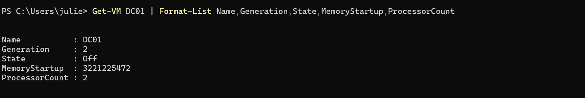

**P-01b**, `Get-VMFirmware DC01` : SecureBoot On, modèle MicrosoftWindows.
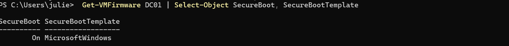

**P-01c**, points de contrôle de type Production.
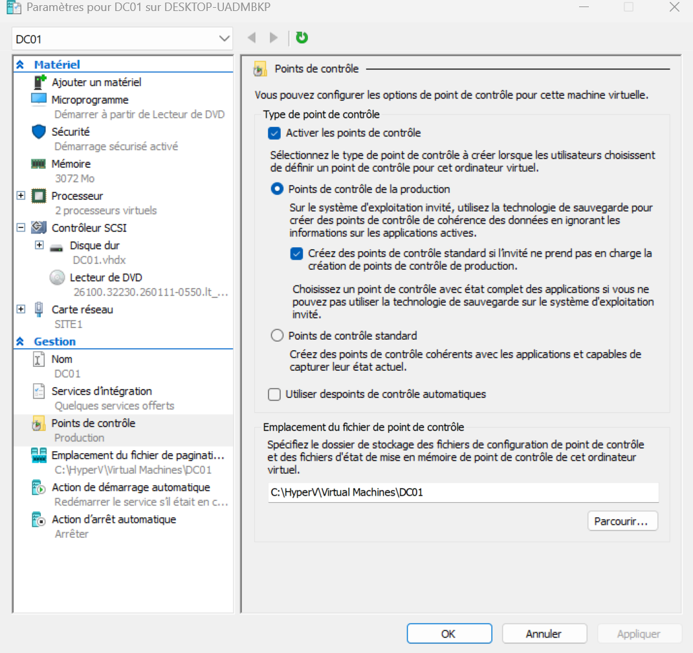

**P-01d**, `Get-VMMemory DC01` mémoire statique
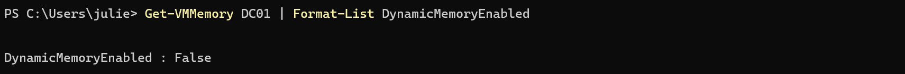

**P-02a**, `Get-VM DC02` : Off, Génération 2 (version de configuration 12.0).
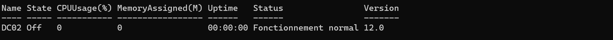

**P-02b**, `Get-VMFirmware DC02` : SecureBoot On, modèle MicrosoftWindows.
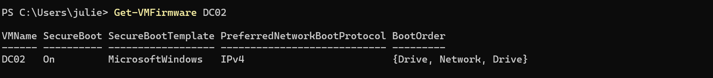
</details>

---
### <a id="étape-2"></a>Étape 2 : IP statique et DNS de DC01

🎯 **Objectif :** fixer l'identité réseau de DC01 avant toute promotion.

💡 **Principe de conception N°1 : un DC ne se promeut jamais sur une adresse DHCP.**

Les autres machines trouvent un DC par son IP et son DNS. Une adresse qui change au gré d'un bail rendrait le DC introuvable par ses clients comme par l'autre DC.

💡 **Principe de conception N°2 : pas de passerelle en réseau isolé.** 

Le réseau est isolé en N1, il n'y a rien à router hors du sous-réseau. La passerelle arrive avec le routeur en N3.

```powershell
# IP statique 10.10.1.10 /24, SANS passerelle (réseau isolé : rien à router)
New-NetIPAddress `
    -InterfaceAlias "Ethernet" `
    -IPAddress 10.10.1.10 `
    -PrefixLength 24
```

```powershell
# DNS client de DC01 : loopback, seul serveur DNS existant à ce stade (partenaire ajouté à partir de N3, voir registre L-02)
Set-DnsClientServerAddress -InterfaceAlias "Ethernet" -ServerAddresses 127.0.0.1
```

```powershell
# Renommage puis redémarrage
Rename-Computer -NewName "DC01" -Restart
```

<details><summary>🖱️ Version GUI</summary>

**Centre Réseau et partage** → **Modifier les paramètres de la carte** → clic droit → **Propriétés** → **Protocole IPv4** → **Utiliser l'adresse suivante** : `10.10.1.10`, masque `255.255.255.0`, **passerelle vide**, DNS préféré `127.0.0.1`. 

Puis **Système** → **Renommer ce PC** → `DC01` → redémarrer.
</details>

**Validation**

| Vérification | Attendu | Preuve |
| ------------ | ------- | ------ |
| `Get-NetIPConfiguration` | `10.10.1.10`, pas de passerelle, DNS `127.0.0.1` | P-03 |

<details><summary><a id="p-03"></a>📷 Preuve : P-03 · identité réseau de DC01</summary>

**P-03**, `Get-NetIPConfiguration` : `.10`, sans passerelle, DNS `127.0.0.1`.
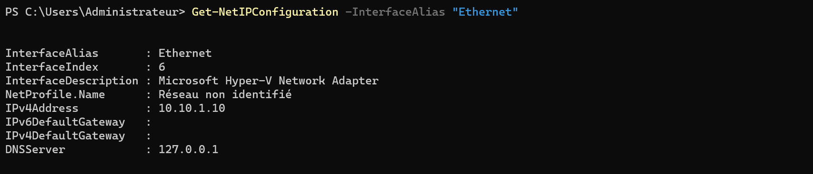
</details>


---
### <a id="étape-3"></a>Étape 3 : promotion de DC01 (forêt sabre.local) + DNS

🎯 **Objectif :** installer AD DS, promouvoir DC01 en premier DC d'une nouvelle forêt, configurer les forwarders DNS.

💡 **Principe de conception : DNS intégré à AD, forwarders publics, jamais le DNS du FAI en primaire.**

AD DS ne se localise que par le DNS (les clients trouvent un DC via des enregistrements **SRV**). Le DNS s'installe donc **pendant** la promotion, intégré à l'annuaire. Les requêtes externes partent vers un résolveur public en **forwarder** (`9.9.9.9`, `1.1.1.1`), jamais posé en DNS primaire sur le DC.

```powershell
# 1. Rôle AD DS + outils
Install-WindowsFeature -Name AD-Domain-Services -IncludeManagementTools
```

```powershell
# 2. Promotion : nouvelle forêt + domaine sabre.local, DNS intégré installé au passage
# (niveau fonctionnel non forcé : défaut 2025 sur un hôte Server 2025)
Install-ADDSForest `
    -DomainName "sabre.local" `
    -DomainNetbiosName "SABRE" `
    -InstallDns `
    -SafeModeAdministratorPassword (Read-Host -AsSecureString) `
    -Force
```

```powershell
# 3. Forwarders publics (résolution externe), APRÈS redémarrage de promotion
Set-DnsServerForwarder -IPAddress 9.9.9.9,1.1.1.1
```

> ⚠️ **forwarder ≠ DNS primaire.** 
> 
> Ne pas mettre `9.9.9.9` en DNS **primaire** sur la carte du DC. Le forwarder est un relais de sortie, pas le résolveur des noms `sabre.local`.

<details><summary>🖱️ Version GUI</summary>

Rôle : **Gestionnaire de serveur** → **Ajouter des rôles** → **AD DS**.

Promotion : bannière drapeau ⚑ → **Promouvoir ce serveur en contrôleur de domaine** → **Ajouter une nouvelle forêt** → `sabre.local` → mot de passe DSRM → **Installer**.

Forwarders : **Gestionnaire DNS** → clic droit serveur → **Propriétés** → **Redirecteurs** → `9.9.9.9`, `1.1.1.1`.
</details>

**Validation**

| Vérification | Attendu | Preuve |
| ------------ | ------- | ------ |
| `Get-Service ADWS,DNS,Kdc,Netlogon,NTDS` | tous `Running` | P-04 |
| `Get-ADDomain \| Format-List DNSRoot,NetBIOSName,DomainMode` | `sabre.local`, `SABRE`, `Windows2025Domain` | P-05 |
| `dcdiag /test:dns` | Connectivity + DNS `passed` | P-06 |
| `Resolve-DnsName dc01.sabre.local` | A `10.10.1.10` | P-07 |
| `Get-DnsServerForwarder` | `9.9.9.9`, `1.1.1.1` | P-08 |

<details><summary><a id="p-04"></a><a id="p-05"></a><a id="p-06"></a><a id="p-07"></a><a id="p-08"></a>📷 Preuves : P-04 à P-08 · forêt, services, DNS</summary>

**P-04**, `Get-Service` : ADWS, DNS, KDC, Netlogon, NTDS tous Running.
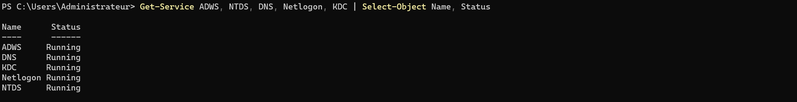

**P-05**, `Get-ADDomain` : sabre.local / SABRE / Windows2025Domain.
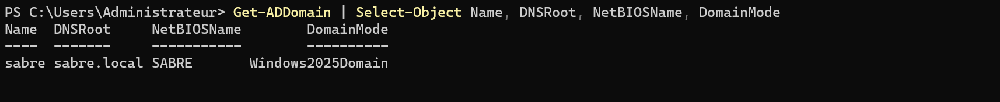

**P-06**, `dcdiag /test:dns` : Connectivity et DNS réussis. 
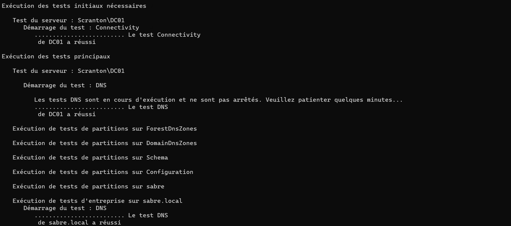

**P-07**, `Resolve-DnsName dc01.sabre.local` : A `10.10.1.10`.
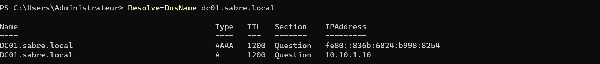

**P-08**, forwarders `9.9.9.9`, `1.1.1.1`.
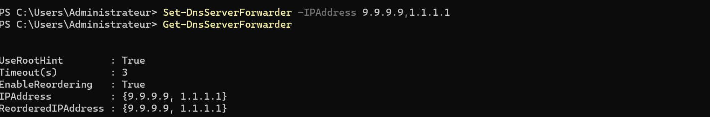
</details>

---
### <a id="étape-4"></a>Étape 4 : DHCP (scope SITE1)

🎯 **Objectif :** installer DHCP sur DC01, créer le scope du site 1, l'autoriser dans AD, prêt pour WIN11-A.

🔧 **Séquencement de l'option 006 en deux temps.** 

DC02 n'existe pas encore, donc l'option 006 (serveurs DNS) ne peut lister que DC01 (`10.10.1.10`). Elle est étendue aux deux DC à l'[Étape 5](#étape-5), une fois DC02 promu et devenu DNS. C'est ce qui permet au client de garder une résolution si un DC tombe, prérequis de la [Mission 2](./BREAKFIX.md#mission-redondance).

💡 **Principe de conception : pas d'option 003, et un DHCP doit être autorisé.** 

L'option 003 (routeur) reste absente en N1 (réseau isolé, pas de routeur avant N3). Pousser une passerelle qui n'existe pas n'aurait rien apporté et aurait brouillé les diagnostics futurs. Un serveur DHCP non autorisé dans AD ne distribue aucun bail, l'autorisation est un geste à part entière.

```powershell
# 1. Rôle DHCP + outils
Install-WindowsFeature -Name DHCP -IncludeManagementTools
```

```powershell
# 2. Scope du site 1 : pool 10.10.1.100 à .199 (réf. IPAM)
Add-DhcpServerv4Scope `
    -Name "SITE1" `
    -StartRange 10.10.1.100 `
    -EndRange 10.10.1.199 `
    -SubnetMask 255.255.255.0
```

```powershell
# 3. Option 006 = DC01 seul pour l'instant (DC02 n'existe pas encore, ajouté en Étape 5) ; option 015 = suffixe
Set-DhcpServerv4OptionValue `
    -ScopeId 10.10.1.0 `
    -DnsServer 10.10.1.10 `
    -DnsDomain "sabre.local"
```

```powershell
# 4. Autoriser le serveur DHCP dans AD (sinon il ne distribue rien)
Add-DhcpServerInDC -DnsName "DC01.sabre.local" -IPAddress 10.10.1.10
```

> 🔧 **Note d'installation :** Installer le rôle ne suffit pas. L'assistant post-installation du Gestionnaire de serveur (« Terminer la configuration DHCP ») crée les groupes de sécurité *Administrateurs DHCP* et *Utilisateurs DHCP*, puis autorise le serveur dans AD. En PowerShell, l'équivalent est `netsh dhcp add securitygroups` suivi de `Restart-Service dhcpserver`, plus l'autorisation `Add-DhcpServerInDC` ci-dessus.

<details><summary>🖱️ Version GUI</summary>

Rôle : **Gestionnaire de serveur** → **Gérer** → **Ajouter des rôles et fonctionnalités** → **Serveur DHCP** → **Installer**. Puis drapeau ⚑ → **Terminer la configuration DHCP** → **Valider** (crée les groupes de sécurité et autorise le serveur dans AD).

Étendue : **Console DHCP** → clic droit **IPv4** → **Nouvelle étendue** → `SITE1`, `10.10.1.100`–`10.10.1.199`, `/24` → page **Routeur (passerelle par défaut)** laissée vide → options : **006** `10.10.1.10` (DC02 ajouté en Étape 5), **015** `sabre.local` → **Activer l'étendue maintenant**.

Si l'assistant n'a pas autorisé le serveur : clic droit sur le serveur → **Autoriser**.
</details>

**Validation**

| Vérification | Attendu | Preuve |
| ------------ | ------- | ------ |
| `Get-DhcpServerv4OptionValue -ScopeId 10.10.1.0` | 006 = `10.10.1.10` (étendu à `.11` en Étape 5), 015 = `sabre.local`, **pas de 003** | P-09a |
| `Get-DhcpServerInDC` | `dc01.sabre.local` autorisé | P-09b |
| `Get-DhcpServerv4Scope` | SITE1 `State = Active`, `.100-.199` | P-09c |

<details><summary><a id="p-09"></a>📷 Preuves : P-09 · DHCP : options, autorisation et scope</summary>

**P-09a**, `Get-DhcpServerv4OptionValue` : option 006 (les deux DC, **état après l'ajout de DC02 en Étape 5**), 015 (suffixe), aucune option 003.
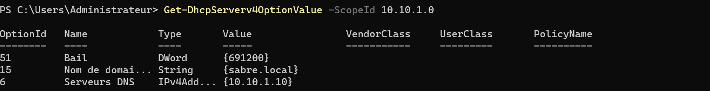

**P-09b**, `Get-DhcpServerInDC` : `dc01.sabre.local` autorisé dans AD.
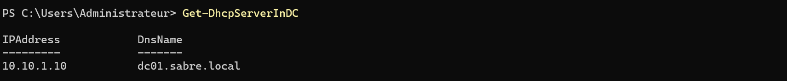

**P-09c**, `Get-DhcpServerv4Scope` : SITE1 `State = Active`, `.100-.199`.
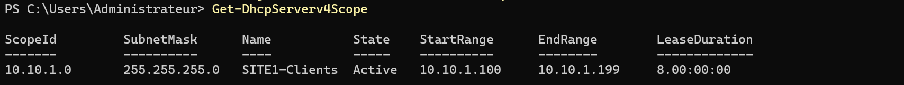
</details>

---
### <a id="étape-5"></a>Étape 5 : DC02, réplication et GC

🎯 **Objectif :** ajouter DC02 comme second DC de `sabre.local`, prouver la réplication et le catalogue global.

⚠️ **Le piège du DNS de DC02 pointé vers DC01 avant la promotion.**

Pour rejoindre le domaine, DC02 doit d'abord le **localiser** via DNS. Son DNS client pointe donc sur DC01 (`10.10.1.10`) avant la promo. Si on oublie, la promotion échoue avec « domaine introuvable », symptôme qui ressemble à tort à un problème de compte. Le loopback (`127.0.0.1`) est ajouté en secondaire **après** la promotion (partenaire puis loopback).

```powershell
# Sur DC02 : IP statique 10.10.1.11 /24, sans passerelle
New-NetIPAddress `
    -InterfaceAlias "Ethernet" `
    -IPAddress 10.10.1.11 `
    -PrefixLength 24
```

```powershell
# DNS de DC02 = DC01 (indispensable AVANT la promo)
Set-DnsClientServerAddress -InterfaceAlias "Ethernet" -ServerAddresses 10.10.1.10

# Renommer DC02 puis redémarrer, AVANT la promotion
Rename-Computer -NewName "DC02" -Restart
```

```powershell
# Pré-vol AVANT promotion : DC02 atteint DC01 en LDAP et résout le domaine
Test-NetConnection 10.10.1.10 -Port 389   # attendu : TcpTestSucceeded = True
Resolve-DnsName sabre.local               # attendu : A 10.10.1.10
Get-NetIPAddress -InterfaceAlias "Ethernet" -AddressFamily IPv4  # attendu : 10.10.1.11 /24 Manual
```

```powershell
# Rôle AD DS puis promotion en DC additionnel (DNS + GC par défaut)
Install-WindowsFeature -Name AD-Domain-Services -IncludeManagementTools

Install-ADDSDomainController `
    -DomainName "sabre.local" `
    -InstallDns `
    -Credential (Get-Credential "SABRE\Administrateur") `
    -SafeModeAdministratorPassword (Read-Host -AsSecureString) `
    -Force
```

```powershell
# APRÈS promotion : ajouter le loopback en DNS secondaire (partenaire puis loopback)
Set-DnsClientServerAddress -InterfaceAlias "Ethernet" -ServerAddresses 10.10.1.10,127.0.0.1
```

> 📌 **Note pour plus tard : DC01 reste en loopback seul en N1.** DC02 est à `10.10.1.11`, une adresse provisoire qui changera au renumérotage de N3. Le passage de DC01 en « partenaire puis loopback » est donc prévu à partir de N3, avec l'adresse définitive de DC02 (registre L-02).

```powershell
# Sur DC01 : DC02 est maintenant un serveur DNS → l'ajouter à l'option 006 du scope
# (résilience : le client garde une résolution si un DC tombe, prérequis de la Mission 2)
Set-DhcpServerv4OptionValue `
    -ScopeId 10.10.1.0 `
    -DnsServer 10.10.1.10,10.10.1.11
```

```powershell
# Preuve de traversée : créer sur DC01, forcer la convergence, lire sur DC02, nettoyer
New-ADUser -Name "replTest01" -SamAccountName "replTest01" -Server DC01 -Enabled $false
repadmin /syncall DC01 /AdeP                  # pousse les changements de DC01 avant de lire ailleurs
Get-ADUser replTest01 -Server DC02            # l'objet doit exister sur DC02
Remove-ADUser replTest01 -Server DC01 -Confirm:$false   # nettoie l'artefact de test
```

> 🔧 **Note de diagnostic : latence de réplication.** Entre deux DC du même site, un changement part après une quinzaine de secondes. Le `repadmin /syncall` évite de conclure sur cette latence normale. L'objet `replTest01` est un artefact de test, supprimé après validation.

<details><summary>🖱️ Version GUI</summary>

Sur DC02, fixer l'IPv4 (`10.10.1.11`, DNS `10.10.1.10`, pas de passerelle) puis renommer en `DC02` et redémarrer. **Gestionnaire de serveur** → rôle **AD DS** → bannière ⚑ → **Promouvoir** → **Ajouter un contrôleur de domaine à un domaine existant** → `sabre.local` → cocher DNS et **catalogue global** → **Installer**.

Après promotion : propriétés IPv4 de DC02 → DNS auxiliaire `127.0.0.1`.

Option 006 : sur DC01, **Console DHCP** → étendue `SITE1` → **Options d'étendue** → **006 Serveurs DNS** → ajouter `10.10.1.11`.

Test de réplication : **Utilisateurs et ordinateurs AD** (connecté à DC01) → créer `replTest01`, désactivé → **Sites et services AD** → `Default-First-Site-Name` → **Servers** → `DC02` → **NTDS Settings** → clic droit sur la connexion venant de DC01 → **Répliquer maintenant** → dans ADUC, clic droit sur le domaine → **Changer de contrôleur de domaine** → `DC02` → l'objet est visible → le supprimer.

`repadmin` et `dcdiag` n'ont pas d'équivalent graphique.
</details>

**Validation**

| Vérification                                                        | Attendu                           | Preuve         |
| ------------------------------------------------------------------- | --------------------------------- | -------------- |
| `Test-NetConnection 10.10.1.10 -Port 389` (pré-vol)                 | `TcpTestSucceeded : True`         | P-10a          |
| `Get-NetIPAddress` DC02 (pré-vol)                                   | `10.10.1.11` /24 Manual           | P-10b          |
| `Resolve-DnsName sabre.local` (pré-vol, depuis DC02)                | A `10.10.1.10`                    | P-10c          |
| `Get-ADDomainController -Filter * \| Select Name,IsGlobalCatalog`   | 2 DC, `IsGlobalCatalog : True` ×2 | P-11           |
| `repadmin /replsummary`                                             | 0 échec sur 5                     | P-11           |
| `repadmin /showrepl DC02`                                           | 5 partitions, `IS_GC`             | P-11           |
| `Get-ADUser replTest01 -Server DC02`                                | objet trouvé (traversée OK)       | P-11           |
| `dcdiag /test:replications`                                         | réussi (DC02)                     | P-11           |
| `Get-DhcpServerv4OptionValue -ScopeId 10.10.1.0` (après ajout DC02) | 006 = `10.10.1.10, 10.10.1.11`    | [P-09a](#p-09) |
| `Get-NetIPAddress` DC02 (pré-vol)                                   | `10.10.1.11` /24 Manual           | P-10b          |

<details><summary><a id="p-10"></a>📷 Preuves : P-10 · pré-vol de promotion DC02</summary>

**P-10a**, `Test-NetConnection 10.10.1.10 -Port 389` : `TcpTestSucceeded : True` (LDAP joignable depuis DC02).
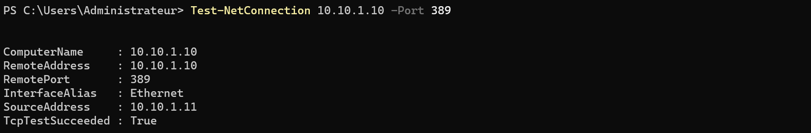

**P-10b**, `Get-NetIPAddress` DC02 : `10.10.1.11` /24, `Manual` (IP statique).
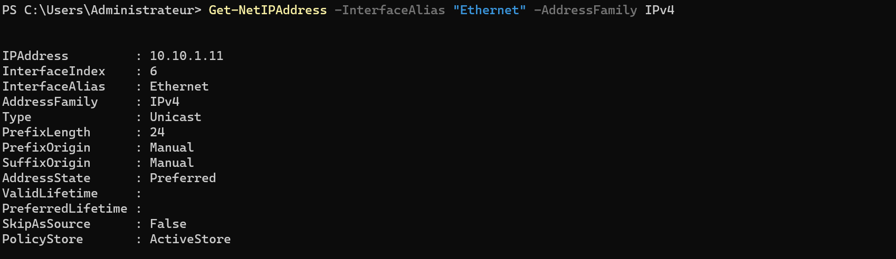

**P-10c**, `Resolve-DnsName sabre.local` depuis DC02 : A `10.10.1.10`.
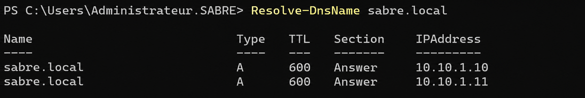
</details>

<details><summary><a id="p-11"></a>📷 Preuves : P-11 · GC et réplication</summary>

**P-11a**, `Get-ADDomainController` : 2 DC, GC = True ×2.
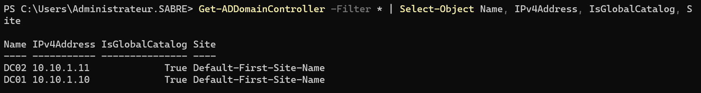

**P-11b**, `repadmin /replsummary` : 0/5, aucune erreur.
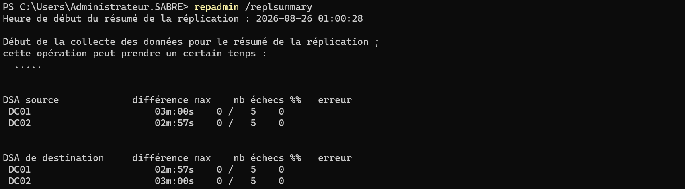

**P-11c**, `repadmin /showrepl DC02` : 5 partitions, IS_GC.
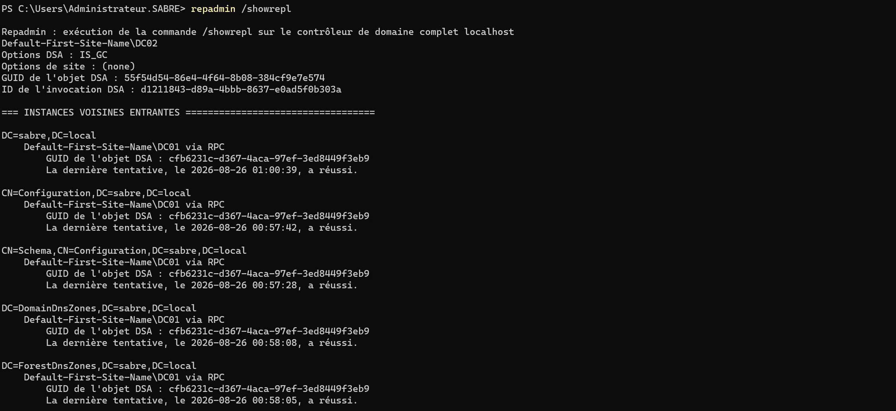

**P-11d**, `Get-ADUser replTest01` trouvé sur DC02 (traversée de réplication).
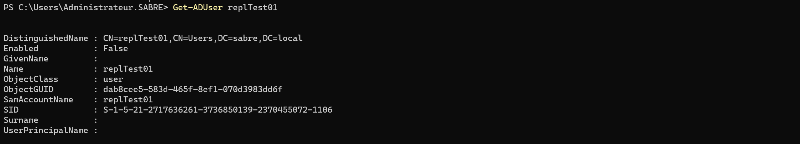

**P-11e**, `dcdiag /test:replications` : réussi sur DC02.
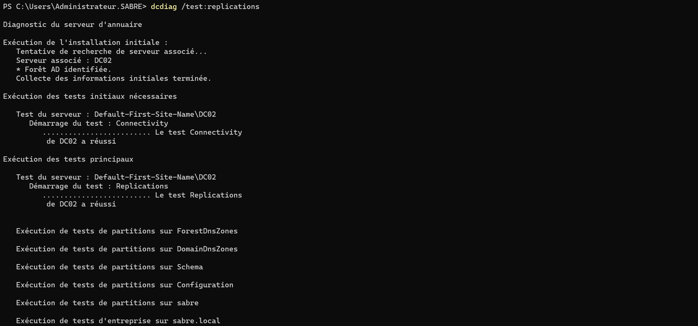
</details>

---
### <a id="étape-6"></a>Étape 6 : FSMO et hiérarchie de temps

🎯 **Objectif :** localiser les rôles FSMO et figer la racine de temps du domaine.

💡 **Principe de conception : le PDC Emulator est la racine de temps.** 

Tous les membres du domaine calent leur horloge sur la hiérarchie `w32tm`, dont le PDC est le sommet. En réseau isolé, il n'a aucune source externe : déclaré source fiable, il suit sa propre horloge (celle de la VM, initialisée depuis l'hôte au démarrage) et s'annonce `stratum 1`. C'est la référence unique, assumée. Kerberos refuse tout écart supérieur à 5 minutes.

⚠️ **Le piège du time-sync Hyper-V laissé actif sur un DC.** 

Le service d'intégration réaligne l'horloge de l'invité sur celle de l'hôte et entre en conflit avec la hiérarchie `w32tm`. Il est coupé sur les deux DC dès l'Étape 1.

```powershell
# 1. Localiser les 5 rôles FSMO (tous sur DC01 en N1)
netdom query fsmo
```

```powershell
# 2. Vérifier que le time-sync d'intégration est bien coupé sur les deux DC (déjà fait en Étape 1)
Get-VMIntegrationService -VMName "DC01","DC02" -Name "Time Synchronization" |
    Select-Object VMName, Enabled   # attendu : Enabled = False
```

```powershell
# 3. Sur DC01 (PDC) : horloge locale comme source unique en réseau isolé
w32tm /config /syncfromflags:no /reliable:yes /update
Restart-Service w32time
w32tm /query /status
```

```powershell
# 4. Sur DC02 : la source doit être DC01 (hiérarchie de domaine)
w32tm /query /status /verbose
```

<details><summary>🖱️ Version GUI</summary>

FSMO : **Utilisateurs et ordinateurs AD** → clic droit sur le domaine → **Maîtres d'opérations** (onglets RID, Contrôleur principal de domaine, Infrastructure). 

Maître d'attribution de noms : **Domaines et approbations AD** → clic droit sur la racine → **Maître d'opérations**. Maître de schéma : console **Schéma Active Directory**, à enregistrer d'abord (`regsvr32 schmmgmt.dll`, puis `mmc` → **Ajouter un composant logiciel enfichable**) → clic droit → **Maître d'opérations**.

Time-sync : **Gestionnaire Hyper-V** → clic droit VM → **Paramètres** → **Services d'intégration** → décocher **Synchronisation date/heure** (DC01 et DC02, si ce n'est déjà fait).

Source de temps (`w32tm`) : pas d'équivalent graphique, la configuration se fait uniquement en ligne de commande.
</details>

**Validation**

| Vérification                           | Attendu                              | Preuve |
| -------------------------------------- | ------------------------------------ | ------ |
| `netdom query fsmo`                    | les 5 rôles sur DC01                 | P-12   |
| `w32tm /query /status` (DC01)          | source = horloge locale, `stratum 1` | P-13a  |
| `w32tm /query /status /verbose` (DC02) | source = DC01, erreur 0              | P-13b  |

<details><summary><a id="p-12"></a><a id="p-13"></a>📷 Preuves : P-12 · P-13 · FSMO et temps</summary>

**P-12**, `netdom query fsmo` : 5 rôles sur DC01.
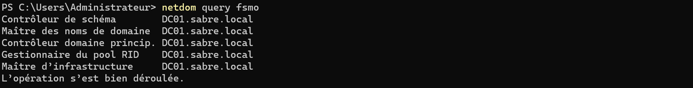

**P-13a**, DC01 : `w32tm /config /syncfromflags:no` + status stratum 1.
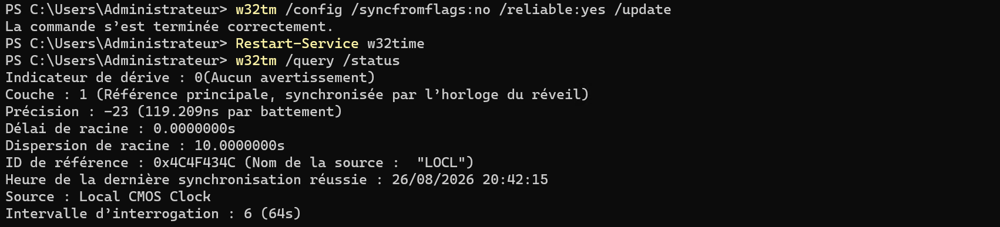

**P-13b**, DC02 : source = DC01, erreur 0.
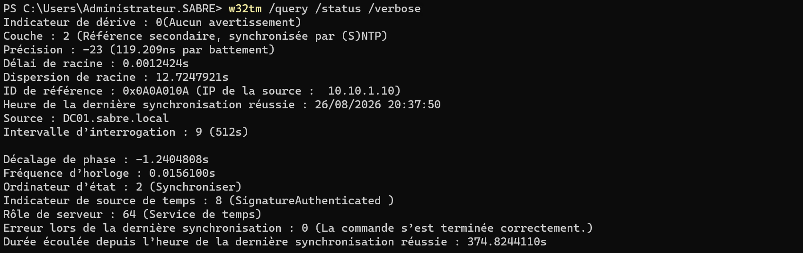
</details>

---
### <a id="étape-7"></a>Étape 7 : WIN11-A (client) et jonction au domaine

🎯 **Objectif :** créer le premier client, l'installer, le joindre au domaine, prouver qu'il reçoit un bail DHCP avec les deux DC en DNS.

💡 **Principe de conception : un client ne se règle pas comme un DC.** 

WIN11-A garde la **mémoire dynamique** (un client s'en accommode et ça libère de la RAM sur l'hôte) et **conserve la synchronisation de temps** des services d'intégration.

⚠️ **Prérequis Windows 11 : vTPM et Secure Boot.** Sans eux, l'installeur refuse de continuer.

```powershell
# 1. Coquille WIN11-A : Gen2, 4 Go dynamiques, VHDX sur le SSD (VM chaude)
New-VM `
    -Name "WIN11-A" `
    -Generation 2 `
    -MemoryStartupBytes 4GB `
    -NewVHDPath "<Dossier VHDX chauds>\WIN11-A.vhdx" `
    -NewVHDSizeBytes 80GB `
    -SwitchName "SITE1" `
    -Path "<Dossier configs VM>"

# Configuration spécifique client (mémoire dynamique)
Set-VMMemory -VMName "WIN11-A" -DynamicMemoryEnabled $true -StartupBytes 4GB -MinimumBytes 1GB -MaximumBytes 6GB
Set-VMProcessor -VMName "WIN11-A" -Count 2
Set-VM -VMName "WIN11-A" -CheckpointType Production -AutomaticCheckpointsEnabled $false

# vTPM obligatoire pour Windows 11
Set-VMKeyProtector -VMName "WIN11-A" -NewLocalKeyProtector
Enable-VMTPM -VMName "WIN11-A"

$dvd = Add-VMDvdDrive -VMName "WIN11-A" -Path "<Dossier ISO>\Windows11Enterprise.iso" -Passthru
Set-VMFirmware -VMName "WIN11-A" -FirstBootDevice $dvd -SecureBootTemplate "MicrosoftWindows"
```

> 🔧 **Note d'installation :** Windows 11 Enterprise s'installe avec un **compte local**, la jonction au domaine vient ensuite. L'édition Enterprise le permet sans contournement : **Configurer pour le travail ou l'école** → **Options de connexion** → **Joindre un domaine à la place**, qui crée un compte local. Cette étape se fait dans l'OS invité, sans équivalent PowerShell côté hôte.

```powershell
# 2. Renommage + jonction au domaine en une commande (dans l'OS WIN11-A, après réception du bail DHCP)
# Le poste a déjà reçu son IP et les deux DC en DNS par le DHCP
Add-Computer -DomainName "sabre.local" -NewName "WIN11-A" -Credential (Get-Credential "SABRE\Administrateur") -Restart
```

<details><summary>🖱️ Version GUI</summary>

VM : **Action** → **Nouveau** → **Ordinateur virtuel** → **Génération 2** → 4096 Mo, **mémoire dynamique cochée** → réseau `SITE1` → disque 80 Go dans le dossier des VHDX chauds (SSD) → ISO Windows 11. 

Puis **Paramètres** → **Processeur** → 2 processeurs virtuels ; **Points de contrôle** → Production, automatiques décochés.

Sécurité : **Paramètres** → **Sécurité** → cocher **Activer le module de plateforme sécurisée (TPM)**, modèle Secure Boot **Microsoft Windows**.

Renommage et jonction : dans WIN11-A, **Paramètres** → **Système** → **Informations système** → **Domaine ou groupe de travail** → onglet **Nom de l'ordinateur** → **Modifier** → nom `WIN11-A`, **Membre d'un domaine** `sabre.local` → identifiants `SABRE\Administrateur` → redémarrer.
</details>

**Validation**

| Vérification | Attendu | Preuve |
| ------------ | ------- | ------ |
| `Get-VMFirmware WIN11-A` (hôte) | SecureBoot On / MicrosoftWindows | P-14a |
| `Get-VMSecurity WIN11-A` (hôte) | `TpmEnabled : True` | P-14b |
| `Get-VMMemory WIN11-A` (hôte) | `DynamicMemoryEnabled : True` | P-14c |
| `ipconfig /all` (WIN11-A) | bail `.101`, DNS `10.10.1.10` **et** `10.10.1.11`, pas de passerelle | P-15a |
| `Get-DhcpServerv4Lease -ScopeId 10.10.1.0` (DC01) | bail actif pour WIN11-A | P-15b |
| `Get-ADComputer WIN11-A` (depuis un DC) | objet présent dans le domaine | P-16 |

<details><summary><a id="p-14"></a>📷 Preuves : P-14 · coquille WIN11-A</summary>

**P-14a**, `Get-VMFirmware WIN11-A` : SecureBoot On, modèle MicrosoftWindows.
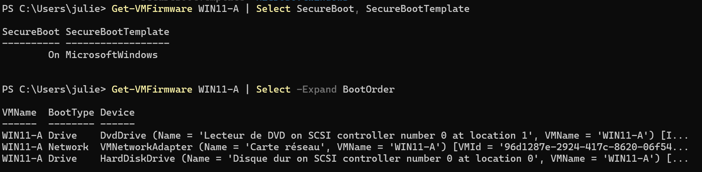

**P-14b**, `Get-VMSecurity WIN11-A` : `TpmEnabled : True` (vTPM).
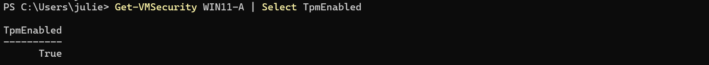

**P-14c**, `Get-VMMemory WIN11-A` : `DynamicMemoryEnabled : True` (client, ≠ DC).
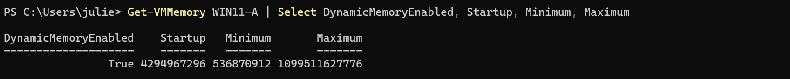
</details>

<details><summary><a id="p-15"></a><a id="p-16"></a>📷 Preuves : P-15 · P-16 · DHCP de bout en bout et jonction</summary>

**P-15a**, WIN11-A : `ipconfig /all` → bail `10.10.1.101`, **Serveurs DNS `10.10.1.10` et `10.10.1.11`**, pas de passerelle (réseau isolé).
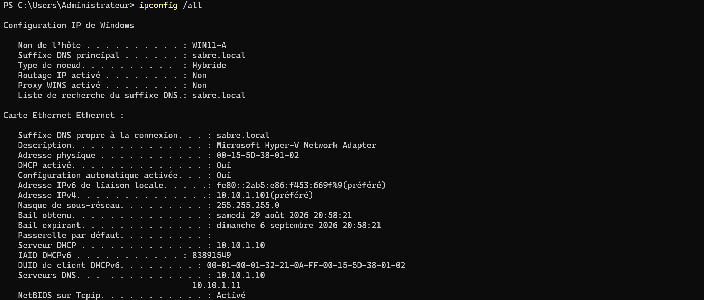

**P-15b**, DC01 : `Get-DhcpServerv4Lease` → bail `.101` actif pour `WIN11-A.sabre.local`. Le bail `.100`, sans nom d'hôte, est celui de DC02 (MAC vérifiée côté hôte), pris pendant son installation avant la pose de l'IP statique. Sans effet, il expire seul.
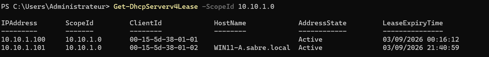

**P-16**, `Get-ADComputer WIN11-A` : objet ordinateur présent dans le domaine (jonction confirmée).
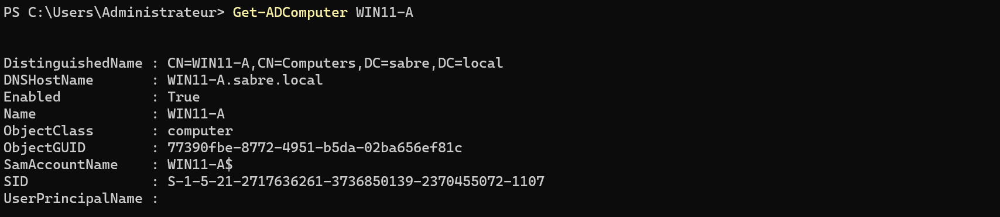
</details>

---

# 3. Preuves et clôtures

## <a id="validation-de-bout-en-bout"></a>Validation de bout en bout

| Domaine        | Vérification                           | Attendu                                 | Preuve                                                           |
| -------------- | -------------------------------------- | --------------------------------------- | ---------------------------------------------------------------- |
| VM / firmware  | `Get-VM` + `Get-VMFirmware`            | Gen2, SecureBoot MicrosoftWindows       | [P-01](#p-01) · [P-02](#p-02)                                    |
| Réseau DC01    | `Get-NetIPConfiguration`               | `.10`, sans passerelle, DNS `127.0.0.1` | [P-03](#p-03)                                                  |
| Services AD    | `Get-Service`                          | ADWS/DNS/KDC/Netlogon/NTDS Running      | [P-04](#p-04)                                                    |
| Domaine        | `Get-ADDomain`                         | sabre.local / SABRE / 2025              | [P-05](#p-05)                                                    |
| DNS / SRV      | `dcdiag /test:dns` · `Resolve-DnsName` | tests verts, A `.10`                    | [P-06](#p-06) · [P-07](#p-07)                                    |
| Forwarders     | `Get-DnsServerForwarder`               | `9.9.9.9`, `1.1.1.1`                    | [P-08](#p-08)                                                    |
| DHCP options   | `Get-DhcpServerv4OptionValue`          | 006 = 2 DC, pas de 003                  | [P-09](#p-09)                                                    |
| DHCP autorisé  | `Get-DhcpServerInDC` + `Get-DhcpServerv4Scope` | autorisé, scope Active          | [P-09](#p-09)                                                    |
| Pré-vol DC02   | `Test-NetConnection 389` + `Resolve`   | LDAP joignable, domaine résolu          | [P-10](#p-10)                                                    |
| Réplication AD | `repadmin /replsummary` + traversée + `dcdiag /test:replications` | 0 échec, `replTest01` sur DC02 | [P-11](#p-11)                                          |
| Global Catalog | `Get-ADDomainController`               | `IsGlobalCatalog : True` ×2             | [P-11](#p-11)                                                    |
| FSMO           | `netdom query fsmo`                    | 5 rôles sur DC01                        | [P-12](#p-12)                                                    |
| Temps          | `w32tm /query /status`                 | PDC stratum 1, DC02 source DC01         | [P-13](#p-13)                                                    |
| Coquille client| `Get-VMFirmware/Security/Memory` WIN11-A | SecureBoot, vTPM, RAM dynamique       | [P-14](#p-14)                                                    |
| Client DHCP    | `ipconfig /all` + `Get-DhcpServerv4Lease` | bail `.101`, 2 DNS, pas de passerelle | [P-15](#p-15)                                                  |
| Client joint   | `Get-ADComputer WIN11-A`               | objet présent                           | [P-16](#p-16)                                                    |
| Break/Fix      | localisation du DC après casse DNS     | échec puis réparé et re-prouvé          | [BF-04](./BREAKFIX.md#bf-04) |

## <a id="registre-derreurs--dette-technique"></a>Registre d'erreurs & dette technique

| ID   | Point                                                                                                                                               | Gravité | Domaine       | Statut                                                   |
| ---- | --------------------------------------------------------------------------------------------------------------------------------------------------- | ------- | ------------- | -------------------------------------------------------- |
| L-01 | Pas de source NTP externe : le PDC suit sa propre horloge de VM (réseau isolé, stratum 1)                                                           | 🟢      | Temps         | 📋 limite lab                                            |
| L-02 | DC01 en DNS loopback seul : seule valeur possible à sa promotion, « partenaire puis loopback » prévu à partir de N3 (DC02 à son adresse définitive) | 🟢      | DNS           | ✅ corrigé en N4 (voir N3 L-06 et N4 L-06)                |
| L-03 | Zone de recherche inversée non créée (aucun rôle dans la localisation des DC)                                                                       | 🟢      | DNS           | 📋 limite lab                                            |
| L-04 | DHCP porté par DC01 seul : point de défaillance unique, démontré en Mission 2                                                                       | 🟠      | DHCP          | 📋 Pas prévu dans le périmètre à ce jour                 |
| L-05 | DNS client de DC01 vidé par une erreur de cible pendant la mission panne (injection prévue pour WIN11-A exécutée sur DC01)                          | 🟠      | DNS / méthode | ✅ réparé, documenté ([incident 2](./BREAKFIX.md#dcdiag)) |


---

⬆️ [Sommaire](#sommaire) · [README de l'épisode](./README.md) · [Vue d'ensemble](../../README.md) · 🔧 **[Break/Fix N1 →](./BREAKFIX.md)** · **Suivant → [Workflow N2](../N2/WORKFLOW.md)** : OU, comptes en masse par PowerShell, AGDLP, GPO, LAPS et cycle de vie des comptes.
