# Épisode N2 : Break/Fix

**Concepts clés** : barrière structurelle vs contrôle procédural · déprovisionnement d'un prestataire externe · angle mort du radar d'expiration · détection par absence d'expiration · validation en miroir

- 🎬 **Saison 1 · Épisode N2**
- 🖥️ **Stack** : Windows Server 2025 (DC01, DC02), Windows 11 Enterprise (WIN11-A), Hyper-V, ADUC, GPMC, PowerShell
- 🗺️ Adressage (IP / DNS / passerelle / vSwitch) → [IPAM](../../IPAM.md)
- 🎭 Annuaire de démo (OU, groupes, comptes, nommage...) → [ABOUT DUNDER MIFFLAD](../../ABOUT_DUNDER_MIFFLAD.md)
- 📄 Présentation de l'épisode → [README N2](./README.md)
- 📝 Progression étape par étape → [WORKFLOW N2](./WORKFLOW.md)

## Sommaire

**1. Mission panne (délibérée)**

- [Mission panne : le presta oublié](#mission-panne)

**2. Dépannage (incidents accidentels)**

- [Incidents de session](#dépannage-incidents-de-session)


---

# 1. Mission panne (délibérée)

## <a id="mission-panne"></a>Mission panne : le presta oublié

> 🎥 **Storyline :** *Bob Vance (Vance Refrigeration) a terminé sa mission, mais son compte reste utilisable.*

**Ce que cette panne prouve :** L'expiration posée à la création agit toute seule, personne n'a besoin d'y penser. La désactivation manuelle dépend de quelqu'un qui se souvient de la faire. Un jour personne ne se souvient, et le compte reste ouvert.

> ⚠️ **Panne inversée :** Ici le défaut n'est pas qu'un service tombe, mais plutôt qu'un accès **réussit alors qu'il devrait échouer**. La validation finale re-tente donc la même opération et vérifie qu'elle est désormais refusée.

### 1.1 État sain, puis injection

**Baseline.** Un externe correctement géré apparaît dans le radar d'expiration.

```powershell
Search-ADAccount `
    -AccountExpiring `
    -TimeSpan (New-TimeSpan -Days 45) `
    -UsersOnly |
Select-Object Name, SamAccountName, AccountExpirationDate
```

**Attendu :** `bvance.ext` apparaît avec son expiration J+30, à côté de `tpacker`.

<details><summary><a id="bf-01"></a>📷 Preuve : BF-01 · baseline (état sain)</summary>

**BF-01** : `bvance.ext` présent dans `Search-ADAccount -AccountExpiring` avant injection.
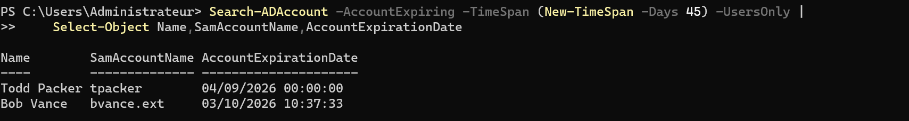
</details>

**Injection (délibérée).** On retire volontairement l'expiration.

```powershell
Clear-ADAccountExpiration -Identity bvance.ext

Get-ADUser bvance.ext `
    -Properties AccountExpirationDate, Enabled |
Select-Object SamAccountName, Enabled, AccountExpirationDate
```

**État cassé :** `Enabled = True`, `AccountExpirationDate` vide.

<details><summary>🖱️ Version GUI</summary>

**Utilisateurs et ordinateurs Active Directory** → `Externals` → `bvance.ext` → onglet **Compte** → **Le compte expire** → **Jamais**.
</details>

<details><summary><a id="bf-02"></a>📷 Preuve : BF-02 · état cassé</summary>

**BF-02** : `Enabled = True`, `AccountExpirationDate` vide après `Clear-ADAccountExpiration`. *(état cassé, mission panne)*
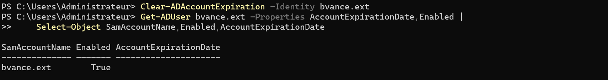
</details>

### <a id="mp-impact"></a>1.2 Impact : ce que la panne casse pour un utilisateur

L'impact est prouvé par une **vraie session Bob** sur `WIN11-A`, pas seulement par une requête admin.

```text
Connexion : sabre\bvance.ext
```

```powershell
whoami                          # -> sabre\bvance.ext
net user /domain                # énumère les comptes du domaine
net group "GG-Sales" /domain    # révèle la composition d'un groupe métier
```

**Observé :** la session s'ouvre, l'identité est confirmée, Bob peut reconnaître l'annuaire.

> **📌 Note sur le périmètre de l'impact :** Bob n'a aucun groupe métier (`NbGroupes = 0`) et aucun partage n'existe encore. La preuve s'arrête à l'**authentification** et à la **reconnaissance d'annuaire**. Le compte a été déprovisionné à la fin de la mission, avant que des partages existent : l'accès à une ressource n'a pas été rejoué.

<details><summary><a id="bf-03"></a><a id="bf-04"></a><a id="bf-05"></a><a id="bf-06"></a>📷 Preuves : BF-03 · BF-04 · BF-05 · BF-06 · impact utilisateur</summary>

**BF-03** : session Bob Vance ouverte sur `WIN11-A`.


**BF-04** : `whoami` → `sabre\bvance.ext`.
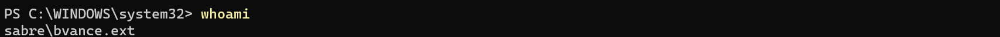

**BF-05** : `net user /domain` énumère les comptes du domaine.
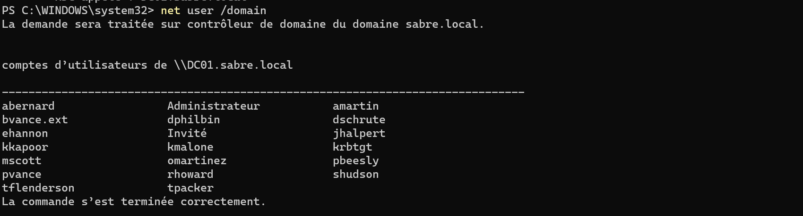

**BF-06** : `net group "GG-Sales" /domain` révèle les membres du groupe.
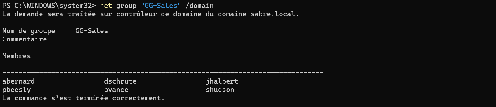
</details>

### <a id="mp-symptome"></a>1.3 Symptôme observé

Le symptôme est un **silence** : Bob disparaît du radar d'expiration alors que son compte reste actif.

```powershell
Search-ADAccount `
    -AccountExpiring `
    -TimeSpan (New-TimeSpan -Days 45) `
    -UsersOnly |
Select-Object Name, SamAccountName
```

**Observé :** `tpacker` reste visible, `bvance.ext` disparaît. Un compte sans date d'expiration ne peut apparaître dans **aucune** fenêtre `-AccountExpiring` : l'absence du radar **est** le symptôme.

<details><summary><a id="bf-07"></a>📷 Preuve : BF-07 · angle mort du radar</summary>

**BF-07** : après retrait de l'expiration, Bob disparaît du radar `-AccountExpiring`.
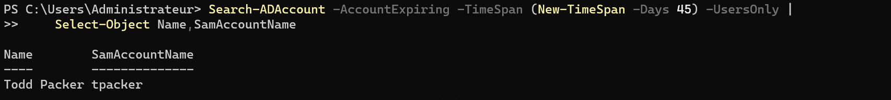
</details>

### 1.4 Diagnostic

Deux lentilles sont testées, dont une **fausse piste** délibérément écartée.

```powershell
# Fausse piste : comptes inactifs
Search-ADAccount `
    -AccountInactive `
    -TimeSpan (New-TimeSpan -Days 30) `
    -UsersOnly |
Where-Object { $_.DistinguishedName -like "*OU=Externals*" }
# -> vide : cohérent, Bob vient d'être utilisé, il n'est PAS inactif
```

```powershell
# Bonne lentille, vue d'ensemble : état d'expiration et d'activité des externes
Get-ADUser `
    -Filter * `
    -SearchBase "OU=Externals,DC=sabre,DC=local" `
    -Properties AccountExpirationDate, Enabled, LastLogonDate, whenCreated |
Select-Object SamAccountName, Enabled, AccountExpirationDate, LastLogonDate
# -> bvance.ext : Enabled=True, expiration vide, logon récent

# Requête ciblée : externes actifs SANS date d'expiration (l'angle mort du radar)
Get-ADUser `
    -Filter 'Enabled -eq $true' `
    -SearchBase "OU=Externals,DC=sabre,DC=local" `
    -Properties AccountExpirationDate |
Where-Object { $_.AccountExpirationDate -eq $null } |
Select-Object SamAccountName, Enabled, AccountExpirationDate
```

La bascule fausse piste → bonne lentille est le cœur du raisonnement. `-AccountInactive` ne détecte pas un compte **récemment utilisé**, et il s'appuie sur `lastLogonTimestamp`, répliqué avec 9 à 14 jours de retard : il est doublement aveugle ici. Il faut interroger explicitement l'**absence d'expiration** sur `OU=Externals`, ce que fait la requête ciblée.

<details><summary><a id="bf-08"></a><a id="bf-09"></a>📷 Preuves : BF-08 · BF-09 · diagnostic</summary>

**BF-08** : Bob actif, sans expiration, avec un logon récent (bonne lentille).
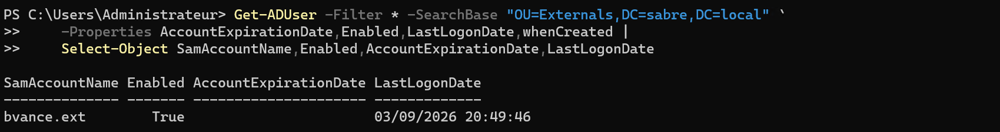

**BF-09** : `Search-ADAccount -AccountInactive` ne remonte rien pour Bob (fausse piste écartée).
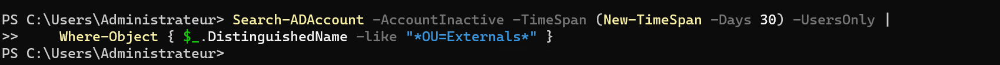
</details>

### 1.5 Cause racine

La barrière `accountExpires` a été retirée. Le déprovisionnement dépend alors entièrement d'une action humaine future. Le défaut de gouvernance est double : le compte reste actif sans date, **et** `Search-ADAccount -AccountExpiring` devient aveugle précisément à ce cas.

### 1.6 Réparation

Deux gestes : contenir immédiatement (désactiver), puis réinstaller la barrière structurelle (reposer une expiration et tracer).

```powershell
# 1. confinement immédiat
Disable-ADAccount -Identity bvance.ext

# 2. réinstaller la barrière + tracer
Set-ADUser `
    -Identity bvance.ext `
    -AccountExpirationDate (Get-Date) `
    -Description "EXTERNE - Vance Refrigeration - mission TERMINEE, deprovisionne le $(Get-Date -Format 'yyyy-MM-dd')"

Get-ADUser bvance.ext `
    -Properties Enabled, AccountExpirationDate, Description |
Select-Object SamAccountName, Enabled, AccountExpirationDate, Description
```

**État réparé :** compte désactivé, expiration reposée, description horodatée. L'objet n'est pas supprimé : le SID reste disponible pour la traçabilité et la réversibilité.

<details><summary>🖱️ Version GUI</summary>

Clic droit `bvance.ext` → **Désactiver le compte** → onglet **Compte** → **Le compte expire** → **Fin de :** aujourd'hui → onglet **Général** → **Description**. En GUI, « Fin de : aujourd'hui » n'expire qu'à minuit : c'est la désactivation qui coupe l'accès tout de suite. La version PowerShell (`Get-Date`) expire à la seconde.
</details>

<details><summary><a id="bf-10"></a>📷 Preuve : BF-10 · état réparé</summary>

**BF-10** : compte désactivé, expiration reposée, description de déprovisionnement tracée. *(après restauration)*
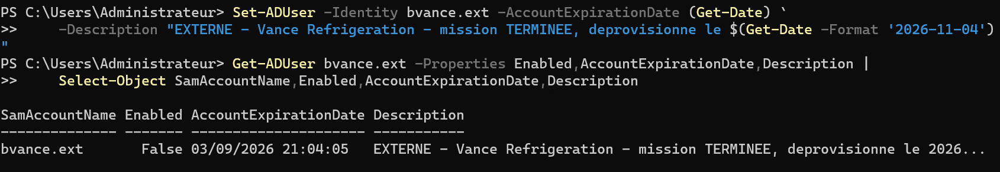
</details>

### <a id="mp-validation"></a>1.7 Validation en miroir

On re-tente **exactement l'opération qui réussissait pendant la panne** : ouverture de session `sabre\bvance.ext` sur `WIN11-A`.

**Attendu :** logon refusé. **Observé :** Windows affiche « Le compte de l'utilisateur a expiré. »

> ⚠️ **Pourquoi « expiré » et non « désactivé », alors que les deux gardes sont posés ?**
>
> La réparation a fait les deux gestes : désactivation **et** expiration (BF-10 : `Enabled=False`, date d'expiration présente). Windows a remonté le motif « expiré ». L'ordre dans lequel Windows évalue ces deux restrictions n'est pas documenté publiquement : BF-11 prouve que l'accès est refusé, pas laquelle des deux gardes l'a refusé.

<details><summary><a id="bf-11"></a>📷 Preuve : BF-11 · validation miroir</summary>

**BF-11** : la même opération qui réussissait pendant la panne échoue après réparation.

</details>

### 1.8 Leçon transférable

- **Structurel > procédural pour un externe.** Une expiration posée à la création coupe l'accès sans attendre qu'un humain agisse.

- **Le radar d'expiration a un angle mort.** Il ne voit jamais les comptes sans expiration : auditer explicitement `AccountExpirationDate -eq $null` sur `OU=Externals`.

- **Un compte oublié peut être actif :** `-AccountInactive` ne suffit pas comme détecteur unique.

- **Réparer = contenir + restaurer le garde-fou :** désactiver coupe l'accès ; reposer l'expiration empêche qu'une réactivation future recrée la panne.

---

# 2. Dépannage (incidents accidentels)

## <a id="dépannage-incidents-de-session"></a>Incidents de session

> Incidents ACCIDENTELS rencontrés **et corrigés dans la même session**.

| # | Symptôme | Cause | Diagnostic | Correctif |
| - | -------- | ----- | ---------- | --------- |
| 1 | `Get-LapsADPassword` ne retourne rien pour `WIN11-A` | backup directory non configuré ; LAPS cible Azure AD au lieu d'AD | journal LAPS : événements **10024** puis **10060** | GPO → backup directory = **Active Directory** → `gpupdate /force` → re-test |
| 2 | RDP refusé pour un compte de domaine standard | être membre du domaine ne donne pas le droit de logon RDP | contrôle du groupe local **Utilisateurs du Bureau à distance** | ajouter le bon groupe ; en prod, gérer par groupe/GPO, pas par compte |

**Commandes de diagnostic de référence :**

```powershell
Get-WinEvent `
    -LogName "Microsoft-Windows-LAPS/Operational" `
    -MaxEvents 20 |
Select-Object TimeCreated, Id, LevelDisplayName, Message

gpresult /r /scope:computer
gpupdate /force
```

📌 **Incident marquant : LAPS vers la mauvaise cible.** Au premier test, l'absence de résultat pouvait faire soupçonner le schéma ou les permissions self. Le journal LAPS a tranché : **10024** (stratégie non configurée) puis **10060** (sauvegarde tentée vers Azure AD sur une machine jointe à AD seul). 

🔧 **Correctif** : imposer **Active Directory** comme backup directory, rafraîchir la stratégie. Le mot de passe apparaît ensuite dans AD ; l'état réparé est prouvé par **[P-14](./WORKFLOW.md#p-14)** dans le WORKFLOW.

<details><summary><a id="bf-12"></a><a id="bf-13"></a>📷 Preuves : BF-12 · BF-13 · incidents de session</summary>

**BF-12** : événements LAPS `10024` / `10060` et paramètre de GPO non configuré. *(avant correction)*
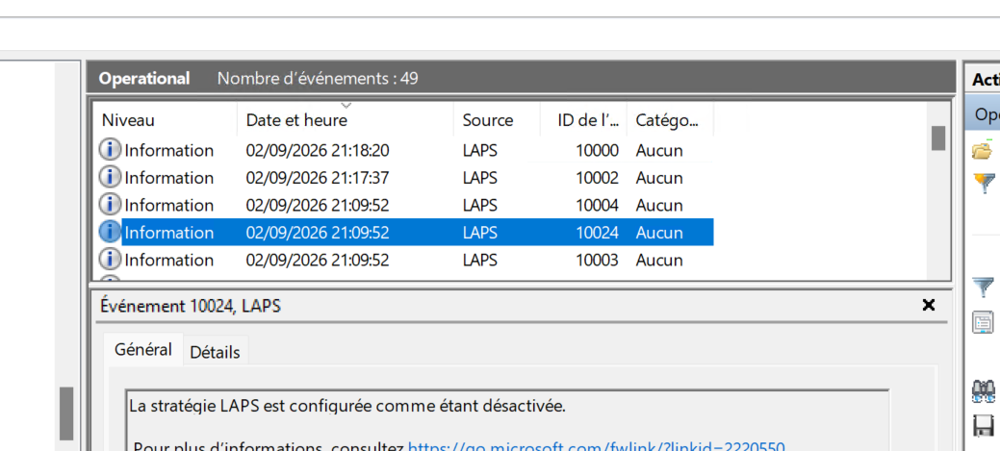
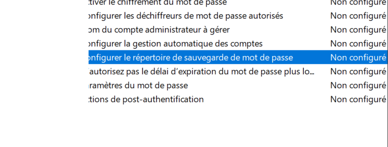
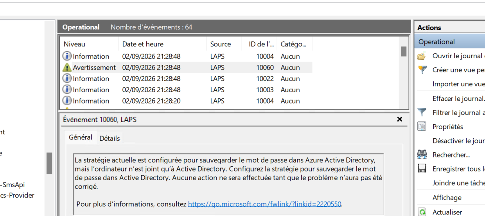

**BF-13** : RDP refusé pour un compte de domaine standard non membre du groupe local autorisé.

</details>

---

⬆️ [Sommaire](#sommaire) · 📄 **[← Workflow N2](./WORKFLOW.md)** · [README N2](./README.md) · [Vue d'ensemble](../../README.md) · **Suivant → [Workflow N3](../N3/WORKFLOW.md)**
