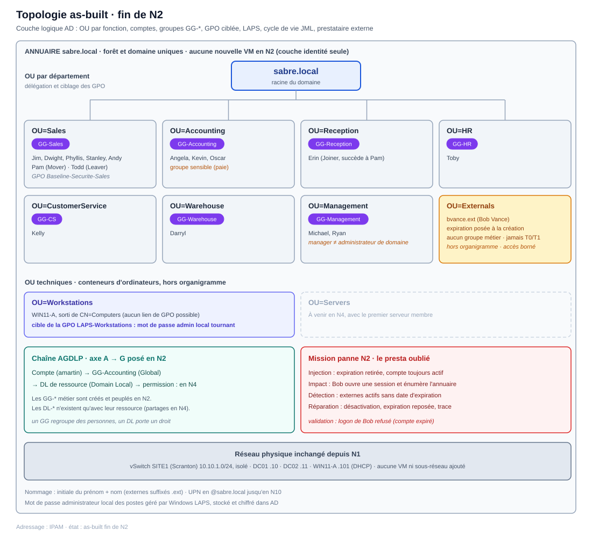

# Épisode N2 : L'administration

**Concepts clés** : OU (unités d'organisation) · comptes AD · groupes & modèle AGDLP · PowerShell (fil rouge) · GPO & héritage · Windows LAPS · cycle de vie JML · prestataire externe

- 🎬 **Saison 1 · Épisode N2**
- 🖥️ **Stack** : Windows Server 2025 (DC01, DC02), Windows 11 Enterprise (WIN11-A), Hyper-V, ADUC, GPMC, PowerShell
- 🗺️ Adressage (IP / DNS / passerelle / vSwitch) → [IPAM](../../IPAM.md)
- 🎭 Annuaire de démo (OU, groupes, comptes, nommage...) → [ABOUT DUNDER MIFFLAD](../../ABOUT_DUNDER_MIFFLAD.md)
- 📝 Progression étape par étape → [WORKFLOW N2](./WORKFLOW.md)
- 🔧 Mission panne, dépannage & preuves Break/Fix → [BREAKFIX N2](./BREAKFIX.md)

> 🎥 **Storyline :** *Dunder Mifflin recrute. Les nouveaux employés reçoivent leurs comptes et leurs droits par département. Bob Vance (Vance Refrigeration) rejoint la boîte pour un projet commun, avec un accès borné dans le temps.*

## Topologie

> La topologie physique de N2 est identique à celle de N1 : réseau plat, un seul sous-réseau SITE1 `10.10.1.0/24` (vSwitch privé `SITE1`), aucune passerelle (réseau isolé). N2 ne crée aucune VM. Le delta de l'épisode est entièrement logique (arbre OU, groupes, GPO), visible dans le diagramme AD du [WORKFLOW N2](./WORKFLOW.md#ad-logique).

## Objectif

N2 peuple un annuaire jusqu'ici vide. L'épisode construit la structure d'organisation, provisionne les comptes, pose le modèle de droits et sécurise le mot de passe administrateur local.

Le but n'était pas de sécuriser finement le domaine (ça sera en N5) ni de donner accès à des ressources partagées (c'est N4). L'objectif est de rendre l'annuaire **administrable à l'échelle**, de façon à ce que tout le reste puisse s'appuyer dessus.

- Arborescence d'OU par fonction, pour la délégation et le ciblage GPO.
- Comptes internes créés par PowerShell depuis un CSV (idempotent, dry-run, objets en sortie).
- Groupes globaux métier et amorce de la chaîne AGDLP.
- GPO ciblée sur une OU, avec preuve du ciblage.
- Windows LAPS : mot de passe administrateur local unique par machine, stocké dans AD.
- Cycle de vie JML (Joiner, Mover, Leaver) et prestataire externe auto-expirant.

## Principes de conception

1) Tout droit et toute règle passent par la **structure**, jamais par l'objet individuel. Une personne se range dans une OU et s'inscrit dans un groupe de rôle, et c'est le rôle qui porte le droit (chaîne AGDLP, sans raccourci).

2) Aucun compte ne reste dans un conteneur par défaut : ni `CN=Users` ni `CN=Computers` n'acceptent de lien de GPO.

3) Tout compte externe embarque une **barrière structurelle** dès sa création : une date d'expiration posée à la naissance du compte, pas ajoutée après coup. C'est ce principe que la mission panne met à l'épreuve.

## Fil conducteur N1 → N2

Le socle N1 (DNS intégré, DHCP, GC, FSMO, réplication, hiérarchie de temps) est hérité, vérifié, non reconfiguré. N2 n'y touche pas.

Le seul changement de comportement concerne le poste client. En N1, `WIN11-A` était utilisé avec `SABRE\Administrateur` faute de comptes réels, soit une session d'administrateur de domaine sur un poste client : l'anti-pattern exact que le modèle en tiers interdira en N5. N2 crée les premiers comptes standard (`jhalpert`, `mscott`...) : le poste s'utilise désormais normalement, et LAPS supprime le passe-partout administrateur local.

## La mission panne : cadrage

- **Incident simulé :** un compte de prestataire externe reste actif après la fin de sa mission (expiration retirée « au cas où »).

- **Storyline :** Bob Vance (Vance Refrigeration) a terminé son projet, mais personne n'a récupéré son badge, et il n'expire plus.

- **Ce que ça démontre :** une **barrière structurelle** résiste à l'oubli humain là où un contrôle procédural échoue. Le radar d'expiration a un angle mort (les comptes *sans* date), ce qui impose une détection par absence. La réparation se valide en miroir : l'action qui réussissait à tort doit échouer après correction.

- ➡️ Exécution & preuves : [BREAKFIX N2 § Mission panne](./BREAKFIX.md#mission-panne)

## Couverture compétences

| Compétence                        | Démonstration                                                                                  |
| --------------------------------- | ---------------------------------------------------------------------------------------------- |
| OU / structure d'annuaire         | 7 OU de département + `Externals` (hors organigramme) + `Workstations` ; ciblage et délégation |
| Comptes / provisioning            | création unique + création CSV en masse idempotente (dry-run, objets)                          |
| Groupes / AGDLP                   | `GG-*` métier peuplés, chaîne A→G posée (les `DL-*` ressource arrivent en N4)                  |
| GPO & héritage                    | GPO ciblée `OU=Sales`, ciblage prouvé (appliquée aux Ventes, `N/A` en Comptabilité)            |
| Windows LAPS                      | mot de passe local stocké dans AD, rotation prouvée ; incident diagnostiqué et réparé          |
| PowerShell (fil rouge)            | boucles idempotentes, dry-run, sortie en objets                                                |
| Cycle de vie / JML                | Joiner / Mover / Leaver, puis mission panne du presta oublié                                   |
| Gestion des prestataires externes | OU dédiée, convention `.ext`, expiration automatique ; cassé, diagnostiqué, restauré           |
| Troubleshooting                   | mission panne + incidents de session (LAPS, RDP)                                               |

## Limites de l'épisode

- 📋 **Mot de passe initial commun aux comptes de démo**, sans changement forcé à la première connexion : simplification de lab. En production, chaque utilisateur choisit le sien au premier logon.

- 📋 **Tiering / interdiction de l'admin de domaine sur le client** : hors périmètre N2, traité en N5. Connu et anticipé depuis N1.

- 📋 **Ressources et partages** hors périmètre N2 (ils arrivent en N4). L'impact de la mission panne s'arrête donc à l'authentification et à la reconnaissance de l'annuaire : le compte de Bob a été déprovisionné avant que des partages existent.

- 📋 **Délégation Pam → Erin** : faite côté identité seulement ; la délégation de droits est un exercice N5.

- ⚠️ **OU, comptes, groupes AGDLP (axe A→G), GPO ciblée** : montés et validés, pas encore soumis à un Break/Fix. La preuve « cassé puis restauré » sur ces briques arrivera avec les épisodes de sécurité (N5 et suivants).

## Conclusion

Ce que j'ai retenu de N2 n'est pas d'avoir seulement su créer des comptes, c'est d'avoir compris que l'administration se fait sur une **structure** et un **cycle de vie**, jamais sur des individus.

La preuve qui m'a le plus marqué est la panne du presta oublié : une barrière qui ne tient que si un humain s'en souvient n'en est pas une.

Ce réflexe de préférer une garantie structurelle à un contrôle procédural, je compte le réinvestir à chaque étape de sécurité qui suit : tiering en N5, révocation de certificat en N6, sauvegarde et reprise en N7.

---

⬅️ [N1 : Fondations](../N1/README.md) · ⬆️ [Vue d'ensemble](../../README.md) · 🔁 [Workflow N2](./WORKFLOW.md) · 🔧 [Break/Fix N2](./BREAKFIX.md) · **Suivant → [N3 : Réseau entreprise](../N3/README.md)** : RTR, deux sous-réseaux, Sites & Services, et la bascule DC02 `10.10.1.11 → 10.10.2.10`.
