# Épisode N2 : Workflow

**Concepts clés** : OU & délégation · comptes AD · modèle AGDLP (axe A→G) · PowerShell (fil rouge) · GPO & ciblage · Windows LAPS · cycle de vie JML · prestataire externe

- 🎬 **Saison 1 · Épisode N2**
- 🖥️ **Stack** : Windows Server 2025 (DC01, DC02), Windows 11 Enterprise (WIN11-A), Hyper-V, ADUC, GPMC, PowerShell
- 🗺️ Adressage (IP / DNS / passerelle / vSwitch) → [IPAM](../../IPAM.md)
- 🎭 Annuaire de démo (OU, groupes, comptes, nommage...) → [ABOUT DUNDER MIFFLAD](../../ABOUT_DUNDER_MIFFLAD.md)
- 📄 Présentation de l'épisode → [README N2](./README.md)
- 🔧 Mission panne, dépannage & preuves Break/Fix → [BREAKFIX N2](./BREAKFIX.md)

## Sommaire

**1. Cadrage**

- [Composants & rôles](#composants--rôles)
- [Topologie logique AD (delta N2)](#ad-logique)

**2. Étapes de configuration**

- [Étape 1 : arborescence d'OU](#étape-1)
- [Étape 2 : comptes utilisateurs](#étape-2)
- [Étape 3 : groupes globaux & AGDLP](#étape-3)
- [Étape 4 : GPO créer / lier / cibler](#étape-4)
- [Étape 5 : Windows LAPS](#étape-5)
- [Étape 6 : cycle de vie JML](#étape-6)
- [Étape 7 : prestataire externe](#étape-7)

**3. Preuves et clôtures**

- [Validation de bout en bout](#validation-de-bout-en-bout)
- [Registre d'erreurs & dette technique](#registre-derreurs--dette-technique)

---

# 1. Cadrage

## <a id="composants--rôles"></a>Composants & rôles

La topologie **physique ne bouge pas depuis N1** : réseau privé `SITE1`, `10.10.1.0/24`, sans passerelle. Aucune VM n'est créée ; le delta N2 est presque entièrement **logique** dans Active Directory. Les trois VM existent déjà sur le SSD `C:`.

| Machine     | Rôle en N2                                                                          | IP (réf. IPAM)                     |
| ----------- | ----------------------------------------------------------------------------------- | ---------------------------------- |
| **DC01**    | Administration AD : OU, comptes, groupes, GPO, LAPS · RWDC · DNS · DHCP · GC · FSMO | `10.10.1.10`                       |
| **DC02**    | Second RWDC · DNS · GC · réplication · peut servir les GPO au client                | `10.10.1.11` *(transitoire N1-N2)* |
| **WIN11-A** | Client de domaine · cible des GPO utilisateur et LAPS                               | DHCP                               |

## <a id="ad-logique"></a>Topologie logique AD (delta N2)

N2 transforme le socle N1 en annuaire métier : OU départementales, `OU=Externals`, `OU=Workstations`, comptes internes, groupes `GG-*`, GPO ciblée, LAPS et compte externe (delta surligné).

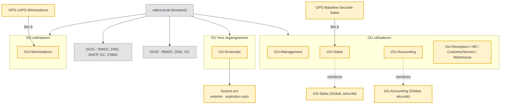

---

# 2. Étapes de configuration

Pourquoi ce choix chronologique :

1) **OU → comptes → groupes → GPO.** Un compte créé avant son OU atterrit dans `CN=Users`, qui n'accepte aucun lien de GPO. Un groupe peuplé avant les comptes ne rattache personne.

2) LAPS a ses propres dépendances (OU ordinateur, schéma, permission self, GPO).

3) JML et l'externe ferment l'épisode : ils réutilisent ces briques et préparent la mission Break/Fix.

📌 **Démonstration GUI, une fois.** L'OU `Sales`, le compte `mscott` et le groupe `GG-Accounting` ont été créés à la main pour montrer la structure de chaque objet. Les scripts passent ensuite derrière et les ignorent : c'est l'idempotence visible dans P-01, P-04 et P-06.

---
### <a id="étape-1"></a>Étape 1 : arborescence d'OU

🎯 **Objectif :** créer les conteneurs de **délégation** et de **ciblage GPO** avant tout provisionnement.

**💡 Principe de conception :** conteneur par défaut ≠ OU. 

Un conteneur par défaut (CN=Users, CN=Computers) n'accepte aucun lien de GPO ; seule une OU se délègue et se cible. C'est pour cette raison que WIN11-A devra quitter CN=Computers avant de recevoir LAPS à l'étape 5.

```powershell
$ouNames = "Management","Sales","Accounting","Reception",
           "HR","CustomerService","Warehouse","Externals"

foreach ($ou in $ouNames) {
    if (-not (Get-ADOrganizationalUnit -Filter "Name -eq '$ou'" -ErrorAction SilentlyContinue)) {
        New-ADOrganizationalUnit `
            -Name $ou `
            -Path "DC=sabre,DC=local" `
            -ProtectedFromAccidentalDeletion $true

        [PSCustomObject]@{ OU = $ou; Action = "Creee" }          # sortie objet, pas Write-Host
    }
    else {
        [PSCustomObject]@{ OU = $ou; Action = "Ignoree (existe deja)" }   # idempotence
    }
}
```

<details><summary>🖱️ Version GUI</summary>

**Utilisateurs et ordinateurs Active Directory** → clic droit `sabre.local` → **Nouveau** ▸ **Unité d'organisation** → nom → laisser coché **Protéger le conteneur contre une suppression accidentelle**.
</details>

**Validation**

| Vérification                                     | Attendu                                    | Preuve |
| ------------------------------------------------ | ------------------------------------------ | ------ |
| relancer le script                               | une OU existante est ignorée (idempotence) | P-01   |
| `Get-ADOrganizationalUnit -SearchScope OneLevel` | 8 OU (7 départements + `Externals`) + `Domain Controllers` | P-02 |

<details><summary><a id="p-01"></a><a id="p-02"></a>📷 Preuves : P-01 · P-02 · OU</summary>

**P-01** : 7 OU créées ; `Sales`, créée auparavant en GUI, est ignorée.
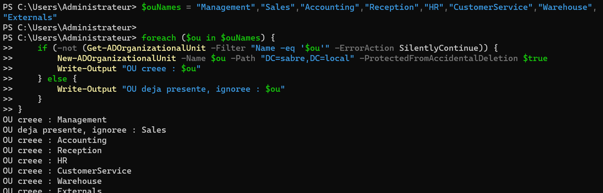

**P-02** : 8 OU listées avec leur DN (7 départements + `Externals`), plus `Domain Controllers`.
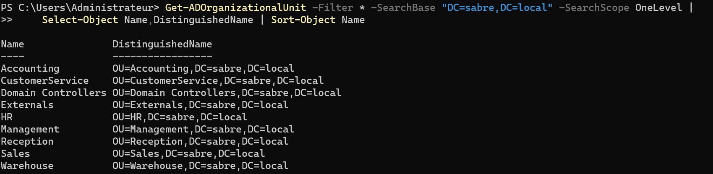
</details>

---
### <a id="étape-2"></a>Étape 2 : comptes utilisateurs

🎯 **Objectif :** provisionner les internes : un compte de référence à la main, puis la masse via CSV.

⚠️ **Le piège du suffixe UPN avant N10 :** 

Les UPN internes se créent en `@sabre.local`. Le suffixe routable `@DunderMifflAD.com` n'existera qu'après son ajout et sa vérification en N10 : créer des UPN dessus dès maintenant produirait des identifiants de connexion refusés. L'UPN est donc calculé dans le script à partir du `SamAccountName`, jamais stocké dans le CSV.

🔧 **Note de production : mot de passe initial (lab).** 

Le mot de passe est saisi une fois en `SecureString`, jamais en clair dans le script, et il est commun à tous les comptes de démo. Le changement forcé à la première connexion, posé à la création, a ensuite été retiré pour fluidifier les tests. 

Ce retrait a été ciblé sur les OU de département avec `-SearchBase`, jamais sur l'annuaire entier : un `Set-ADUser` sans périmètre aurait aussi touché `krbtgt` et les comptes intégrés. En production, chaque utilisateur choisit son mot de passe au premier logon ([L-05](#registre-derreurs--dette-technique)).

### Compte de référence

```powershell
New-ADUser `
    -Name "Jim Halpert" `
    -GivenName "Jim" `
    -Surname "Halpert" `
    -DisplayName "Jim Halpert" `
    -SamAccountName "jhalpert" `
    -UserPrincipalName "jhalpert@sabre.local" `
    -Department "Sales" `
    -Title "Sales Representative" `
    -Path "OU=Sales,DC=sabre,DC=local" `
    -AccountPassword (Read-Host "Mot de passe" -AsSecureString) `
    -Enabled $true
```

### Le CSV source (`users_sabre.csv`)

Le roster canonique tient en 14 lignes. Colonnes tirées des conventions de nommage du lab ([ABOUT](../../ABOUT_DUNDER_MIFFLAD.md)), **sans colonne UPN** : l'UPN est reconstruit dans le script à partir du `SamAccountName`, ce qui force `@sabre.local` en un seul endroit et rend impossible qu'une donnée porte le mauvais suffixe.

```csv
DisplayName,GivenName,Surname,SamAccountName,Department,Title,OUPath
Michael Scott,Michael,Scott,mscott,Management,Regional Manager,"OU=Management,DC=sabre,DC=local"
Ryan Howard,Ryan,Howard,rhoward,Management,Temp,"OU=Management,DC=sabre,DC=local"
Andy Bernard,Andy,Bernard,abernard,Sales,Sales Representative,"OU=Sales,DC=sabre,DC=local"
Phyllis Vance,Phyllis,Vance,pvance,Sales,Sales Representative,"OU=Sales,DC=sabre,DC=local"
Stanley Hudson,Stanley,Hudson,shudson,Sales,Sales Representative,"OU=Sales,DC=sabre,DC=local"
Jim Halpert,Jim,Halpert,jhalpert,Sales,Sales Representative,"OU=Sales,DC=sabre,DC=local"
Dwight Schrute,Dwight,Schrute,dschrute,Sales,Assistant Regional Manager,"OU=Sales,DC=sabre,DC=local"
Angela Martin,Angela,Martin,amartin,Accounting,Senior Accountant,"OU=Accounting,DC=sabre,DC=local"
Kevin Malone,Kevin,Malone,kmalone,Accounting,Accountant,"OU=Accounting,DC=sabre,DC=local"
Oscar Martinez,Oscar,Martinez,omartinez,Accounting,Accountant,"OU=Accounting,DC=sabre,DC=local"
Pam Beesly,Pam,Beesly,pbeesly,Reception,Receptionist,"OU=Reception,DC=sabre,DC=local"
Toby Flenderson,Toby,Flenderson,tflenderson,HR,HR Representative,"OU=HR,DC=sabre,DC=local"
Kelly Kapoor,Kelly,Kapoor,kkapoor,CustomerService,Customer Service Representative,"OU=CustomerService,DC=sabre,DC=local"
Darryl Philbin,Darryl,Philbin,dphilbin,Warehouse,Warehouse Foreman,"OU=Warehouse,DC=sabre,DC=local"
```

📌 **Note sur le CSV :** Warehouse ne compte qu'un seul poste (`dphilbin`), ce qui est voulu. Jerry, Madge et Lonnie n'ont pas de nom de famille dans le canon, les provisionner aurait été du remplissage. C'est ce qui explique le décompte « autres 1 chacun » plus bas (P-05), Warehouse inclus. 

D'autres personnages sont volontairement **hors CSV** parce qu'ils servent un exercice précis : `ehannon` (Joiner, succession de Pam) et `tpacker` (Leaver), créés à l'étape 6 ; `bvance.ext` (externe, étape 7) ; `kfilippelli` (directrice d'Utica, créée en N4 une fois le site opérationnel) ; `dwallace` (break-glass T0, N5). La succession RH Toby → Holly (`hflax`) n'est pas jouée en N2 ([L-06](#registre-derreurs--dette-technique)).

### Création CSV

```powershell
# données ≠ logique : on change le fichier, pas le code
$users      = Import-Csv "C:\Lab\N2\users_sabre.csv"
$initialPwd = Read-Host "Mot de passe initial" -AsSecureString
$WhatIfMode = $true          # dry-run d'abord ; passer à $false pour écrire

foreach ($u in $users) {

    $upn = "$($u.SamAccountName)@sabre.local"          # UPN construit ici, pas dans le CSV

    if (Get-ADUser -Filter "SamAccountName -eq '$($u.SamAccountName)'" -ErrorAction SilentlyContinue) {
        [PSCustomObject]@{ Sam = $u.SamAccountName; Action = "Ignore (existe deja)"; OU = $u.OUPath }
        continue                                       # idempotence
    }

    try {
        New-ADUser `
            -Name $u.DisplayName `
            -GivenName $u.GivenName `
            -Surname $u.Surname `
            -DisplayName $u.DisplayName `
            -SamAccountName $u.SamAccountName `
            -UserPrincipalName $upn `
            -Department $u.Department `
            -Title $u.Title `
            -Path $u.OUPath `
            -AccountPassword $initialPwd `
            -ChangePasswordAtLogon $true `     # retiré ensuite en lab, voir la note ci-dessus
            -Enabled $true `
            -ErrorAction Stop `
            -WhatIf:$WhatIfMode

        [PSCustomObject]@{ Sam = $u.SamAccountName; Action = if ($WhatIfMode) { "SIMULE" } else { "Cree" }; OU = $u.OUPath }
    }
    catch {
        [PSCustomObject]@{ Sam = $u.SamAccountName; Action = "ECHEC : $($_.Exception.Message)"; OU = $u.OUPath }
    }
}
```

<details><summary>🖱️ Version GUI</summary>

**Utilisateurs et ordinateurs Active Directory** → clic droit sur l'OU cible → **Nouveau** ▸ **Utilisateur** → **Prénom**, **Nom**, **Nom d'ouverture de session de l'utilisateur** (suffixe `@sabre.local` dans la liste) → mot de passe → **Terminer**. 

L'assistant ne renseigne ni le service ni la fonction : double-clic sur le compte → onglet **Organisation** → **Fonction** et **Service**. 

Sans le service, l'étape 3 ne rattache le compte à aucun groupe. C'est ainsi qu'a été créé `mscott`.

Le geste est montré sur **un** objet. La création de masse reste scriptée : elle doit être rejouable et traçable, et répéter l'assistant quatorze fois est un anti-pattern à cette échelle.
</details>

**Validation**

```powershell
Get-ADUser `
    -Filter 'Department -like "*"' `
    -SearchBase "DC=sabre,DC=local" `
    -Properties Department |
Group-Object Department |
Select-Object Count, Name |
Sort-Object Name
```

| Vérification | Attendu | Preuve |
| ------------ | ------- | ------ |
| compte de référence | `jhalpert` dans `OU=Sales`, UPN `@sabre.local`, activé | P-03 |
| passage CSV | comptes existants ignorés, autres créés | P-04 |
| décompte par département | Sales 5 · Accounting 3 · Management 2 · autres 1 chacun | P-05 |

> Les comptes intégrés sans attribut `Department` sont exclus par le filtre : normal.

<details><summary><a id="p-03"></a><a id="p-04"></a><a id="p-05"></a>📷 Preuves : P-03 · P-04 · P-05 · Comptes</summary>

**P-03** : DN dans `OU=Sales`, UPN `@sabre.local`, compte activé.
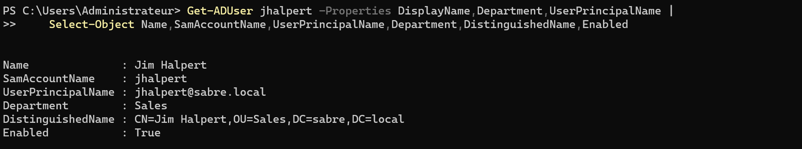

**P-04** : `mscott` et `jhalpert` ignorés (déjà présents) ; autres créés.
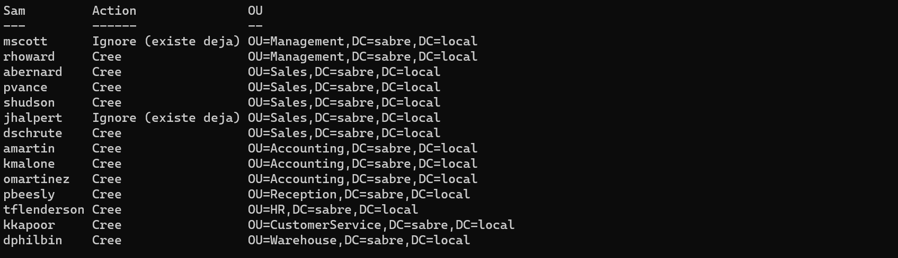

**P-05** : décompte par département conforme au CSV.
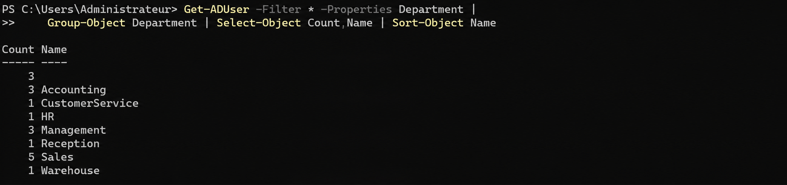
</details>

---
### <a id="étape-3"></a>Étape 3 : groupes globaux & AGDLP

🎯 **Objectif :** poser l'axe **A → G** du modèle **A**ccount → **G**lobal → **D**omain Local → **P**ermission.

💡 **Principe de conception : un droit se porte par un rôle, jamais par une personne.**

Ne jamais donner de permission sur un compte. Le compte entre dans un groupe global métier (`GG-*`), qui regroupe les personnes. Ce groupe entrera ensuite dans un `DL-*` de ressource, qui portera le droit (maillon `DL-*` et NTFS en N4). Les groupes AGDLP sont toujours de type **Sécurité**, jamais **Distribution** : un groupe de distribution ne peut recevoir aucune permission.

```powershell
# Un GG-* par departement : la donnee (nom + OU) pilote la creation
$globalGroups = @(
    [PSCustomObject]@{ Name = "GG-Management"; OU = "OU=Management,DC=sabre,DC=local" }
    [PSCustomObject]@{ Name = "GG-Sales";      OU = "OU=Sales,DC=sabre,DC=local" }
    [PSCustomObject]@{ Name = "GG-Accounting"; OU = "OU=Accounting,DC=sabre,DC=local" }
    [PSCustomObject]@{ Name = "GG-Reception";  OU = "OU=Reception,DC=sabre,DC=local" }
    [PSCustomObject]@{ Name = "GG-HR";         OU = "OU=HR,DC=sabre,DC=local" }
    [PSCustomObject]@{ Name = "GG-CS";         OU = "OU=CustomerService,DC=sabre,DC=local" }
    [PSCustomObject]@{ Name = "GG-Warehouse";  OU = "OU=Warehouse,DC=sabre,DC=local" }
)

foreach ($g in $globalGroups) {
    if (-not (Get-ADGroup -Filter "Name -eq '$($g.Name)'" -ErrorAction SilentlyContinue)) {
        New-ADGroup -Name $g.Name -GroupScope Global -GroupCategory Security -Path $g.OU
        [PSCustomObject]@{ Groupe = $g.Name; Action = "Cree" }
    }
    else {
        [PSCustomObject]@{ Groupe = $g.Name; Action = "Ignore (existe deja)" }   # idempotence
    }
}

# Table departement -> groupe : une seule source de correspondance
$deptToGroup = @{
    Management      = "GG-Management"
    Sales           = "GG-Sales"
    Accounting      = "GG-Accounting"
    Reception       = "GG-Reception"
    HR              = "GG-HR"
    CustomerService = "GG-CS"
    Warehouse       = "GG-Warehouse"
}

# Filtre a la source : seuls les comptes qui ont un departement (les comptes integres sont exclus)
Get-ADUser `
    -Filter 'Department -like "*"' `
    -SearchBase "DC=sabre,DC=local" `
    -Properties Department |
ForEach-Object {
    $grp = $deptToGroup[$_.Department]
    if ($grp) {
        Add-ADGroupMember -Identity $grp -Members $_ -ErrorAction SilentlyContinue
        [PSCustomObject]@{ User = $_.SamAccountName; Departement = $_.Department; Groupe = $grp }
    }
}
```

> 🔧 **Note : `-ErrorAction SilentlyContinue` sur l'ajout de membres.** Il garde la relance silencieuse, mais il masquerait aussi une vraie erreur (groupe introuvable, droits insuffisants). Une version plus stricte, en `try/catch` qui émet l'échec comme objet, serait préférable pour un usage répété.

<details><summary>🖱️ Version GUI</summary>

Clic droit sur l'OU → **Nouveau** ▸ **Groupe** → nom → **Étendue du groupe : Globale**, **Type de groupe : Sécurité** → **OK**. Adhésions : double-clic sur le groupe → onglet **Membres** → **Ajouter**. C'est ainsi qu'a été créé `GG-Accounting`.
</details>

**Validation**

| Vérification | Attendu | Preuve |
| ------------ | ------- | ------ |
| création des `GG-*` | 7 groupes, rejouable sans doublon | P-06 |
| adhésions | chaque utilisateur rejoint le `GG-*` de son département | P-07 |
| `Get-ADGroupMember GG-Sales` | 5 membres **à cet instant** (avant le Mover de Pam) | P-08 |

<details><summary><a id="p-06"></a><a id="p-07"></a><a id="p-08"></a>📷 Preuves : P-06 · P-07 · P-08 · Groupes / AGDLP</summary>

**P-06** : 7 groupes globaux de sécurité ; `GG-Accounting`, créé auparavant en GUI, est ignoré.
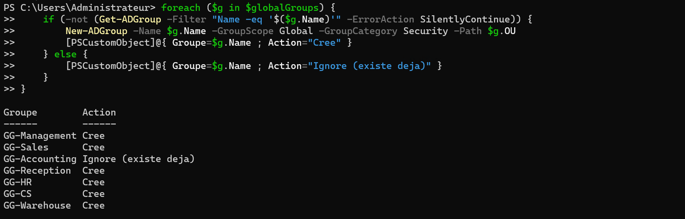

**P-07** : les 14 comptes rattachés chacun au `GG-*` de son département (sortie du script de peuplement).
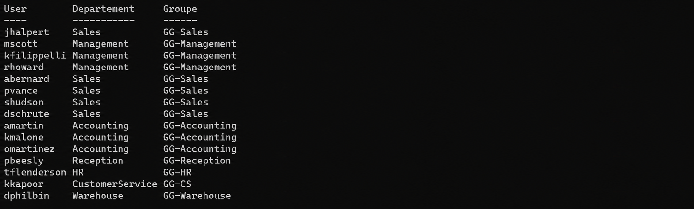

**P-08** : instantané **avant JML** : 5 membres Sales. Pam les rejoindra à l'étape 6.
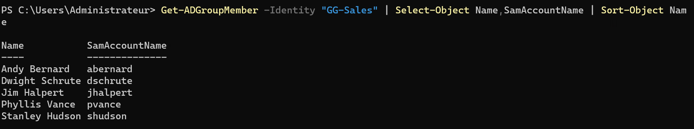
</details>

---
### <a id="étape-4"></a>Étape 4 : GPO créer / lier / cibler

🎯 **Objectif :** démontrer qu'une GPO **créée n'est pas appliquée tant qu'elle n'est pas liée**, puis prouver son ciblage sur `OU=Sales`.

💡 **Principe de conception : une GPO liée, pas seulement créée.** 

Une GPO ne s'applique qu'une fois liée à un site, au domaine ou à une OU, jamais à un conteneur par défaut comme `CN=Users`. En cas de conflit, le paramètre le plus proche de l'objet l'emporte (ordre **Local → Site → Domain → OU**), sauf lien `Enforced`.

```powershell
New-GPO `
    -Name "Baseline-Securite-Sales" `
    -Comment "Baseline securite ciblee OU Sales (N2)"

New-GPLink `
    -Name "Baseline-Securite-Sales" `
    -Target "OU=Sales,DC=sabre,DC=local" `
    -LinkEnabled Yes
```

Réglage retenu, fait dans l'éditeur de GPO : écran de veille activé, protégé par mot de passe, avec un délai d'inactivité. Équivalent PowerShell ci-dessous, non exécuté dans le lab :

```powershell
$key = "HKCU\Software\Policies\Microsoft\Windows\Control Panel\Desktop"
Set-GPRegistryValue -Name "Baseline-Securite-Sales" -Key $key -ValueName "ScreenSaveActive"    -Type String -Value "1"
Set-GPRegistryValue -Name "Baseline-Securite-Sales" -Key $key -ValueName "ScreenSaverIsSecure" -Type String -Value "1"
Set-GPRegistryValue -Name "Baseline-Securite-Sales" -Key $key -ValueName "ScreenSaveTimeOut"   -Type String -Value "600"
```

📌 **Note sur le nom.** « Baseline » est historique : cette GPO ne porte qu'un réglage de démonstration. Les baselines de sécurité Microsoft arrivent en N5.

<details><summary>🖱️ Version GUI</summary>

**Gestion des stratégies de groupe** → clic droit `Sales` → **Créer un objet GPO dans ce domaine, et le lier ici...** → `Baseline-Securite-Sales`. Clic droit sur la GPO → **Modifier** → **Configuration utilisateur** → **Stratégies** → **Modèles d'administration** → **Panneau de configuration** → **Personnalisation** → activer l'écran de veille, sa protection par mot de passe et son délai.

Vérification : `gpresult` n'a pas d'interface graphique sur le poste. Côté console, **Résultats de stratégie de groupe** (GPMC) produit le même rapport.
</details>

**Validation**

| Vérification | Attendu | Preuve |
| ------------ | ------- | ------ |
| `Get-GPInheritance -Target "OU=Sales,…"` | lien `Baseline-Securite-Sales`, Enabled, non Enforced, Order 1 | P-09 |
| `gpresult /r` (Jim / Sales) | GPO **appliquée** | P-10 |
| `gpresult /r` (Kevin / Accounting) | GPO **absente** (`N/A`) | P-11 |

<details><summary><a id="p-09"></a><a id="p-10"></a><a id="p-11"></a>📷 Preuves : P-09 · P-10 · P-11 · GPO</summary>

**P-09** : `Baseline-Securite-Sales` liée à `OU=Sales`, Enabled, non Enforced, Order 1.
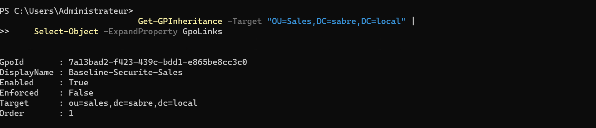

**P-10** : `gpresult` de Jim : GPO appliquée, servie depuis DC02.
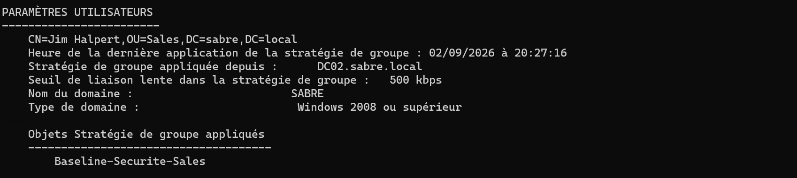

**P-11** : `gpresult` de Kevin : GPO Sales absente (`N/A`). P-10 servi par DC02, P-11 par DC01 : normal en multi-DC.
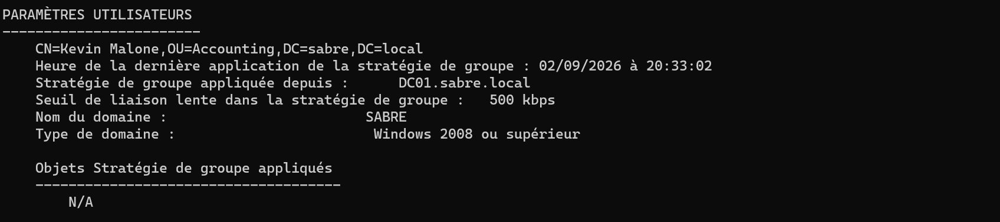
</details>

---
### <a id="étape-5"></a>Étape 5 : Windows LAPS

🎯 **Objectif :** rendre le mot de passe Administrateur local **unique, aléatoire, rotatif et stocké dans AD**, pour couper le mouvement latéral.

💡 **Principe de conception : LAPS a des dépendances.**

Le schéma doit connaître les attributs `ms-LAPS-*` avant qu'on accorde à la machine le droit de les écrire, et l'OU doit exister avant la permission et le lien de GPO. D'où l'ordre suivi : OU, schéma, permission self, GPO. `Update-LapsADSchema` exige un compte membre des **Administrateurs du schéma**.

LAPS relève de la configuration ordinateur : tant que `WIN11-A` reste dans `CN=Computers`, aucun lien de GPO ne l'atteint. C'est le payoff de la distinction posée à l'étape 1.

```powershell
# 1. OU ordinateurs + déplacement de la machine
if (-not (Get-ADOrganizationalUnit -Filter "Name -eq 'Workstations'" -ErrorAction SilentlyContinue)) {
    New-ADOrganizationalUnit `
        -Name "Workstations" `
        -Path "DC=sabre,DC=local" `
        -ProtectedFromAccidentalDeletion $true
}

Move-ADObject `
    -Identity "CN=WIN11-A,CN=Computers,DC=sabre,DC=local" `
    -TargetPath "OU=Workstations,DC=sabre,DC=local"

# 2. Schéma : attributs ms-LAPS-* au niveau forêt
Update-LapsADSchema -Confirm:$false

# 3. La machine peut écrire son propre secret
Set-LapsADComputerSelfPermission `
    -Identity "OU=Workstations,DC=sabre,DC=local"

# 4. GPO LAPS liée à l'OU ordinateurs
New-GPO `
    -Name "LAPS-Workstations" `
    -Comment "Windows LAPS - postes (N2)"

New-GPLink `
    -Name "LAPS-Workstations" `
    -Target "OU=Workstations,DC=sabre,DC=local" `
    -LinkEnabled Yes
```

Réglages GPO indispensables, faits dans l'éditeur : répertoire de sauvegarde = **Active Directory**, paramètres du mot de passe (longueur, complexité, âge 30 jours). Équivalent PowerShell, non exécuté dans le lab :

```powershell
$laps = "HKLM\Software\Microsoft\Windows\CurrentVersion\Policies\LAPS"
Set-GPRegistryValue -Name "LAPS-Workstations" -Key $laps -ValueName "BackupDirectory" -Type DWord -Value 2    # 2 = Active Directory
Set-GPRegistryValue -Name "LAPS-Workstations" -Key $laps -ValueName "PasswordAgeDays" -Type DWord -Value 30

# Lecture des valeurs réellement posées par l'éditeur
Get-GPRegistryValue -Name "LAPS-Workstations" -Key $laps
```

<details><summary>🖱️ Version GUI</summary>

Déplacement : **Utilisateurs et ordinateurs Active Directory** → `Computers` → clic droit `WIN11-A` → **Déplacer...** → `Workstations`.

GPO : **Gestion des stratégies de groupe** → clic droit `Workstations` → **Créer un objet GPO dans ce domaine, et le lier ici...** → `LAPS-Workstations` → **Modifier** → **Configuration ordinateur** → **Stratégies** → **Modèles d'administration** → **Système** → **LAPS** → répertoire de sauvegarde = **Active Directory**, puis paramètres du mot de passe.

Lecture du mot de passe : ADUC → `WIN11-A` → **Propriétés** → onglet **LAPS**.

Extension du schéma et permission self : PowerShell uniquement, sans équivalent graphique propre.
</details>

**Validation**

```powershell
# sur WIN11-A
gpupdate /force

# depuis DC01
Get-LapsADPassword -Identity "WIN11-A" -AsPlainText

# rotation forcée puis relecture, sur WIN11-A (session admin)
Reset-LapsPassword
Get-LapsADPassword -Identity "WIN11-A" -AsPlainText
```

| Vérification | Attendu | Preuve |
| ------------ | ------- | ------ |
| position machine | `WIN11-A` passe de `CN=Computers` à `OU=Workstations` | P-12 · P-13 |
| secret LAPS | mot de passe récupérable, expiration 30 j, déchiffrement réservé aux Admins du domaine | P-14 |
| rotation | après `Reset-LapsPassword`, `PasswordUpdateTime` postérieur à celui de P-14, nouvelle expiration à +30 j | [P-15](#p-15) |

> ⚠️ **Incident lié documenté dans [BREAKFIX N2 § Dépannage](./BREAKFIX.md#dépannage-incidents-de-session) :** au 1ᵉʳ essai le backup directory n'était pas réglé sur **Active Directory** ; les événements LAPS `10024` / `10060` ont tranché. P-14 montre l'état réparé.

<details><summary><a id="p-12"></a><a id="p-13"></a><a id="p-14"></a><a id="p-15"></a>📷 Preuves : P-12 · P-13 · P-14 · P-15 · LAPS</summary>

**P-12** : *avant* : `WIN11-A` encore dans `CN=Computers`, non ciblable par lien GPO.
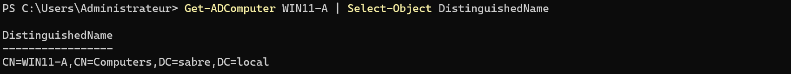

**P-13** : *après* : `WIN11-A` déplacé dans `OU=Workstations`.
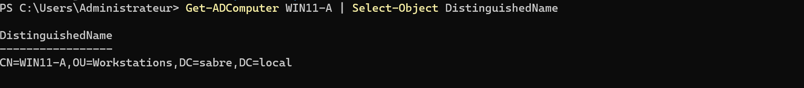

**P-14** : `Get-LapsADPassword` renvoie le secret, l'expiration et les infos de déchiffrement.
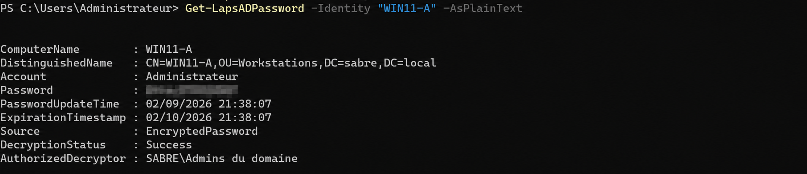

**P-15** : rotation forcée sur WIN11-A : `Reset-LapsPassword` puis relecture → `PasswordUpdateTime` et `ExpirationTimestamp` renouvelés (+30 j), toujours chiffré (`EncryptedPassword`, déchiffrement réservé à `Admins du domaine`). Mot de passe masqué à la capture.
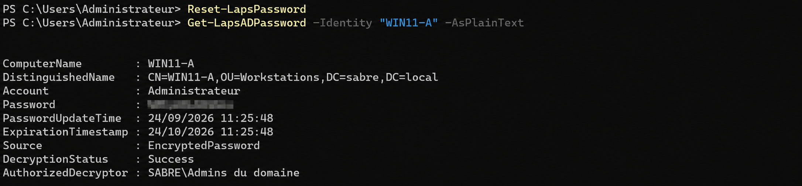
</details>

---
### <a id="étape-6"></a>Étape 6 : cycle de vie JML

🎯 **Objectif :** gérer l'identité **après** sa création : **J**oiner, **M**over, **L**eaver.

⚠️ **Piège : un Mover incomplet laisse des droits fantômes.**

Déplacer l'objet ne suffit pas. Un Mover, c'est trois gestes solidaires, déplacer l'objet, basculer les groupes, aligner `Department` et `Title`. Oublier les groupes laisse les droits de l'ancien poste ; oublier `Department` fait re-rattacher l'ancien groupe à la prochaine relance du script de peuplement de l'étape 3.

```powershell
# MOVER : Pam Beesly (Reception → Sales)
Move-ADObject `
    -Identity "CN=Pam Beesly,OU=Reception,DC=sabre,DC=local" `
    -TargetPath "OU=Sales,DC=sabre,DC=local"

Remove-ADGroupMember `
    -Identity "GG-Reception" `
    -Members pbeesly `
    -Confirm:$false                 # retire l'ancien droit

Add-ADGroupMember `
    -Identity "GG-Sales" `
    -Members pbeesly

Set-ADUser `
    -Identity pbeesly `
    -Department "Sales" `
    -Title "Sales Representative"

# JOINER : Erin Hannon reprend la réception
New-ADUser `
    -Name "Erin Hannon" `
    -GivenName "Erin" `
    -Surname "Hannon" `
    -DisplayName "Erin Hannon" `
    -SamAccountName "ehannon" `
    -UserPrincipalName "ehannon@sabre.local" `
    -Department "Reception" `
    -Title "Receptionist" `
    -Path "OU=Reception,DC=sabre,DC=local" `
    -AccountPassword (Read-Host "Mot de passe" -AsSecureString) `
    -Enabled $true

Add-ADGroupMember -Identity "GG-Reception" -Members ehannon

# PREALABLE au Leaver : Todd Packer n'etait pas dans le CSV (reserve pour cet exercice).
# On le cree ici pour derouler le cycle complet sur un compte reel, groupe compris.
New-ADUser `
    -Name "Todd Packer" `
    -GivenName "Todd" `
    -Surname "Packer" `
    -DisplayName "Todd Packer" `
    -SamAccountName "tpacker" `
    -UserPrincipalName "tpacker@sabre.local" `
    -Department "Sales" `
    -Title "Traveling Salesman" `
    -Path "OU=Sales,DC=sabre,DC=local" `
    -AccountPassword (Read-Host "Mot de passe" -AsSecureString) `
    -Enabled $true

Add-ADGroupMember -Identity "GG-Sales" -Members tpacker

# LEAVER : Todd Packer, neutralisé sans suppression immédiate de l'objet
Disable-ADAccount -Identity tpacker

Get-ADUser tpacker -Properties MemberOf |
Select-Object -ExpandProperty MemberOf |
ForEach-Object {
    Remove-ADGroupMember `
        -Identity $_ `
        -Members tpacker `
        -Confirm:$false `
        -ErrorAction SilentlyContinue
}

# Trace + expiration à minuit ce soir (équivalent GUI « Fin de : aujourd'hui »)
Set-ADUser `
    -Identity tpacker `
    -Description "LEAVER" `
    -AccountExpirationDate (Get-Date).Date.AddDays(1)
```

> 📌 **Note : description minimale en lab.** En production, la description porte la date et le motif (`LEAVER - 2026-09-03 - départ RH`) pour que le prochain admin sache qui a fait quoi et pourquoi.

🔎 **Audit par état (contrôle d'habilitation).** Une fois le Leaver posé, on vérifie l'annuaire par les quatre lentilles de `Search-ADAccount`, l'outil dédié aux états de comptes là où `Get-ADUser -Filter` demanderait des filtres LDAP de dates. Todd remonte en désactivé (P-19) et dans la fenêtre d'expiration à 7 jours (P-20) : son expiration tombe à minuit, elle est encore à venir au moment de l'audit. Passé minuit, il bascule dans `-AccountExpired`. Les lentilles `-AccountExpired` et `-AccountInactive` complètent l'audit ; `-AccountInactive` sert d'ailleurs de fausse piste dans la mission panne ([BF-09](./BREAKFIX.md#bf-09)).

```powershell
Search-ADAccount -AccountDisabled -UsersOnly |
    Select-Object Name, SamAccountName

Search-ADAccount -AccountExpired  -UsersOnly |
    Select-Object Name, SamAccountName, AccountExpirationDate

Search-ADAccount -AccountExpiring -TimeSpan (New-TimeSpan -Days 7)  -UsersOnly |
    Select-Object Name, SamAccountName, AccountExpirationDate

Search-ADAccount -AccountInactive -TimeSpan (New-TimeSpan -Days 90) -UsersOnly |
    Select-Object Name, SamAccountName
```

<details><summary>🖱️ Version GUI</summary>

**Mover** (Pam) : clic droit → **Déplacer...** → `Sales` ; onglet **Membre de** → retirer `GG-Reception`, ajouter `GG-Sales` ; onglet **Organisation** → **Service** et **Fonction**.

**Joiner** (Erin) : comme à l'étape 2, dans `Reception`, puis onglet **Membre de** → `GG-Reception`.

**Leaver** (Todd) : clic droit → **Désactiver le compte** ; onglet **Membre de** → retirer les groupes ; onglet **Compte** → **Le compte expire** → **Fin de :** date du jour ; onglet **Général** → **Description**.

Audit par état : partiel en GUI. ADUC → **Requêtes enregistrées** → **Nouvelle** ▸ **Requête** → **Définir la requête** propose **Comptes désactivés** et **Nombre de jours depuis la dernière ouverture de session**, mais aucune fenêtre d'expiration. `Search-ADAccount` reste l'outil de référence.
</details>

**Validation**

| Vérification              | Attendu                                                             | Preuve |
| ------------------------- | ------------------------------------------------------------------- | ------ |
| Joiner Erin               | `OU=Reception` · `Department=Reception` · `GG-Reception`            | P-16   |
| Mover Pam                 | `OU=Sales` · `Department=Sales` · `GG-Sales` · plus `GG-Reception`  | P-17   |
| Leaver Todd               | `Enabled=False` · 0 groupe · description LEAVER · expiration posée  | P-18   |
| audit, comptes désactivés | `Search-ADAccount -AccountDisabled` capte Todd (+ comptes intégrés) | P-19   |
| audit, expiration 7 j     | fenêtre courte : Todd présent, Bob encore absent (J+30)             | P-20   |


> 📌 **Note pour plus tard** : le handoff des **droits délégués** Pam → Erin (≠ identité) est reporté à N5.

<details><summary><a id="p-16"></a><a id="p-17"></a><a id="p-18"></a><a id="p-19"></a><a id="p-20"></a>📷 Preuves : P-16 · P-17 · P-18 · P-19 · P-20 · JML / Audit</summary>

**P-16** : Erin : `OU=Reception`, `Department=Reception`, membre de `GG-Reception` (Joiner).
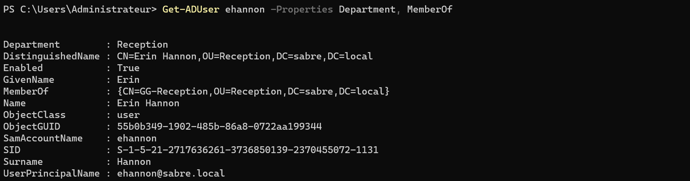

**P-17** : Pam : `OU=Sales`, `Department=Sales`, membre de `GG-Sales`.
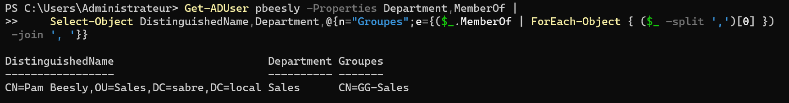

**P-18** : Todd : `Enabled=False`, `MemberOf` vide, description `LEAVER`, expiration `04/09/2026 00:00:00` (minuit suivant le Leaver). Sortie brute de `Get-ADUser`.
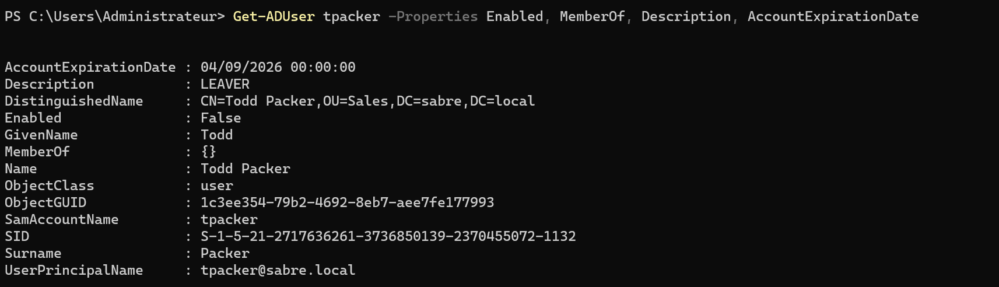

**P-19** : `Search-ADAccount -AccountDisabled` capte Todd et les comptes intégrés désactivés par défaut.
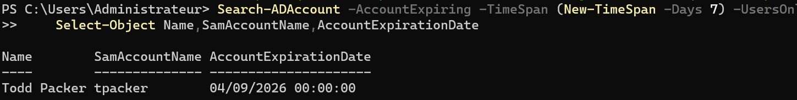

**P-20** : fenêtre 7 jours : Todd capté ; Bob absent car son expiration est à J+30.
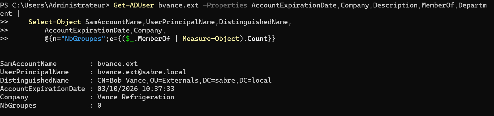
</details>

---
### <a id="étape-7"></a>Étape 7 : prestataire externe

🎯 **Objectif :** créer `bvance.ext` avec une **barrière structurelle d'expiration** qui coupe l'accès sans dépendre d'un humain.

💡 **Principe de conception : un externe naît avec sa date de fin.**

Un compte externe embarque sa barrière de sortie dès la création : expiration à J+30. Il suit la sous-convention `.ext` (`bvance.ext`), ne reçoit aucun `GG-*` métier et n'est jamais T0/T1. Il garde l'UPN `@sabre.local` : son exclusion du cloud se jouera en N10 par le filtrage d'OU d'Entra Connect (`OU=Externals` hors périmètre de synchronisation), le suffixe à lui seul ne l'empêcherait pas d'être synchronisé.

```powershell
# La barrière structurelle : -AccountExpirationDate, posée à la création
New-ADUser `
    -Name "Bob Vance" `
    -GivenName "Bob" `
    -Surname "Vance" `
    -DisplayName "Bob Vance (Vance Refrigeration)" `
    -SamAccountName "bvance.ext" `
    -UserPrincipalName "bvance.ext@sabre.local" `
    -Description "EXTERNE - Vance Refrigeration - mission bornee" `
    -Company "Vance Refrigeration" `
    -Path "OU=Externals,DC=sabre,DC=local" `
    -AccountExpirationDate (Get-Date).AddDays(30) `
    -AccountPassword (Read-Host "Mot de passe" -AsSecureString) `
    -Enabled $true
```

<details><summary>🖱️ Version GUI</summary>

**Utilisateurs et ordinateurs Active Directory** → clic droit `Externals` → **Nouveau** ▸ **Utilisateur** → Bob Vance, nom d'ouverture de session `bvance.ext`, suffixe `@sabre.local` → mot de passe → **Terminer**. Double-clic sur le compte : onglet **Général** → **Description** ; onglet **Organisation** → **Société** `Vance Refrigeration` ; onglet **Compte** → **Le compte expire** → **Fin de :** J+30.
</details>

**Validation**

| Vérification | Attendu | Preuve |
| ------------ | ------- | ------ |
| conformité externe | `OU=Externals` · `bvance.ext@sabre.local` · J+30 · 0 groupe | P-21 |
| radar d'expiration 45 j | Bob **apparaît** dans la fenêtre | P-22 |

> 📌 **Lien avec la mission panne.** Cette présence sur le radar est la **baseline de la mission Break/Fix** : quand on retirera l'expiration, Bob deviendra invisible au radar tout en restant actif.

<details><summary><a id="p-21"></a><a id="p-22"></a>📷 Preuves : P-21 · P-22 · Externe</summary>

**P-21** : compte dans `OU=Externals`, UPN `bvance.ext@sabre.local`, expiration `03/10/2026`, Vance Refrigeration, 0 groupe.
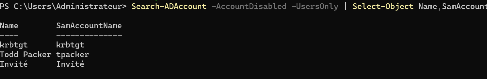

**P-22** : fenêtre 45 jours : capte `tpacker` (`04/09/2026`) et `bvance.ext` (`03/10/2026`).
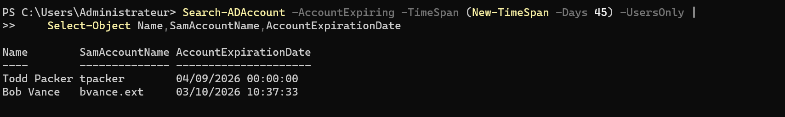
</details>

---

# 3. Preuves et clôtures

## <a id="validation-de-bout-en-bout"></a>Validation de bout en bout

| Domaine         | Vérification              | Attendu                                                       | Preuve                                                            |
| --------------- | ------------------------- | ------------------------------------------------------------- | ----------------------------------------------------------------- |
| OU              | structure finale          | 8 OU + `OU=Workstations` + `Domain Controllers`               | [P-01](#p-01) · [P-02](#p-02) · [P-13](#p-13)                     |
| Comptes         | provisionnement interne   | décompte conforme au CSV                                      | [P-03](#p-03) · [P-04](#p-04) · [P-05](#p-05)                     |
| Groupes / AGDLP | axe A → G                 | `GG-*` peuplés par département                                | [P-06](#p-06) · [P-07](#p-07) · [P-08](#p-08)                     |
| GPO             | ciblage OU                | appliquée à Sales, absente pour Accounting                    | [P-09](#p-09) · [P-10](#p-10) · [P-11](#p-11)                     |
| LAPS            | secret local géré dans AD | mot de passe récupérable, rotation forcée prouvée             | [P-12](#p-12) · [P-13](#p-13) · [P-14](#p-14) · [P-15](#p-15)     |
| JML             | Joiner / Mover / Leaver   | Erin rattachée · Pam alignée · Todd neutralisé                | [P-16](#p-16) · [P-17](#p-17) · [P-18](#p-18)                     |
| Externe         | barrière structurelle     | Bob auto-expirant, sans groupe métier                         | [P-21](#p-21)                                                     |
| Audit           | états surveillés          | Todd désactivé/expirant · Bob à J+30                          | [P-19](#p-19) · [P-20](#p-20) · [P-22](#p-22)                     |
| Break/Fix       | « presta oublié »         | accès qui réussit à tort avant réparation, logon refusé après | [BF-11](./BREAKFIX.md#bf-11) |

## <a id="registre-derreurs--dette-technique"></a>Registre d'erreurs & dette technique


| ID   | Point                                                                                                   | Gravité | Domaine    | Statut                         |
| ---- | ------------------------------------------------------------------------------------------------------- | ------- | ---------- | ------------------------------ |
| L-01 | `OU=Workstations` créée hors de la convention de nommage initiale                                       | 🟢      | Nommage    | ✅ intégrée aux conventions    |
| L-02 | `bvance.ext` sans `DL-*` ressource : l'impact « accès à une ressource » de la mission panne n'a pas été démontré | 🟢 | AGDLP / Preuve | 📋 sans objet, compte déprovisionné en fin de mission ([BREAKFIX N2](./BREAKFIX.md#mission-panne)) |
| L-03 | handoff de délégation Pam → Erin limité à l'identité                                                    | 🟠      | Délégation | 🔜 N5                          |
| L-04 | Leaver `tpacker` garde `Department=Sales` : une relance du peuplement de l'étape 3 le rattacherait de nouveau à `GG-Sales` (en production, vider `Department` ou sortir l'objet du périmètre du script) | 🟠 | JML | 📋 limite lab |
| L-05 | mot de passe initial commun aux comptes de démo, changement forcé au premier logon retiré              | 🟠      | Sécurité   | 🔜 N5 (FGPP sur la compta paie) |
| L-06 | succession RH Toby → Holly (`hflax`) prévue, non jouée                                                  | 🟢      | JML        | 📋 hors périmètre N2           |

---

⬆️ [Sommaire](#sommaire) · [README N2](./README.md) · [Vue d'ensemble](../../README.md) · 🔧 **[Break/Fix N2 →](./BREAKFIX.md)** · **Suivant → [Workflow N3](../N3/WORKFLOW.md)** : RTR, deux sous-réseaux, Sites & Services, renumérotation DC02 `10.10.1.11 → 10.10.2.10`.
