# Épisode N3 : Break/Fix

**Concepts clés** : cadrer une panne avant de la réparer · rôle d'un témoin dans un diagnostic · dépendance d'ordre de démarrage · erreur de réplication 8524

- 🎬 **Saison 1 · Épisode N3**
- 🖥️ **Stack** : Windows Server 2025 (DC01, DC02, RTR), Windows 11 Enterprise (WIN11-A, WIN11-B), Hyper-V, RRAS, PowerShell/RSAT
- 🗺️ Adressage (IP / DNS / passerelle / vSwitch) → [IPAM](../../IPAM.md)
- 🎭 Annuaire de démo (OU, groupes, comptes, nommage...) → [ABOUT DUNDER MIFFLAD](../../ABOUT_DUNDER_MIFFLAD.md)
- 📄 Présentation de l'épisode → [README N3](./README.md)
- 📝 Progression étape par étape → [WORKFLOW N3](./WORKFLOW.md)

## Sommaire

**1. Mission panne (délibérée)**

- [Mission panne : famine DHCP à Utica](#mission-panne)

**2. Dépannage (incidents accidentels)**

- [Incidents de session](#dépannage-incidents-de-session)
- [Incidents marquants](#incidents-marquants)
	- [La réplication 8524 après le renum de DC02](#replication-8524)
	- [RRAS reste Stopped après chaque reboot](#rras-stopped)
	- [Relais DHCP fonctionnel mais non administrable](#relais-dhcp)


---

# 1. Mission panne (délibérée)

## <a id="mission-panne"></a>Mission panne : famine DHCP à Utica

> 🎥 **Storyline :** *Le jour de l'ouverture d'Utica, aucun poste de la succursale n'obtient d'adresse, et personne n'y ouvre de session.*

**Ce que cette panne démontre :** cadrer une panne avant de la réparer. Un témoin resté sain disculpe le serveur, puis l'état du service pour le site en échec désigne la cause, sans démonter le relais ni le routage à l'aveugle.

### 1.1 Injection (délibérée)

**Ce que je casse, exprès :** désactiver l'étendue DHCP de SITE2 sur DC01. Utica n'a plus de source de baux.

Le geste porte sur l'étendue plutôt que sur le relais, faute de pouvoir toucher proprement l'agent de relais (voir [BF-17](#bf-17)). L'effet observable pour le client est le même : plus de bail à Utica.

```powershell
Set-DhcpServerv4Scope `
    -ComputerName DC01 `
    -ScopeId 10.10.2.0 `
    -State Inactive
```

Désactiver l'étendue ne suffit pas : un bail encore valide continue d'être renouvelé en unicast. Pour révéler la panne, WIN11-B est forcé en ré-acquisition (`ipconfig /release` puis `ipconfig /renew`), et sa demande repart en broadcast à travers le relais vers une étendue qui ne répond plus.

<details><summary><a id="bf-01"></a>📷 Preuve BF-01 · état cassé</summary>

**BF-01** : étendue SITE2 passée *Inactive* sur DC01 *(état cassé, mission panne)*.
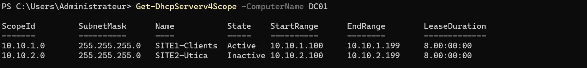
</details>

### <a id="mp-impact"></a>1.2 Impact : ce que la panne casse pour un utilisateur

**Opération tentée :** ouverture de session d'un compte de domaine sur WIN11-B, le poste d'Utica.

**Résultat observé (panne active) :** ouverture de session refusée, « Le contexte de sécurité n'a pas pu être établi ». Sans adresse, le poste ne joint aucun DC. Un compte déjà connecté sur ce poste aurait pu entrer grâce à ses identifiants en cache : le refus montre qu'aucun cache n'a pris le relais, le poste a bien dû chercher un DC et n'en a trouvé aucun.

<details><summary><a id="bf-02"></a>📷 Preuve BF-02 · impact utilisateur</summary>

**BF-02** : ouverture de session refusée sur WIN11-B, contexte de sécurité non valide.

</details>

### <a id="mp-symptome"></a>1.3 Symptôme observé

WIN11-B est en APIPA : `169.254.168.35`, l'adresse d'auto-configuration que Windows se donne quand aucun serveur DHCP ne répond. C'est la trace côté sonde, distincte de l'impact (le logon refusé) que voit l'utilisateur.

<details><summary><a id="bf-03"></a>📷 Preuve BF-03 · symptôme</summary>

**BF-03** : `ipconfig /all` sur WIN11-B, adresse APIPA `169.254.x.x`.
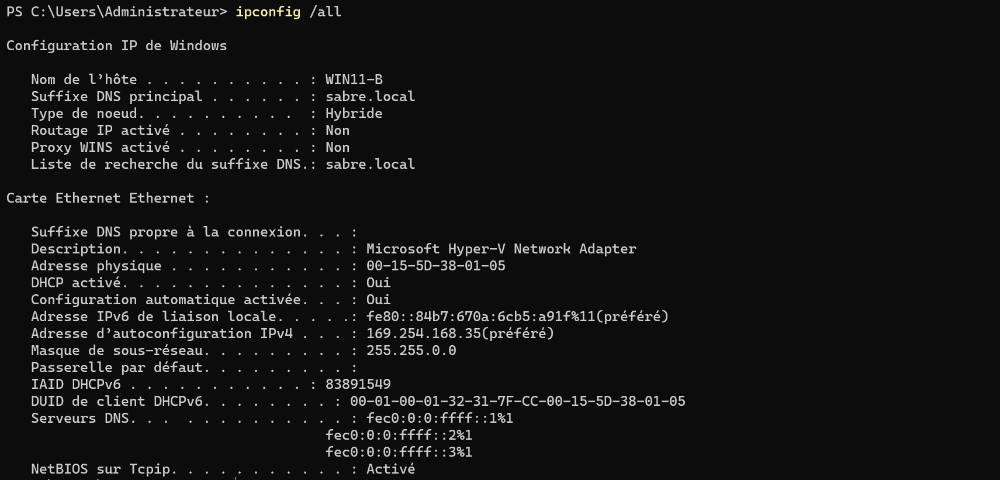
</details>

### 1.4 Diagnostic

La question qui oriente tout : le DHCP est-il mort pour tout le monde, ou seulement pour Utica ? Je réponds avec un témoin.

```powershell
# Témoin : WIN11-A, sur SITE1, demande un bail
ipconfig /renew        # sur WIN11-A → 10.10.1.101, bail obtenu

# Le témoin reçoit une adresse → le service DHCP de DC01 est vivant.
# Donc la coupure est propre à SITE2, pas au serveur. On regarde l'étendue.
Get-DhcpServerv4Scope -ComputerName DC01
```

WIN11-A obtient `10.10.1.101` sans problème : le service DHCP de DC01 est vivant, la fausse piste « serveur DHCP mort » tombe. Ce témoin ne dit rien, en revanche, du chemin entre Utica et Scranton, puisqu'il ne traverse pas le routeur. L'étape suivante interroge donc le serveur directement : l'étendue de SITE2 ressort *Inactive* ([BF-05](#bf-05)). La cause est trouvée sans avoir eu à démonter le relais ni le routage.

<details><summary><a id="bf-04"></a>📷 Preuve BF-04 · diagnostic (témoin)</summary>

**BF-04** : témoin WIN11-A obtient `10.10.1.101`, ce qui disculpe le serveur DHCP.
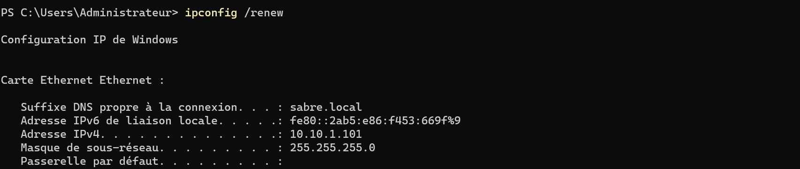
</details>

<details><summary><a id="bf-05"></a>📷 Preuve BF-05 · diagnostic (état de l'étendue)</summary>

**BF-05** : `Get-DhcpServerv4Scope` sur DC01, `SITE1-Clients` *Active*, `SITE2-Utica` *Inactive*.
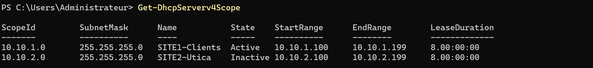
</details>

### 1.5 Cause racine

L'étendue de SITE2 est désactivée sur DC01. Le serveur reçoit les demandes relayées, mais n'a plus d'étendue active pour ce sous-réseau : aucun bail ne part vers Utica. Le témoin disculpe le serveur, l'état de l'étendue désigne la cause.

> 📋 **Limite de preuve.** Le chemin réseau SITE2 → SITE1 n'a pas été testé pendant la panne. Qu'il soit sain se déduit de la réparation : réactiver l'étendue suffit à rétablir le bail, sans toucher au routage ni au relais.

### 1.6 Réparation

Deux gestes : réactiver l'étendue de SITE2, puis re-prouver côté client qu'un bail repart.

```powershell
Set-DhcpServerv4Scope `
    -ComputerName DC01 `
    -ScopeId 10.10.2.0 `
    -State Active
```

<details><summary><a id="bf-06"></a>📷 Preuve BF-06 · état réparé</summary>

**BF-06** : les deux étendues (SITE1 et SITE2) de nouveau *Active* sur DC01 *(après restauration)*.
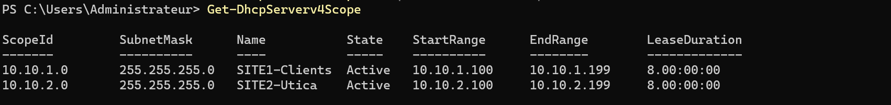
</details>

### <a id="mp-validation"></a>1.7 Validation en miroir

Je re-tente l'opération réelle du temps 1.2. Cette panne coupait un service, donc la validation attendue est l'inverse d'une panne « garde-fou » : l'opération qui échouait doit désormais réussir.

**Opération re-tentée :** obtention d'un bail sur WIN11-B (`ipconfig /release` puis `/renew`), la même opération qui échouait au temps 1.3.

**Résultat observé (après réparation) :** WIN11-B reçoit `10.10.2.100` par le relais, et le serveur DHCP vu reste `10.10.1.10` : la demande traverse de nouveau le relais.

<details><summary><a id="bf-07"></a>📷 Preuve BF-07 · validation miroir</summary>

**BF-07** : WIN11-B récupère son bail `10.10.2.100` à travers le relais, l'opération qui échouait réussit.
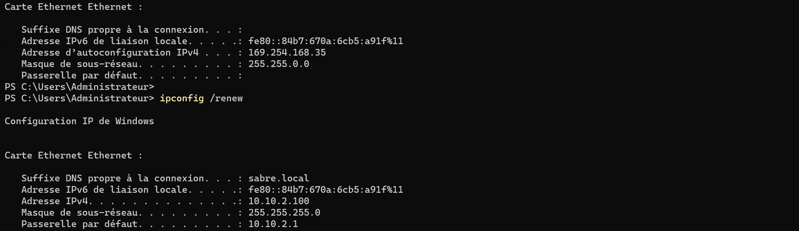
</details>

### 1.8 Leçon transférable

Face à un « ça ne marche pas » sur un site, mon premier réflexe est de tester un témoin sain ailleurs. S'il fonctionne, le problème est cadré : le serveur n'est pas en cause. Je ne conclus pas pour autant au réseau, je vais lire l'état du service pour le site en échec. Ici, deux commandes ont suffi, sans démonter le relais ni le routage.

---

# 2. Dépannage (incidents accidentels)

## <a id="dépannage-incidents-de-session"></a>Incidents de session

> Tableau des incidents **accidentels** rencontrés pendant la construction de N3, diagnostiqués et traités dans la session.

| #   | Symptôme | Cause | Diagnostic | Correctif | Preuve |
| --- | -------- | ----- | ---------- | --------- | ------ |
| 1   | Réplication en 8524 sur les 5 partitions après la renumérotation de DC02 | Route de retour absente sur DC01, puis ordre de démarrage | `repadmin`, TNC, `route print`, reproduction volontaire | `route -p add` + « RTR d'abord » + tâche `Repl-SyncAll-Startup` | [BF-08 à BF-14](#replication-8524) |
| 2   | RRAS *Stopped* après chaque reboot malgré un StartType *Automatic* | RRAS démarre trop tôt sur cette build, échoue et reste couché ; le routage tombe avec lui | `Get-Service RemoteAccess`, `sc qc RemoteAccess` | `sc.exe config RemoteAccess start= delayed-auto` + forwarding verrouillé par interface | [BF-15](#bf-15) |
| 3   | Erreur 58 « le nom spécifié n'est plus disponible » sur `DC02.sabre.local` | Enregistrements DNS de DC02 restés à `10.10.1.11` | `repadmin /replsummary`, `Resolve-DnsName DC02` | `ipconfig /registerdns` + `Restart-Service Netlogon` + purge de l'enregistrement résiduel | *pas de capture* |
| 4   | Ping et TNC **vers RTR** en échec | Cartes de RTR en profil *Public* : ICMP entrant bloqué sur RTR | `Get-NetConnectionProfile`, `Get-NetFirewallProfile` | Cartes en *Private* + règle ICMPv4 entrante | [BF-09](#bf-09) |
| 5   | `New-NetRoute -PolicyStore PersistentStore` échoue | Cmdlet défaillant sur WS2025 | Erreur 87 (paramètre invalide) | `route -p add` | [BF-12](#bf-12) |
| 6   | Checkpoint pris sur DC02 avant la renumérotation | Filet par réflexe, et en type *Standard* | `Get-VMSnapshot` | `Remove-VMSnapshot` | [BF-16](#bf-16) |
| 7   | Relais DHCP « Désactivé et Non lié », console RRAS verrouillée | RoutingOnly bloque le mode hérité, pas de cmdlet | `netsh routing ip relay show interface / global` | Config via `netsh`, dette L-02 | [BF-17](#bf-17) |
| 8   | Option 006 (DNS) du scope SITE1 périmée `{10.10.1.10, 10.10.1.11}` | Valeur figée de l'ancien réseau | `Get-DhcpServerv4OptionValue` | `{10.10.1.10, 10.10.2.10}` | [BF-18](#bf-18) |
| 9   | Option 003 (routeur) absente du scope SITE1 | Jamais posée en réseau isolé | Absente au niveau scope et serveur | `-Router 10.10.1.1` | [BF-19](#bf-19) |

> 🔎 **Fausse alerte écartée avant la renumérotation.** `repadmin /replsummary` affichait un 8524 et plusieurs jours de retard pour DC02, alors que `repadmin /showrepl` montrait toutes les partitions répliquées avec succès. Le résumé traîne l'historique des échecs passés (DC02 éteint plusieurs jours), le détail daté tranche.

**Commandes de diagnostic de référence :**

```powershell
repadmin /replsummary
Test-NetConnection 10.10.2.10 -Port 389      # LDAP sur DC02 (et non sur RTR, qui n'est pas un DC)
route print -4
Resolve-DnsName DC02 -Server 10.10.1.10
Get-DhcpServerv4OptionValue -ComputerName DC01 -ScopeId 10.10.1.0
```

## <a id="incidents-marquants"></a>Incidents marquants

> Résumé des incidents accidentels rencontrés pendant la construction de l'épisode, par opposition aux missions panne injectées volontairement. Chacun a été diagnostiqué jusqu'à la cause racine et traité dans la session.

### <a id="replication-8524"></a>1) La réplication 8524 après le renum de DC02

Après renumérotation de DC02 dans SITE2, `repadmin /replsummary` sort en 8524 sur les cinq partitions. Le symptôme accuse DNS, alors que la cause était ailleurs. Microsoft range d'ailleurs la perte de connectivité parmi les causes documentées du 8524, pas seulement le DNS.

Voici le diagnostic mené en isolant chaque couche avant de conclure.

**1) Symptôme et impact.** `repadmin /replsummary` en 8524 sur les cinq partitions, `Test-NetConnection` inter-site en échec juste après le renum. La réplication AD est à l'arrêt entre les deux sites. 

<details><summary><a id="bf-08"></a>📷 Preuve BF-08 · impact réplication</summary>

**BF-08** : `repadmin /replsummary` en 8524 et TNC inter-site en échec après le renum.
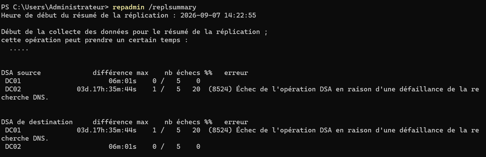
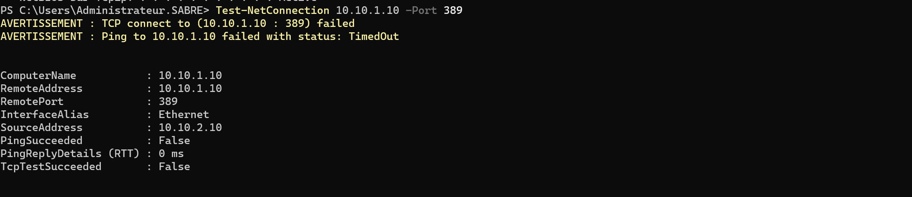
</details>

**2) Brouillard de diagnostic : le pare-feu de RTR.** Les deux cartes de RTR étaient en profil *Public*, qui bloque l'ICMP entrant **vers RTR**. Le pare-feu Windows ne filtre que ce qui est adressé à la machine elle-même, pas le trafic qu'elle route : mes sondes vers la passerelle échouaient, pendant que le flux DC↔DC n'était pas concerné.

Bascule des cartes en *Private* et activation de la règle ICMPv4 entrante. 

```powershell
Set-NetConnectionProfile -InterfaceAlias "SITE1" -NetworkCategory Private
Set-NetConnectionProfile -InterfaceAlias "SITE2" -NetworkCategory Private
Enable-NetFirewallRule -Name "FPS-ICMP4-ERQ-In"
```

Le 8524 persiste après ça, ce qui prouve que le pare-feu était un brouillard sur le diagnostic, pas la cause. 

<details><summary><a id="bf-09"></a>📷 Preuve BF-09 · pare-feu RTR (Public → Private + ICMP)</summary>

**BF-09** : cartes SITE1 et SITE2 de RTR en profil `Public` (`NetworkCategory: Public`, `DomainAuthenticationKind: None`) avant la bascule en `Private`.
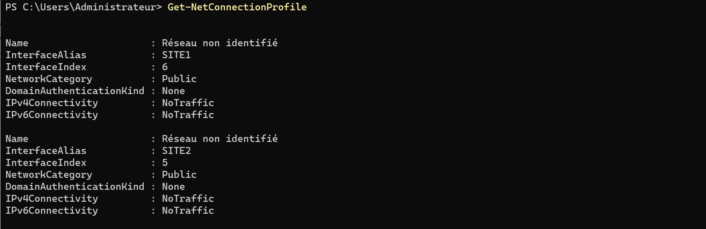

`Get-NetFirewallProfile` sur RTR : les trois profils actifs (`Enabled: True`), le profil Public applique bien ses règles restrictives.
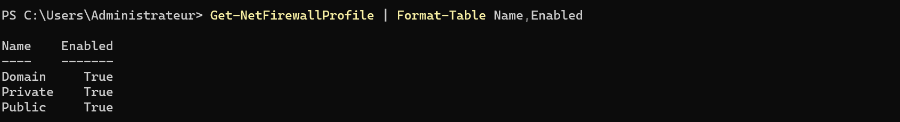

L'état rétabli se lit dans la passerelle `10.10.2.1` de nouveau joignable depuis DC01 ([P-02C](./WORKFLOW.md#p-02)).

</details>

**3) Diagnostic couche par couche.** Le forwarding et l'état de RRAS sont sains. DC02 joint bien sa passerelle `10.10.2.1`, mais DC01 n'a aucune route vers `10.10.2.0/24`. Le trafic part, rien ne revient.

<details><summary><a id="bf-10"></a>📷 Preuve BF-10 · chemin de retour manquant</summary>

**BF-10** : chemin de retour absent, forwarding et RRAS vérifiés sains.
(DC02 → passerelle OK, DC01 en échec). 


Forwarding et RRAS vérifiés :
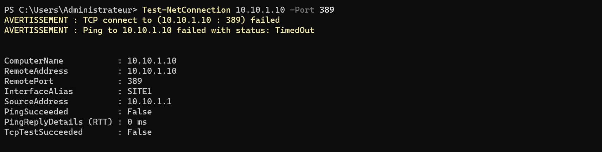
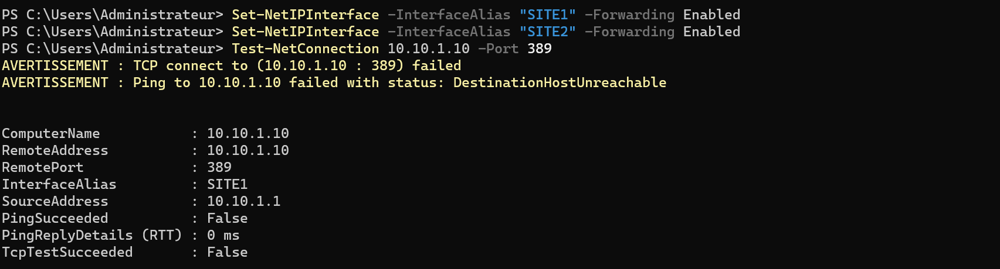
</details>

<details><summary><a id="bf-11"></a>📷 Preuve BF-11 · cause racine</summary>

**BF-11** : `Get-NetIPConfiguration` DC01 sans passerelle et `Get-NetRoute` vide vers SITE2.
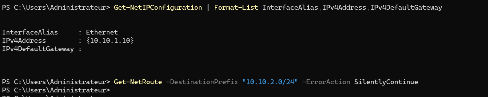
</details>

**4) Cause racine et réparation.** Route de retour absente sur DC01 : Pose d'une route statique persistante avec `route -p add` (`New-NetRoute -PolicyStore` échoue sur WS2025).

<details><summary><a id="bf-12"></a>📷 Preuve BF-12 · gotcha New-NetRoute</summary>

**BF-12** : `New-NetRoute -PolicyStore PersistentStore` en erreur 87.
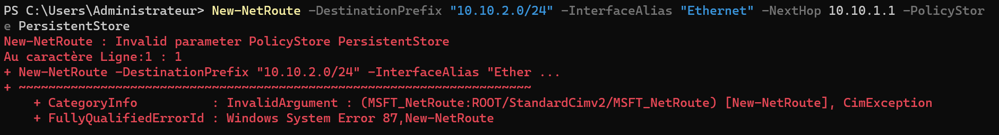
</details>

<details><summary><a id="bf-13"></a>📷 Preuve BF-13 · réparation (route persistante)</summary>

**BF-13** : route statique persistante posée sur DC01 vers `10.10.2.0/24`.
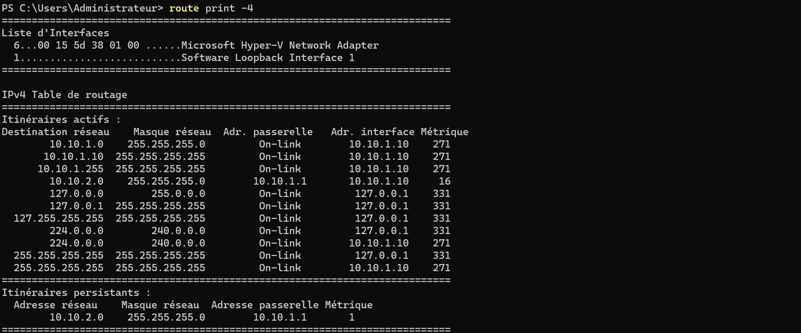

Route persistante (partagée avec P-02).
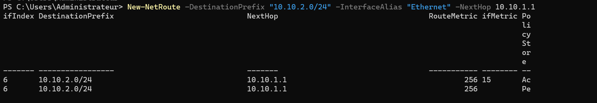
</details>

**5) Validation.** Réplication à 0 échec, résolution DNS inter-site rétablie. 

<details><summary><a id="bf-14"></a>📷 Preuve BF-14 · validation inter-site</summary>

**BF-14** : réplication à 0 échec et résolution DNS inter-site rétablie après la route (captures partagées avec P-02).
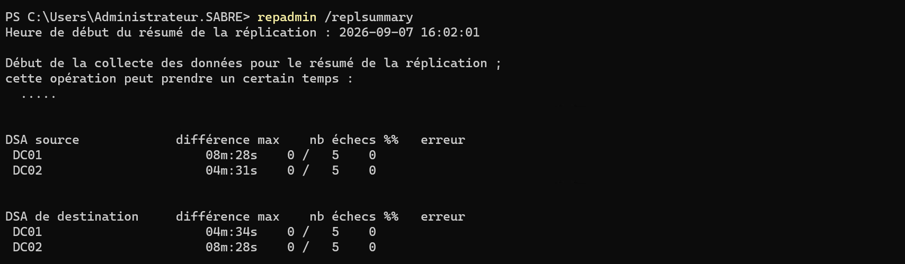
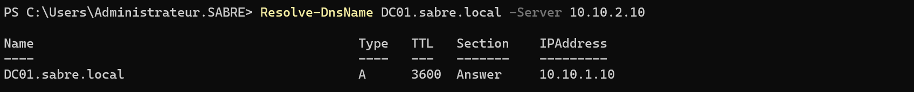
</details>

**6) Facteur au démarrage, confirmé par reproduction.** Pour être sûr, panne rejouée volontairement. DC allumés avant que RTR ne route, le 8524 revient à l'identique, route persistante en place comprise. 

RTR démarré en premier puis DC redémarrés, zéro échec. Le facteur restant est une dépendance d'ordre de démarrage : tout l'inter-site (DNS et réplication) traverse RTR, qui doit router avant que les DC ne se cherchent.

La route manquante (point 4) était la configuration à corriger. L'ordre de démarrage, aggravé par un RRAS qui ne redémarrait pas seul ([incident 2](#rras-stopped)), régissait le comportement au boot.

**Mitigation en deux temps.** Ordre de démarrage procédural (RTR d'abord), et filet automatisé par tâche planifiée `Repl-SyncAll-Startup` (au démarrage, différée, `repadmin /syncall DC01 /Ade`).

### <a id="rras-stopped"></a> 2) RRAS reste Stopped après chaque reboot (build WS2025)

**1) Symptôme et impact :** Après chaque redémarrage, le service Routing and Remote Access (RRAS) reste Stopped alors que son type de démarrage est réglé sur Automatic. RTR ne route plus au boot, tout l'inter-site (DNS et réplication) reste coupé jusqu'à une relance manuelle du service.

**2) Cause :** Sur cette build, RRAS se lance trop tôt dans la séquence de démarrage, échoue faute d'avoir ses dépendances prêtes, et reste couché. Automatic (démarrage immédiat) est donc le mauvais mode ici, il faut retarder le lancement.

**3) Correctif, avec gotcha WS2025 :** Passage en démarrage différé. La commande PowerShell attendue refuse la valeur d'enum sur cette build, on bascule donc sur `sc.exe`. Forwarding verrouillé au niveau interface pour survivre lui aussi au reboot. Preuve [BF-15](#bf-15).

<details><summary><a id="bf-15"></a>📷 Preuve BF-15 · gotcha Set-Service</summary>

**BF-15** : `Set-Service -StartupType AutomaticDelayedStart` refusé.
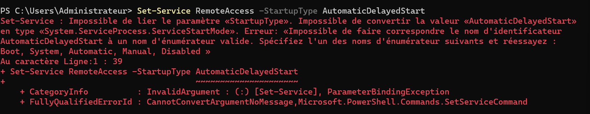

Puis `sc.exe config ... start= delayed-auto` accepté.
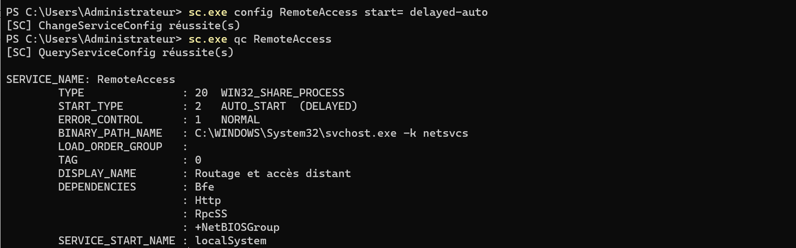

</details>

```powershell
# Refusé sur WS2025 :
Set-Service -Name RemoteAccess -StartupType AutomaticDelayedStart   # rejette la valeur d'enum

# Accepté (espace après le "=" obligatoire) :
sc.exe config RemoteAccess start= delayed-auto
```

**4) Validation.** Après reboot, RRAS démarre seul, routage inter-site présent sans intervention.

#### Gotchas WS2025 (aide-mémoire, aucun diagnostic à refaire)

| Commande attendue                                | Comportement sur WS2025 | Contournement                                               | Preuve          |
| ------------------------------------------------ | ----------------------- | ----------------------------------------------------------- | --------------- |
| `Set-Service -StartupType AutomaticDelayedStart` | refuse la valeur d'enum | `sc.exe config RemoteAccess start= delayed-auto`            | [BF-15](#bf-15) |
| `New-NetRoute -PolicyStore PersistentStore`      | erreur 87               | `route -p add` (route persistante posée en [BF-13](#bf-13)) | [BF-12](#bf-12) |

#### Hygiène Hyper-V

Un checkpoint avait été pris sur DC02 comme filet avant la renumérotation, en type **Standard** au lieu de **Production** (VSS). Le type est le moindre des deux problèmes : un checkpoint n'est jamais une méthode de restauration d'un DC, quel que soit son type (risque d'USN rollback, voir N7). Le filet correct avant une opération de ce niveau est une sauvegarde System State. Le checkpoint a été supprimé sans avoir servi.

<details><summary><a id="bf-16"></a>📷 Preuve BF-16 · checkpoint Standard nettoyé</summary>

**BF-16** : `Get-VMSnapshot` (checkpoint *Standard* avant renum) puis `Remove-VMSnapshot`.
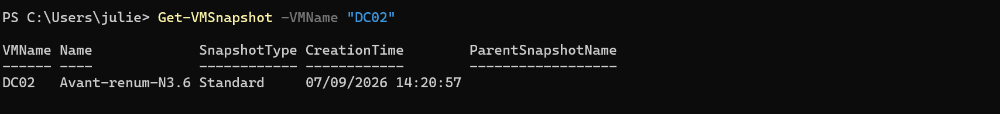
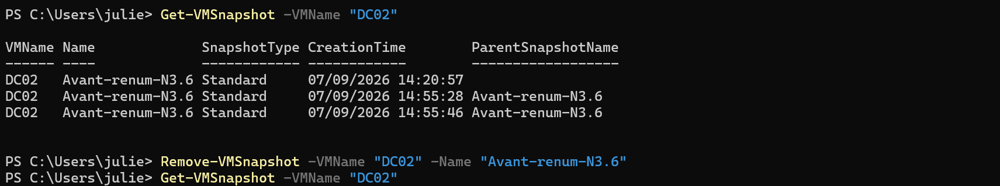
</details>

### <a id="relais-dhcp"></a> 3) Relais DHCP fonctionnel mais non administrable (dette L-02)

**Constat.** Juste après configuration, le relais DHCP s'affiche « Désactivé et Non lié », sans client encore présent sur SITE2 et sans redémarrage du service.

**Lecture.** Pas une panne. L'affichage « Désactivé » n'est pas expliqué sur cette build, et il est contredit par les faits : WIN11-B a tiré `10.10.2.100` à travers ce relais, bail confirmé côté DC01. On se fie au bail, pas à l'indicateur.

**La cause de manageabilité (dette L-02).** RTR est en `RoutingOnly`.

Sur Windows Server 2025, `Install-RemoteAccess -VpnType RoutingOnly` désactive le snap-in RRAS hérité. Le module `RemoteAccess` n'expose que des verbes DirectAccess/VPN, et l'agent de relais n'offre dans cette configuration ni GUI éditable ni cmdlet propre. 

Configuration menée par le contexte hérité `netsh routing ip relay`. Relais fonctionnel mais non administrable proprement : dette de manageabilité, pas de fonctionnement.

**Conséquence de conception.** L-02 a orienté l'injection de la mission panne N3 vers l'étendue DHCP (scope `10.10.2.0` basculé en `Inactive`, réversible en une commande) plutôt que vers le relais, non manipulable proprement pour un exercice répétable.

La dette n'a pas été subie, elle a dicté le choix de scénario.

<details><summary><a id="bf-17"></a>📷 Preuve BF-17 · relais non administrable proprement (WS2025, mode hérité verrouillé)</summary>

**BF-17** : sur WS2025 en `RoutingOnly`, console héritée verrouillée et agent de relais sans outil supporté ; config posée en `netsh`, relais prouvé fonctionnel au bout-en-bout.
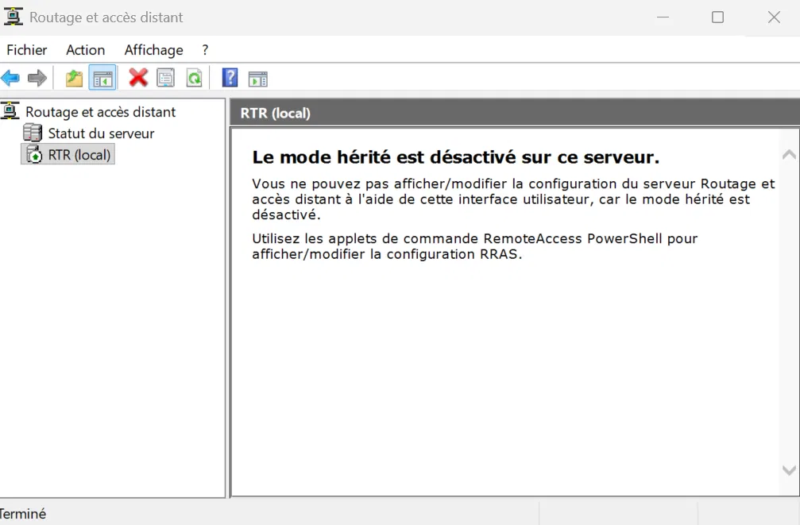

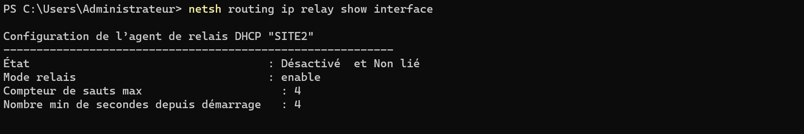

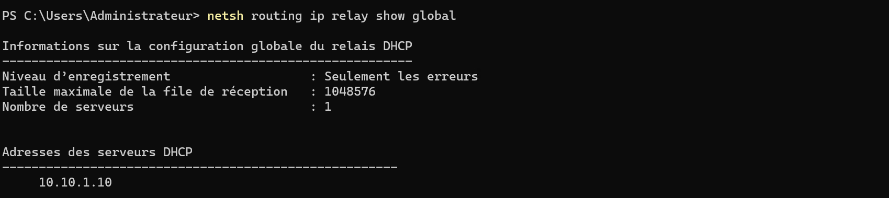

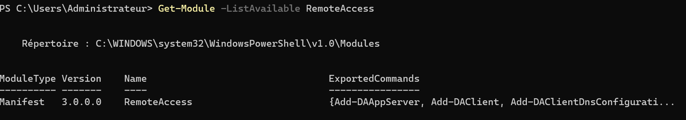

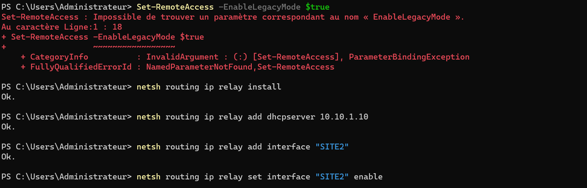
</details>

#### Nettoyage des options DHCP SITE1 (dette héritée du réseau isolé N1-N2)

Deux options traînaient depuis la période où SITE1 tournait isolé, avant l'ouverture de l'inter-site.

| Option        | État hérité                              | Correction                                      | Découverte                           | Preuve          |
| ------------- | ---------------------------------------- | ----------------------------------------------- | ------------------------------------ | --------------- |
| 006 (DNS)     | `{10.10.1.10, 10.10.1.11}`, valeur morte | `{10.10.1.10, 10.10.2.10}`                      | hygiène post-renum                   | [BF-18](#bf-18) |
| 003 (Routeur) | jamais posée, inutile sans passerelle    | `Set-DhcpServerv4OptionValue -Router 10.10.1.1` | au passage, pendant la mission panne | [BF-19](#bf-19) |

<details><summary><a id="bf-18"></a>📷 Preuve BF-18 · option 006 (DNS) périmée puis corrigée</summary>

**BF-18** : option 006 SITE1 périmée `{10.10.1.10, 10.10.1.11}` (le `.11` = ancienne IP de DC02), corrigée en `{10.10.1.10, 10.10.2.10}`.
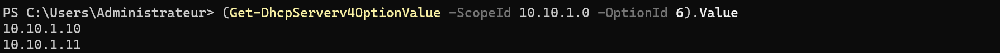
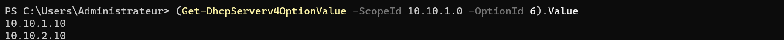
</details>

<details><summary><a id="bf-19"></a>📷 Preuve BF-19 · option 003 (routeur) absente puis posée et validée côté client</summary>

**BF-19** : option 003 absente au niveau scope et au niveau serveur sur SITE1, posée avec `-Router 10.10.1.1`, puis validée côté client (passerelle par défaut reçue).

Option 003 absente au niveau serveur SITE1
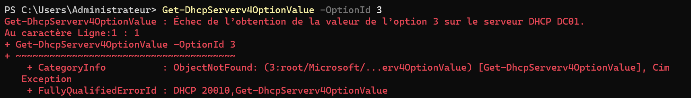

Option 003 absente au niveau du scope
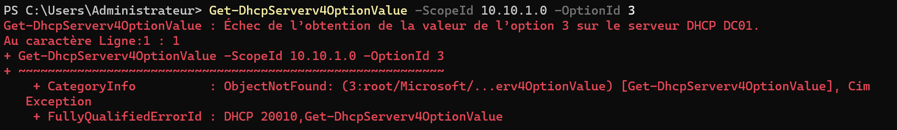

Pose de l'option 003 : `Set-DhcpServerv4OptionValue -Router 10.10.1.1`
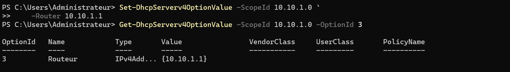

Validation client : `ipconfig /all` sur WIN11-A, passerelle par défaut `10.10.1.1`
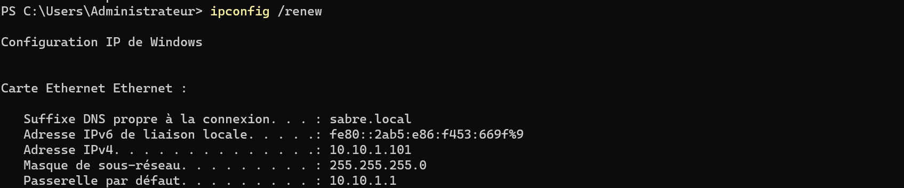

</details>

---

⬆️ [Sommaire](#sommaire) · 📄 **[← Workflow N3](./WORKFLOW.md)** · [README de l'épisode](./README.md) · [Vue d'ensemble](../../README.md) · **Suivant → [Workflow N4](../N4/WORKFLOW.md)**, les services de fichiers entre Scranton et Utica, avec la mission panne SYSVOL/DFS-R.
