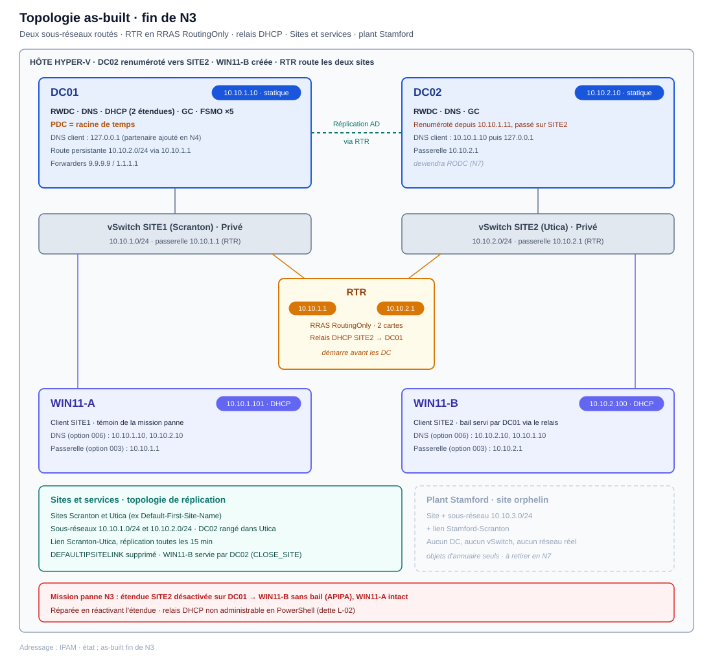

# Épisode N3 : Le réseau d'entreprise

**Concepts clés** : Sites & Services · réplication AD inter-site · routage RRAS · relais DHCP (IP Helper) · DNS inter-site · diagnostic (erreur 8524)

- 🎬 **Saison 1 · Épisode N3**
- 🖥️ **Stack** : Windows Server 2025 (DC01, DC02, RTR), Windows 11 Enterprise (WIN11-A, WIN11-B), Hyper-V, RRAS, PowerShell/RSAT
- 🗺️ Adressage (IP / DNS / passerelle / vSwitch) → [IPAM](../../IPAM.md)
- 🎭 Annuaire de démo (OU, groupes, comptes, nommage...) → [ABOUT DUNDER MIFFLAD](../../ABOUT_DUNDER_MIFFLAD.md)
- 📝 Progression étape par étape → [WORKFLOW N3](./WORKFLOW.md)
- 🔧 Mission panne, dépannage & preuves Break/Fix → [BREAKFIX N3](./BREAKFIX.md)

> 🎥 **Storyline :** *Utica ouvre. La succursale distante rejoint Scranton avec son propre sous-réseau, sa réplication d'annuaire et ses postes adressés à travers le routeur.*

## Topologie

## Objectif

N3 fait passer le lab d'un réseau isolé à plat (un seul sous-réseau en N1-N2) à une vraie infrastructure à deux sites routés.

Le but n'était pas d'empiler des rôles réseau. C'était de comprendre ce qui circule entre deux sites AD, et surtout ce qui casse quand un maillon du chemin manque.

Le socle réseau posé ici est ce sur quoi N4 va répartir les services de fichiers entre les deux sites.

- Router deux sous-réseaux isolés avec RTR (deux cartes, RRAS en RoutingOnly, IP forwarding activé).
- Renuméroter DC02 vers SITE2 et rétablir la réplication inter-site.
- Poser la topologie AD (sites Scranton et Utica, objets sous-réseau, lien de site) et le plant Stamford.
- Servir le DHCP à SITE2 par relais, puisque le broadcast client ne franchit pas le routeur.

## Principes de conception

1. **L'ordre : router avant de déplacer DC02.** Router ne se limite pas à RTR : DC01, sans passerelle, a aussi besoin d'une route de retour vers SITE2. Sans ce chemin complet, la réplication inter-site échoue (erreur 8524). Cet ordre est la condition pour que l'annuaire reste convergent pendant la bascule.

2. **Le broadcast DHCP ne franchit pas un routeur :** Servir SITE2 impose donc un relais (IP Helper) qui réémet la requête en unicast vers DC01, pas un second serveur DHCP.

Ces deux décisions ancrent le fil rouge de l'épisode : on construit le chemin, puis on le casse pour prouver qu'on sait le diagnostiquer.

## Fil conducteur 

N3 prend un réseau volontairement isolé (N1-N2 : un seul sous-réseau, DC01 sans passerelle) et lui ajoute le routage. Deux dettes héritées remontent à ce moment précis.

- DC01 était en DNS loopback seul depuis N1, conformément au plan (aucun partenaire à sa promotion). Son passage en « partenaire puis loopback », prévu à partir de N3, a été omis du plan de renumérotage de DC02 : corrigé en N4 (`10.10.2.10, 127.0.0.1`).
- L'option DHCP 003 (routeur) n'avait jamais été posée sur SITE1, inutile en réseau isolé. Surfacée puis soldée pendant le Break/Fix.

Ordre de solde respecté : router d'abord, renuméroter ensuite, ranger la topologie AD, servir SITE2 en dernier.

## Mission panne : cadrage

- **Incident simulé :** famine DHCP côté SITE2. Le scope SITE2 est désactivé sur DC01, les postes d'Utica ne reçoivent plus de bail.

- **Storyline :** le jour de l'ouverture d'Utica, aucun poste de la succursale n'obtient d'adresse, personne ne peut y ouvrir de session.

- **Ce que ça prouve :** je cadre une panne avant de la réparer. Un témoin sain (WIN11-A, sur SITE1, reçoit toujours son bail) disculpe le serveur DHCP ; l'état de l'étendue SITE2, lu ensuite sur le serveur, désigne la cause. Pas de démontage du relais ni du routage à l'aveugle.

- ➡️ Exécution & preuves : [BREAKFIX N3 § Mission panne](./BREAKFIX.md#mission-panne)

## Couverture compétences

| Compétence                  | Démonstration                                                                     |
| --------------------------- | --------------------------------------------------------------------------------- |
| Réplication AD (inter-site) | Renum DC02 vers SITE2, route inter-site, réplication cassée (8524) puis restaurée |
| Sites & Services            | Sites Scranton/Utica, objets sous-réseau, lien de site, plant Stamford            |
| DHCP (relais inter-site)    | Étendue SITE2 servie via relais IP Helper, mission panne « client affamé »        |
| DNS (résolution inter-site) | Résolution croisée SITE1↔SITE2, purge d'une option 006 périmée                    |
| Troubleshooting             | 8524 (cause prouvée par reproduction), famine DHCP, limite du relais RRAS         |

## Limites de l'épisode

- 📋 Routeur = RRAS Windows en RoutingOnly, pas un pare-feu dédié (pfSense/VyOS). La segmentation par ACL et le filtrage des ports AD sont laissés hors périmètre N3.

- ⚠️ Sites & Services et le plant Stamford sont montés et vérifiés, mais le décommissionnement (le payoff) n'est prouvé qu'en N7.

> Dette cross-épisode nommée pour la vitrine : le plant/payoff **Stamford (N3 → N7)**. IDs, gravité et statut vivent au [WORKFLOW N3 § Registre d'erreurs & dette technique](./WORKFLOW.md#registre-derreurs--dette-technique), source unique.

## Conclusion

N3 est l'épisode qui a généré le plus d'incidents non prévus à ce stade, et c'est précisément ce qui en fait la richesse.  À côté de la mission panne planifiée (le client de SITE2 privé de bail DHCP), plusieurs pannes accidentelles ont dû être diagnostiquées à froid.

La plus formatrice reste l'erreur de réplication **8524** apparue avec la renumérotation de DC02. Plusieurs défauts se superposaient derrière le même symptôme : une route de retour absente sur DC01, un RRAS qui ne redémarrait pas seul après un reboot (le routage tombait au démarrage) et des enregistrements DNS de DC02 restés sur son ancienne adresse. Par-dessus, un brouillard : le pare-feu de RTR, en profil Public, faisait échouer mes sondes vers le routeur lui-même sans être la cause de la panne.

Les démêler a demandé de tester chaque couche séparément, et de ne pas s'arrêter à la première cause trouvée. Réparer une seule couche faisait taire le symptôme assez longtemps pour croire que c'était réglé, avant qu'il ne revienne au redémarrage suivant.

La leçon de N3 tient là : séparer ce qui cause la panne de ce qui brouille son diagnostic, et ne clore que quand chaque couche est comprise et corrigée.

---

⬅️ [N2 : Annuaire, GPO et cycle de vie des comptes](../N2/README.md) · ⬆️ [Vue d'ensemble](../../README.md) · 🔁 [Workflow N3](./WORKFLOW.md) · 🔧 [Break/Fix N3](./BREAKFIX.md) · **Suivant → [N4 : Services de fichiers](../N4/README.md)** : les partages répartis entre Scranton et Utica s'appuient directement sur le routage et la réplication posés ici.
