# Épisode N3 : Workflow

**Concepts clés** : Sites & Services · réplication AD inter-site · routage RRAS · relais DHCP (IP Helper) · DNS inter-site · diagnostic (erreur 8524)

- 🎬 **Saison 1 · Épisode N3**
- 🖥️ **Stack** : Windows Server 2025 (DC01, DC02, RTR), Windows 11 Enterprise (WIN11-A, WIN11-B), Hyper-V, RRAS, PowerShell/RSAT
- 🗺️ Adressage (IP / DNS / passerelle / vSwitch) → [IPAM](../../IPAM.md)
- 🎭 Annuaire de démo (OU, groupes, comptes, nommage...) → [ABOUT DUNDER MIFFLAD](../../ABOUT_DUNDER_MIFFLAD.md)
- 📄 Présentation de l'épisode → [README N3](./README.md)
- 🔧 Mission panne, dépannage & preuves Break/Fix → [BREAKFIX N3](./BREAKFIX.md)

## Sommaire

**1. Cadrage**

- [Composants & rôles](#composants--rôles)
- [Topologie logique AD (delta N3)](#ad-logique)

**2. Étapes de configuration**

- [Étape 1 : router les deux sous-réseaux (RTR)](#étape-1)
- [Étape 2 : renuméroter DC02 vers SITE2 et rétablir la réplication](#étape-2)
- [Étape 3 : poser la topologie AD (Sites & Services + plant Stamford)](#étape-3)
- [Étape 4 : servir SITE2 en DHCP par relais](#étape-4)

**3. Preuves et clôtures**

- [Validation de bout en bout](#validation-de-bout-en-bout)
- [Registre d'erreurs & dette technique](#registre-derreurs--dette-technique)

---

# 1. Cadrage

## <a id="composants--rôles"></a>Composants & rôles

- Deux sous-réseaux privés, chacun sur son propre vSwitch Hyper-V, reliés par un routeur à deux cartes : SITE1 porte DC01 (FSMO, GC) et le poste WIN11-A. SITE2 porte DC02 et le poste WIN11-B. 

- RTR route entre les deux et n'a pas de passerelle par défaut, le lab restant isolé de l'extérieur. DC01 ne prend pas de passerelle par défaut non plus : il reçoit une route statique persistante vers SITE2, suffisante pour le trafic inter-site. DC02, lui, reçoit la passerelle `10.10.2.1` : son seul voisin utile, DC01, est de l'autre côté du routeur. L'asymétrie est volontaire, DC01 garde le minimum de chemins sortants.

- WIN11-B a été posée sur le SSD (client interactif, inutilisable au boot sur HDD). RTR tourne sur le SSD pendant N3, puis est remis sur le HDD à l'ouverture de N4 pour libérer la place à SRV-FILE (routeur non interactif, insensible au disque).

Les valeurs d'adressage du tableau ci-dessous sont rappelées pour la lisibilité ([IPAM](../../IPAM.md) fait foi). Les étendues DHCP couvrent `10.10.1.100-.199` (SITE1) et `10.10.2.100-.199` (SITE2). L'objet sous-réseau fictif du plant Stamford est `10.10.3.0/24`, sans machine ni vSwitch.

| Machine | Rôle dans l'épisode                           | IP (réf. IPAM)            |
| ------- | --------------------------------------------- | ------------------------- |
| RTR     | Routeur inter-site, deux cartes (SITE1/SITE2) | `10.10.1.1` · `10.10.2.1` |
| DC01    | DC FSMO/GC, DHCP, DNS (SITE1)                 | `10.10.1.10`              |
| DC02    | DC secondaire (SITE2), renuméroté en N3       | `10.10.2.10`              |
| WIN11-A | Poste témoin (SITE1), bail DHCP local         | `10.10.1.101` (DHCP)      |
| WIN11-B | Poste victime (SITE2), bail DHCP par relais   | `10.10.2.100` (DHCP)      |

## <a id="ad-logique"></a>Topologie logique AD (delta N3)

N3 n'ajoute aucun objet d'annuaire de département : les OU, groupes et comptes de démo sont hérités de N2 sans changement. 

Le delta de cet épisode est la **topologie de réplication** : deux sites nommés, leurs objets sous-réseau, un lien de site, et un troisième site orphelin posé exprès (Stamford) pour être retiré en N7.

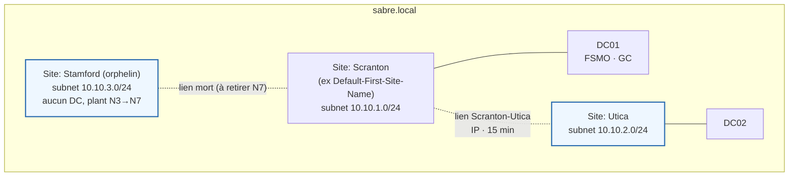

> Les objets d'annuaire de département (OU, GG-*, DL-*, comptes) restent ceux construits en N2. Voir le diagramme AD-logique cumulatif du [WORKFLOW N2](../N2/WORKFLOW.md#ad-logique).

---

# 2. Étapes de configuration

Pourquoi ce choix chronologique :

1) On route le réseau d'abord, on ne renumérote DC02 qu'ensuite. Router ne se limite pas à RTR : DC01, sans passerelle, doit aussi savoir renvoyer ses réponses vers SITE2. Sans ce chemin complet, la réplication inter-site sort en 8524 sur toutes les partitions.

2) La topologie AD (étape 3) et le DHCP relayé (étape 4) viennent après, une fois le chemin réseau prouvé sain.

---
### <a id="étape-1"></a>Étape 1 : router les deux sous-réseaux (RTR)

🎯 **Objectif :** créer la VM RTR à deux cartes, puis relier SITE1 et SITE2 en routant entre elles, chaque carte fixée sur son sous-réseau, sans passerelle vers l'extérieur.

🧪 **Lab vs Production : RRAS en routeur simple**

La piste évitée : utiliser un DC ou un serveur applicatif comme routeur.

La piste gardée dans ce lab : RTR est une VM Windows dédiée en `Install-RemoteAccess -VpnType RoutingOnly`, sans rôle AD, ce qui suffit à router deux sous-réseaux privés.

La piste que j'aurais privilégiée en production : le routage et le filtrage inter-site vivent sur un équipement dédié (pare-feu/routeur), pas sur un hôte Windows polyvalent.

```powershell
# --- Sur l'hôte Hyper-V : vSwitch SITE2 et coquille RTR ---

# vSwitch privé SITE2 (SITE1 existe depuis N1)
New-VMSwitch -Name "SITE2" -SwitchType Private

# VM RTR, Génération 2, VHDX sur le SSD pendant N3 (disque chaud)
New-VM `
    -Name "RTR" `
    -Generation 2 `
    -MemoryStartupBytes 1GB `
    -NewVHDPath "<Dossier VHDX chauds>\RTR.vhdx" `
    -NewVHDSizeBytes 60GB `
    -SwitchName "SITE1" `
    -Path "<Dossier configs VM>"

# RAM dynamique : acceptable sur un routeur (un DC, lui, la proscrit)
Set-VMMemory `
    -VMName "RTR" `
    -DynamicMemoryEnabled $true `
    -MinimumBytes 512MB `
    -StartupBytes 1GB `
    -MaximumBytes 2GB

# Deux cartes, une par site, nommées côté Hyper-V pour ne pas les confondre
Rename-VMNetworkAdapter `
    -VMName "RTR" `
    -Name "Carte réseau" `
    -NewName "SITE1"

Add-VMNetworkAdapter `
    -VMName "RTR" `
    -SwitchName "SITE2" `
    -Name "SITE2"

# Relever les MAC côté hôte : c'est le seul lien fiable entre carte Hyper-V et carte invitée
Get-VMNetworkAdapter -VMName "RTR" | Select-Object Name, SwitchName, MacAddress

# --- Dans RTR (OS invité), après installation de Windows Server ---

# Windows ne numérote pas forcément les cartes dans l'ordre Hyper-V : rapprocher par MAC avant de renommer
Get-NetAdapter | Select-Object Name, MacAddress
Rename-NetAdapter -Name "Ethernet" -NewName "SITE1"      # carte dont la MAC = celle de SITE1 côté hôte
Rename-NetAdapter -Name "Ethernet 2" -NewName "SITE2"

# Couper le DHCP sur chaque carte avant de poser l'IP statique
Set-NetIPInterface -InterfaceAlias "SITE1" -Dhcp Disabled
Set-NetIPInterface -InterfaceAlias "SITE2" -Dhcp Disabled

# IP statiques : RTR est de l'infra, jamais en DHCP (principe IPAM)
New-NetIPAddress `
    -InterfaceAlias "SITE1" `
    -IPAddress 10.10.1.1 `
    -PrefixLength 24

New-NetIPAddress `
    -InterfaceAlias "SITE2" `
    -IPAddress 10.10.2.1 `
    -PrefixLength 24

# Installer le rôle (Install-RemoteAccess n'existe qu'après), puis activer le routage seul
Install-WindowsFeature RemoteAccess, Routing -IncludeManagementTools
Install-RemoteAccess -VpnType RoutingOnly
Set-NetIPInterface -InterfaceAlias "SITE1" -Forwarding Enabled
Set-NetIPInterface -InterfaceAlias "SITE2" -Forwarding Enabled
```

<details><summary>🖱️ Version GUI</summary>

**1) Créer le commutateur SITE2**
Gestionnaire Hyper-V → Gestionnaire de commutateur virtuel → Nouveau commutateur réseau virtuel → **Privé** → nom `SITE2`.
(SITE1 existe déjà depuis N1.)

**2) Créer la VM RTR avec ses deux cartes**
Nouvelle machine virtuelle → **Génération 2**, mémoire de démarrage **1 Go**, VHDX dans le dossier des VHDX chauds (SSD), première carte réseau connectée à **SITE1**.
Puis Paramètres de RTR :
- Ajouter un matériel → Carte réseau → commutateur **SITE2** (la seconde patte).
- Mémoire → cocher la **mémoire dynamique** (RTR n'a pas besoin de RAM fixe, contrairement à un DC).

**3) Poser les IP statiques sur les DEUX cartes (avant RRAS)**
Dans l'invité RTR : Panneau de configuration → Centre Réseau et partage → Modifier les paramètres de la carte → clic droit sur la carte → Propriétés → IPv4.
- Carte **SITE1** : `10.10.1.1` /24
- Carte **SITE2** : `10.10.2.1` /24
(valeurs depuis l'IPAM ; RTR ne porte **pas** de passerelle par défaut, il *est* la passerelle des deux sites.)

**4) Installer le rôle, puis activer le routage**
Gestionnaire de serveur → Ajouter des rôles et fonctionnalités → **Accès à distance** → service de rôle **Routage**.
L'activation du routage n'a pas d'équivalent graphique dans ce lab : une fois RRAS en `RoutingOnly`, la console *Routage et accès distant* affiche « Le mode hérité est désactivé sur ce serveur » et ne permet plus aucune configuration ([BF-17](./BREAKFIX.md#bf-17)). La configuration s'est faite en PowerShell.
Rapprochement des cartes : comparer les adresses MAC de *Paramètres → Carte réseau → Fonctionnalités avancées* (hôte) avec `ipconfig /all` (invité) avant de renommer.
</details>

**Validation**

| Vérification                                      | Attendu                                                              | Preuve               |
| ------------------------------------------------- | -------------------------------------------------------------------- | -------------------- |
| `Get-VM RTR` + `Get-VMNetworkAdapter -VMName RTR` | VM Génération 2, deux cartes sur les vSwitch SITE1 et SITE2          | P-01A · P-01B · P-01D |
| `Get-NetIPConfiguration` sur RTR                  | deux cartes SITE1/SITE2, `10.10.1.1` et `10.10.2.1`, sans passerelle | P-01C                |
| `Get-Service RemoteAccess` + `Get-NetIPInterface` | service *Running*, `Forwarding Enabled` sur les deux cartes          | P-01E                |

<details><summary><a id="p-01"></a>📷 Preuve P-01 · routage RTR</summary>

**P-01A :** VM Génération 2
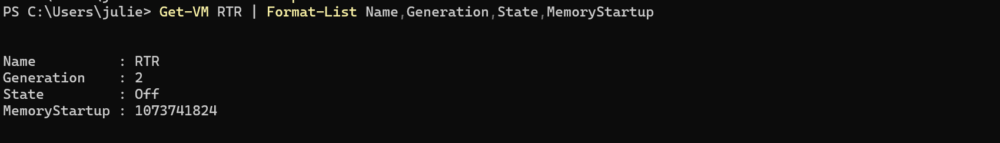

**P-01B :** 2 cartes sur les vSwitch SITE1 et SITE2, renommées
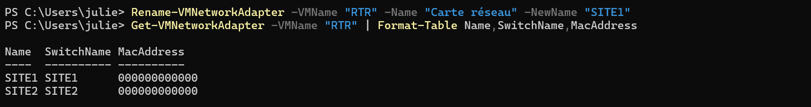
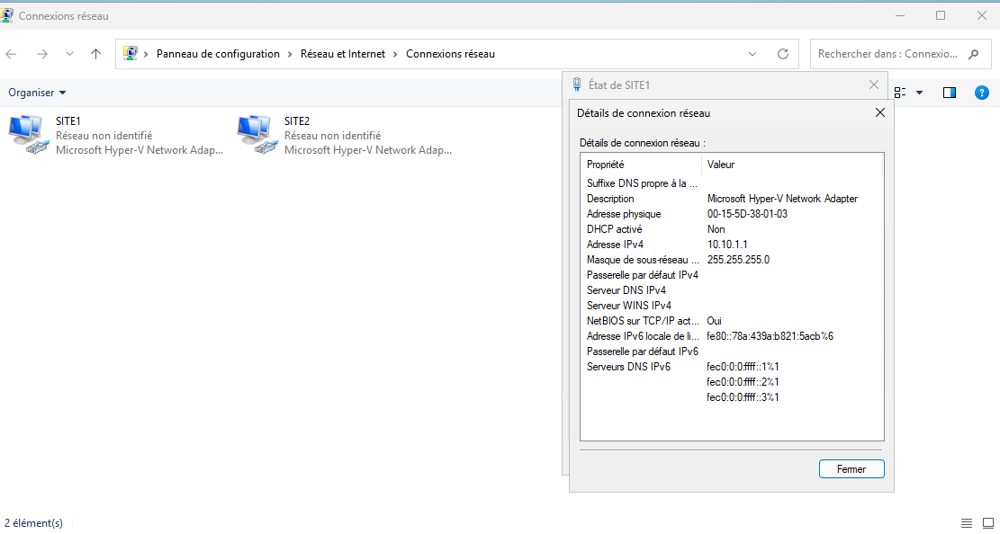

**P-01C :** IP `10.10.1.1`/`10.10.2.1` sans passerelle


**P-01D :** MAC réelles des deux cartes (rapprochement hôte / invité)
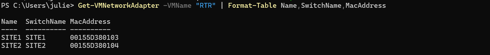

**P-01E :** service *Running* + forwarding *Enabled*
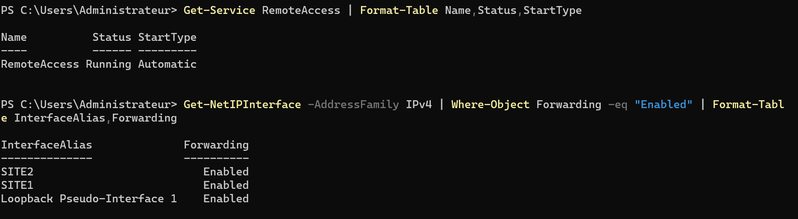
</details>

---
### <a id="étape-2"></a>Étape 2 : renuméroter DC02 vers SITE2 et rétablir la réplication

🎯 **Objectif :** déplacer DC02 sur `10.10.2.10` avec passerelle `10.10.2.1`, donner à DC01 une route vers SITE2, et vérifier que la réplication inter-site est saine.

⚠️ **Le piège du routage qui n'est pas forcément symétrique.** 

Après la renumérotation, DC02 joignait sa passerelle mais DC01 n'avait aucune route vers `10.10.2.0/24` : la requête arrivait, la réponse se perdait, et la réplication tombait en 8524.

🔧 **Note d'installation : `New-NetRoute -PolicyStore PersistentStore` en erreur 87 sur WS2025.** La route persistante se pose avec `route -p add`.

⚠️ **Piège : changer l'IP d'un DC ne nettoie pas le DNS.** 

DC02 a publié pendant N1-N2 des enregistrements A, SRV et CNAME à `10.10.1.11`. Sans réinscription ni purge, des opérations par nom visent une adresse morte (erreur 58 « le nom spécifié n'est plus disponible », [incident 3](./BREAKFIX.md#dépannage-incidents-de-session)).

🔧 **Note : le vrai filet avant de renuméroter un DC.** Un checkpoint n'en est pas un ([BF-16](./BREAKFIX.md#bf-16)). Le filet correct est une sauvegarde System State (N7).

```powershell
# --- Dans DC02 (console VMConnect obligatoire, l'IP change sous nos pieds) ---

# Retirer l'ancienne IP SITE1 avant de poser la nouvelle (sinon double IP)
Remove-NetIPAddress -InterfaceAlias "Ethernet" -IPAddress 10.10.1.11 -Confirm:$false

# Nouvelle IP de DC02 dans SITE2
New-NetIPAddress `
    -InterfaceAlias "Ethernet" `
    -IPAddress 10.10.2.10 `
    -PrefixLength 24 `
    -DefaultGateway 10.10.2.1

# DNS client de DC02 : partenaire d'abord, loopback ensuite (principe IPAM)
Set-DnsClientServerAddress -InterfaceAlias "Ethernet" -ServerAddresses 10.10.1.10,127.0.0.1

# --- Sur l'hôte Hyper-V : basculer la carte de DC02 sur le vSwitch SITE2 ---
# (renuméroter l'IP sans rebrancher le vSwitch laisserait DC02 sur SITE1)
Connect-VMNetworkAdapter -VMName "DC02" -SwitchName "SITE2"

# --- Sur DC01 : route de retour persistante vers SITE2 ---
# (route -p, car New-NetRoute -PolicyStore échoue sur WS2025)
route -p add 10.10.2.0 mask 255.255.255.0 10.10.1.1

# --- Dans DC02 : réinscrire ses enregistrements DNS à la nouvelle adresse ---
ipconfig /registerdns          # enregistrements A/PTR
Restart-Service Netlogon       # enregistrements SRV et CNAME de localisation

# --- Sur DC01 : purger l'enregistrement A résiduel à l'ancienne adresse ---
Get-DnsServerResourceRecord -ZoneName "sabre.local" -Name "DC02" -RRType A |
    Where-Object { $_.RecordData.IPv4Address -eq "10.10.1.11" } |
    Remove-DnsServerResourceRecord -ZoneName "sabre.local" -Force

# Contrôle de la réplication après bascule
repadmin /replsummary
```

> ⚠️ **Le geste manqué : le DNS client de DC01 :** 
> 
> Maintenant que DC02 a son adresse définitive, DC01 aurait dû passer en « partenaire puis loopback » (`10.10.2.10, 127.0.0.1`). Le plan de renumérotage ne listait que des changements sur DC02, et ce geste n'y figurait pas. Il a été rattrapé en N4 ([registre L-06](#registre-derreurs--dette-technique)).

<details><summary>🖱️ Version GUI</summary>

IP et DNS de DC02 se règlent depuis la console *VMConnect* (la session distante saute au changement d'IP) : *Propriétés IPv4* de la carte, champ *Passerelle par défaut* = `10.10.2.1`, serveurs DNS `10.10.1.10` puis `127.0.0.1`.

Bascule du vSwitch : *Gestionnaire Hyper-V → clic droit DC02 → Paramètres → Carte réseau → Commutateur virtuel* = `SITE2`.

La route persistante de DC01 n'a pas d'équivalent GUI propre : `route -p add` est la voie standard, la capture de `route print -4` en est la preuve.

Réinscription DNS de DC02 : pas d'équivalent graphique pour `ipconfig /registerdns` ; redémarrage de Netlogon possible via `services.msc`. Purge de l'enregistrement résiduel : *Gestionnaire DNS* → zone `sabre.local` → enregistrement `DC02` en `10.10.1.11` → **Supprimer**.

Réplication : *Utilisateurs et ordinateurs AD* ne montre pas l'état de réplication ; on reste en ligne de commande (`repadmin`).
</details>

**Validation**

| Vérification | Attendu | Preuve |
| ------------ | ------- | ------ |
| `ipconfig /all` sur DC02 | `10.10.2.10`, passerelle `10.10.2.1`, DNS `10.10.1.10` puis loopback | P-02A |
| `route print -4` sur DC01 | `10.10.2.0/24 via 10.10.1.1`, marquée persistante | P-02B |
| `Test-NetConnection DC01 -Port 389` depuis DC02 (et inverse) | connexion inter-site LDAP réussie dans les deux sens | P-02C |
| `Resolve-DnsName DC01 -Server 10.10.2.10` | résolution croisée SITE1↔SITE2 | P-02D |
| `repadmin /replsummary` | 0 échec sur toutes les partitions | P-02E |

<details><summary><a id="p-02"></a>📷 Preuves P-02 · renum DC02 & réplication inter-site</summary>

**P-02A :** DC02 renuméroté dans SITE2
IP `10.10.2.10`, passerelle `10.10.2.1`
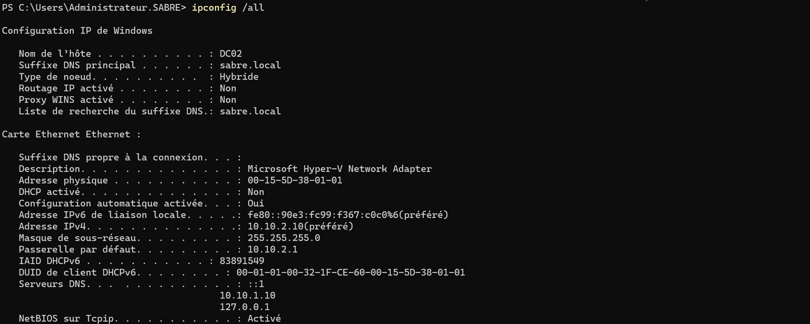

Ordre DNS `{10.10.1.10, 127.0.0.1}`
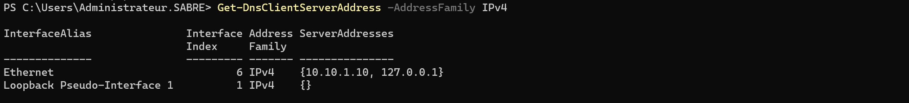

Carte *DomainAuthenticated*
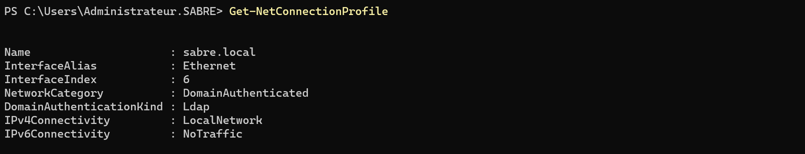

Enregistrement A suivi dans la zone DNS
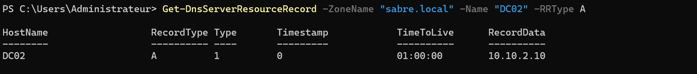

**P-02B :** route de retour persistante sur DC01 vers SITE2 (interface 10.10.1.10 = DC01)


**P-02C :** LDAP inter-site joignable dans les deux sens (port 389) + passerelle SITE2 atteinte
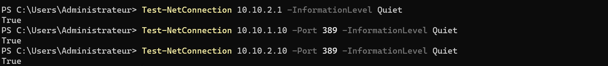
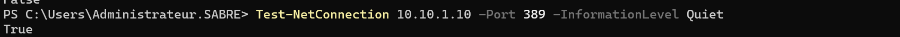

**P-02D :** résolution DNS croisée SITE1↔SITE2 (DC02 interrogé pour DC01)


**P-02E :** réplication AD saine, 0 échec dans les deux sens

</details>

---
### <a id="étape-3"></a>Étape 3 : poser la topologie AD (Sites & Services + plant Stamford)

🎯 **Objectif :** déclarer les sites Scranton et Utica, y rattacher les objets sous-réseau, ranger DC02 dans Utica, créer le lien de site, et poser le site orphelin Stamford.

💡 **Principe de conception : un site AD décrit la topologie de réplication, pas le routage**

L'objet sous-réseau rattache une machine à un site par son IP. Le site sert à AD pour choisir un DC proche et cadencer la réplication inter-site. Le routage reste entièrement à la charge du réseau : déclarer un site ne route rien, et router ne crée aucun site.

```powershell
# Scranton = l'ancien site par défaut, renommé
Rename-ADObject `
    -Identity (Get-ADReplicationSite "Default-First-Site-Name").DistinguishedName `
    -NewName "Scranton"

# Utica = le nouveau site de la succursale
New-ADReplicationSite -Name "Utica"

# Objets sous-réseau rattachés à leur site
New-ADReplicationSubnet -Name "10.10.1.0/24" -Site "Scranton"
New-ADReplicationSubnet -Name "10.10.2.0/24" -Site "Utica"

# DC02 rangé dans Utica
Move-ADDirectoryServer -Identity DC02 -Site "Utica"

# Lien de site Scranton-Utica (transport IP, 15 min)
New-ADReplicationSiteLink `
    -Name "Scranton-Utica" `
    -SitesIncluded Scranton,Utica `
    -ReplicationFrequencyInMinutes 15 `
    -InterSiteTransportProtocol IP

# Plant Stamford : site + sous-réseau + lien dédié, aucun DC, à retirer en N7
New-ADReplicationSite -Name "Stamford"
New-ADReplicationSubnet -Name "10.10.3.0/24" -Site "Stamford"
New-ADReplicationSiteLink `
    -Name "Stamford-Scranton" `
    -SitesIncluded Stamford,Scranton `
    -InterSiteTransportProtocol IP

# Le lien par défaut ne sert plus : chaque site a un lien explicite
Remove-ADReplicationSiteLink -Identity "DEFAULTIPSITELINK" -Confirm:$false
```

<details><summary>🖱️ Version GUI</summary>

Console *Sites et services Active Directory* (`dssite.msc`).

Renommer `Default-First-Site-Name` → `Scranton` (F2).

Clic droit sur *Sites* → *Nouveau site* pour Utica puis Stamford. L'assistant impose de choisir un lien : `DEFAULTIPSITELINK`, le seul disponible à ce stade, sert de rattachement provisoire.

Clic droit sur *Subnets* → *Nouveau sous-réseau* pour chaque préfixe (Scranton et Utica depuis l'[IPAM](../../IPAM.md), Stamford = préfixe fictif `10.10.3.0/24`), chacun associé à son site.

Stamford reste **sans DC ni objet serveur** : objet d'annuaire volontairement orphelin, destiné au décommissionnement N7.

Créer les liens : clic droit sur *Inter-Site Transports → IP* → *Nouveau lien de site*, `Scranton-Utica` (membres Scranton + Utica), puis `Stamford-Scranton` (membres Stamford + Scranton). Supprimer ensuite `DEFAULTIPSITELINK`, devenu inutile.

Déplacer DC02 : glisser-déposer l'objet serveur `DC02` sous *Utica → Servers*, ou clic droit → *Déplacer* → Utica. L'objet serveur ne suit pas le changement d'IP, ce déplacement est obligatoire.

Régler la réplication : *Inter-Site Transports → IP → Scranton-Utica → Propriétés*, fréquence 15 min (minimum autorisé, défaut 180).
</details>

**Validation**

| Vérification                                 | Attendu                                                              | Preuve |
| -------------------------------------------- | -------------------------------------------------------------------- | ------ |
| `Get-ADReplicationSite -Filter *`            | Scranton, Utica, Stamford présents                                   | P-03A  |
| `Get-ADReplicationSubnet -Filter *`          | `10.10.1.0/24`, `10.10.2.0/24`, `10.10.3.0/24` rattachés             | P-03A  |
| `Get-ADReplicationSiteLink -Filter *`        | `Scranton-Utica` et `Stamford-Scranton`, plus de `DEFAULTIPSITELINK` | P-03A  |
| `Get-ADDomainController -Filter *`           | DC01 → Scranton, DC02 → Utica                                        | P-03B  |
| `Get-ADReplicationSiteLink Scranton-Utica`   | `ReplicationFrequencyInMinutes : 15`                                 | P-03C  |
| `nltest /dsgetsite` + `/dsgetdc` sur WIN11-B | `Utica` ; `DC02` avec `CLOSE_SITE`                                   | P-03D  |

<details><summary><a id="p-03"></a>📷 Preuves P-03 · Sites & Services</summary>

**P-03A :** sites, sous-réseaux et liens dans une seule vue (`-Filter *`). Les trois sites Scranton/Utica/Stamford, les trois sous-réseaux rattachés à leur site (`10.10.3.0/24` = préfixe fictif de Stamford), et les deux liens IP `Scranton-Utica` et `Stamford-Scranton` (ce dernier volontairement orphelin, sans DC, destiné au décommissionnement N7).
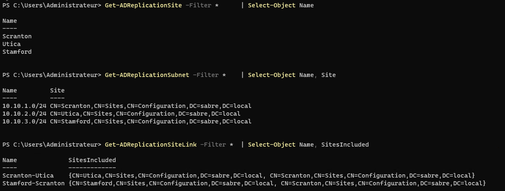

**P-03B :** placement des contrôleurs dans leurs sites (DC01 → Scranton, DC02 → Utica après déplacement de l'objet serveur)
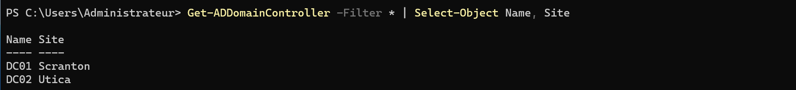

**P-03C :** fréquence de réplication du lien inter-site `Scranton-Utica` réglée à 15 min (Cost 100, membres Scranton + Utica)
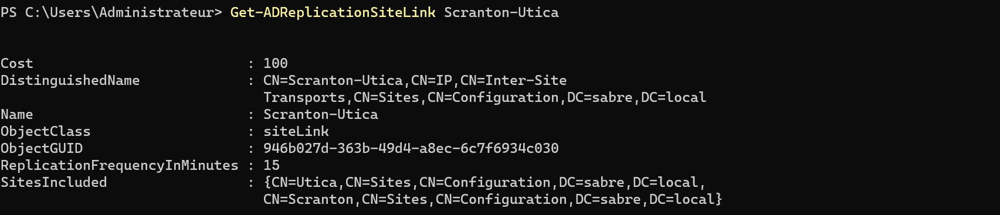

**P-03D :** WIN11-B rattaché au site `Utica` et servi par `DC02`, indicateur `CLOSE_SITE` : les sites déclarés orientent bien la localisation du DC.
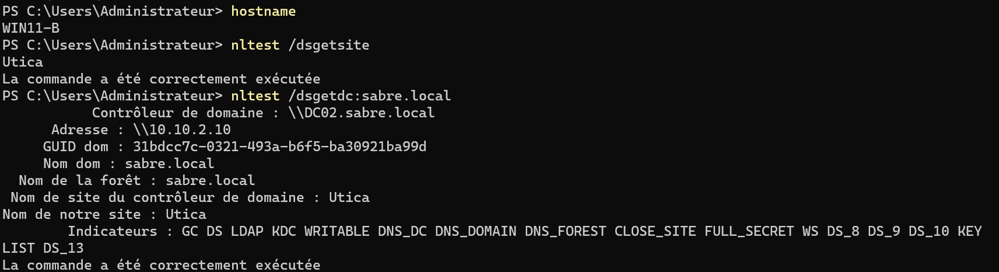
</details>

---
### <a id="étape-4"></a>Étape 4 : servir SITE2 en DHCP par relais

🎯 **Objectif :** créer l'étendue DHCP de SITE2 sur DC01, la doter des bonnes options, et faire relayer les requêtes d'Utica par RTR pour que WIN11-B obtienne un bail.

⚠️ **Le piège du broadcast DHCP (UDP 67/68) qui ne route pas.**

Un client sans adresse émet sa demande DHCP en broadcast. Un routeur ne réémet pas les broadcasts, donc la demande d'un poste d'Utica n'atteint jamais DC01 sur SITE1. 

Le relais (IP Helper, configuré sur RTR) intercepte ce broadcast et le réémet en unicast vers `10.10.1.10`. Sans lui, l'étendue SITE2 peut être parfaitement configurée et WIN11-B restera quand même en APIPA.

```powershell
# Étendue SITE2, hébergée sur le DHCP de DC01
Add-DhcpServerv4Scope `
    -ComputerName DC01 `
    -Name "SITE2-Utica" `
    -StartRange 10.10.2.100 `
    -EndRange 10.10.2.199 `
    -SubnetMask 255.255.255.0

# Option 003 (passerelle) et 006 (DNS) au niveau de l'étendue SITE2
Set-DhcpServerv4OptionValue `
    -ComputerName DC01 `
    -ScopeId 10.10.2.0 `
    -Router 10.10.2.1 `
    -DnsServer 10.10.2.10,10.10.1.10     # DC local d'abord : un client d'Utica ne traverse pas le routeur pour chaque requête

# Sur RTR : relais DHCP (IP Helper), pointer le serveur puis écouter sur SITE2
netsh routing ip relay install
netsh routing ip relay add dhcpserver 10.10.1.10
netsh routing ip relay add interface "SITE2"
netsh routing ip relay set interface "SITE2" enable
```

> 🔧 **Note d'installation : l'ordre DNS corrigé après coup.** L'étendue SITE2 a d'abord été créée avec le DNS de Scranton en premier, puis inversée pour que les postes d'Utica interrogent d'abord leur DC local. Un client ne reçoit le nouvel ordre qu'à son renouvellement de bail : WIN11-B l'a reçu au renouvellement suivant (P-04C).

<details><summary>🖱️ Version GUI</summary>

Étendue : console *DHCP* → `dc01` → *IPv4* → clic droit → *Nouvelle étendue* → plage `10.10.2.100-.199`, masque `/24`, options 003 = `10.10.2.1` et 006 = `10.10.2.10` puis `10.10.1.10` → *Activer l'étendue maintenant*.

Relais : pas d'équivalent graphique dans ce lab. RRAS étant en `RoutingOnly`, la console héritée est verrouillée (« mode hérité désactivé ») et l'agent de relais n'a pas de cmdlet : la configuration passe par `netsh routing ip relay` ([BF-17](./BREAKFIX.md#bf-17), dette [L-02](#registre-derreurs--dette-technique)).
</details>

**Validation**

| Vérification | Attendu | Preuve |
| ------------ | ------- | ------ |
| `Get-DhcpServerv4Scope -ComputerName DC01` | deux étendues *Active* (SITE1 et SITE2) | P-04A |
| `Get-DhcpServerv4OptionValue -ScopeId 10.10.2.0` | routeur `10.10.2.1`, DNS `10.10.2.10` puis `10.10.1.10` (DC local d'abord) | P-04B |
| `ipconfig /renew` + `/all` sur WIN11-B | bail `10.10.2.100` via relais, serveur DHCP `10.10.1.10` (SITE1), DNS `10.10.2.10` en premier | P-04C |
| `Get-DhcpServerv4Lease` | WIN11-B `10.10.2.100` *Active* côté DC01 | P-04D |

<details><summary><a id="p-04"></a>📷 Preuves P-04 · DHCP relayé pour SITE2</summary>

**P-04A :** deux étendues DHCP servies par DC01, SITE1 et SITE2, toutes deux *Active*
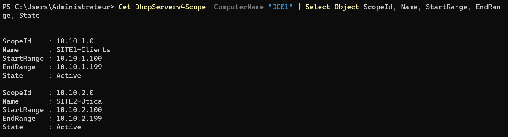

**P-04B :** options de l'étendue SITE2 (routeur `10.10.2.1`, DNS `{10.10.2.10, 10.10.1.10}`, DC local d'abord), et option DNS de l'étendue SITE1 (`{10.10.1.10, 10.10.2.10}`, DC local d'abord également).
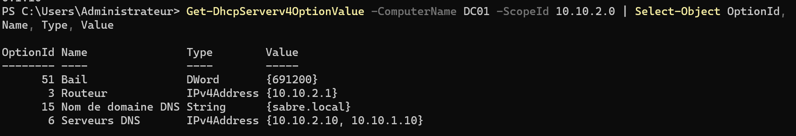


**P-04C :** WIN11-B, physiquement sur le vSwitch SITE2, tient son bail `10.10.2.100` d'un serveur DHCP situé en `10.10.1.10` (SITE1) : la ligne « Serveur DHCP » atteste la traversée du routeur par relais. Après l'inversion de l'option 006, le poste reçoit `10.10.2.10` (DC local) en premier serveur DNS.
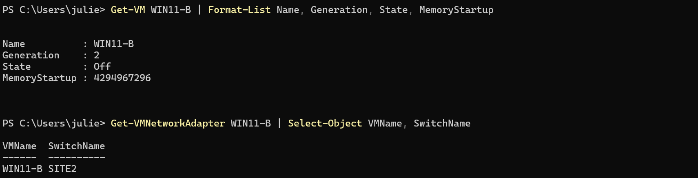
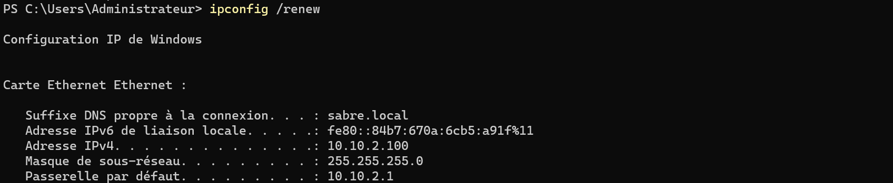
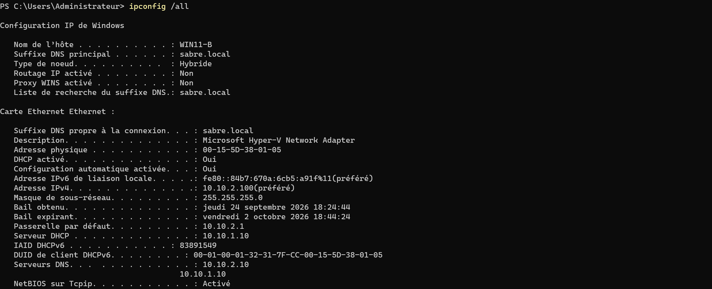

**P-04D :** confirmation côté serveur, bail WIN11-B `10.10.2.100` *Active* dans le scope SITE2 de DC01
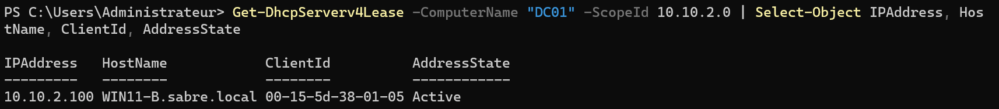
</details>

---

# 3. Preuves et clôtures

## <a id="validation-de-bout-en-bout"></a>Validation de bout en bout

| Domaine        | Vérification                              | Attendu                                  | Preuve                                                                                                                                |
| -------------- | ----------------------------------------- | ---------------------------------------- | ------------------------------------------------------------------------------------------------------------------------------------- |
| Routage        | `Get-NetIPConfiguration` RTR + forwarding | deux cartes routantes, sans passerelle   | [P-01](#p-01)                                                                                                                         |
| Réplication AD | `repadmin /replsummary`                   | 0 échec sur toutes les partitions        | [P-02](#p-02)                                                                                                                         |
| DNS inter-site | `Resolve-DnsName DC01 -Server 10.10.2.10` | résolution croisée SITE1↔SITE2           | [P-02](#p-02) |
| Sites & Serv.  | `Get-ADReplicationSite` / sous-réseaux + `nltest` sur WIN11-B | sites déclarés, client d'Utica servi par DC02 | [P-03](#p-03) |
| DHCP relayé    | bail WIN11-B via `10.10.1.10`             | `10.10.2.100` *Active*                   | [P-04](#p-04)                                                                                                                         |
| Break/Fix      | famine DHCP SITE2, témoin WIN11-A         | WIN11-B en APIPA, WIN11-A reçoit un bail | [BF-03](./BREAKFIX.md#bf-03) · [BF-04](./BREAKFIX.md#bf-04) |

## <a id="registre-derreurs--dette-technique"></a>Registre d'erreurs & dette technique

| ID   | Point                                                                                                   | Gravité | Domaine       | Statut                                                              |
| ---- | ------------------------------------------------------------------------------------------------------- | ------- | ------------- | ------------------------------------------------------------------- |
| L-01 | Option DHCP 003 (routeur) absente du scope SITE1, héritée du réseau isolé N1-N2                         | 🟠      | DHCP          | ✅ soldée pendant le Break/Fix ([BF-19](./BREAKFIX.md#bf-19))       |
| L-02 | Agent de relais DHCP non administrable proprement : console RRAS verrouillée en RoutingOnly, aucune cmdlet | 🟠   | RRAS / DHCP   | 📋 limite lab, workaround `netsh` ([BF-17](./BREAKFIX.md#bf-17))    |
| L-03 | Course au démarrage : RTR doit router avant que les DC ne répliquent, sinon 8524 au boot froid          | 🟠      | Réplication   | ✅ mitigée : ordre de démarrage + tâche `Repl-SyncAll-Startup` ([BF-08](./BREAKFIX.md#bf-08)) |
| L-04 | Plant Stamford : site + sous-réseau + lien orphelins posés exprès                                       | 🟢      | Sites & Serv. | 🔜 N7 (décommissionnement = payoff d'hygiène de topologie)          |
| L-05 | Règle ICMP entrante activée à la main sur RTR pour fiabiliser les tests, pas encore généralisée         | 🟢      | Pare-feu      | 🔜 N5 (à pousser par GPO, [BF-09](./BREAKFIX.md#bf-09))             |
| L-06 | DNS client de DC01 non passé en « partenaire puis loopback » : geste absent du plan de renumérotage (suite de N1 L-02) | 🟠 | DNS | ✅ corrigé en N4 (`10.10.2.10, 127.0.0.1`, N4 L-06) |

---

⬆️ [Sommaire](#sommaire) · [README de l'épisode](./README.md) · [Vue d'ensemble](../../README.md) · 🔧 **[Break/Fix N3 →](./BREAKFIX.md)** · **Suivant → [Workflow N4](../N4/WORKFLOW.md)**, les services de fichiers répartis entre Scranton et Utica s'appuient sur ce routage et cette réplication.
