# Épisode N4 : Break/Fix

**Concepts clés** : SMB/NTFS · AGDLP · DFS Namespace · DFS-R · FSRM · serveur d'impression + GPO

- 🎬 **Saison 1 · Épisode N4**
- 🖥️ **Stack** : Windows Server 2025 (SRV-FILE, DC01, DC02) · Windows 11 Enterprise (WIN11-A, WIN11-B) · Hyper-V
- 🗺️ Adressage (IP / DNS / passerelle / vSwitch) → [IPAM](../../IPAM.md)
- 🎭 Annuaire de démo (OU, groupes, comptes, nommage...) → [ABOUT DUNDER MIFFLAD](../../ABOUT_DUNDER_MIFFLAD.md)
- 📄 Présentation de l'épisode → [README N4](./README.md)
- 📝 Progression étape par étape → [WORKFLOW N4](./WORKFLOW.md)

## Sommaire

**1. Mission panne (délibérée)**

- [Mission panne : coupure SYSVOL / DFS-R](#mission-panne)
- [Mission panne (annexe) : conflit d'écriture DFS-R](#mission-panne-conflit)

**2. Dépannage (incidents accidentels)**

- [Incidents de session](#dépannage-incidents-de-session)
- [Incidents marquants](#incidents-marquants)
	- [Le doublon RG-Demo (CNF:)](#cnf)
	- [Le déploiement d'imprimante à cinq couches](#print)
	- [Clôture DFS-R](#cloture-dfsr)

---

# 1. Mission panne (délibérée)

## <a id="mission-panne"></a>Mission panne : coupure SYSVOL / DFS-R

> 🎥 **Storyline :** *Toby publie le règlement intérieur mis à jour (une GPO). DC01 l'a, Utica ne l'a jamais reçu et travaille encore sur l'ancienne version.*

**Ce que cette panne démontre :** SYSVOL (répliqué par DFS-R) et la base AD (`ntds.dit`, répliquée par le moteur AD) sont deux mécanismes distincts, avec deux outils de diagnostic distincts. `repadmin` peut afficher une réplication AD parfaitement saine pendant que les GPO n'arrivent plus, parce que le contenu SYSVOL est figé.

### 1.0 Ligne de base

Une GPO de bannière légale (`legalnoticecaption` / `legalnoticetext`) est créée sur DC01, liée au domaine, et sa version est alignée des deux côtés avant de casser quoi que ce soit. C'est le point de départ sain qui rend la panne lisible.

```powershell
New-GPO -Name "SYSVOL-Mission-Reglement" -Comment "Mission N4 SYSVOL/DFS-R"

Set-GPRegistryValue `
    -Name "SYSVOL-Mission-Reglement" `
    -Key "HKLM\Software\Microsoft\Windows\CurrentVersion\Policies\System" `
    -ValueName "legalnoticetext" `
    -Type String `
    -Value "Version 1 - texte initial"

New-GPLink -Name "SYSVOL-Mission-Reglement" -Target "DC=sabre,DC=local" -LinkEnabled Yes
```

<details><summary><a id="bf-01"></a>📷 Preuve BF-01 · ligne de base saine</summary>

**BF-01** : sur DC01, `DSVersion` et `SysvolVersion` alignées (2 / 2), la GPO est cohérente avant l'injection.
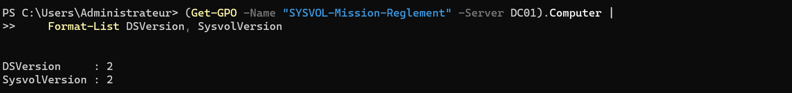
</details>

### 1.1 Injection (délibérée)

**Ce que je casse, exprès :** j'arrête le service DFS Replication sur DC02, ce qui fige la réplication SYSVOL de ce DC. Puis je modifie la GPO sur DC01 et je force la réplication AD pour bien montrer que la couche AD, elle, passe.

```powershell
# sur DC02 : figer la réplication SYSVOL
Stop-Service DFSR
```

```powershell
# sur DC01 : publier la version 2, puis pousser la réplication AD
Set-GPRegistryValue `
    -Name "SYSVOL-Mission-Reglement" `
    -Key "HKLM\Software\Microsoft\Windows\CurrentVersion\Policies\System" `
    -ValueName "legalnoticetext" `
    -Type String `
    -Value "Version 2 - reglement mis a jour"

repadmin /replicate DC02 DC01 "DC=sabre,DC=local"
```

<details><summary><a id="bf-02"></a>📷 Preuve BF-02 · état cassé</summary>

**BF-02** : service DFSR arrêté sur DC02 *(état cassé, mission panne)*.
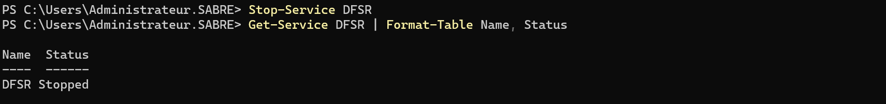
</details>

### <a id="mp-impact"></a>1.2 Impact : ce que la panne casse pour un utilisateur

Karen (`kfilippelli`) travaille sur WIN11-B à Utica, donc elle s'authentifie sur DC02. Son opération réelle : elle rafraîchit ses stratégies et rouvre sa session pour voir la bannière du règlement. Elle voit l'ancienne version, alors que le texte a changé côté corporate.

**Opération tentée :** `gpupdate /force` puis réouverture de session sur WIN11-B.

```
gpupdate /force
# puis logoff, la bannière affichée reste l'ancienne
```

**Résultat observé (panne active) :** la stratégie appliquée sur le poste de Karen reste en version 1. La mise à jour de Toby n'atteint pas Utica.

<details><summary><a id="bf-03"></a>📷 Preuve BF-03 · impact utilisateur</summary>

**BF-03** : sur WIN11-B, session Karen, après `gpupdate /force`, `legalnoticetext` vaut encore `Version 1 - texte initial` alors que la version 2 est publiée sur DC01 *(impact pendant la panne)*. L'écran de connexion en version 1 n'a pas été photographié ; la bannière à l'écran est montrée après réparation (BF-10).
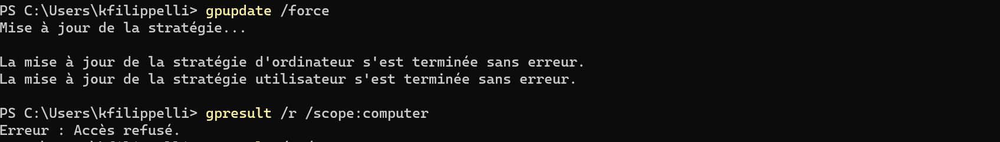
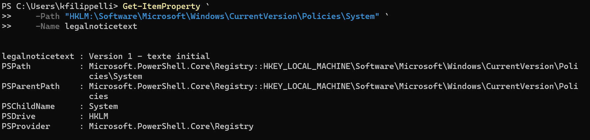

> 📌 **Note : `gpresult` refusé à Karen.** `gpresult /r /scope:computer` renvoie « Accès refusé » en session utilisateur standard : lire la stratégie ordinateur demande des droits d'administration locale. C'est le comportement attendu, et c'est pourquoi l'impact se lit ici dans le registre du poste.
</details>

### <a id="mp-symptome"></a>1.3 Symptôme observé

Côté admin, sur DC02, la GPO présente un écart de versions : la partie AD de la stratégie (`DSVersion`) a bien avancé à 3, mais la partie SYSVOL (`SysvolVersion`) est restée à 2. Le contenu de la stratégie n'a pas suivi son enregistrement dans l'annuaire.

```powershell
(Get-GPO -Name "SYSVOL-Mission-Reglement" -Server DC02).Computer |
    Format-List DSVersion, SysvolVersion
```

<details><summary><a id="bf-04"></a>📷 Preuve BF-04 · symptôme</summary>

**BF-04** : sur DC02, `DSVersion 3` face à `SysvolVersion 2` : l'annuaire a la nouvelle version, le SYSVOL non.
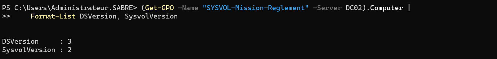
</details>

### 1.4 Diagnostic

La démarche consiste à éliminer d'abord la piste la plus évidente, la réplication AD, puis à comprendre pourquoi l'outil canonique de SYSVOL ment lui aussi.

Première sonde, `repadmin /replsummary` : zéro échec. C'est la fausse piste centrale de la mission. Si je m'arrêtais là, je conclurais à tort que tout va bien.

Deuxième sonde, `dcdiag /test:sysvolcheck` sur DC02 : vert également. Piège plus subtil, ce test vérifie que le partage SYSVOL est publié, pas que son contenu est à jour.

C'est l'écart `DSVersion` / `SysvolVersion` qui discrimine, confirmé par le journal DFS Replication et par l'état du service.

```powershell
repadmin /replsummary                     # AD : zéro échec (fausse piste)
dcdiag /test:sysvolcheck /s:DC02          # partage publié : vert (fausse piste)
Get-Service DFSR                          # sur DC02 : Stopped (cause probable)
Get-WinEvent -LogName "DFS Replication" -MaxEvents 15   # arrêt puis reprise
```

<details><summary><a id="bf-05"></a><a id="bf-06"></a><a id="bf-07"></a>📷 Preuves BF-05 → BF-07 · diagnostic</summary>

**BF-05** : `repadmin /replsummary` sans aucun échec : la réplication AD est saine pendant que SYSVOL est cassé.
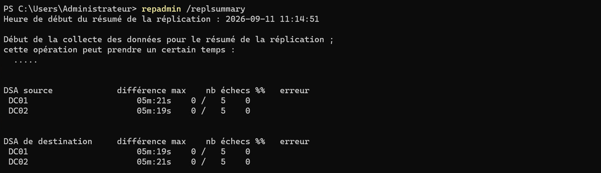

**BF-06** : `dcdiag /test:sysvolcheck` réussi sur DC02 : le partage est publié, ce qui ne dit rien de la fraîcheur du contenu.
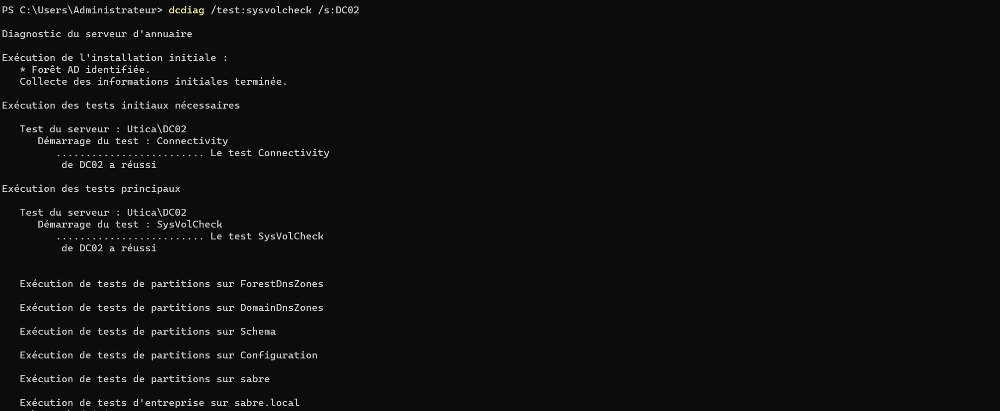

**BF-07** : journal DFS Replication : arrêt (5002 puis 5014) et, plus tard, reprise (2002 / 3006 / 4010 / 1004).
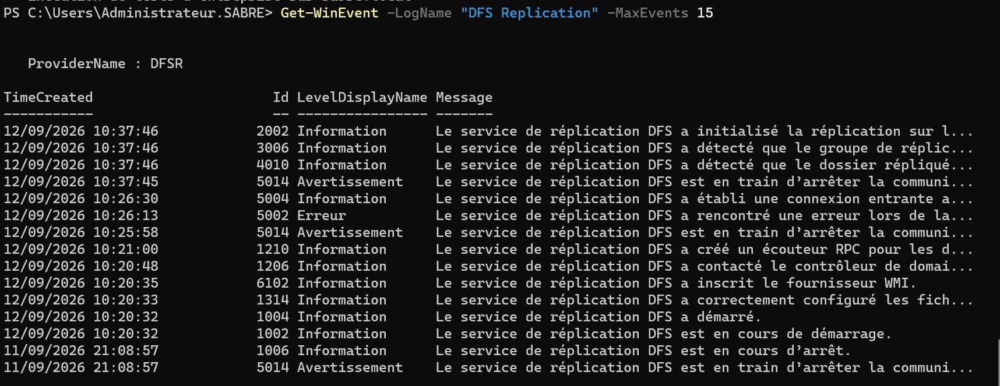
</details>

### 1.5 Cause racine

Le service DFS Replication arrêté sur DC02 fige le SYSVOL de ce contrôleur. La modification de la GPO a bien traversé la réplication AD (d'où `DSVersion 3`), mais son fichier de contenu, transporté par DFS-R dans SYSVOL, n'a pas pu se répliquer (`SysvolVersion 2`). Deux moteurs, deux vitesses, un seul en panne.

### 1.6 Réparation

**Un geste :** redémarrer DFS Replication sur DC02. Le service reprend son rattrapage et le contenu SYSVOL converge, `SysvolVersion` rejoint `DSVersion`.

```powershell
Start-Service DFSR
```

<details><summary><a id="bf-08"></a>📷 Preuve BF-08 · état réparé</summary>

**BF-08** : service DFSR redémarré sur DC02, événements de reprise dans le journal *(après restauration)*.
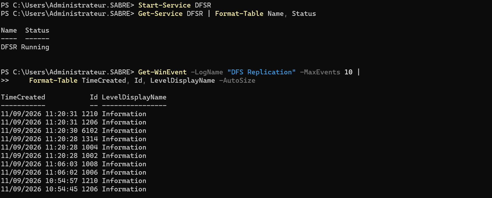
</details>

### <a id="mp-validation"></a>1.7 Validation en miroir

Je re-tente l'opération réelle du temps 1.2 : Karen rafraîchit ses stratégies et rouvre sa session. Cette fois, elle voit la version à jour. La panne rendait la bannière périmée, la réparation lui rend la bonne.

**Opération re-tentée :** `gpupdate /force` puis réouverture de session sur WIN11-B.

**Résultat observé (après réparation) :** la bannière affichée est la version 2, et les versions de la GPO sont réalignées sur DC02.

<details><summary><a id="bf-09"></a><a id="bf-10"></a><a id="bf-11"></a>📷 Preuves BF-09 → BF-11 · validation miroir</summary>

**BF-09** : sur DC02, `DSVersion 3` et `SysvolVersion 3` réalignées.
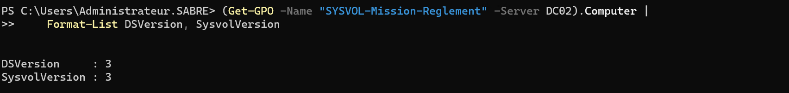

**BF-10** : l'opération utilisateur qui donnait l'ancien texte donne maintenant le bon : bannière version 2 à l'écran de session de Karen.
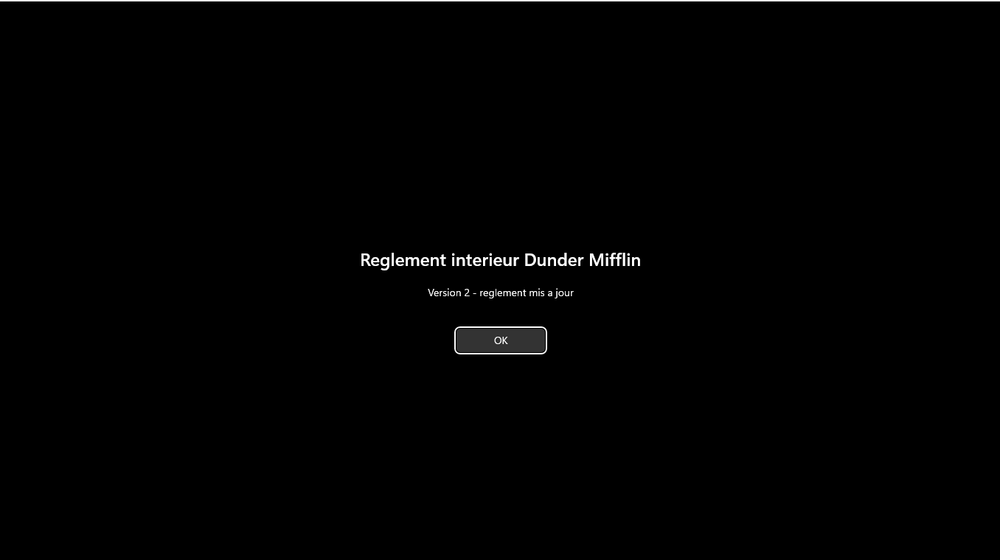

**BF-11** : côté client, la valeur appliquée est passée en version 2.
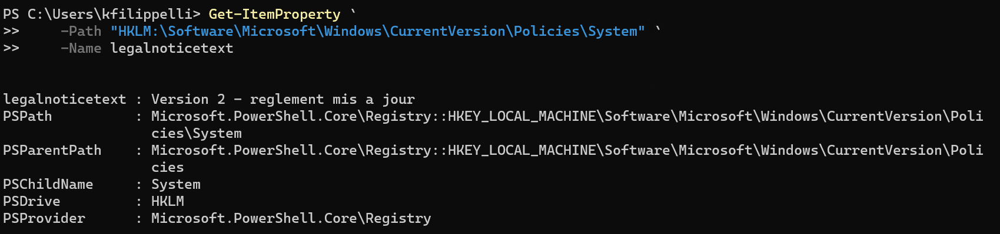
</details>

### 1.8 Leçon transférable

Devant une GPO qui n'arrive pas sur un site, je ne me fie plus à `repadmin` seul. Je sais désormais distinguer à l'aveugle une panne SYSVOL d'une panne de réplication AD : je lis `DSVersion` contre `SysvolVersion`, et je vérifie l'état de DFS Replication. `dcdiag /test:sysvolcheck` me confirme qu'un partage est publié, jamais que son contenu est frais.

---

## <a id="mission-panne-conflit"></a>Mission panne (annexe) : conflit d'écriture DFS-R

> 🎥 **Storyline :** *Pendant une coupure entre Scranton et Utica, chaque site crée un document portant le même nom. À la reprise, il faut savoir lequel gagne et où est passé l'autre.*

**Ce que cette panne démontre :** DFS-R résout un conflit par « dernier écrivain gagne », mais la version perdante n'est pas détruite, elle est mise de côté dans `ConflictAndDeleted`. Un fichier créé indépendamment de chaque côté pendant la coupure produit un `NameConflict`, distinct d'un `ConflictLoser`. Et surtout : DFS-R n'est pas une sauvegarde.

### Injection, conflit, résolution

```powershell
# couper la réplication dans les deux sens
Set-DfsrConnection `
    -GroupName "RG-Demo" `
    -SourceComputerName "SRV-FILE" `
    -DestinationComputerName "DC02" `
    -DisableConnection $true

Update-DfsrConfigurationFromAD SRV-FILE,DC02
```

Pendant la coupure, un `conflit.txt` est créé indépendamment de chaque côté, DC02 en dernier : c'est un conflit de **nom**, pas de mise à jour. Puis la connexion est réactivée (`-DisableConnection $false`) et DFS-R tranche.

<details><summary><a id="bf-12"></a><a id="bf-13"></a><a id="bf-14"></a><a id="bf-15"></a>📷 Preuves BF-12 → BF-15 · conflit DFS-R</summary>

**BF-12** : liaison DFS-R coupée volontairement *(injection)*.
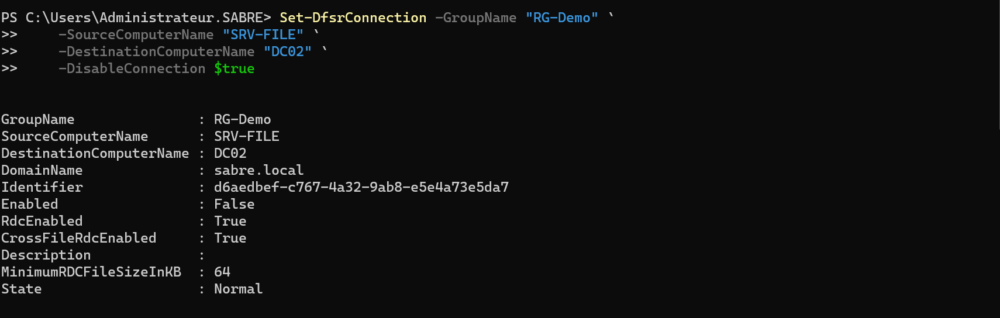

**BF-13** : un `conflit.txt` de chaque côté, contenus et horodatages différents.
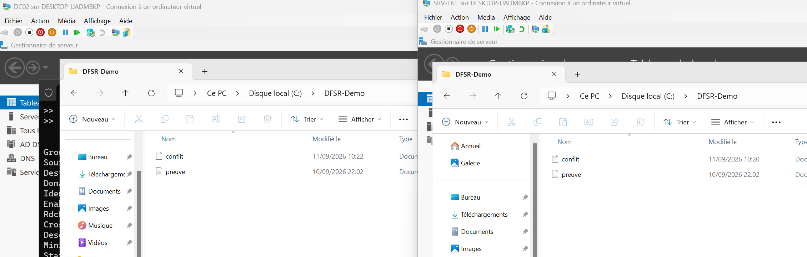

**BF-14** : après reprise, `Get-Content conflit.txt` renvoie la version de DC02, le dernier écrivain.
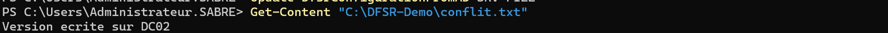

**BF-15** : `Get-DfsrPreservedFiles` : la version perdante (celle de SRV-FILE) est préservée, `PreservedReason: NameConflict`.
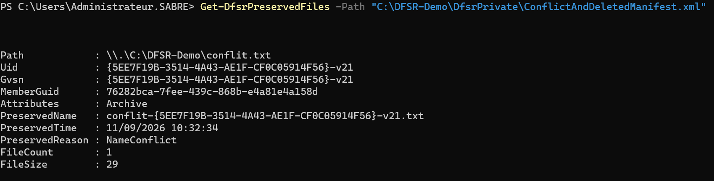
</details>

**Leçon transférable :** une réplication multi-maître n'arbitre pas le fond, elle applique une règle mécanique (le dernier écrit gagne). La version écrasée n'est récupérable que parce que DFS-R la met de côté dans `ConflictAndDeleted`, un dossier limité en taille qui purge ses plus anciens éléments. Une suppression, elle, se réplique partout : récupérable un temps, sans aucune garantie. DFS-R n'est pas une sauvegarde.

---

# 2. Dépannage (incidents accidentels)

## <a id="dépannage-incidents-de-session"></a>Incidents de session

> Incidents **accidentels** rencontrés et corrigés dans la même session, distincts de la mission panne délibérée (§1). Les dettes restées ouvertes vivent au [WORKFLOW § Registre](./WORKFLOW.md#registre-derreurs--dette-technique).

| #   | Symptôme                                                                                                                                                                           | Cause                                                                                                                                                                                                                        | Diagnostic                                                                                                                                                                                                                                                                      | Correctif                                                                                                                                                                    |
| --- | ---------------------------------------------------------------------------------------------------------------------------------------------------------------------------------- | ---------------------------------------------------------------------------------------------------------------------------------------------------------------------------------------------------------------------------- | ------------------------------------------------------------------------------------------------------------------------------------------------------------------------------------------------------------------------------------------------------------------------------- | ---------------------------------------------------------------------------------------------------------------------------------------------------------------------------- |
| 1   | Deux groupes `RG-Demo` coexistent, les commandes `-GroupName` frappent au hasard ; réplication DC02 inerte                                                                         | Objet de conflit AD (`CNF:`) né d'une recréation de RG-Demo avant convergence de la réplication AD, plus un membership DC02 sans `ContentPath`                                                                               | `Get-DfsReplicationGroup` (deux résultats), `Get-DfsrMembership` (ContentPath vide), journal (4114 en boucle)                                                                                                                                                                   | Opérer par `Identifier` (GUID), teardown complet (`Remove-DfsReplicatedFolder` avant le groupe), `repadmin /syncall /AdeP`, reconstruction propre                            |
| 2   | Après déploiement, l'imprimante n'arrive sur aucun poste, puis l'installation du pilote échoue côté client                                                                         | Cinq obstacles empilés (ciblage, contexte de session, pilote, `Set-Printer`, Point and Print), chacun masquant le suivant                                                                                                    | isolation d'une variable à la fois, développée ci-dessous                                                                                                                                                                                                                       | correction couche par couche, développée ci-dessous                                                                                                                          |
| 3   | Angela ne peut plus **ouvrir** le partage Compta (« Windows ne peut pas accéder à \\SRV-FILE\Compta »), lecture comme écriture, alors que le Deny ne devait bloquer que l'écriture | Le Deny posé via `icacls (W)` est un masque large qui inclut `Synchronize` (droit d'ouvrir un handle sur l'objet) ; Deny > Allow s'appliquant droit par droit, le refus de Synchronize casse aussi l'ouverture et la lecture | `Get-Acl` montre `Write, Synchronize / Deny` ; `Get-ChildItem` côté Angela échoue en `UnauthorizedAccessException` même en lecture seule ; l'écriture rétablie après un précédent `/remove:d` (P-12) prouve que l'Allow Modify du DL est intact, donc seul le Deny est en cause | Reposer un Deny **granulaire** `(WD,AD,WEA,WA)` sans Synchronize ; relire l'ACL pour confirmer l'absence de Synchronize ; lecture rétablie, écriture toujours refusée (P-11) |
| 4   | Revue pré-publication : `Config-PointAndPrint` supprime l'invite d'élévation **sans** limiter les serveurs (« …que sur ces serveurs » : Désactivé) ; la liste `SRV-FILE.sabre.local` est saisie mais ignorée | Case de restriction laissée décochée lors de la configuration initiale | Rapport GPMC, onglet *Paramètres* ([BF-24](#bf-24)) | Case cochée, liste réduite à `SRV-FILE.sabre.local`, `gpupdate` + redémarrage, test Angela ([BF-25](#bf-25) · [BF-26](#bf-26)) |

**Commandes de diagnostic de référence :**

```powershell
Get-DfsReplicationGroup | Format-Table GroupName, Identifier
Get-DfsrMembership -GroupName "RG-Demo"
dfsrdiag backlog /rgname:"RG-Demo" /rfname:"RF-Demo" /smem:SRV-FILE /rmem:DC02
gpresult /r /scope:computer
Get-WinEvent -LogName "Microsoft-Windows-GroupPolicy/Operational" -MaxEvents 20
```

## <a id="incidents-marquants"></a>Incidents marquants

> Résumé des incidents accidentels rencontrés pendant la construction de l'épisode, par opposition aux missions panne injectées volontairement. Chacun a été diagnostiqué jusqu'à la cause racine et traité dans la session.

### <a id="cnf"></a> 1) Un nom n'est pas un identifiant : le doublon RG-Demo (CNF:)

**Symptôme.** Après une première tentative de montage, `Get-DfsReplicationGroup` renvoie deux objets nommés `RG-Demo`, dont un au nom tronqué. Tant que l'objet CNF existe, toute commande qui passe par `-GroupName "RG-Demo"` est ambiguë : elle peut viser le vrai groupe ou le fantôme.

**Fausses pistes écartées.** Le premier réflexe, croire à une simple latence, est démenti : DC02 est bien inscrit dans le groupe de réplication, mais aucun dossier local ne lui est attribué (`ContentPath` vide). Il n'a nulle part où écrire. La réplication ne traîne pas, elle ne démarre jamais.

La seconde hypothèse, un problème réseau, est écartée par la mesure locale : sur DC02, `dfsrdiag backlog` répond, le service DFS-R vit. L'échec de `Get-DfsrBacklog` venait du canal d'administration à distance (WinRM entre sous-réseaux, dette L-03), pas de la réplication.

**Cause racine.** Le second `RG-Demo` porte le préfixe `CNF:` : c'est un objet de conflit AD, né d'une recréation du groupe avant que la réplication AD DC01↔DC02 n'ait convergé. Un nom n'est pas un identifiant unique.

**Réparation.** Désambiguïser et opérer par `Identifier` (GUID), démolir dans le bon ordre (le dossier répliqué avant le groupe), forcer `repadmin /syncall /AdeP`, puis reconstruire proprement.

<details><summary><a id="bf-16"></a><a id="bf-17"></a><a id="bf-18"></a><a id="bf-19"></a>📷 Preuves BF-16 → BF-19 · doublon RG-Demo (CNF:)</summary>

**BF-16** : l'objet de conflit AD, préfixe `CNF:` sur un second `RG-Demo`.
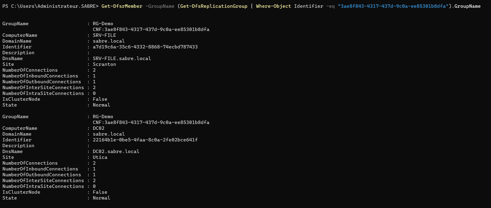

**BF-17** : deux `RG-Demo` listés côte à côte, source de la non-détermination.
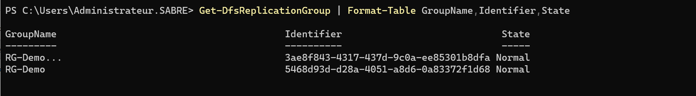

**BF-18** : membership DC02 sans `ContentPath` : réplication inerte, pas en retard.
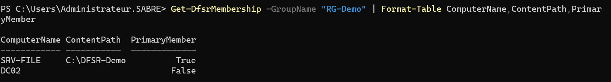

**BF-19** : après teardown et reconstruction, `dfsrdiag backlog` confirme « dc02 synchronisé avec srv-file ».
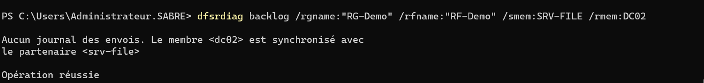
</details>

### <a id="print"></a> 2) Une variable à la fois : le déploiement d'imprimante à cinq couches

Le déploiement de l'imprimante a buté sur cinq obstacles empilés, chacun masquant le suivant.

Ce qui a fini par payer n'est pas de les connaître tous, c'est la discipline d'en isoler un seul à la fois et de ne jamais changer deux choses avant de retester.

**Couche 1, le ciblage.** La préférence d'imprimante vit en Configuration utilisateur, mais la GPO était liée à `OU=Workstations`, qui ne contient que des ordinateurs. Une préférence utilisateur sur une OU de machines ne s'applique à personne. 

`gpresult` montrait pourtant la GPO reçue et le journal `GroupPolicy/Operational` l'extension Printers traitée, ce qui a d'abord brouillé la piste. 

Correctif : relier la GPO aux OU métier `Accounting` et `Management`, retirer le lien sur Workstations.

<details><summary><a id="bf-20"></a>📷 Preuve BF-20 · ciblage erroné puis corrigé</summary>

**BF-20** : la GPO liée à `OU=Workstations` (préférence utilisateur sur une OU de machines, elle ne touchait personne)
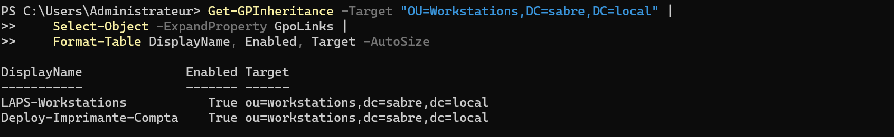

Relink ensuite vers `Accounting` et `Management`
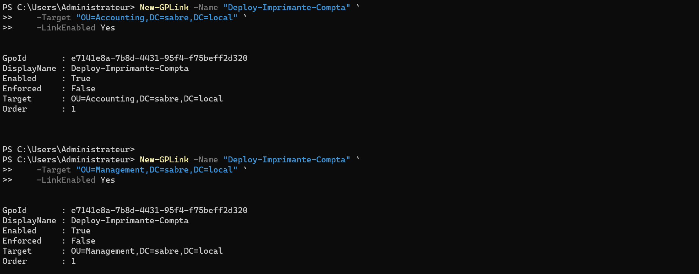

Puis lien Workstations retiré.
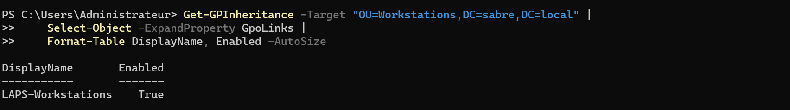
</details>

**Couche 2, le contexte de session.** Le test client ne montrait rien, mais la session VMConnect en mode amélioré redirige les imprimantes, ce qui faussait l'observation. 

Repasser WIN11-A en session basique a levé ce faux négatif.

<details><summary><a id="bf-21"></a>📷 Preuve BF-21 · faux négatif de session</summary>

**BF-21** : côté client, aucune imprimante visible, mais la capture est prise sur une session redirigée qui masquait le résultat réel.
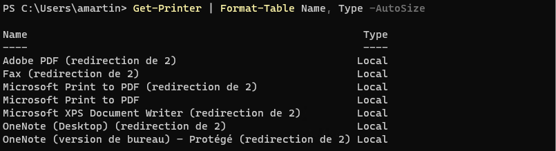
</details>

**Couche 3, le pilote.** `Add-Printer` refusait le pilote IPP/enhanced avec `0x80070bce` : ce pilote ne se déploie pas dans ce contexte.

<details><summary><a id="bf-22"></a>📷 Preuve BF-22 · pilote non déployable</summary>

**BF-22** : `Add-Printer` refusé `0x80070bce` sur le pilote initial, avant bascule.
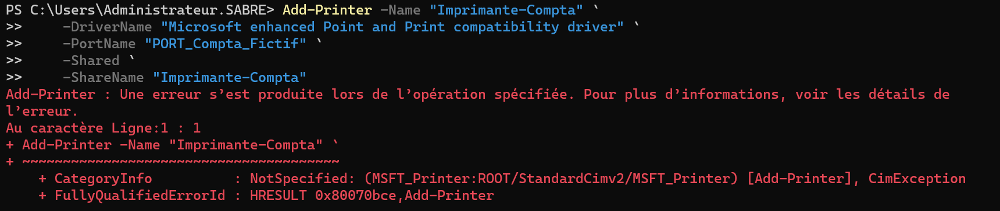
</details>

**Couche 4, `Set-Printer` contourné.** Basculer le pilote côté serveur a buté sur `Set-Printer 0x80070032`. La sortie propre a été de supprimer puis recréer l'imprimante directement avec `Generic / Text Only`. Piège hérité : la recréation réinitialise le descripteur de sécurité, il a fallu re-poser l'ACL (voir [WORKFLOW P-29](./WORKFLOW.md#p-29)).

<details><summary><a id="bf-23"></a>📷 Preuve BF-23 · recréation avec Generic / Text Only</summary>

**BF-23** : `Add-PrinterDriver Generic / Text Only` accepté, `Set-Printer` encore refusé `0x80070032`, d'où la recréation directe de l'imprimante sur le bon pilote.
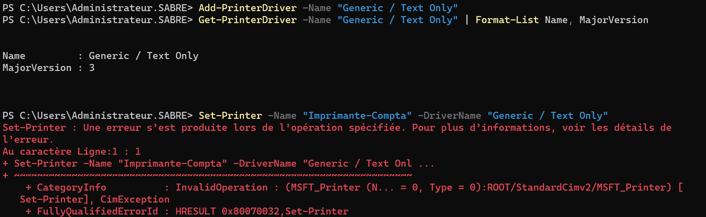
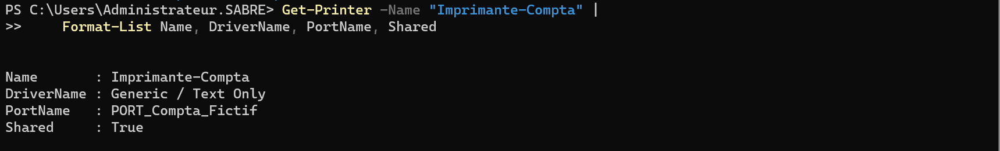
</details>

**Couche 5, Point and Print.** Avec le bon pilote, le téléchargement passait enfin, mais Angela butait sur `0x800702e4` (`ERROR_ELEVATION_REQUIRED`). Depuis les correctifs PrintNightmare (2021), Windows exige une élévation pour installer un pilote d'imprimante, même depuis un serveur légitime.

Correctif : la GPO `Config-PointAndPrint`, avec deux réglages complémentaires. **Restrictions Pointer et imprimer** supprime l'invite d'élévation pour les pilotes classiques ; **Package Point and Print - Serveurs approuvés** déclare `SRV-FILE.sabre.local` pour les pilotes « package ». Après redémarrage du poste, Angela installe l'imprimante sans erreur ([P-30](./WORKFLOW.md#p-30)), et Jim reste bloqué dès la connexion ([P-31](./WORKFLOW.md#p-31)).

Arbitrage assumé : supprimer l'invite d'élévation affaiblit la protection PrintNightmare. Ça ne se fait qu'en limitant les postes aux serveurs approuvés, et SRV-FILE doit alors être durci (dette L-05, tiering N5).

> 🔎 **Trouvé en relecture.** La première configuration supprimait l'invite sans activer la restriction aux serveurs listés : la protection annoncée n'existait pas. L'écart a été repéré en relisant le rapport de la GPO avant publication, puis corrigé et vérifié sur le poste ([incident 4](#dépannage-incidents-de-session)).

<details><summary><a id="bf-24"></a><a id="bf-25"></a><a id="bf-26"></a>📷 Preuves BF-24 → BF-26 · Point and Print, avant / après</summary>

**BF-24** : état trouvé en revue : invites d'élévation supprimées, restriction aux serveurs listés **désactivée**. Tout serveur d'impression pouvait pousser un pilote sans invite. *(avant correction)*
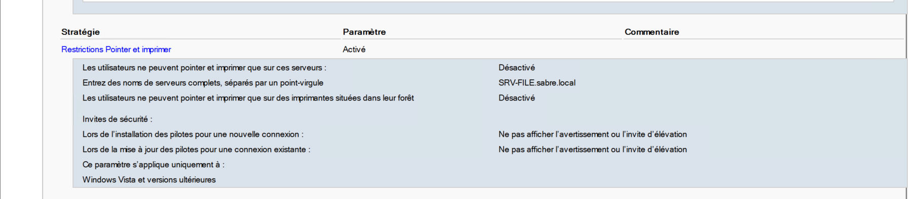

**BF-25** : restriction activée, `SRV-FILE.sabre.local` seul serveur autorisé. *(après correction, vue GPO)*
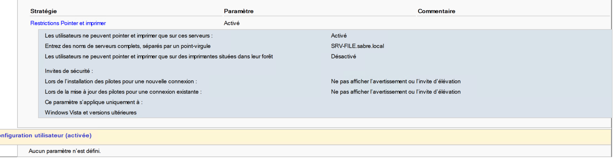

**BF-26** : sur WIN11-A, en session Angela (utilisatrice standard), après redémarrage : la GPO est appliquée au poste (`Restricted = 1`, `TrustedServers = 1`, `ServerList = SRV-FILE.sabre.local`, invites supprimées : `NoWarningNoElevationOnInstall = 1`, `UpdatePromptSettings = 2`). La commande précédente, `Add-Printer -ConnectionName \\SRV-FILE\Imprimante-Compta`, est revenue sans erreur : le serveur autorisé passe toujours.
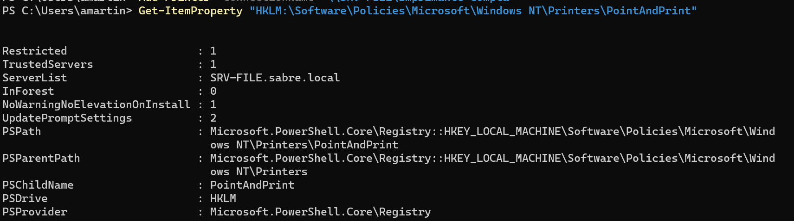

📌 La lecture de `HKLM\Software\Policies` fonctionne en session standard, là où `gpresult /scope:computer` était refusé à Karen (BF-03) : c'est le moyen le plus simple de vérifier une stratégie ordinateur sans droits d'administration.
</details>

**Leçon transférable.** Un problème d'impression est rarement une panne unique, c'est un oignon : il faut remonter les couches une par une (pilote, spouleur, droits, ciblage GPO, Point and Print).

### <a id="cloture-dfsr"></a> 3) Clôture DFS-R

En fin d'épisode, le groupe `RG-Demo` et son dossier répliqué sont décommissionnés : plus aucun groupe ni membership, dossiers supprimés sur disque, l'anti-pattern « fichiers sur DC02 » est retiré (commandes au [WORKFLOW Étape 6](./WORKFLOW.md#étape-6)).

<details><summary><a id="bf-27"></a>📷 Preuve BF-27 · décommissionnement RG-Demo</summary>

**BF-27** : `Get-DfsReplicationGroup` et `Get-DfsrMembership` vides, arborescence nettoyée.
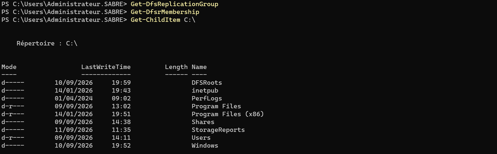
</details>

---

⬆️ [Sommaire](#sommaire) · 📄 **[← Workflow N4](./WORKFLOW.md)** · [README de l'épisode](./README.md) · [Vue d'ensemble](../../README.md) · **Suivant : Workflow N5 (à venir)**, sécurité et tiering : qui administre quoi, depuis quelle machine.
