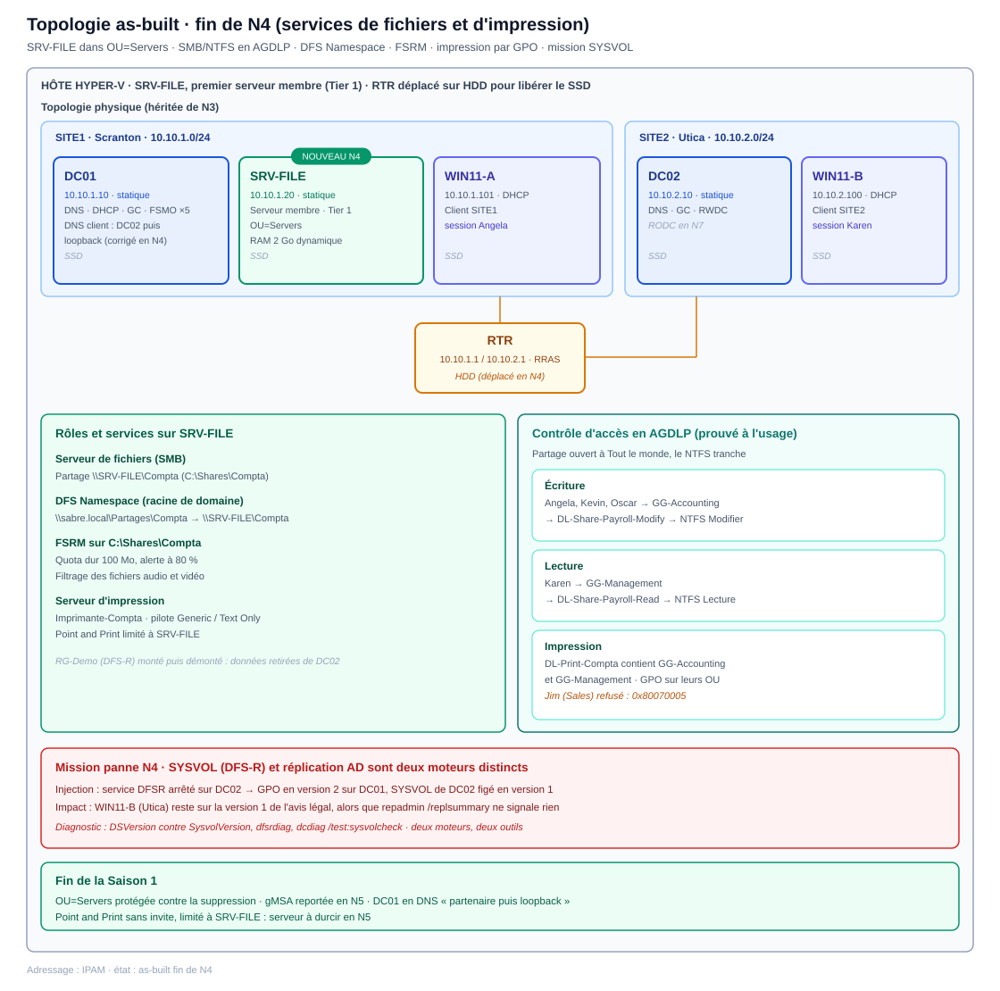

# Épisode N4 : Les services de fichiers

**Concepts clés** : SMB/NTFS · AGDLP · DFS Namespace · DFS-R · FSRM · serveur d'impression + GPO

- 🎬 **Saison 1 · Épisode N4**
- 🖥️ **Stack** : Windows Server 2025 (SRV-FILE, DC01, DC02) · Windows 11 Enterprise (WIN11-A, WIN11-B) · Hyper-V
- 🗺️ Adressage (IP / DNS / passerelle / vSwitch) → [IPAM](../../IPAM.md)
- 🎭 Annuaire de démo (OU, groupes, comptes, nommage...) → [ABOUT DUNDER MIFFLAD](../../ABOUT_DUNDER_MIFFLAD.md)
- 📝 Progression étape par étape → [WORKFLOW N4](./WORKFLOW.md)
- 🔧 Mission panne, dépannage & preuves Break/Fix → [BREAKFIX N4](./BREAKFIX.md)

> 🎥 **Storyline :** *Scranton et Utica travaillent enfin sur les mêmes dossiers, atteints par un chemin unique quel que soit le serveur, et l'imprimante du couloir devient accessible aux services qui en ont besoin.*

## Topologie 

## Objectif

N4 monte la couche services de fichiers par-dessus le réseau à deux sites de N3. 

Dans cet épisode, le but n'est pas d'empiler des partages, mais de prouver une chaîne d'accès complète et de savoir isoler la couche fautive quand la réplication qui la porte tombe.

Dans l'ordre on va : 

- Poser le premier serveur membre (SRV-FILE) et un partage géré par le modèle AGDLP, sur deux niveaux d'accès réels (Compta écrit, Management lit).
- Séparer le chemin logique (DFS Namespace) de la réplication de données (DFS-R), deux choses qu'on confond souvent.
- Poser les garde-fous d'un serveur de fichiers (quota et filtrage FSRM) et prouver qu'ils se déclenchent.
- Déployer une imprimante par GPO avec le même modèle d'accès qu'un partage.
- Casser la réplication SYSVOL pour prouver qu'elle est distincte de la réplication AD.

La suite (N5) s'appuiera sur SRV-FILE rangé dans son OU pour cibler les GPO serveur et poser le modèle en tiers.

## Principes de conception

1. **AGDLP strict, aucun droit posé en direct sur un compte :** La chaîne est toujours Compte → Groupe Global → Groupe Domain Local → Ressource. Sans le maillon Domain Local, chaque ressource devient un empilement de droits individuels impossible à auditer.

2. **Le partage SMB Compta reste ouvert à *Tout le monde* en Contrôle total, exprès.** Partage large et NTFS restrictif est un modèle courant en production (souvent restreint à *Utilisateurs authentifiés*). Ici, il sert surtout à neutraliser la couche partage pour que le NTFS soit la seule variable des démonstrations de permissions.

3. **En lab, DC02 porte temporairement le dossier répliqué DFS-R :** Anti-pattern assumé (les fichiers sont du Tier 1, un DC est du Tier 0), faute de place pour un second serveur de fichiers en VM chaude sur le SSD. Il est retiré en clôture d'épisode. En production : une VM SRV-FILE2 dédiée serait plus approprié. 

## Fil conducteur 

Hérité de N3 : le réseau inter-site routé (SITE1/SITE2) et une réplication AD saine.

Avant de poser SRV-FILE et DFS-R, j'ai vérifié cette réplication (`repadmin`), parce que DFS-R et la réplication SYSVOL empruntent exactement ces mêmes liens inter-site. 

Le décalage de démarrage RTR → DC identifié en N3 (erreurs 8524 au boot à froid) reste couvert par la tâche planifiée `Repl-SyncAll-Startup` posée à ce moment-là.

En enquêtant sur un nouveau 8524 au démarrage, j'ai aussi rattrapé un geste oublié au renumérotage de N3 : DC01 est passé en « partenaire puis loopback » (`10.10.2.10, 127.0.0.1`), comme le prévoit le plan d'adressage.

## Mission panne : cadrage

- **Incident simulé :** arrêt du service DFS Replication sur DC02, la réplication SYSVOL se fige pendant que la réplication AD continue.

- **Storyline :** Toby publie une mise à jour du règlement (une GPO de bannière légale). DC01 l'a, Utica ne l'a jamais reçue et reste sur l'ancienne version.

- **Ce que ça démontre :** SYSVOL (DFS-R) et la base AD (`ntds.dit`) sont deux moteurs de réplication distincts. `repadmin /replsummary` peut afficher zéro erreur pendant que les GPO n'arrivent plus. Le réflexe prouvé : lire `DSVersion` contre `SysvolVersion`, et ne jamais conclure sur un seul outil.

- **Mission annexe, conflit DFS-R :** deux fichiers du même nom créés de chaque côté pendant une coupure. DFS-R garde le dernier écrit et met l'autre de côté : une réplication n'est pas une sauvegarde.

- ➡️ Exécution & preuves : [BREAKFIX N4 § Mission panne](./BREAKFIX.md#mission-panne) · [annexe](./BREAKFIX.md#mission-panne-conflit)

## Couverture compétences

| Compétence           | Démonstration                                                           |
| -------------------- | ----------------------------------------------------------------------- |
| SMB / NTFS           | AGDLP deux niveaux, Share ∩ NTFS, Deny > Allow, jeton d'accès           |
| Serveur d'impression | rôle Print, déploiement GPP, AGDLP imprimante, contrôle négatif         |
| GPO                  | déploiement GPP + dépendance GPO ↔ réplication SYSVOL                   |
| DFS-R                | RG-Demo jetable, conflit d'écriture, coupure SYSVOL                     |
| FSRM                 | quota dur + seuil d'alerte, filtrage de fichiers, déclenchement observé |
| DFS Namespace        | `\\sabre.local\Partages\Compta` atteint des deux sites                  |

## Limites de l'épisode

- 📋 gMSA laissé hors périmètre : pertinent mais indissociable du modèle en tiers, il arrive en N5.

- 📋 Pas de second serveur de fichiers. L'idée d'avoir une redondance permanente derrière Compta serait une décision d'architecture, pas seulement un effet de bord. SRV-FILE2 écarté par manque de place sur le SSD, l'anti-pattern DC-porte-les-fichiers est retiré en fin d'épisode.

- 📋 Point and Print autorisé sans invite d'élévation, limité à `SRV-FILE` : le risque PrintNightmare est borné à ce serveur, qui devra être durci en N5. La première configuration ne posait pas cette limite ; l'écart a été trouvé en relisant le rapport de la GPO avant publication, puis corrigé.

- ⚠️ DFS Namespace monté et prouvé à l'usage (accès des deux sites), mais non cassé dans cet épisode.

> Dette opérationnelle complète (IDs, gravité, statut) : [WORKFLOW N4 § Registre d'erreurs & dette technique](./WORKFLOW.md#registre-derreurs--dette-technique)

## Conclusion

Ce que j'ai retenu de N4 n'est pas d'avoir monté un partage et une imprimante, c'est d'avoir vu qu'une même chaîne d'accès traverse plusieurs couches empilées : partage, NTFS, appartenance de groupes, réplication.

Diagnostiquer, c'est isoler laquelle a lâché. Le partage grand ouvert m'a appris à neutraliser une couche pour observer l'autre proprement.

La mission SYSVOL m'a donné un réflexe précis : devant une GPO qui n'arrive pas, je ne regarde pas la GPO d'abord, je demande quel moteur de réplication la transporte, et je vérifie SYSVOL séparément de la base AD.

---

⬅️ [N3 : Réseau entreprise](../N3/README.md) · ⬆️ [Vue d'ensemble](../../README.md) · 🔁 [Workflow N4](./WORKFLOW.md) · 🔧 [Break/Fix N4](./BREAKFIX.md) · **Suivant : N5 : Sécurité & tiering (à venir)** : le modèle en tiers, les PAW et le durcissement par baselines, autrement dit qui a le droit d'administrer quoi et depuis quelle machine.
