# Épisode N4 : Workflow

**Concepts clés** : SMB/NTFS · AGDLP · DFS Namespace · DFS-R · FSRM · serveur d'impression + GPO

- 🎬 **Saison 1 · Épisode N4**
- 🖥️ **Stack** : Windows Server 2025 (SRV-FILE, DC01, DC02) · Windows 11 Enterprise (WIN11-A, WIN11-B) · Hyper-V
- 🗺️ Adressage (IP / DNS / passerelle / vSwitch) → [IPAM](../../IPAM.md)
- 🎭 Annuaire de démo (OU, groupes, comptes, nommage...) → [ABOUT DUNDER MIFFLAD](../../ABOUT_DUNDER_MIFFLAD.md)
- 📄 Présentation de l'épisode → [README N4](./README.md)
- 🔧 Mission panne, dépannage & preuves Break/Fix → [BREAKFIX N4](./BREAKFIX.md)

## Sommaire

**1. Cadrage**

- [Composants & rôles](#composants--rôles)
- [Topologie logique AD (delta N4)](#ad-logique)

**2. Étapes de configuration**

- [Étape 1 : SRV-FILE, de la coquille au domaine](#étape-1)
- [Étape 2 : Rôle Serveur de fichiers + partage Compta](#étape-2)
- [Étape 3 : AGDLP niveau écriture (Compta)](#étape-3)
- [Étape 4 : AGDLP niveau lecture (Management)](#étape-4)
- [Étape 5 : DFS Namespace](#étape-5)
- [Étape 6 : DFS-R (réplication de données)](#étape-6)
- [Étape 7 : FSRM quota](#étape-7)
- [Étape 8 : FSRM filtrage de fichiers](#étape-8)
- [Étape 9 : Serveur d'impression + GPO](#étape-9)
- [Étape 10 : Rangement OU=Servers + hygiène](#étape-10)

**3. Preuves et clôtures**

- [Validation de bout en bout](#validation-de-bout-en-bout)
- [Registre d'erreurs & dette technique](#registre-derreurs--dette-technique)

---

# 1. Cadrage

## <a id="composants--rôles"></a>Composants & rôles

- SITE1 (Scranton, `10.10.1.0/24`) porte DC01, le client WIN11-A et le nouveau serveur membre SRV-FILE. SITE2 (Utica, `10.10.2.0/24`) porte DC02 et le client WIN11-B. 

- Les deux sous-réseaux communiquent par le routeur RTR monté en N3. SRV-FILE est une VM chaude placée sur le SSD, parce qu'un serveur de fichiers est interactif et sollicité en I/O.

| Machine  | Rôle dans l'épisode                                                   | IP (réf. IPAM) |
| -------- | --------------------------------------------------------------------- | -------------- |
| SRV-FILE | Serveur de fichiers et d'impression, membre Tier 1                    | `10.10.1.20`   |
| DC01     | Contrôleur de domaine, source SYSVOL de la mission panne              | `10.10.1.10`   |
| DC02     | Contrôleur de domaine Utica, cible SYSVOL, membre DFS-R RG-Demo (lab) | `10.10.2.10`   |
| WIN11-A  | Client Scranton, session Angela (`amartin`)                           | DHCP SITE1     |
| WIN11-B  | Client Utica, session Karen (`kfilippelli`)                           | DHCP SITE2     |

> 📌 **Correction héritée : DNS client de DC01.** Pendant l'enquête sur un 8524 au démarrage, DC01 est passé en « partenaire puis loopback », geste prévu à partir de N3 mais absent du plan de renumérotage de DC02.
>
> ```powershell
> Set-DnsClientServerAddress -InterfaceAlias "Ethernet" -ServerAddresses 10.10.2.10,127.0.0.1
> ```

<details><summary><a id="p-01"></a>📷 Preuve P-01 · DNS client de DC01</summary>

**P-01** : sur DC01, `Get-DnsClientServerAddress -AddressFamily IPv4` → `{10.10.2.10, 127.0.0.1}`. Correction posée pendant N4, état vérifié par capture.
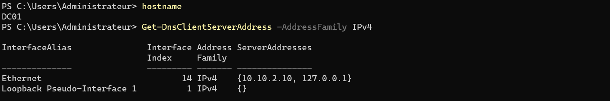
</details>

## <a id="ad-logique"></a>Topologie logique AD (delta N4)

N4 ajoute l'OU technique `OU=Servers` (pour ranger SRV-FILE), les trois groupes Domain Local de ressource (`DL-Share-Payroll-Modify`, `DL-Share-Payroll-Read`, `DL-Print-Compta`), le compte de Karen Filippelli et l'imprimante partagée.

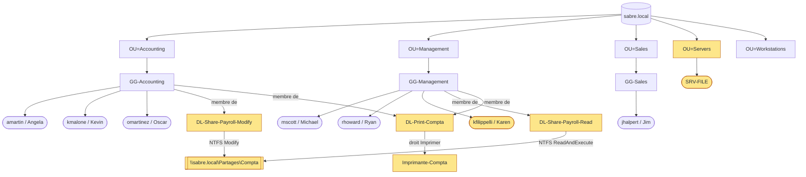
```mermaid
graph TD
    DOM[("sabre.local")]
    DOM --> OUA[OU=Accounting]
    DOM --> OUM[OU=Management]
    DOM --> OUSA[OU=Sales]
    DOM --> OUSRV[OU=Servers]:::nouveau
    DOM --> OUW[OU=Workstations]

    OUA --> GGA[GG-Accounting]
    OUM --> GGM[GG-Management]
    OUSA --> GGS[GG-Sales]

    GGA --> amartin([amartin / Angela])
    GGA --> kmalone([kmalone / Kevin])
    GGA --> omartinez([omartinez / Oscar])
    GGM --> mscott([mscott / Michael])
    GGM --> rhoward([rhoward / Ryan])
    GGM --> kfilippelli([kfilippelli / Karen]):::nouveau
    GGS --> jhalpert([jhalpert / Jim])

    GGA -->|membre de| DLM[DL-Share-Payroll-Modify]:::nouveau
    GGM -->|membre de| DLR[DL-Share-Payroll-Read]:::nouveau
    GGA -->|membre de| DLP[DL-Print-Compta]:::nouveau
    GGM -->|membre de| DLP

    DLM -->|NTFS Modify| CMP[["\\sabre.local\Partages\Compta"]]:::nouveau
    DLR -->|NTFS ReadAndExecute| CMP
    DLP -->|droit Imprimer| PRN[Imprimante-Compta]:::nouveau

    OUSRV --> SRVFILE([SRV-FILE]):::nouveau

    classDef nouveau fill:#fde68a,stroke:#b45309,color:#1f2937;
```

> Les flèches « membre de » se lisent dans le sens de l'imbrication AGDLP : un compte appartient à son groupe Global, qui appartient au groupe Domain Local, qui porte le droit sur la ressource.

---

# 2. Étapes de configuration

Pourquoi ce choix chronologique :

1) Le partage et le NTFS viennent avant DFS parce que le Namespace ne fait que pointer vers une cible déjà correctement permissionnée, et DFS-R ne réplique proprement que des données dont les ACL sont déjà posées. 

2) FSRM se pose sur un partage vivant. L'impression vient ensuite, avec ses GPO ciblées sur les utilisateurs et les postes. Le rangement de SRV-FILE dans `OU=Servers` clôt l'épisode : il prépare le ciblage des GPO de durcissement serveur de N5.

---
### <a id="étape-1"></a>Étape 1 : SRV-FILE, de la coquille au domaine

🎯 **Objectif :** créer le premier serveur membre, lui fixer son adressage, prouver la résolution DNS, puis le joindre.

⚠️ **Le piège du DNS pointé vers les DC avant la jonction**

Le DNS de SRV-FILE doit pointer vers les DC avant la jonction au domaine. Pour trouver un DC, la machine interroge l'enregistrement `_ldap._tcp.dc._msdcs.sabre.local`. Avec un autre DNS, elle ne le trouve pas et la jonction échoue.

🔧 **Note de production : avoir un canal bien sécurisé**

Une machine jointe entretient un secret partagé avec un DC (son mot de passe d'ordinateur, renouvelé automatiquement). `Test-ComputerSecureChannel` interroge ce secret : s'il est rompu, la machine est « jointe » sur le papier mais n'authentifie plus personne.

Coquille Hyper-V (VM chaude, placée sur le SSD parce qu'un serveur de fichiers est interactif et sollicité en I/O) :

```powershell
New-VM `
    -Name "SRV-FILE" `
    -Generation 2 `
    -MemoryStartupBytes 2GB `
    -NewVHDPath "<Dossier VHDX chauds>\SRV-FILE.vhdx" `
    -NewVHDSizeBytes 80GB `
    -SwitchName "SITE1" `
    -Path "<Dossier configs VM>"

Set-VMMemory `
    -VMName "SRV-FILE" `
    -DynamicMemoryEnabled $true `
    -MinimumBytes 1GB `
    -StartupBytes 2GB `
    -MaximumBytes 3GB
```

Adressage statique et DNS (valeurs : [IPAM](../../IPAM.md)), à faire dans la console VMConnect, pas en RDP :

```powershell
$if = "Ethernet"
New-NetIPAddress `
    -InterfaceAlias $if `
    -IPAddress 10.10.1.20 `
    -PrefixLength 24 `
    -DefaultGateway 10.10.1.1

Set-DnsClientServerAddress -InterfaceAlias $if -ServerAddresses 10.10.1.10,10.10.2.10
```

Preuve de résolution avant jonction, puis renommage et jonction :

```powershell
# la localisation de domaine doit répondre AVANT de joindre
Resolve-DnsName -Name "_ldap._tcp.dc._msdcs.sabre.local" -Type SRV
nltest /dsgetdc:sabre.local

Add-Computer `
    -DomainName "sabre.local" `
    -NewName "SRV-FILE" `
    -Credential (Get-Credential "SABRE\Administrateur") `
    -Restart
```

<details><summary>🖱️ Version GUI</summary>

Coquille : Gestionnaire Hyper-V → Nouvel ordinateur virtuel (Génération 2, mémoire dynamique 2 Go avec minimum 1 Go et maximum 3 Go, vSwitch SITE1, disque 80 Go dans le dossier des VHDX chauds).

Adressage : `ncpa.cpl` → Ethernet → Propriétés → TCP/IPv4 → saisir IP, masque, passerelle et DNS.

Jonction : Paramètres → Système → Renommer ce PC (avancé) → onglet Nom de l'ordinateur → Modifier → cocher Domaine `sabre.local`.
</details>

**Validation**

| Vérification                                                 | Attendu                             | Preuve |
| ------------------------------------------------------------ | ----------------------------------- | ------ |
| `Resolve-DnsName _ldap._tcp.dc._msdcs.sabre.local -Type SRV` | DC01/DC02 renvoyés (avant jonction) | P-02A  |
| `Get-CimInstance Win32_ComputerSystem`                       | `PartOfDomain = True`               | P-02B  |
| `Test-ComputerSecureChannel -Verbose`                        | `True`, canal sain vers DC01        | P-02B  |

<details><summary><a id="p-02"></a>📷 Preuve P-02 · Jonction domaine</summary>

**P-02A** : **résolution des SRV `_ldap._tcp.dc._msdcs.sabre.local` avant jonction**  
Les deux DC répondent, dc01 sur `10.10.1.10` (TTL 3600) et dc02 sur `10.10.2.10` (TTL 1200). La zone publie bien les SRV de localisation (capture prise depuis un DC). Que SRV-FILE sache les résoudre est prouvé par la jonction réussie (P-02B).
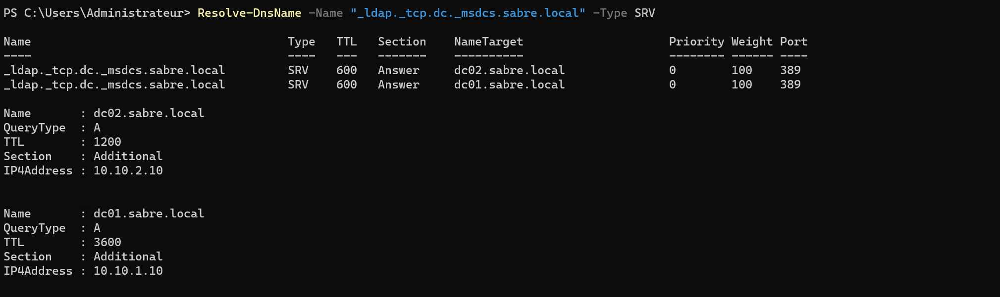

**P-02B** : SRV-FILE jointe à `sabre.local`, `Test-ComputerSecureChannel` renvoie `True`, localisation site-aware Scranton.
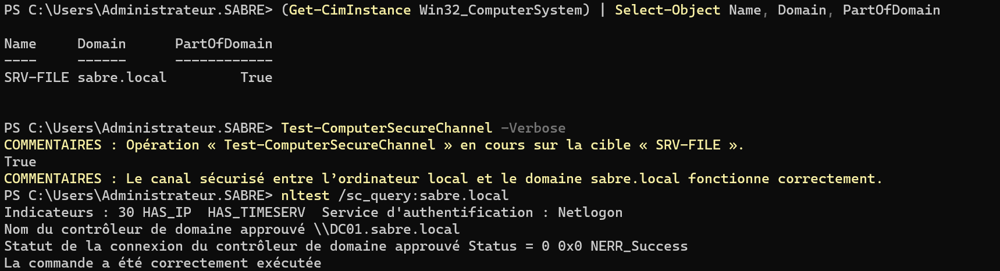
</details>

---
### <a id="étape-2"></a>Étape 2 : rôle Serveur de fichiers + partage Compta

🎯 **Objectif :** installer le rôle fichiers et publier le premier partage SMB.

💡 **Principe de conception : permissions effectives = Share ∩ NTFS, et Deny l'emporte**

Sur un accès réseau, le droit réel est l'intersection de la couche partage et de la couche NTFS : la plus restrictive des deux gagne. À l'intérieur du NTFS, un **Deny explicite** l'emporte sur un Allow explicite ; un Allow explicite l'emporte en revanche sur un Deny hérité. Laisser le partage ouvert à *Tout le monde* neutralise la couche partage, pour que le NTFS soit la seule variable observable dans les étapes suivantes.

```powershell
Install-WindowsFeature -Name FS-FileServer -IncludeManagementTools

New-Item -Path "C:\Shares\Compta" -ItemType Directory

New-SmbShare `
    -Name "Compta" `
    -Path "C:\Shares\Compta" `
    -FullAccess "Tout le monde"
```

> 🔧 **Note : nom du groupe *Tout le monde*.** `New-SmbShare` a accepté le nom français (Compta) comme le nom anglais `Everyone` (Partages, étape 5). Le partage stocke un SID ; `Get-SmbShareAccess` affiche ensuite le nom localisé dans les deux cas.

<details><summary>🖱️ Version GUI</summary>

Rôle : Gestionnaire de serveur → Gérer → Ajouter des rôles et fonctionnalités → Services de fichiers et de stockage → Services de fichiers → Serveur de fichiers.
Partage : créer `C:\Shares\Compta`, puis clic droit → Propriétés → Partage → Partage avancé → cocher **Partager ce dossier** → **Autorisations** → *Tout le monde* → **Contrôle total**.
</details>

**Validation**

| Vérification | Attendu | Preuve |
| ------------ | ------- | ------ |
| `Get-WindowsFeature FS-FileServer` | `Installed` | P-03 |
| `Get-SmbShareAccess Compta` | *Tout le monde* `Full` (partage neutralisé exprès) | P-04 |

<details><summary><a id="p-03"></a><a id="p-04"></a>📷 Preuves P-03 · P-04 · Rôle fichiers & partage</summary>

**P-03** : rôle `FS-FileServer` installé sur SRV-FILE.
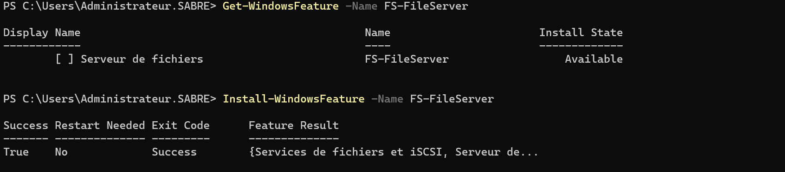

**P-04** : partage `Compta` publié, accès partage *Tout le monde* / Full.
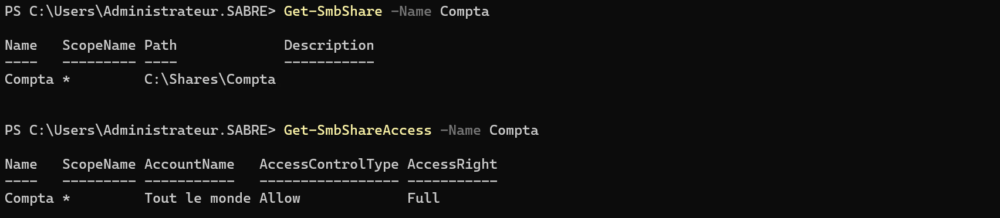
</details>

---
### <a id="étape-3"></a>Étape 3 : AGDLP niveau écriture (Compta)

🎯 **Objectif :** donner l'accès en écriture à la comptabilité par la chaîne AGDLP complète.

💡 **Principe de conception : AGDLP**

Un compte ne reçoit jamais un droit en direct. Il entre dans un groupe Global métier (`GG-Accounting`), ce groupe entre dans un groupe Domain Local de ressource (`DL-Share-Payroll-Modify`), et c'est ce dernier qui porte le NTFS. Le niveau d'accès est une propriété du DL, pas du compte.

⚠️ **Le piège d'un `icacls /grant` réussi qui ne prouve pas le droit posé.** 

Au premier passage, `icacls "…:(OI)(CI)M"` a répondu sans erreur, mais la relecture de l'ACL montrait `ReadAndExecute` au lieu de `Modify`. 

La cause n'a pas été établie (la syntaxe `(OI)(CI)M` est celle de la documentation) ; reposé sous la forme `(OI)(CI)(M)`, le droit est correct. Réflexe gardé : icacls confirme l'écriture, pas le résultat. Relire l'ACL après chaque `/grant` (`Get-Acl` ou `icacls <chemin>`).

```powershell
# groupe Domain Local de ressource, rangé dans l'OU métier
New-ADGroup `
    -Name "DL-Share-Payroll-Modify" `
    -GroupScope DomainLocal `
    -GroupCategory Security `
    -Path "OU=Accounting,DC=sabre,DC=local"

# imbrication : le GG métier entre dans le DL ressource
Add-ADGroupMember -Identity "DL-Share-Payroll-Modify" -Members "GG-Accounting"

# les comptes entrent dans le GG métier (déjà fait en N2, sans effet si déjà membres)
Add-ADGroupMember -Identity "GG-Accounting" -Members amartin,kmalone,omartinez

# NTFS : casser l'héritage, retirer Utilisateurs, poser le DL en Modify
icacls "C:\Shares\Compta" /inheritance:d
icacls "C:\Shares\Compta" /remove:g "Utilisateurs"
icacls "C:\Shares\Compta" /grant "DL-Share-Payroll-Modify:(OI)(CI)(M)"
```

<details><summary>🖱️ Version GUI</summary>

Groupes : ADUC → OU=Accounting → clic droit → Nouveau → Groupe (**Domaine local** / **Sécurité**), puis onglet **Membres** pour imbriquer `GG-Accounting`.
NTFS : Propriétés du dossier → Sécurité → Avancé → Désactiver l'héritage (convertir en explicite) → retirer Utilisateurs → Ajouter `DL-Share-Payroll-Modify` en Modifier.
</details>

**Validation**

| Vérification | Attendu | Preuve |
| ------------ | ------- | ------ |
| `Get-Acl "C:\Shares\Compta"` avant modification | héritage actif, Utilisateurs présent | P-05 |
| `Get-ADGroupMember DL-Share-Payroll-Modify` | contient `GG-Accounting` | P-06 |
| `Get-Acl "C:\Shares\Compta"` après | DL en Modify, héritage cassé | P-07 |
| `whoami /groups` (session Angela) | le jeton porte `GG-Accounting` **et** le DL | P-08 |
| écriture d'un fichier depuis WIN11-A | fichier créé | P-09 |

<details><summary><a id="p-05"></a><a id="p-06"></a><a id="p-07"></a><a id="p-08"></a><a id="p-09"></a>📷 Preuves P-05 → P-09 · AGDLP écriture</summary>

**P-05** : ACL par défaut *(avant correction : héritage encore actif)*.
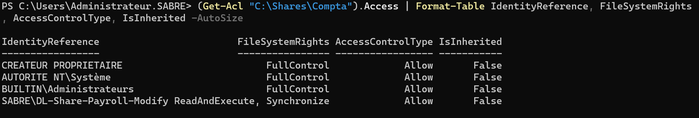

**P-06** : `DL-Share-Payroll-Modify` contient `GG-Accounting` (imbrication).
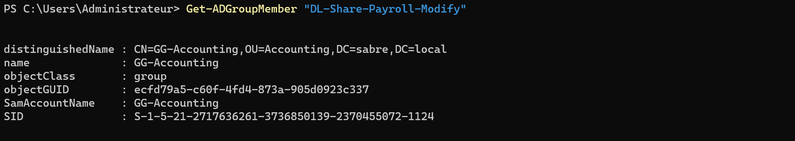

**P-07** : ACL finale, le DL posé en Modify, héritage cassé.
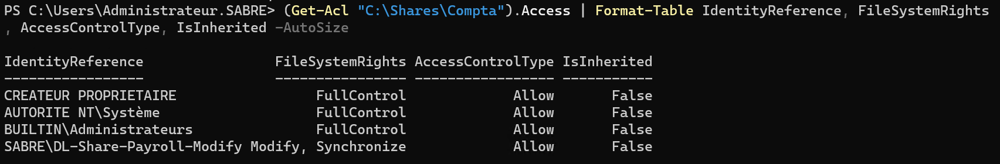

**P-08** : jeton d'accès d'Angela (`amartin`) : `GG-Accounting` et le DL présents.
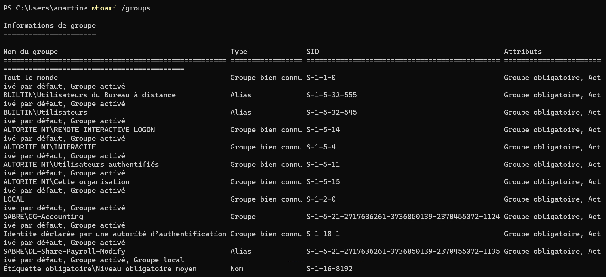

**P-09** : écriture réelle depuis WIN11-A, `test-angela.txt` créé dans le partage.
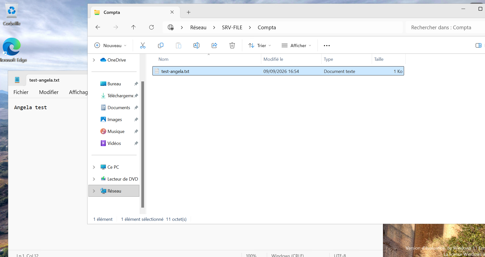
</details>

🔎 **Démonstration Deny > Allow (par l'usage)**

Angela restant connectée, on pose un refus explicite d'écriture sur `GG-Accounting`, par-dessus l'autorisation Modify qu'elle tient du DL. Elle est aussitôt bloquée, puis le retrait du refus lui rend l'accès. C'est la preuve, côté utilisateur réel, qu'un Deny explicite écrase tous les Allow.

```powershell
# --- SRV-FILE : Deny granulaire (écriture seule, lecture préservée) ---
icacls "C:\Shares\Compta" /deny "SABRE\GG-Accounting:(OI)(CI)(WD,AD,WEA,WA)"

# Vérifier que la ligne Deny n'inclut PAS Synchronize :
(Get-Acl "C:\Shares\Compta").Access |
  Where-Object { $_.AccessControlType -eq 'Deny' } |
  Format-List IdentityReference, FileSystemRights, AccessControlType

# --- WIN11-A, session Angela : purge du cache SMB, puis test ---
net use * /delete /y

# Lecture : doit lister le contenu (Deny ne touche pas la lecture)
Get-ChildItem \\sabre.local\Partages\Compta

# Écriture : doit être refusée (UnauthorizedAccessException)
"test $(Get-Date -Format o)" | Out-File \\sabre.local\Partages\Compta\test-deny.txt

# --- SRV-FILE : retrait du Deny ---
icacls "C:\Shares\Compta" /remove:d "SABRE\GG-Accounting"
(Get-Acl "C:\Shares\Compta").Access |
  Where-Object { $_.AccessControlType -eq 'Deny' }   # ne doit rien renvoyer

# --- WIN11-A, session Angela : écriture rétablie ---
"test $(Get-Date -Format o)" | Out-File \\sabre.local\Partages\Compta\test-ok.txt
```

<details><summary>🖱️ Version GUI</summary>

Pose : Propriétés de `C:\Shares\Compta` → **Sécurité** → **Avancé** → **Ajouter** → **Sélectionnez un principal** `GG-Accounting` → **Type : Refuser** → **Afficher les autorisations avancées** → cocher uniquement **Création de fichiers/écriture de données**, **Création de dossiers/ajout de données**, **Écriture d'attributs**, **Écriture d'attributs étendus**.
Retrait : même fenêtre → sélectionner la ligne Refuser → **Supprimer**.
</details>

**🔧 Note icacls, masque (W) :** `icacls /deny "...:(W)"` pose un Deny large qui inclut Synchronize, le droit d'ouvrir un handle sur l'objet. 

Un Deny « Write » naïf bloque donc aussi l'ouverture et la lecture du dossier, pas seulement l'écriture. Pour refuser l'écriture en préservant la lecture, cibler les droits granulaires `(WD,AD,WEA,WA)` et vérifier après pose que la ligne Deny de `(Get-Acl).Access` n'affiche pas Synchronize.

| Vérification                        | Attendu                                           | Preuve |
| ----------------------------------- | ------------------------------------------------- | ------ |
| ACL après le /deny granulaire       | GG-Accounting en Deny sur Write, sans Synchronize | P-10   |
| Lecture d'Angela, Deny actif        | préservée (liste le dossier)                      | P-11   |
| Écriture d'Angela, Deny actif       | refusée à l'enregistrement                        | P-11   |
| Retrait du Deny, écriture re-tentée | rétablie                                          | P-12   |

<details>
<summary><a id="p-10"></a>📷 P-10 · ACL après le /deny granulaire</summary>

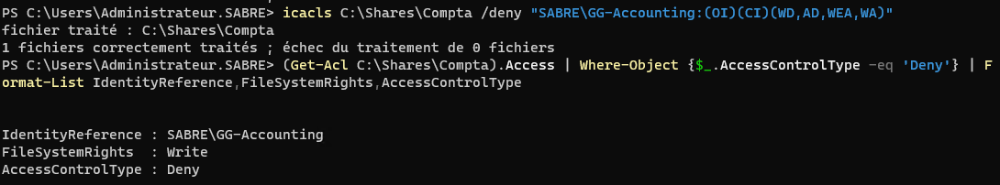

Deny ciblé sur les seuls droits d'écriture (create/write data, append, write EA, write attributes) posé sur GG-Accounting. L'ACL relue affiche Write / Deny sans Synchronize, à la différence du Deny (W) large qui, lui, bloquait aussi la lecture (voir incident de session et note icacls).
</details>

<details>
<summary><a id="p-11"></a>📷 P-11 · Deny actif : lecture préservée, écriture refusée</summary>

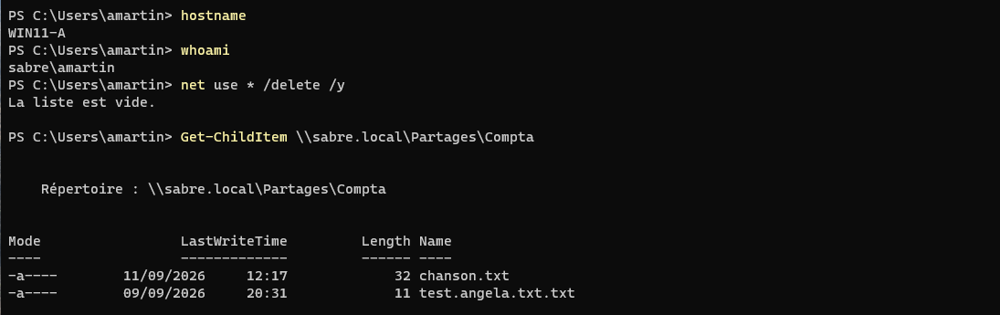
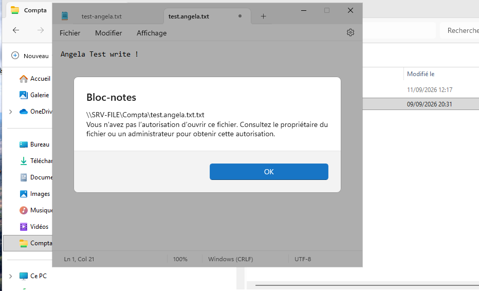

Angela liste le contenu de Compta (la lecture n'est pas touchée par le Deny), mais l'enregistrement d'un fichier est refusé. Le message Bloc-notes dit « ouvrir » : il s'agit de l'ouverture d'un handle en écriture pour sauvegarder, refusée par le Deny Write. La preuve de lecture qui précède lève l'ambiguïté. La règle Deny > Allow s'applique droit par droit : seule l'écriture tombe.
</details>

<details>
<summary><a id="p-12"></a>📷 P-12 · Écriture rétablie après retrait du Deny</summary>

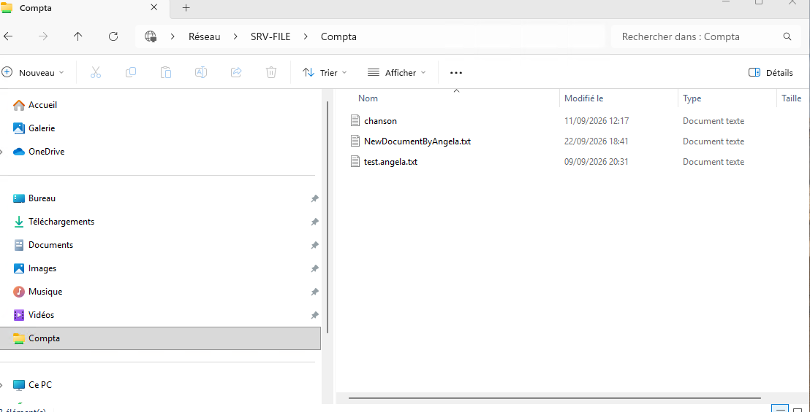

Deny retiré, Angela crée un fichier sans erreur. Seule variable changée entre P-11 et P-12, l'ACL.
</details>

---
### <a id="étape-4"></a>Étape 4 : AGDLP niveau lecture (Management)

🎯 **Objectif :** ajouter un second niveau d'accès (lecture seule) sur la même ressource, porté par un DL distinct.

⚠️ **Piège : le jeton est figé à l'ouverture de session.**

Ajouter un utilisateur à un groupe ne rafraîchit pas sa session en cours. Son jeton Kerberos a été calculé au logon et ne contient pas le nouveau groupe. Tant qu'il n'a pas fermé puis rouvert sa session, il se voit refuser un accès qu'il possède pourtant. Ne jamais conclure à un problème de droits sans avoir rouvert la session.

Karen Filippelli, directrice d'Utica, n'existait pas encore : elle est créée ici, au moment où l'épisode a besoin d'un vrai utilisateur standard de SITE2. Créée sur DC01, elle n'apparaît sur DC02 qu'après la réplication inter-site, ce qui sert au passage de contrôle DC01 → DC02.

```powershell
New-ADUser `
    -Server DC01 `
    -Name "Karen Filippelli" `
    -GivenName "Karen" `
    -Surname "Filippelli" `
    -DisplayName "Karen Filippelli" `
    -SamAccountName "kfilippelli" `
    -UserPrincipalName "kfilippelli@sabre.local" `
    -Path "OU=Management,DC=sabre,DC=local" `
    -Department "Management" `
    -Title "Regional Manager (Utica)" `
    -AccountPassword (Read-Host "Mot de passe" -AsSecureString) `
    -Enabled $true `
    -ChangePasswordAtLogon $false

Add-ADGroupMember -Server DC01 -Identity "GG-Management" -Members "kfilippelli"

# Présente sur DC02 seulement une fois la réplication inter-site passée
Get-ADUser -Server DC02 kfilippelli | Select-Object Name, SamAccountName, Enabled
```

Puis le second niveau d'accès :

```powershell
New-ADGroup `
    -Name "DL-Share-Payroll-Read" `
    -GroupScope DomainLocal `
    -GroupCategory Security `
    -Path "OU=Accounting,DC=sabre,DC=local"

Add-ADGroupMember -Identity "DL-Share-Payroll-Read" -Members "GG-Management"

icacls "C:\Shares\Compta" /grant "DL-Share-Payroll-Read:(OI)(CI)(RX)"
```

<details><summary>🖱️ Version GUI</summary>

Karen : ADUC → `Management` → clic droit → **Nouveau** ▸ **Utilisateur** → Karen Filippelli, `kfilippelli` → mot de passe → **Terminer** ; onglet **Organisation** → **Service** `Management` ; onglet **Membre de** → `GG-Management`.
Même chemin qu'à l'étape 3 pour le groupe et l'imbrication. NTFS : ajouter `DL-Share-Payroll-Read` avec **Lecture et exécution** seulement.
</details>

**Validation**

| Vérification                                  | Attendu                                                | Preuve |
| --------------------------------------------- | ------------------------------------------------------ | ------ |
| `Get-ADGroup DL-Share-Payroll-Read` + membres | DomainLocal, contient `GG-Management`                  | P-13   |
| `whoami /groups` (session Karen, WIN11-B)     | jeton porte `GG-Management` et `DL-Share-Payroll-Read` | P-14   |
| écriture tentée depuis WIN11-B                | **refusée** (lecture seule)                            | P-15   |


<details><summary><a id="p-13"></a><a id="p-14"></a><a id="p-15"></a>📷 Preuves P-13 → P-15 · AGDLP lecture</summary>

**P-13** : `DL-Share-Payroll-Read` (DomainLocal) contient `GG-Management`.
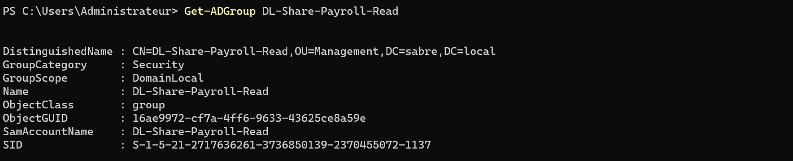

**P-14** : jeton de Karen (`kfilippelli`) sur WIN11-B, DL-Read remonté par imbrication.
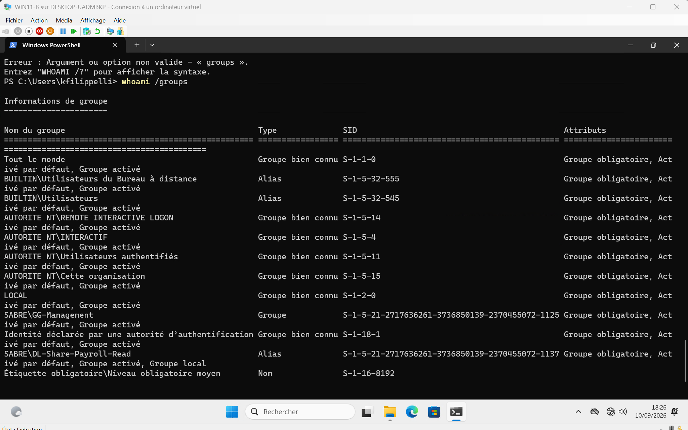

**P-15** : écriture refusée à Karen (`test.angela_V2.txt`), lecture seule confirmée par l'usage.
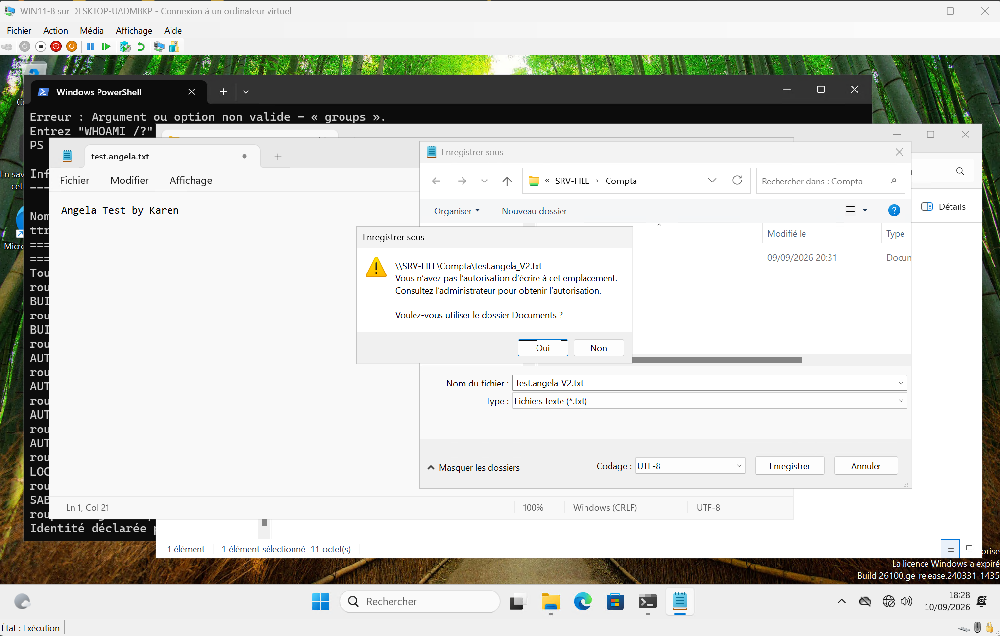
</details>

---
### <a id="étape-5"></a>Étape 5 : DFS Namespace

🎯 **Objectif :** exposer le partage derrière un chemin logique stable, indépendant du serveur.

💡 **Principe de conception : Namespace ≠ DFS-R**

Un espace de noms est du routage : `\\sabre.local\Partages\Compta` est un pointeur qui redirige vers la vraie cible (`\\SRV-FILE\Compta`). Il ne copie aucune donnée et ne porte aucun droit. Les permissions restent celles du NTFS de la cible.

Repointer un dossier de namespace vers un autre serveur est le dernier geste d'une migration sans coupure, une fois les données déjà répliquées.

```powershell
Install-WindowsFeature -Name FS-DFS-Namespace -IncludeManagementTools

# la racine namespace a besoin d'une cible réelle : un dossier partagé
New-Item -Path "C:\DFSRoots\Partages" -ItemType Directory
New-SmbShare -Name "Partages" -Path "C:\DFSRoots\Partages" -FullAccess "Everyone"

New-DfsnRoot `
    -Path "\\sabre.local\Partages" `
    -TargetPath "\\SRV-FILE\Partages" `
    -Type DomainV2

New-DfsnFolder `
    -Path "\\sabre.local\Partages\Compta" `
    -TargetPath "\\SRV-FILE\Compta"
```

<details><summary>🖱️ Version GUI</summary>

Outils → Gestion du système de fichiers distribué DFS → Nouvel espace de noms → serveur SRV-FILE → nom `Partages` → basé sur un domaine (activer Windows Server 2008 mode = DomainV2) → Nouveau dossier `Compta` avec cible `\\SRV-FILE\Compta`.
</details>

**Validation**

| Vérification | Attendu | Preuve |
| ------------ | ------- | ------ |
| `Test-Path "\\sabre.local\Partages\Compta"` | `True` depuis WIN11-A et WIN11-B | P-16 |
| accès explorateur au chemin logique | contenu visible, droits inchangés | P-17 |

<details><summary><a id="p-16"></a><a id="p-17"></a>📷 Preuves P-16 · P-17 · Namespace</summary>

**P-16** : `Test-Path` sur le chemin logique renvoie `True` depuis Scranton.
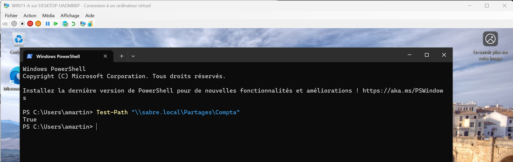

**P-16** (Utica) : `Test-Path "\\sabre.local\Partages\Compta"` renvoie `True` en session Karen sur WIN11-B.
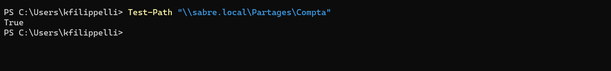

**P-17** : explorateur sur `\\sabre.local\Partages\Compta` depuis WIN11-A, fichier visible.
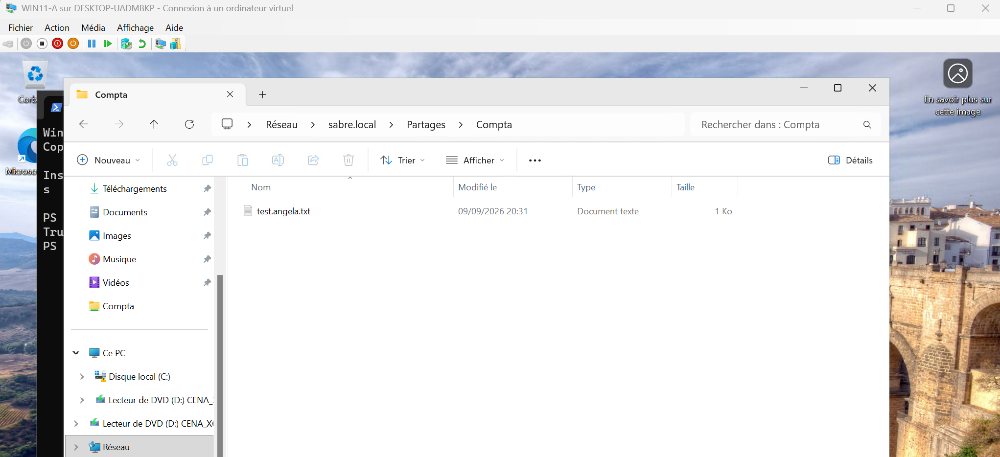

**P-17** (Utica) : Karen ouvre `\\sabre.local\Partages\Compta` depuis WIN11-B et lit `test.angela.txt` ; l'enregistrement est refusé. Le chemin logique mène à la même cible, avec les mêmes droits NTFS.
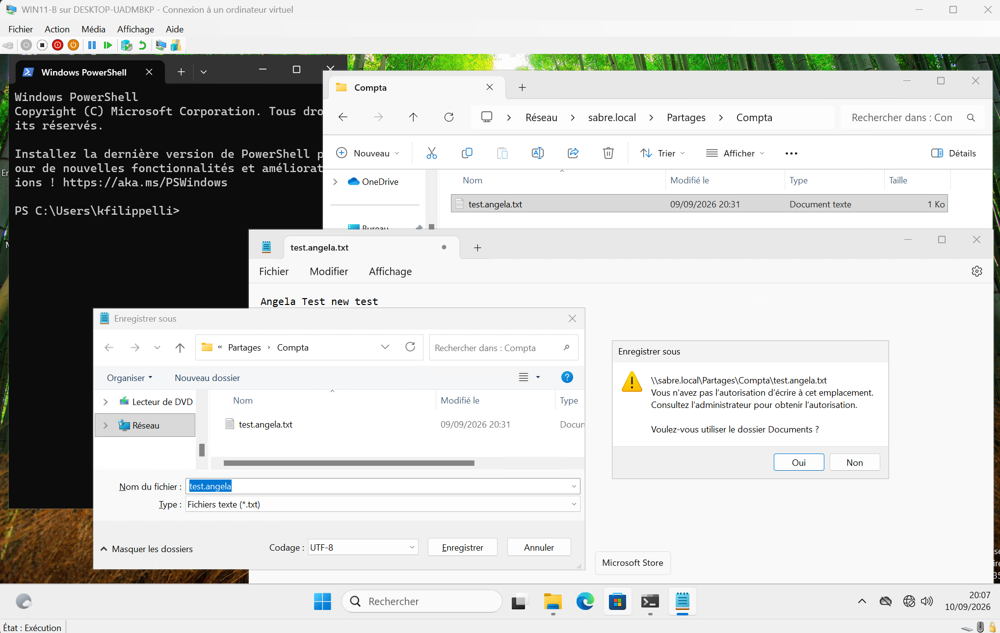
</details>

---
### <a id="étape-6"></a>Étape 6 : DFS-R (réplication de données)

🎯 **Objectif :** répliquer un dossier de données entre deux serveurs, sur un jeu jetable.

🧪 **Lab vs production : le second porteur de données**

Prouver DFS-R demande deux serveurs qui portent les mêmes données. Compta n'en a qu'un, SRV-FILE. La topologie du lab ne prévoit pas de second serveur de fichiers, et l'hôte unique n'a pas la capacité d'en ajouter un.

Choix du lab : répliquer un dossier jetable, `C:\DFSR-Demo`, entre SRV-FILE et DC02. Aucune VM ajoutée, aucune donnée métier en jeu. Garde-fou : ce groupe de réplication ne touche jamais SYSVOL ni le dossier de `ntds.dit`.

En production, un second serveur membre (SRV-FILE2, Tier 1) porterait la copie. Poser des données métier sur un DC (Tier 0) élargit la surface d'attaque du Tier 0 et casse le modèle en tiers. L'écart est assumé ici parce que le dossier est jetable et démonté après la démonstration.

Deux incidents accidentels rencontrés pendant ce montage (objet de conflit `CNF:`, membership inerte sans `ContentPath`) sont documentés dans le [BREAKFIX N4 § Dépannage](./BREAKFIX.md#dépannage-incidents-de-session). Le bloc ci-dessous est la séquence propre.

```powershell
# rôle sur les deux membres
Install-WindowsFeature FS-DFS-Replication -IncludeManagementTools -ComputerName SRV-FILE
Install-WindowsFeature FS-DFS-Replication -IncludeManagementTools -ComputerName DC02

# dossier physique de contenu, des deux côtés
New-Item -Path "C:\DFSR-Demo" -ItemType Directory   # sur SRV-FILE
New-Item -Path "C:\DFSR-Demo" -ItemType Directory   # sur DC02

# topologie
New-DfsReplicationGroup -GroupName "RG-Demo"
New-DfsReplicatedFolder -GroupName "RG-Demo" -FolderName "RF-Demo"
Add-DfsrMember -GroupName "RG-Demo" -ComputerName SRV-FILE,DC02
Add-DfsrConnection `
    -GroupName "RG-Demo" `
    -SourceComputerName SRV-FILE `
    -DestinationComputerName DC02

# SRV-FILE = membre primaire, chemin de contenu de chaque côté
Set-DfsrMembership `
    -GroupName "RG-Demo" `
    -FolderName "RF-Demo" `
    -ComputerName SRV-FILE `
    -ContentPath "C:\DFSR-Demo" `
    -PrimaryMember $true `
    -Force

Set-DfsrMembership `
    -GroupName "RG-Demo" `
    -FolderName "RF-Demo" `
    -ComputerName DC02 `
    -ContentPath "C:\DFSR-Demo" `
    -Force

# forcer le poll AD des deux membres, sinon la config reste "installée mais inerte"
Update-DfsrConfigurationFromAD -ComputerName SRV-FILE,DC02
```

⚠️ **Piège : recréer RG-Demo avant la convergence de la réplication AD.**

Si des objets de conflit `CNF:` traînent d'un montage précédent, nettoyer d'abord la config AD, puis attendre la réplication inter-DC avant de reconstruire :

1) Nettoyage : `Get-DfsReplicationGroup | Where-Object GroupName -like "RG-Demo*" | Remove-DfsReplicationGroup -RemoveReplicatedFolders -Force`
2) Suivi de `repadmin /syncall /AdeP`.

Recréer trop tôt refait naître un doublon `CNF:` (voir [BREAKFIX § Dépannage](./BREAKFIX.md#dépannage-incidents-de-session)).

<details><summary>🖱️ Version GUI</summary>

Gestion DFS → Réplication → Nouveau groupe de réplication → topologie maille pleine → membres SRV-FILE et DC02 → dossier répliqué `RF-Demo` → membre principal SRV-FILE.
</details>

**Validation**

| Vérification                                   | Attendu                                   | Preuve |
| ---------------------------------------------- | ----------------------------------------- | ------ |
| `Get-WindowsFeature FS-DFS-Replication` (DC02) | `Installed`                               | P-18   |
| `Get-DfsReplicatedFolder`                      | `RF-Demo` présent                         | P-19   |
| `Get-DfsrMembership` (DC02)                    | `Enabled = True`, `ContentPath` renseigné | P-20   |
| `dfsrdiag backlog` en local sur DC02           | backlog 0, « synchronisé avec SRV-FILE »  | [BF-19](./BREAKFIX.md#bf-19) |
| contenu réellement répliqué                    | un fichier écrit d'un côté arrive de l'autre | [BF-14](./BREAKFIX.md#bf-14) |

<details><summary><a id="p-18"></a><a id="p-19"></a><a id="p-20"></a>📷 Preuves P-18 → P-20 · DFS-R</summary>

**P-18** : `FS-DFS-Replication` installé sur DC02. Sur un DC, DFS-R tourne déjà pour SYSVOL : l'installation est une formalité, RG-Demo s'ajoute au même service.
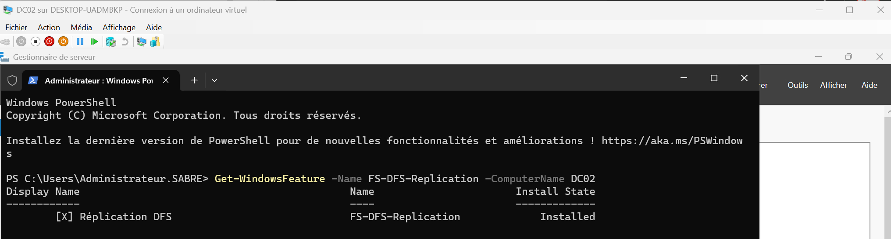

**P-19** : dossier répliqué `RF-Demo` en place.
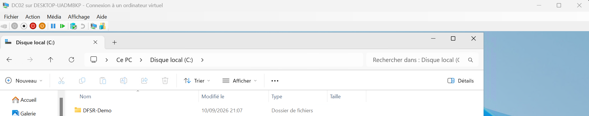

**P-20** : membership DC02 enfin `Enabled = True`.
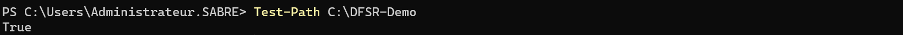
</details>

Démontage en clôture d'épisode (retrait de l'anti-pattern « données sur DC02 ») :

```powershell
# Retire le groupe et ses dossiers répliqués de la configuration AD (les fichiers ne sont pas supprimés)
Get-DfsReplicationGroup |
    Where-Object GroupName -like "RG-Demo*" |
    Remove-DfsReplicationGroup -RemoveReplicatedFolders -Force

# Contrôle : plus aucun groupe, plus aucune membership
Get-DfsReplicationGroup
Get-DfsrMembership

# Les fichiers restent sur disque après Remove-DfsReplicationGroup : suppression explicite
Remove-Item "C:\DFSR-Demo" -Recurse -Force      # sur DC02 (et SRV-FILE)
Test-Path "C:\DFSR-Demo"                          # False
```

Preuve : [BF-27](./BREAKFIX.md#bf-27).

---
### <a id="étape-7"></a>Étape 7 : FSRM quota

🎯 **Objectif :** poser une limite d'espace dure sur Compta et prouver qu'elle bloque.

💡 **Principe de conception : une limite, des seuils d'alerte**

Un quota FSRM, c'est **une** limite dure (100 Mo) assortie de **seuils d'alerte en pourcentage** (par exemple 80 %). Ce ne sont pas des quotas empilés : le 80 % ne réserve rien, il déclenche une notification pendant que la limite reste 100 Mo. Passé la limite, l'écriture est refusée par le système de fichiers.

```powershell
Install-WindowsFeature -Name FS-Resource-Manager -IncludeManagementTools

# le seuil 80 % porte une action : un événement (journal Application, source SRMSVC)
$seuil = New-FsrmQuotaThreshold `
    -Percentage 80 `
    -Action (New-FsrmAction -Type Event -EventType Warning -Body "Compta atteint 80% de son quota.")

New-FsrmQuota `
    -Path "C:\Shares\Compta" `
    -Size 100MB `
    -Threshold $seuil `
    -Description "Quota dur Compta, démo N4 FSRM"
```

Impact prouvé par saturation depuis WIN11-A (la troisième écriture doit échouer, disque plein) :

```powershell
[System.IO.File]::WriteAllBytes("\\sabre.local\Partages\Compta\gros1.bin", (New-Object byte[] (60MB)))
[System.IO.File]::WriteAllBytes("\\sabre.local\Partages\Compta\gros2.bin", (New-Object byte[] (30MB)))
[System.IO.File]::WriteAllBytes("\\sabre.local\Partages\Compta\gros3.bin", (New-Object byte[] (30MB)))
```

<details><summary>🖱️ Version GUI</summary>

Outils → Gestionnaire de ressources du serveur de fichiers → Gestion des quotas → Quotas → Créer un quota → chemin `C:\Shares\Compta` → quota dur personnalisé 100 Mo → seuil d'avertissement 80 % → onglet **Journal des événements** → envoyer un avertissement.
</details>

**Validation**

| Vérification | Attendu | Preuve |
| ------------ | ------- | ------ |
| `Get-FsrmQuota "C:\Shares\Compta"` | limite 100 Mo, seuil 80 % | P-21 |
| écriture au-delà de la limite | refus « espace insuffisant » | P-22 · P-23 |
| journal Application, source SRMSVC | avertissement au franchissement du seuil de 80 % | P-24 |

<details><summary><a id="p-21"></a><a id="p-22"></a><a id="p-23"></a><a id="p-24"></a>📷 Preuves P-21 → P-23 · P-24 · FSRM quota</summary>

**P-21** : quota de 100 Mo actif sur Compta (`Size 104857600`, `SoftLimit False` = quota dur).
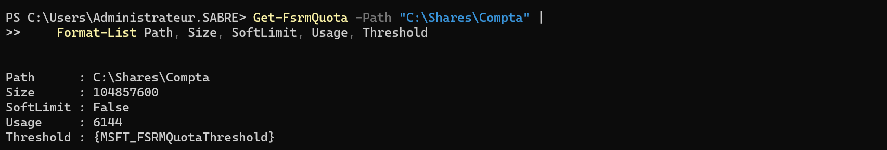

**P-22** : impact utilisateur, deux vues. En PowerShell, la troisième écriture échoue (« Espace insuffisant sur le disque »). Dans l'explorateur, la copie est refusée (« Espace disque insuffisant sur Compta »).
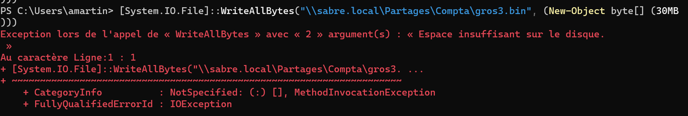
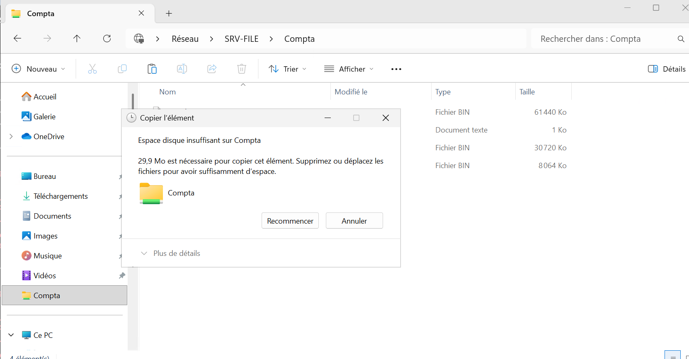

**P-23** : quota saturé, `Usage` au plus près de `Size`.
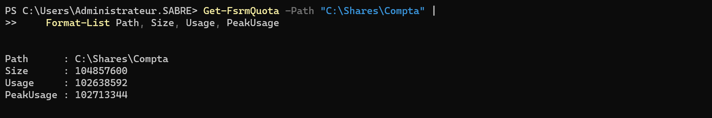

**P-24** : journal Application, source SRMSVC : un avertissement `12325` au franchissement du seuil, puis des événements d'information.
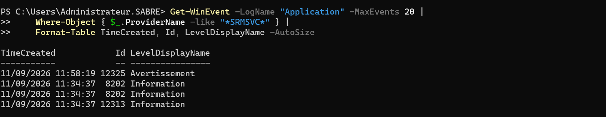
</details>

---
### <a id="étape-8"></a>Étape 8 : FSRM filtrage de fichiers

🎯 **Objectif :** interdire un type de fichier sur le partage, indépendamment de l'espace disponible.

💡 **Principe de conception : filtrage par type, orthogonal au quota**

Le filtrage agit sur le motif de nom (extensions du groupe « Fichiers audio et vidéo »), pas sur la taille. Un mp3 est refusé même si le quota est loin d'être atteint. Quota et filtrage sont deux garde-fous distincts posés sur le même dossier.

```powershell
# le nom du groupe de fichiers dépend de la langue de l'OS : le confirmer d'abord
Get-FsrmFileGroup | Format-Table Name -AutoSize
Get-FsrmFileGroup -Name "Fichiers audio et vidéo" | Format-List Name,IncludePattern

New-FsrmFileScreen `
    -Path "C:\Shares\Compta" `
    -IncludeGroup "Fichiers audio et vidéo" `
    -Active `
    -Notification (New-FsrmAction -Type Event -EventType Warning -Body "Depot d'un fichier interdit dans Compta.")
```

<details><summary>🖱️ Version GUI</summary>

Gestionnaire de ressources du serveur de fichiers → Gestion du filtrage de fichiers → Filtres de fichiers → Créer un filtre → chemin `C:\Shares\Compta` → bloquer le groupe « Fichiers audio et vidéo ».
</details>

**Validation**

| Vérification | Attendu | Preuve |
| ------------ | ------- | ------ |
| `Get-FsrmFileScreen "C:\Shares\Compta"` | actif, groupe audio/vidéo | P-25 |
| dépôt d'un fichier `.mp3` | refusé (type de fichier) | P-26 |
| même contenu renommé en `.txt` | accepté | P-26 |

<details><summary><a id="p-25"></a><a id="p-26"></a>📷 Preuves P-25 · P-26 · FSRM filtrage</summary>

**P-25** : filtre de fichiers actif sur Compta.
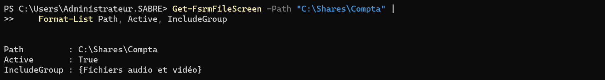

**P-26** : le `.mp3` est bloqué, le même contenu en `test.angela.txt` passe. La preuve que le filtre inspecte le nom, jamais les octets : renommer contourne. C'est aussi la leçon d'exploitation : l'utilisateur voit un simple « accès refusé », qui ne dit pas la vraie cause. Le motif n'apparaît que côté serveur, dans l'événement SRMSVC du filtrage (non capturé ici).
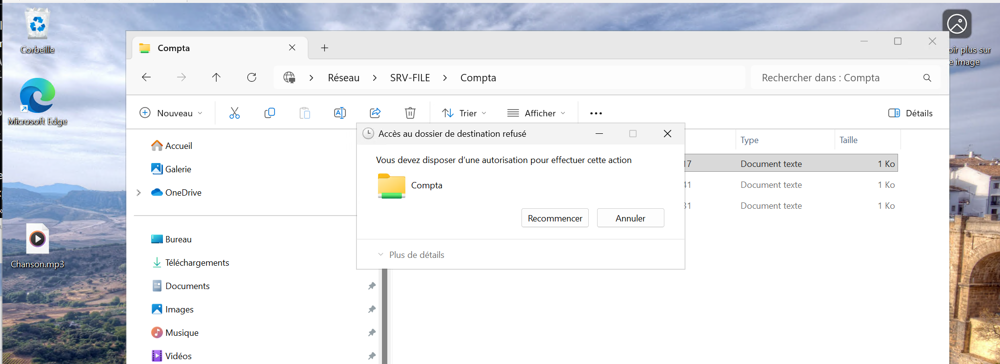
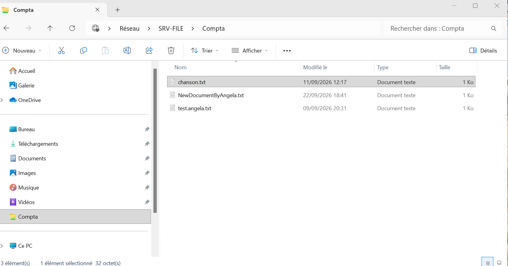
</details>

---
### <a id="étape-9"></a>Étape 9 : serveur d'impression + GPO

🎯 **Objectif :** publier une imprimante partagée, la déployer par GPO sur les services autorisés, autoriser l'installation du pilote côté utilisateur standard, verrouiller l'accès par AGDLP.

💡 **Principe de conception : une imprimante se gouverne comme un partage**

Deux couches, comme pour les fichiers. Le déploiement (préférence GPO, Préférences → Panneau de configuration → Imprimantes) rend l'imprimante disponible, c'est le partage. Le droit Imprimer, porté par un Domain Local (`DL-Print-Compta`) qui contient les GG autorisés, c'est la permission NTFS. 

L'un rend visible, l'autre protège. Le déploiement est ciblé sur les OU métier en Configuration utilisateur : le loopback a été envisagé puis écarté, parce que cette imprimante est réservée à une population sensible (compta, direction) et doit suivre les gens autorisés, pas les postes.

⚠️ **Arbitrage sécurité : Point and Print et PrintNightmare**

Depuis les correctifs PrintNightmare (2021), Windows exige une élévation pour installer un pilote d'imprimante, même depuis un serveur légitime. Angela, utilisatrice standard, butait sur `0x800702e4` (`ERROR_ELEVATION_REQUIRED`).

Le déblocage passe par la GPO `Config-PointAndPrint`, avec deux réglages : **Restrictions Pointer et imprimer** (installation et mise à jour de pilote sans invite d'élévation) et **Package Point and Print - Serveurs approuvés** (`SRV-FILE.sabre.local`). Supprimer l'invite d'élévation est précisément ce que Microsoft signale comme affaiblissant la protection PrintNightmare : on ne le fait qu'en limitant les utilisateurs aux serveurs approuvés (case « Les utilisateurs ne peuvent pointer et imprimer que sur ces serveurs », `SRV-FILE.sabre.local`).

Ça ne supprime pas le risque, ça le déplace : la sécurité des postes dépend désormais de celle de SRV-FILE, qui doit être traité comme un actif sensible. Lien direct avec le tiering de N5.

> 🔎 **Trouvé en relecture.** La première configuration supprimait l'invite sans activer la restriction aux serveurs listés : tout serveur d'impression pouvait pousser un pilote sans invite. L'écart a été repéré en relisant le rapport de la GPO avant publication, puis corrigé et vérifié sur le poste ([BREAKFIX, incident 4](./BREAKFIX.md#dépannage-incidents-de-session)).

Rôle, imprimante et groupe d'accès :

```powershell
Install-WindowsFeature -Name Print-Services -IncludeManagementTools

Add-PrinterPort -Name "PORT_Compta_Fictif" -PrinterHostAddress "10.10.1.250"
Add-PrinterDriver -Name "Generic / Text Only"

Add-Printer `
    -Name "Imprimante-Compta" `
    -DriverName "Generic / Text Only" `
    -PortName "PORT_Compta_Fictif" `
    -Shared `
    -ShareName "Imprimante-Compta"

New-ADGroup `
    -Name "DL-Print-Compta" `
    -GroupScope DomainLocal `
    -GroupCategory Security `
    -Path "OU=Accounting,DC=sabre,DC=local"

Add-ADGroupMember -Identity "DL-Print-Compta" -Members "GG-Accounting","GG-Management"
```

GPO de déploiement (utilisateurs) et GPO Point and Print (postes) :

```powershell
# Déploiement : la GPO et ses liens (la préférence d'imprimante elle-même n'a pas de cmdlet, voir GUI)
New-GPO -Name "Deploy-Imprimante-Compta"
New-GPLink -Name "Deploy-Imprimante-Compta" -Target "OU=Accounting,DC=sabre,DC=local" -LinkEnabled Yes
New-GPLink -Name "Deploy-Imprimante-Compta" -Target "OU=Management,DC=sabre,DC=local" -LinkEnabled Yes

# Point and Print : réglage ordinateur, lié aux postes
New-GPO -Name "Config-PointAndPrint" -Comment "N4 - autorise l'install du pilote depuis SRV-FILE"
New-GPLink -Name "Config-PointAndPrint" -Target "OU=Workstations,DC=sabre,DC=local" -LinkEnabled Yes

# Contrôle, sur un poste : les valeurs réellement appliquées (lisible sans droits d'administration)
Get-ItemProperty "HKLM:\Software\Policies\Microsoft\Windows NT\Printers\PointAndPrint"
```

Les réglages eux-mêmes ont été posés dans l'éditeur de GPO (voir GUI).

<details><summary>🖱️ Version GUI</summary>

Rôle : Ajouter des rôles → Services d'impression et de numérisation de documents.
Imprimante : Gestion de l'impression → Ports → Ajouter port TCP/IP `10.10.1.250` → Imprimantes → Ajouter → pilote Generic / Text Only → Partager.
Déploiement (la préférence d'imprimante n'a pas de cmdlet) : GPMC → GPO `Deploy-Imprimante-Compta` → **Modifier** → **Configuration utilisateur** → Préférences → Panneau de configuration → Imprimantes → Nouveau → Imprimante partagée (action Créer, chemin `\\SRV-FILE\Imprimante-Compta`) → liée aux OU=Accounting et OU=Management, en Configuration utilisateur.
Droit d'impression : Propriétés de l'imprimante → **Sécurité** → ajouter `DL-Print-Compta` avec **Imprimer** ; supprimer **Tout le monde**, **TOUS LES PACKAGES D'APPLICATION** et le SID de capacité `S-1-15-3-1024-…`.
Point and Print : GPO `Config-PointAndPrint` → **Modifier** → **Configuration ordinateur** → **Stratégies** → **Modèles d'administration** → **Imprimantes** :
- **Restrictions Pointer et imprimer** : Activé ; cocher **Les utilisateurs ne peuvent pointer et imprimer que sur ces serveurs** avec `SRV-FILE.sabre.local` ; les deux menus « Invites de sécurité » sur **Ne pas afficher l'avertissement ou l'invite d'élévation**.
- **Package Point and Print - Serveurs approuvés** : Activé, ajouter `SRV-FILE.sabre.local`.
Le premier réglage couvre l'invite d'élévation des pilotes classiques, le second les pilotes « package ». Il faut les deux.
</details>

**Validation**

| Vérification | Attendu | Preuve |
| ------------ | ------- | ------ |
| `Get-PrinterPort PORT_Compta_Fictif` | pointe `10.10.1.250` | P-27 |
| `Get-ADGroupMember DL-Print-Compta` | contient `GG-Accounting` et `GG-Management` | P-28 |
| ACL imprimante (re-posée après recréation du pilote) | `DL-Print-Compta` Imprimer, *Tout le monde* et packages d'application retirés | P-29 |
| imprimante reçue par GPO après logoff/logon (Angela) | `Get-Printer` la liste en `Type Connection`, sans installation manuelle | P-30 |
| impression depuis WIN11-A (port fictif, sortie redirigée vers un fichier) | fichier `.prn` produit par le pilote déployé | P-32 |
| Point and Print appliqué sur le poste | restriction aux serveurs listés active, `SRV-FILE.sabre.local` | [BF-26](./BREAKFIX.md#bf-26) |
| Jim (`jhalpert`, Sales) hors périmètre | refus **dès la connexion** `0x80070005`, imprimante invisible | P-31 |

<details><summary><a id="p-27"></a><a id="p-28"></a><a id="p-29"></a><a id="p-30"></a><a id="p-31"></a><a id="p-32"></a>📷 Preuves P-27 → P-32 · Impression</summary>

**P-27** : port d'impression fictif vers `10.10.1.250`.
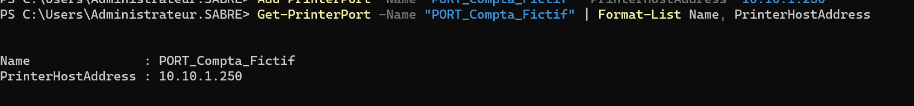

**P-28** : `DL-Print-Compta` contient les deux GG.
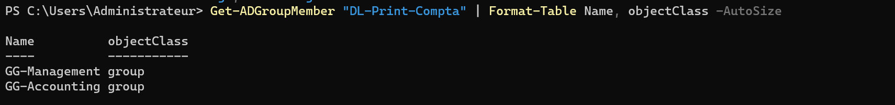

**P-29** : ACL restaurée après la recréation de l'imprimante (le changement de pilote avait réinitialisé son descripteur de sécurité) : `DL-Print-Compta` en Imprimer, *Tout le monde*, *TOUS LES PACKAGES D'APPLICATION* et SID de capacité retirés.
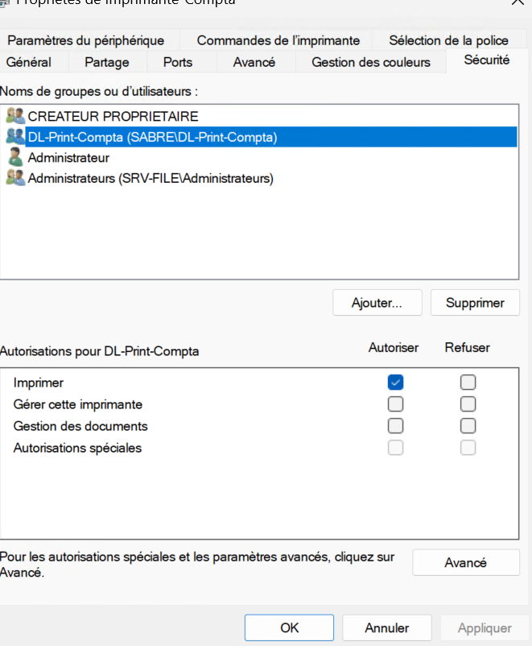

**P-30** : Angela obtient l'imprimante par le déploiement GPO (connexion présente en session amartin). L'installation manuelle testée plus tôt n'était qu'une étape intermédiaire, superposée puis remplacée par le déploiement automatique.
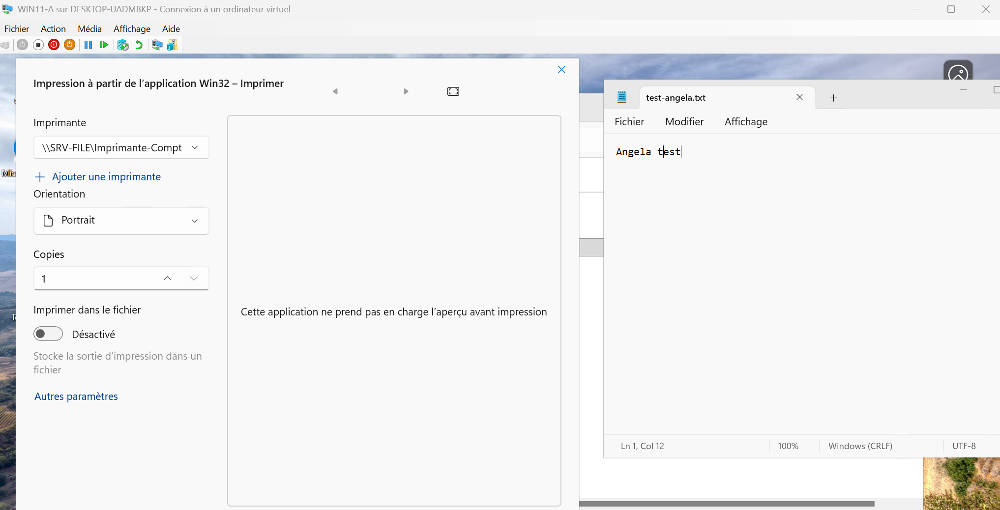

**P-31** : Jim refusé `0x80070005` **dès la connexion**, l'imprimante n'apparaît même pas dans sa liste. Le retrait des packages d'application et du SID de capacité rend le verrou plus strict que le minimum : un non-autorisé ne voit pas l'imprimante, donc ne peut pas ramasser un bulletin de paie.
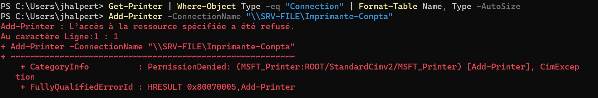
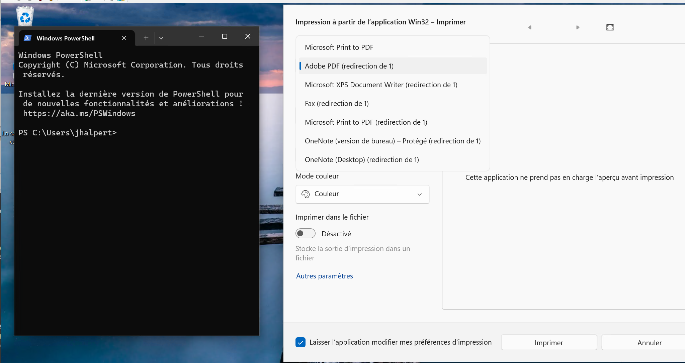

**P-32** : Angela imprime depuis WIN11-A avec l'imprimante reçue par GPO. Le port `10.10.1.250` étant fictif, aucune page ne peut sortir : la sortie a été redirigée vers un fichier (« Imprimer dans un fichier »), `File_printed.prn`, rendu par le pilote déployé depuis SRV-FILE.
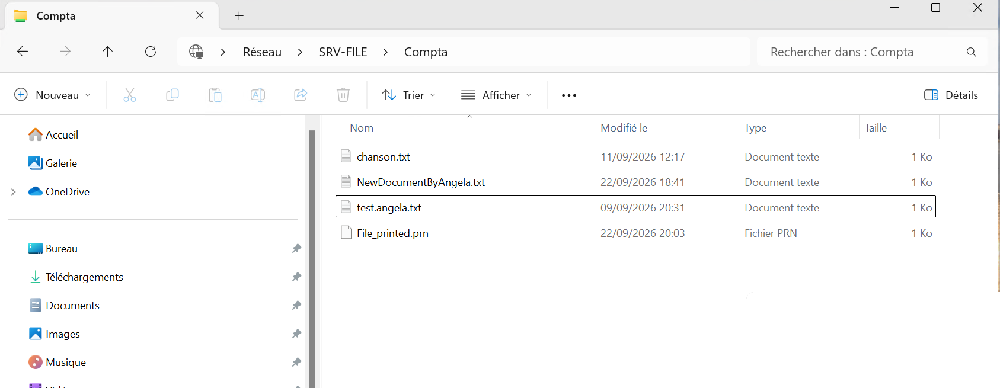
</details>

> Le diagnostic complet qui a mené à cet état (cinq couches, de la préférence GPP à Point and Print) est développé dans le [BREAKFIX N4 § Diagnostic impression](./BREAKFIX.md#print).

---
### <a id="étape-10"></a>Étape 10 : rangement OU=Servers + hygiène

🎯 **Objectif :** sortir SRV-FILE de `CN=Computers` vers une OU ciblable, et protéger les OU contre la suppression accidentelle.

💡 **Principe de conception : un serveur membre ne reste pas dans CN=Computers**

`CN=Computers` est un conteneur, pas une OU : on ne peut pas y lier de GPO ni y déléguer d'administration. Ranger SRV-FILE dans `OU=Servers` le rend ciblable par les GPO serveur (durcissement N5). `ProtectedFromAccidentalDeletion` pose un garde-fou qui refuse la suppression d'une OU tant qu'on ne l'a pas explicitement levé.

```powershell
New-ADOrganizationalUnit `
    -Name "Servers" `
    -Path "DC=sabre,DC=local" `
    -ProtectedFromAccidentalDeletion $true

Move-ADObject `
    -Identity "CN=SRV-FILE,CN=Computers,DC=sabre,DC=local" `
    -TargetPath "OU=Servers,DC=sabre,DC=local"

# rattraper les OU encore non protégées
Get-ADOrganizationalUnit -Filter * |
    Where-Object { -not $_.ProtectedFromAccidentalDeletion } |
    Set-ADOrganizationalUnit -ProtectedFromAccidentalDeletion $true
```

<details><summary>🖱️ Version GUI</summary>

ADUC → clic droit domaine → Nouveau → Unité d'organisation `Servers` (case Protéger cochée). Déplacer SRV-FILE : glisser de `Computers` vers `OU=Servers` (ou clic droit → Déplacer).
</details>

**Validation**

| Vérification | Attendu | Preuve |
| ------------ | ------- | ------ |
| `Get-ADComputer SRV-FILE` | DN dans `OU=Servers` | P-33 |
| `Get-ADOrganizationalUnit -Filter *` | toutes les OU applicatives protégées | P-34 |

<details><summary><a id="p-33"></a><a id="p-34"></a>📷 Preuves P-33 · P-34 · Hygiène OU</summary>

**P-33** : SRV-FILE rangé dans `OU=Servers`.
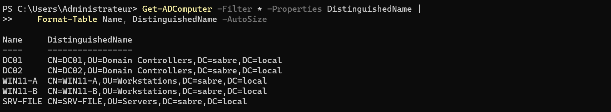

**P-34** : protection contre la suppression accidentelle sur toutes les OU applicatives.
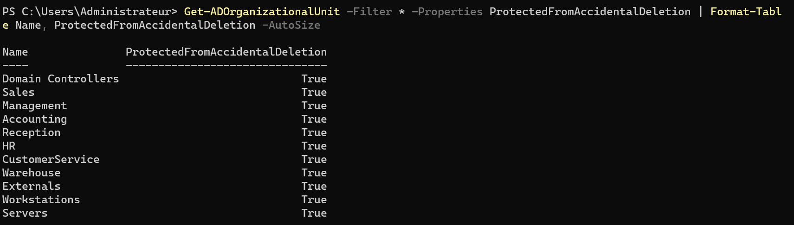
</details>

---

# 3. Preuves et clôtures

## <a id="validation-de-bout-en-bout"></a>Validation de bout en bout

| Domaine | Vérification | Attendu | Preuve |
| ------- | ------------ | ------- | ------ |
| Jonction | canal sécurisé SRV-FILE | `True` | [P-02](#p-02) |
| SMB / NTFS (écriture) | jeton + écriture Angela | GG+DL dans le jeton, fichier créé | [P-06](#p-06) · [P-08](#p-08) · [P-09](#p-09) |
| SMB / NTFS (lecture) | jeton + écriture refusée Karen | DL-Read présent, write refusé | [P-14](#p-14) · [P-15](#p-15) |
| DFS Namespace | chemin logique des deux sites | `True` | [P-16](#p-16) · [P-17](#p-17) |
| DFS-R | membership + backlog + contenu répliqué | `Enabled True`, backlog 0, fichier arrivé de l'autre côté | [P-20](#p-20) · [BF-19](./BREAKFIX.md#bf-19) · [BF-14](./BREAKFIX.md#bf-14) |
| FSRM quota | écriture au-delà de 100 Mo | refus espace, événement de seuil | [P-22](#p-22) · [P-23](#p-23) · [P-24](#p-24) |
| FSRM filtrage | dépôt d'un mp3 | refus type | [P-26](#p-26) |
| Impression | in-scope imprime, out-of-scope refusé, Point and Print borné | Angela OK, Jim refusé, `SRV-FILE` seul serveur autorisé | [P-30](#p-30) · [P-31](#p-31) · [P-32](#p-32) · [BF-26](./BREAKFIX.md#bf-26) |
| Hygiène OU | placement + protection | SRV-FILE rangé, OU protégées | [P-33](#p-33) · [P-34](#p-34) |
| DNS de DC01 | `Get-DnsClientServerAddress` | `10.10.2.10` puis `127.0.0.1` | [P-01](#p-01) |
| Break/Fix | SYSVOL réparé, versions alignées | `DSVersion = SysvolVersion` | [BF-09](./BREAKFIX.md#bf-09) |

## <a id="registre-derreurs--dette-technique"></a>Registre d'erreurs & dette technique


| ID   | Point                                                                                                                | Gravité | Domaine               | Statut                                                              |
| ---- | -------------------------------------------------------------------------------------------------------------------- | ------- | --------------------- | ------------------------------------------------------------------- |
| L-01 | DC02 porte `RG-Demo` / `RF-Demo` (dossier DFS-R) le temps de l'épisode                                               | 🟠      | DFS-R / tiering       | ✅ retiré en clôture N4 ([BREAKFIX § Clôture DFS-R](./BREAKFIX.md#cloture-dfsr)) |
| L-02 | `Set-DfsrMembership -Enabled` refusé (paramètre inexistant sur ce build WS2025)                                      | 🟢      | DFS-R / WS2025        | 📋 limite build, contourné                                          |
| L-03 | `Get-DfsrBacklog` échoue via WinRM/WMI inter-sous-réseau SITE1↔SITE2 (mesure faite en local avec `dfsrdiag backlog`) | 🟢      | DFS-R / réseau        | 🔜 N5 (ouvrir WinRM inter-sites)                                    |
| L-04 | Port d'imprimante `10.10.1.250` hors convention du dernier octet                                                     | 🟢      | Impression / IPAM     | 📋 adresse de test documentée dans l'[IPAM](../../IPAM.md)          |
| L-05 | Point and Print sans invite d'élévation, borné à `SRV-FILE` : acceptable seulement si SRV-FILE est durci et surveillé | 🟠      | Impression / sécurité | 🔜 N5 (SRV-FILE en Tier 1, durcissement)                            |
| L-06 | DNS client de DC01 passé en « partenaire puis loopback » (`10.10.2.10, 127.0.0.1`), geste oublié au renumérotage de N3 | 🟠   | DNS                   | ✅ corrigé en N4 ([P-01](#p-01), solde N1 L-02 et N3 L-06)          |


---

⬆️ [Sommaire](#sommaire) · [README de l'épisode](./README.md) · [Vue d'ensemble](../../README.md) · 🔧 **[Break/Fix N4 →](./BREAKFIX.md)** · **Suivant : Workflow N5 (à venir)**, sécurité et tiering : qui administre quoi, depuis quelle machine.
