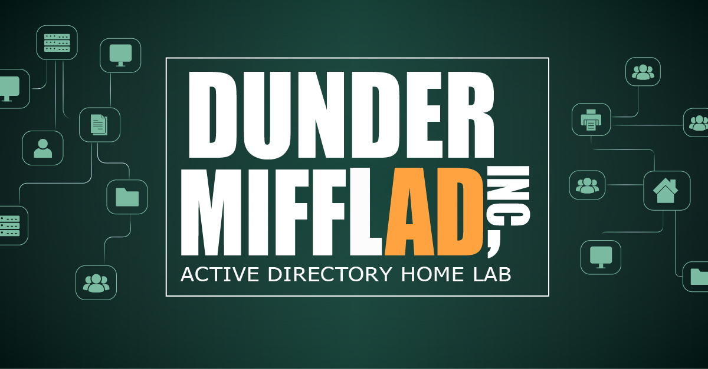

**[Entrez](./FR)** &nbsp;·&nbsp; **[Come In 🔜](./ENG)**

---

👋 Bienvenue chez Dunder MifflAD, succursale "non-officielle" de Scranton

Survivre à un audit de sécurité de Dwight Schrute ou au chaos quotidien de Michael Scott, ça demande une infrastructure qui tient le choc !

C'est exactement ce que j'ai essayé de construire dans ce home lab Active Directory inspiré de _The Office_, dans le cadre de ma reconversion vers l'administration système.

Derrière les références à la série, c'est un véritable environnement d'entreprise simulé, monté de zéro sous Hyper-V. Chaque département devient une OU, chaque profil d'employé justifie une décision de sécurité, et les pires scénarios de la série se transforment en vraies missions de diagnostic, toutes guidées par un fil conducteur : construire, sécuriser, casser volontairement, diagnostiquer, restaurer.

L'objectif ? Prouver mes capacités de déploiement et de résolution d'incidents dans un portfolio qui allie la méthode d'un sysadmin à un peu de second degré.

---

👋 Welcome to Dunder MifflAD, Scranton’s unofficial branch

Surviving a Dwight Schrute security audit, or Michael Scott's daily chaos, takes an infrastructure that can take a hit.

That's exactly what I set out to build in this Active Directory home lab inspired by _The Office_, as part of my career change into system administration.

Behind the show references, it's a real simulated enterprise environment, built from scratch on Hyper-V. Each department becomes an OU, each employee profile justifies a security decision, and the show's worst episodes turn into real diagnostic missions, all driven by a guiding thread: build, secure, break on purpose, diagnose, restore.

The goal? To prove my deployment and incident-response skills through a portfolio that pairs a sysadmin's rigor with a bit of tongue-in-cheek.

---